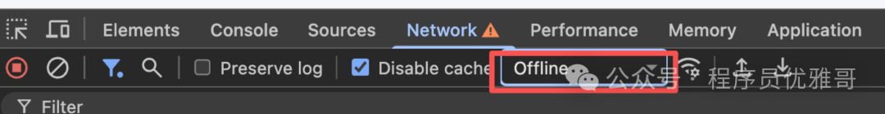

# 配置网络请求

## 封装架构设计

### 创建目录文件

目录结构从项目根路径开始 (注意：不是 src 目录)

```
base-vue3-template/
|- mock/
    |- demo.ts
|- src/
    |- http/
        |- core/
            |- http-client.ts
            |- interceptors.ts
            |- index.ts
            |- types.ts
        |- index.ts
    |- services/
        |- base-service.ts
```

### 设计思路

从宏观上来看，整个设计包括四个部分：

1）**Mock 服务**：项目根目录下的 `mock`目录（与 src 目录平级），用来提供 mock 服务，模拟后端接口；（你也可以采用其他方式提供后端服务，如 Java SpringBoot、NestJS、KOA 等）

2）**请求核心封装**：`src/http/core/`目录，
该目录对 Axios 进行强大的封装，包括拦截器、取消请求、请求去重、重试等，每个功能都是一个独立的类，
最后在 `core`中的 `index.ts`导出所有内容。
这个目录下的内容与具体项目无关，原则上要提取成一个独立的 lib 在不同的项目中复用。后面的微前端会做移植。

3）**项目配置层**：`src/http/index.ts`，通过配置和组装 `core`中的多个类，最后导出具体的 Axios 实例对象和 CRUD 函数，service 层调通过它来调用后端接口。
不同的项目实现会有差异，如针对请求拦截器的处理、请求错误的处理、超时时长、请求基础路径等

4）**service 层**：该目录就是传统写法中的 `api`目录，调用具体的接口。这一层与业务相关，咱们提取了一个 base-service.ts 实现通用的 CRUD，不同的模块可以继承它。

除了 Mock 服务，其他几个部分的关系如下图：

```
+---------------------+
| service层 (API 定义) |
+---------------------+
          ↑
          | 调用
+---------------------+
| 项目配置层 (自定义)    |
+---------------------+
          ↑
          | 实例化
+---------------------+
| 请求核心封装 (通用功能) |
+---------------------+
          ↑
          | 依赖
+---------------------+
|  Axios 原生库        |
+---------------------+
```

各位伙伴一定要仔细消化上面的内容，否则后面几篇文章看起来会云里雾里的。

### 通用类型定义

与后端交互，通常后端会定义一个通用的响应结构，首先创建一个类型文件，定义三个类型：

1）通用响应结构，貌似大多数项目都是定义三个字段 code、data、message；
2）分页请求结构：一般包括页码和每页大小；
3）分页响应数据结构：针对通用响应结构中的 data 的类型，至少包含数据列表 list 和总记录数 total 两个字段。

`src/http/core/types.ts`：

```
/**
 * 通用响应结构
 */
export interface ApiResp<T = any> {
  code: number
  message: string
  data: T
}

/**
 * 分页请求结构
 */
export interface PageReq {
  pageNum: number
  pageSize: number
}

/**
 * 分页响应数据结构
 */
export interface PageData<T> {
  list: T[]
  total: number
}
```

在 `src/http/core/index.ts`导出全部类型：

```
export * from './types'
```

> 关于通用响应结构的设计，是比较存在争议的：
> 一种观点是无论请求成功与否，都返回 code、data、message 这种标准结构，这种方式将请求错误与业务错误分开，前端解析时，需要先判断 HTTP 响应状态码，再判断 code 业务状态码；
> 另一种观点是请求成功就只返回业务数据，业务失败时才返回上面的通用结构。这种方式将请求错误与业务错误合并处理。前端解析时，HTTP 响应状态码为 200 便视为业务成功。
> 优雅哥更倾向于第二种，但几年实践下来，大部分同事都习惯了前者，优雅哥便也一起思维定势吧。优雅哥很期待听到你们对这两种设计方案的理解！

## 搭建 Mock 服务

由于咱没有开发服务端，咱先使用 MockJS 模拟服务端响应，便于后续的测试。

### 安装依赖

```
pnpm add mockjs @types/mockjs vite-plugin-mock -D
```

MockJS 版本号：1.1.0
vite-plugin-mock 版本号：3.0.2


### 配置 Vite 插件

在 `vite.config.ts`中配置 Mock 插件：

```
// ,,,
import { viteMockServe } from 'vite-plugin-mock'

export default defineConfig({
  plugins: [
    // ...
    viteMockServe({
      mockPath: './mock', // Mock 文件目录
      enable: true,
    }),
  ],
  // ...
})
```

### 创建 Mock 文件

在 `mock`目录下创建 `demo.ts`：

```
import Mock from 'mockjs'
import { ApiResp } from '../src/http/core'
import { MockMethod } from 'vite-plugin-mock'

const demoList = Mock.mock({
  'list|100': [
    {
      'id|+1': 1,
      title: '@ctitle(5, 10)',
      content: '@cparagraph(1, 3)',
      author: '@name',
      status: '@boolean',
      createdAt: '@datetime',
      updatedAt: '@datetime',
    },
  ],
}).list

function success<T>(data: T): ApiResp<T> {
  return {
    code: 0,
    message: 'success',
    data,
  }
}

function error(message: string, code: number = 500): ApiResp<null> {
  return {
    code,
    message,
    data: null,
  }
}

const demoMock: MockMethod[] = [
  {
    url: '/api/demo',
    method: 'get',
    timeout: 1000,
    response: ({ query }) => {
      const pageNum = parseInt(query.pageNum) || 1
      const pageSize = parseInt(query.pageSize) || 10
      const keyword = query.keyword || ''

      let filteredList = demoList
      if (keyword) {
        filteredList = demoList.filter(
          (item) =>
              item.title.includes(keyword) ||
              item.content.includes(keyword) ||
              item.author.includes(keyword),
        )
      }

      const start = (pageNum - 1) * pageSize
      const end = start + pageSize
      const list = filteredList.slice(start, end)

      return success({ list, total: filteredList.length })
    },
  },
  {
    url: '/api/demo/:id',
    method: 'get',
    timeout: 3000,
    response: ({ query }) => {
      const item = demoList.find((item) => item.id === parseInt(query.id))
      if (item) {
        return success(item)
      } else {
        return error('Item not found')
      }
    },
  },
  {
    url: '/api/demo',
    method: 'post',
    response: ({ body }) => {
      const newItem = {
        id: demoList.length + 1,
        ...body,
        createdAt: new Date().toISOString(),
        updatedAt: new Date().toISOString(),
      }
      demoList.push(newItem)
      return success(newItem)
    },
  },
  {
    url: '/api/demo/:id',
    method: 'put',
    response: ({ query, body }) => {
      const index = demoList.findIndex((item) => item.id === parseInt(query.id))
      if (index !== -1) {
        demoList[index] = {
          ...demoList[index],
          ...body,
          updatedAt: new Date().toISOString(),
        }
        return success(demoList[index])
      } else {
        return error('Item not found')
      }
    },
  },
  {
    url: '/api/demo/:id',
    method: 'delete',
    response: ({ query }) => {
      const index = demoList.findIndex((item) => item.id === parseInt(query.id))
      if (index !== -1) {
        demoList.splice(index, 1)
        return success(null)
      } else {
        return error('Item not found')
      }
    },
  },
]

export default demoMock
```

这样便搭建好了一个 CRUD 的 Mock 服务。启动项目，在浏览器中访问接口：

http://localhost:5173/api/demo

如果看到分页列表数据 JSON，则 mock 服务便成功了。

## 封装 Axios核心层

### 安装依赖

首先安装 Axios：

```
pnpm add axios
```

版本号为：1.13.2

### 3.2 定义配置类型

在 `src/http/core/types.ts`中追加配置类型的定义：

```
// ...

/**
 * HTTP请求客户端配置
 */
export interface HttpClientConfig {
  baseURL?: string
  timeout?: number
  headers?: Record<string, string>
    
  // 后面还要扩展其他配置项
}
```

目前只定义三个属性：请求基础路径、超时时间、公共请求头。后面还会进一步扩展配置属性。

### 3.3 初步封装 Axios

在 `src/http/core/http-client.ts`中对 Axios 进行初步封装：

创建 Axios 的实例，并封装基础的请求方法。先上代码：

```
import { Env } from '@/utils/env.ts'
import axios, { type AxiosInstance, type AxiosRequestConfig } from 'axios'
import type { HttpClientConfig } from './types.ts'

// HTTP请求客户端的默认配置
const defaultConfig: HttpClientConfig = {
  baseURL: Env.get('VITE_API_BASE_URL', '/api'),
  timeout: 3000,
  headers: {
    'Content-Type': 'application/json;charset=utf-8',
  },
}

/**
 * HttpClient 基础 HTTP 客户端类
 * 负责创建 Axios 实例和封装基础请求方法
 */
export class HttpClient {
  protected instance: AxiosInstance
  protected config: HttpClientConfig

  /**
   * 构造函数
   * @param config 配置选项
   */
  constructor(config: HttpClientConfig = {}) {
    this.config = { ...defaultConfig, ...config }
    this.instance = this.createInstance()
  }
  
  /**
   * 创建 Axios 实例
   * @returns AxiosInstance
   */
  private createInstance(): AxiosInstance {
    return axios.create({
      baseURL: this.config.baseURL,
      timeout: this.config.timeout,
      headers: this.config.headers,
    })
  }

  /**
   * 封装 GET 请求
   * @param url 请求地址
   * @param config 请求配置
   */
  public get(url: string, config?: AxiosRequestConfig): Promise<any> {
    return this.instance.get(url, config)
  }

  /**
   * 封装 POST 请求
   * @param url 请求地址
   * @param data 请求数据
   * @param config 请求配置
   */
  public post(url: string, data?: any, config?: AxiosRequestConfig): Promise<any> {
    return this.instance.post(url, data, config)
  }

  /**
   * 封装 PUT 请求
   * @param url 请求地址
   * @param data 请求数据
   * @param config 请求配置
   */
  public put(url: string, data?: any, config?: AxiosRequestConfig): Promise<any> {
    return this.instance.put(url, data, config)
  }

  /**
   * 封装 DELETE 请求
   * @param url 请求地址
   * @param config 请求配置
   * @returns Promise<T>
   */
  public delete(url: string, config?: AxiosRequestConfig): Promise<any> {
    return this.instance.delete(url, config)
  }

  /**
   * 封装 PATCH 请求
   * @param url 请求地址
   * @param data 请求数据
   * @param config 请求配置
   */
  public patch(url: string, data?: any, config?: AxiosRequestConfig): Promise<any> {
    return this.instance.patch(url, data, config)
  }

  /**
   * 获取 Axios 实例
   * @returns AxiosInstance
   */
  public getInstance(): AxiosInstance {
    return this.instance
  }
}
```

上面的封装非常简单：

1）通过构造函数传递自定义配置，并将自定义配置与默认配置进行合并；
2）createInstance 方法创建 Axios 实例对象；
3）提供增删改查几个方法；
4）提供获取构造函数中创建 Axios 实例的方法；

## 4 核心层 - Interceptors

拦截器包括请求拦截器 request 和响应拦截器 response，而两个拦截器又分别包括成功处理函数 onFulfilled 和失败处理函数 onRejected。
咱们要提供默认拦截器的这四个函数的实现，同时也要支持不同的项目能自定义拦截器。

### 4.1 类型定义

继续在 `src/http/core/types.ts`追加**拦截器配置项 InterceptorConfig**的定义，并在 **HttpClientConfig**中添加 interceptor 配置属性项：

```
// ...

/**
 * 拦截器配置
 */
export interface InterceptorConfig {
  request?: {
    onFulfilled?: (config: AxiosRequestConfig) => AxiosRequestConfig | Promise<AxiosRequestConfig>
    onRejected?: (error: AxiosError) => any
  }
  response?: {
    onFulfilled?: (response: AxiosResponse) => AxiosResponse | Promise<AxiosResponse>
    onRejected?: (error: AxiosError) => any
  }
}

/**
 * HTTP请求客户端配置
 */
export interface HttpClientConfig {
  // ...

  interceptor?: InterceptorConfig
}
```

### 4.2 实现 Interceptors 类

接下来便是在 `src/http/core/interceptors.ts`中实现拦截器的封装。总共包含两大个内容：

1）定义请求拦截器（成功&失败）、响应拦截器（成功&失败）四个函数的默认实现，并将其导出供外部自定义时方便调用：

```
import { type AxiosInstance, type AxiosRequestConfig, type AxiosResponse, AxiosError } from 'axios'
import { Env } from '@/utils/env'
import type { InterceptorConfig } from './types.ts'

// 默认请求拦截器-成功处理函数
export const defaultRequestOnFulfilled = (config: AxiosRequestConfig) => {
  // 请求日志
  if (Env.isDev) {
    console.log('Request:', {
      url: config.url,
      method: config.method,
      params: config.params,
      data: config.data,
    })
  }
  return config
}

// 默认请求拦截器-失败处理函数
export const defaultRequestOnRejected = (error: AxiosError): any => {
  return Promise.reject(error)
}

// 默认响应拦截器-成功
export const defaultResponseOnFulfilled = (response: AxiosResponse): any => {
  // 响应日志
  if (Env.isDev) {
    console.log('Response:', {
      url: response.config.url,
      status: response.status,
      data: response.data,
    })
  }

  // 解析 API 响应
  const { data } = response

  // 检查是否为标准 API 响应格式
  if (data && typeof data === 'object' && 'code' in data && 'message' in data) {
    const { code, message, data: responseData } = data

    // 业务成功时直接返回 data
    if (code === 0 || code === 200) {
      return responseData
    }
    // 业务失败时抛出错误
    else {
      throw new Error(message || '请求失败')
    }
  }

  // 非标准格式直接返回响应数据
  return data
}

// 默认响应拦截器-失败处理函数
export const defaultResponseOnRejected = (error: AxiosError): any => {
  // 错误处理
  if (error.response) {
    // 服务器返回错误状态码
    const status = error.response.status
    console.error('request error, status: ', status)
  } else if (error.request) {
    // 请求已发出，但没有收到响应
    console.error('Network Error')
  } else {
    // 请求配置错误
    console.error('Request Config Error:', error.message)
  }
  return Promise.reject(error)
}
```

上面四个函数的实现逻辑不复杂，需要说明的是：响应成功的处理函数
defaultResponseOnFulfilled：解析返回的结果，将 AxiosResponse 解析为通用结构中的 data 返回给业务层。
业务层在使用时无需：res.data.data 来获取真正的结果。

2）定义 Interceptors 类：

```
/**
 * 拦截器管理类
 * 负责配置和管理请求/响应拦截器
 */
export class Interceptors {
  private config: InterceptorConfig

  /**
   * @param config 拦截器配置
   */
  constructor(config: InterceptorConfig = {}) {
    this.config = config
  }

  /**
   * 应用拦截器到 Axios 实例
   * @param instance Axios 实例
   */
  public applyInterceptors(instance: AxiosInstance): void {
    // 应用请求拦截器
    instance.interceptors.request.use(
      (this.config.request?.onFulfilled ?? defaultRequestOnFulfilled) as any,
      this.config.request?.onRejected ?? defaultRequestOnRejected,
    )

    // 应用响应拦截器
    instance.interceptors.response.use(
      this.config.response?.onFulfilled || defaultResponseOnFulfilled,
      this.config.response?.onRejected || defaultResponseOnRejected,
    )
  }
}
```

该类在构造函数中接收拦截器配置，提供 applyInterceptors 给外部调用，通过该方法将拦截器应用到 Axios 实例对象上。

### 4.3 结合 HttpClient Interceptors

现在虽然定义了 HttpClient 类和 Interceptors 类，但两者是独立的，没结合在一起。
Interceptors 中提供了 applyInterceptors 方法，咱需要再 HttpClient 中创建 Axios 实例后，通过该方法设置拦截器。

修改前面实现的 `http-client.ts`，在里面加入 Interceptors：

```
export class HttpClient {
  // ...
  private interceptors: Interceptors

  constructor(config: HttpClientConfig = {}, interceptorConfig: InterceptorConfig = {}) {
    this.config = { ...defaultConfig, ...config }
    // 实例化拦截器对象
    this.interceptors = new Interceptors(this.config.interceptor ?? {})
    this.requestCanceler = new RequestCanceler()
    this.instance = this.createInstance()
      
    // 设置拦截器
    this.setInterceptors()
  }

  private setInterceptors() {
    this.interceptors.applyInterceptors(this.instance)
  }
}
```

咱们定义了 setInterceptors 方法，目前里面只有一行代码，便是设置拦截器。但随着后面的强大封装，咱们还要继续添加其他拦截器，因此，只有一行代码，咱也提取成一个方法。

最后还需要在 `http/core/index.ts`中导出这两个文件的全部内容：

```
export * from './types'
export * from './http-client'
export * from './interceptors'
```

本文中的 Axios 核心层第一步封装就完成了，接下来需要实现项目配置层。

## 5 项目配置层

项目配置层要做两件事：
1）**提供自定义配置**，（如自定义请求拦截器，在请求头中添加 token；自定义响应拦截器，使用UI展示错误信息等；自定义请求基础路径、超时时间等）
2）**创建并导出 HttpClient 实例对象**，以便 service 层使用。

`src/http/index.ts`：

```
import { HttpClient } from '@/http/core/http-client.ts'
import type { AxiosRequestConfig } from 'axios'

// 自定义请求拦截处理函数
const customRequestOnFulfilled = (config: AxiosRequestConfig) => {
  const { headers = {} } = config
  headers.token = 'aaaaaa'
  return config
}

// 创建并导出 HttpClient 对象 api
export const api = new HttpClient({
  interceptor: {
    request: {
      onFulfilled: customRequestOnFulfilled,
    },
  },
})

// 导出 Axios 实例
export const instance = api.getInstance()
```

如果你无需自定义配置，创建 HttpClient 对象时可以不传递配置：

```
export const api = new HttpClient()
```

不同项目的差异化配置就在这个文件中实现。此外，该文件还导出了 Axios 的实例 instance。你可以拿着这个实例去做你想做的事，如文件上传下载等有个性化的东西。

## 6 阶段测试

手搓了这么多代码，也该开始测试了，首先实现 service 层。

### 6.1 实现 service 层

优雅哥这里说的 `service`，就是很多开源项目里面的 `api`。
在这些项目中，这个模块只负责封装接口调用，没有业务逻辑。从**模块单一职责**这个角度来看，叫 `api`会更适合。但通常里面都只有一行代码：
`axios.get({url: 'xxx', method: 'get''})`
那抽取这一层 api 的意义在哪儿呢？直接写在业务代码中不更省事吗？

千万别说**复用**，你掰着手指数一数，真正多次调用的地方有多少？再者，就算有复用的地方，那对响应解析的处理是不是重复操作呢？

如果包含了响应解析的处理或其他逻辑，那我更宁愿称这一层为 `service`- **服务层**，毕竟它包含了一些其他逻辑的处理，而不仅仅只是调用接口。

分层不在于形，更在于神！

依旧**仁者见仁、智者见智**，没有绝对的优劣，根据自己的习惯和团队的规范即可~ 咱继续回归正题

前文搭建了 Mock 服务，从路径上看，这是比较符合 RESTful 风格的接口。针对这些符合 RESTful 风格的接口，路径通常只有资源不同：
在这个案例中的资源是 `demo`， 换个资源可能是 `user`、`product`等，除了资源不同，其余路径都是一致的，所以我会提取一个抽象类：

```
src/services/base-service.ts
import { api } from '@/http'
import type { PageData, PageReq } from '@/http/core/types.ts'

export abstract class BaseService<T, Q extends PageReq> {
  // 获取资源名，由子类实现
  protected abstract getPrefix(): string

  // 分页查询列表
  public getList(params: Q): Promise<PageData<T>> {
    return api.get(`/${this.getPrefix()}`, { params })
  }

  // 获取详情
  public getDetail(id: number): Promise<T> {
    return api.get(`/${this.getPrefix()}/${id}`)
  }

  // 创建
  public create(data: Partial<T>): Promise<T> {
    return api.post(`/${this.getPrefix()}`, data)
  }

  // 更新
  public update(id: number, data: Partial<T>): Promise<T> {
    return api.put(`/${this.getPrefix()}/${id}`, data)
  }

  // 删除
  public delete(id: number): any {
    return api.delete(`/${this.getPrefix()}/${id}`)
  }
}
```

在这个抽象类的基础上，再来实现业务的 CRUD 就简单了。
`src/services/demo-service.ts`：

```
import { BaseService } from './base-service.ts'
import type { PageReq } from '@/http/core/types.ts'

export interface Demo {
  id: number
  title: string
  content: string
  author: string
  status: boolean
  createdAt: string
  updatedAt: string
}

// Demo 列表请求参数
export interface DemoListReq extends PageReq {
  keyword?: string
}

export class DemoService extends BaseService<Demo, DemoListReq> {
  protected getPrefix(): string {
    return 'demo'
  }
}

export const demoService = new DemoService()
```

如果有其他特殊请求，如启用、停用、下单等定制化的请求，那在 DemoService 类中定义即可。
连面向对象的特性都不用，还扯个毛线的设计模式、架构。一定要保持优雅！

### 6.2 编写页面进行测试


最后一步了，创建一个页面进行测试：
`src/pages/http-demo.vue`

```
<template>
  <div>
    <h1>Demo 列表</h1>
    <div v-if="loading">加载中...</div>
    <div v-else-if="error">错误: {{ error.message }}</div>
    <div v-else>
      <ul>
        <li v-for="item in data" :key="item.id">
          <span
              class="text-xl font-bold text-primary cursor-pointer"
              @click="onTitleClick(item.id)"
          >{{ item.title }}</span>
          <button class="ml-2 text-danger cursor-pointer" @click="deleteItem(item.id)">删除</button>
        </li>
      </ul>
      <div>
        <button @click="fetchData({ pageNum: currentPage - 1 })" :disabled="currentPage === 1">上一页</button>
        <span>{{ currentPage }}/{{ totalPages }}</span>
        <button @click="fetchData({ pageNum: currentPage + 1 })" :disabled="currentPage === totalPages">下一页</button>
      </div>
    </div>
  </div>
</template>

<script setup lang="ts">
import { type Demo, type DemoListReq, demoService } from '@/services/demo-service.ts'

const loading = ref(false)
const error = ref<Error | null>(null)
const data = ref<Demo[]>([])
const currentPage = ref(1)
const pageSize = ref(10)
const total = ref(0)
const totalPages = computed(() => Math.ceil(total.value / pageSize.value))

// 获取数据
const fetchData = async (params?: Partial<DemoListReq>) => {
  loading.value = true
  error.value = null

  try {
    const response = await demoService.getList({
      pageNum: params?.pageNum || currentPage.value,
      pageSize: pageSize.value,
    })

    data.value = response.list
    total.value = response.total
    currentPage.value = params?.pageNum || currentPage.value
  } catch (err) {
    error.value = err as Error
  } finally {
    loading.value = false
  }
}

// 删除项目
const deleteItem = async (id: number) => {
  await demoService.delete(id)
  // 重新获取数据
  await fetchData()
}

const onTitleClick = async (id: number) => {
  const resp = await demoService.getDetail(id)
  console.log(resp)
}

// 组件挂载时获取数据
onMounted(() => {
  fetchData()
})
</script>
<style scoped lang="scss">
button {
  @apply cursor-pointer text-primary hover:text-primary-dark-2;
}
</style>
```

在界面上咱们调用了查询列表、删除、查询详情三个接口。新增和修改大家自己去玩玩。
测试过程就不讲了。大家可以自己捣腾一下默认配置、自定义拦截器等等。

## 结语

本文篇幅较长，但就三个内容：
1）核心库第一步：封装Axios和拦截器
2）实现项目配置层
3）实现业务层和表现层

后续文章都将建立在本文的基础上，感兴趣的伙伴一定要自己写一遍。下文将继续增强核心库的能力：**取消请求和防止重复请求**。

按照惯例，如果你对本文内容有任何疑问或建议，欢迎在评论区留言讨论！

# 插件化架构和请求取消

在开发中，不知道大家会不会遇到这些需求或场景：
1）页面跳转时，之前的请求还未完成，需要取消这些请求
2）搜索框输入时，需要取消之前的搜索请求，只保留最新的
3）用户操作取消时，需要终止正在进行的请求


这些场景需要咱们的网络请求框架能支持取消请求。 咱们继续前行，为网络请求的核心封装添加**取消请求**的功能。

由于后面还要扩展一系列能力，首先咱们需要将核心层扩展为**插件化架构**，请求取消、请求防重、请求重试等，都是核心层的插件，这样代码更加模块化、可扩展！

## 7 核心层-插件化架构

### 7.1 定义插件接口

首先，需要定义一个统一的插件接口，所有网络请求相关的功能（如取消、防重、重试等）都将作为插件，需要实现该接口。

在 `src/http/core/`目录下创建 `plugin.ts`：：

```
import type { AxiosInstance } from 'axios'

/**
 * HTTP 插件接口
 * 所有网络请求相关的功能都将作为插件实现该接口
 */
export interface HttpPlugin {
  /**
   * 应用插件到 Axios 实例
   * @param instance Axios 实例
   */
  apply(instance: AxiosInstance): void
}
```

### 7.2 插件管理类

为了方便的统一管理插件，咱创建一个插件管理类，负责维护插件的注册和应用。

继续在 `src/http/core/`目录下创建 `plugin-manager.ts`：

```
import type { AxiosInstance } from 'axios'
import type { HttpPlugin } from './plugin.ts'

/**
 * 插件管理器
 * 负责管理和应用 HTTP 插件
 */
export class PluginManager {
  private plugins: HttpPlugin[] = []

  /**
   * 注册插件
   * @param plugin HTTP 插件
   */
  public register(plugin: HttpPlugin): void {
    this.plugins.push(plugin)
  }

  /**
   * 应用所有插件到 Axios 实例
   * @param instance Axios 实例
   */
  public applyAll(instance: AxiosInstance): void {
    this.plugins.forEach(plugin => plugin.apply(instance))
  }

  /**
   * 清除所有插件
   */
  public clear(): void {
    this.plugins = []
  }
}
```

定义好插件的规范后，接下来便可以开始实现取消请求这个插件了。

## 8 取消请求

Axios 支持取消请求：在 v0.22.0 之前，使用 `CancelToken`，但之后的版本已弃用该 API，而是使用 `AbortController`方式来实现取消：

https://axios-http.com/zh/docs/cancellation

咱们版本为 1.13.2，使用 `AbortController`来实现取消请求的功能。AbortController 是浏览器原生 API，用于取消网络请求等异步操作，是处理请求取消的标准方案。具体信息大家移步官网：

https://developer.mozilla.org/en-US/docs/Web/API/AbortController

创建 AbortController 的实例对象后，可获取 `signal`属性，调用该对象的 abort() 方法，会触发取消请求操作，使关联的 signal 进入已取消状态。

### 8.1 实现 RequestCanceler 插件

在 `src/http/core/`目录下创建 `request-canceler.ts`，该文件中创建一个类 `RequestCanceler`，实现前面定义的 `HttpPlugin`接口。

实现请求取消的核心逻辑：
1）**定义一个 Map**，用来存储**请求的配置**与**取消控制器对象**的映射关系：key 为请求配置按照某个规则得到的字符串，value 即为这个请求对应的取消控制器。
2）发送请求前，在**请求拦截器**中创建取消控制器对象，并将该对象的 signal 设置到请求配置 config 中，同时将 config 与该对象添加到 Map 中。
3）在**响应拦截器**中（无论成功还是失败），都需要根据请求配置 config 从 Map 中移除。
4）如果需要**取消某个请求**，则从 Map 中根据请求配置获取取消控制器，调用该控制器的 abort() 方法；
5）如果需要**取消所有请求**，则遍历 Map 中的所有控制器，依次调用 abort() 方法。

```
import type { AxiosInstance, AxiosRequestConfig, AxiosResponse, AxiosError } from 'axios'
import type { HttpPlugin } from './plugin.ts'

/**
 * 请求取消器插件
 * 负责管理和取消请求
 */
export class RequestCanceler implements HttpPlugin {
  // 存储取消器的映射表
  private cancelMap: Map<string, AbortController>

  constructor() {
    this.cancelMap = new Map()
  }

  /**
   * 生成请求的唯一标识
   */
  private generateKey(config: AxiosRequestConfig): string {
    const { url, method, params, data } = config
    return `${method || 'GET'}-${url}-${JSON.stringify(params || {})}-${JSON.stringify(data || {})}`
  }

  /**
   * 添加请求到取消器映射表
   * @param config 请求配置
   */
  public add(config: AxiosRequestConfig): void {
    // 先取消之前相同的请求
    this.remove(config)
    
    const key = this.generateKey(config)
    const controller = new AbortController()
    
    config.signal = controller.signal
    this.cancelMap.set(key, controller)
  }

  /**
   * 取消请求并从映射表中移除
   */
  public remove(config: AxiosRequestConfig): void {
    const key = this.generateKey(config)
    if (this.cancelMap.has(key)) {
      const controller = this.cancelMap.get(key)
      controller?.abort()
      this.cancelMap.delete(key)
    }
  }

  /**
   * 取消所有请求
   */
  public clear(): void {
    this.cancelMap.forEach((controller) => {
      controller.abort()
    })
    this.cancelMap.clear()
  }

  /**
   * 应用插件到 Axios 实例
   * @param instance Axios 实例
   */
  public apply(instance: AxiosInstance): void {
    // 请求拦截器：添加请求到取消器
    instance.interceptors.request.use(
      (config: AxiosRequestConfig) => {
        this.add(config)
        return config as any
      },
      (error: AxiosError) => {
        return Promise.reject(error)
      }
    )

    // 响应拦截器：从取消器中移除请求
    instance.interceptors.response.use(
      (response: AxiosResponse) => {
        this.remove(response.config)
        return response
      },
      (error: AxiosError) => {
        if (error.config) {
          this.remove(error.config)
        }
        return Promise.reject(error)
      }
    )
  }
}
```

### 8.2 在 HttpClient 中集成 RequestCanceler 插件

实现了请求取消插件，接下来需要将该插件集成到`HttpClient`中。

可能在某些项目中不需要取消请求这一功能，咱可以在前面定义的 HTTP 请求客户端配置 HttpClientConfig 中添加一个配置项 **enableCancel** 来配置是否开启取消请求功能。

`src/http/core/types.ts`：
扩展 `HttpClientConfig`配置属性：

```
/**
 * HTTP请求客户端配置
 */
export interface HttpClientConfig {
  baseURL?: string
  timeout?: number
  headers?: Record<string, string>
  interceptor?: InterceptorConfig
  
  // 新增配置项
  enableCancel?: boolean // 是否开启请求取消
}
```

接着修改 HttpClient 类，使用 `PluginManager`来管理和应用插件：
`src/http/core/http-client.ts`：

```
// ... 其他导入
import { RequestCanceler } from './request-canceler.ts'
import { PluginManager } from './plugin-manager.ts'

// 默认配置
const defaultConfig: HttpClientConfig = {
  // ...
  enableCancel: true,
}

export class HttpClient {
  // ... 其他属性
  private pluginManager: PluginManager
  private requestCanceler: RequestCanceler

  constructor(config: HttpClientConfig = {}) {
    // ...

    this.pluginManager = new PluginManager()
    this.requestCanceler = new RequestCanceler()

    this.registerPlugins()
    this.setInterceptors()
  }

  private registerPlugins() {
    // 根据配置注册插件
    if (this.config.cancelable) {
      this.pluginManager.register(this.requestCanceler)
    }
    
    // 应用所有插件
    this.pluginManager.applyAll(this.instance)
  }

  // ... 其他方法

  /**
   * 取消所有请求
   */
  public cancelAll(): void {
    this.requestCanceler.clear()
  }

  /**
   * 获取插件管理器
   * 便于后续动态添加或移除插件
   */
  public getPluginManager(): PluginManager {
    return this.pluginManager
  }
}
```

这样，咱就通过插件化架构在 `HttpClient`中集成了第一个插件 `RequestCanceler`：
当请求发起时，会自动添加到取消器中；
当请求完成或失败时，会自动从取消器中移除。


### 8.3 测试取消请求

修改 `src/pages/http-demo.vue`文件，添加测试取消全部请求的功能：

```
<template>
  <div>
    <!-- 其他内容不变 -->
    
    <!-- 测试按钮 -->
    <div class="mt-4">
      <button @click="onTestCancelAllRequests" class="ml-2">测试取消全部请求</button>
    </div>
  </div>
</template>

<script setup lang="ts">
// ...
import { api } from '@/http'

// 测试取消全部请求
const onTestCancelAllRequests = async () => {
  console.log('开始测试取消全部请求')

  // 发送多个请求
  for (let i = 0; i < 3; i++) {
    fetchData({ pageNum: i + 1 })
  }

  // 1秒后取消所有请求
  setTimeout(() => {
    console.log('取消全部请求')
    api.cancelAll()
  }, 1000)
}
</script>
```

启动服务，当点击测试按钮时，在浏览器中可以看到发出了 3 个分页请求，1秒后所有请求会被取消，并且控制台会输出 "取消全部请求"。

## 小结

本文首先实现了网络请求的插件化架构，接着又简单介绍了取消请求的实现方案，最后实现了取消请求插件，并添加到 HttpClient 中，在该类中通过配置决定是否开启取消请求功能。
网络请求核心层封装第二步便完成了。 下文继续第三步请求防重。

按照惯例，如果你对本文内容有任何疑问或建议，欢迎在评论区留言讨论！

# 实现请求防重

关于请求的防重，可以在很多个环节来处理：后端接口、全局Loading、按钮状态控制等，本文只分享基于 Axios 拦截器的防重处理。

## 9 核心层-请求防重

基于 Axios 实现请求防重的方案也有好几种：

- • 请求队列
- • 重写 request
- • 订阅-发布者模式
- • 拦截器
- • （其他你能想到的方案）

由于咱们之前实现过请求取消，在这里采用拦截器的方案与请求取消比较相似：

1. \1. 在请求发送前（请求拦截器），检查是否有相同的请求正在进行；
2. \2. 如果有相同的请求正在进行，那就将当前的请求取消；
3. \3. 如果没有相同的请求，就正常发送请求，并将请求标记为"进行中"
4. \4. 在请求完成后（无论成功还是失败，响应拦截器），移除"进行中"标记

在上面的实现思路中：

\1. 可以使用一个 Set 集合来存储进行中的请求，从而实现“将请求标记为进行中”；


\2. 依旧使用请求取消中生成 key 的方式：根据请求配置对象 config 按照规则生成字符串 key。

回到代码，继续使用插件化的方式来实现：

### 9.1 创建防重插件

在 `src/http/core/`目录下创建 `request-dedup.ts`：

```
import axios, {
  type AxiosInstance,
  type AxiosRequestConfig,
  type AxiosResponse,
  type AxiosError,
} from 'axios'
import type { HttpPlugin } from './plugin.ts'

/**
 * 请求防重插件
 * 负责防止重复请求，复用已有请求的结果
 */
export class RequestDedup implements HttpPlugin {
  // 存储正在进行的请求
  private pendingSet: Set<string>

  constructor() {
    this.pendingSet = new Set<string>()
  }

  /**
   * 生成请求的唯一标识
   */
  private generateKey(config: AxiosRequestConfig): string {
    const { url, method, params, data } = config
    return `${method || 'GET'}-${url}-${JSON.stringify(params || {})}-${JSON.stringify(data || {})}`
  }

  /**
   * 应用插件到 Axios 实例
   */
  public apply(instance: AxiosInstance): void {
    instance.interceptors.request.use((config: AxiosRequestConfig) => {
      if (!(config as any).disableDedup) {
        const key = this.generateKey(config)
        if (this.pendingSet.has(key)) {
          throw new axios.Cancel('Duplicate request canceled.')
        }
        this.pendingSet.add(key)
      }
      return config as any
    })
    // 响应拦截器：清理请求
    instance.interceptors.response.use(
      (response: AxiosResponse) => {
        const key = this.generateKey(response.config)
        this.pendingSet.delete(key)
        return response
      },
      (error: AxiosError) => {
        if (axios.isCancel(error)) {
          console.warn('请求已取消', error.message)
        } else {
          if (error.config) {
            const key = this.generateKey(error.config)
            this.pendingSet.delete(key)
          }
        }
        return Promise.reject(error)
      },
    )
  }
}
```

### 9.2 扩展配置类型

在 `src/http/core/types.ts`文件中，扩展 `HttpClientConfig`配置类型，添加 `enableDedup`选项：

```
/**
 * HTTP请求客户端配置
 */
export interface HttpClientConfig {
  // ...
  enableDedup?: boolean // 是否开启请求防重
}
```

### 9.3 在 HttpClient 中集成插件

修改 `src/http/core/http-client.ts`文件，集成请求防重插件：

```
// 导入防重插件
import { RequestDedup } from './request-dedup.ts'

// 默认配置
const defaultConfig: HttpClientConfig = {
  // ...
  enableDedup: true, // 默认开启防重功能
}

export class HttpClient {
  // ...
  // 添加防重插件属性
  private requestDedup: RequestDedup

  constructor(config: HttpClientConfig = {}) {
    // ... 其他代码
    this.requestDedup = new RequestDedup()
    this.registerPlugins()
    // ... 其他代码
  }

  private registerPlugins() {
    // ...
    if (this.config.enableDedup) {
      this.pluginManager.register(this.requestDedup)
    }

    // 应用所有插件
    this.pluginManager.applyAll(this.instance)
  }
}
```

### 9.4 导出防重插件

在 `src/http/core/index.ts`文件中，导出防重插件：

```
// ...
export * from './request-dedup' // 导出防重插件
```

## 10 测试防重功能

在 `src/pages/http-demo.vue`文件中添加按钮进行测试：

### 10.1 添加测试按钮

首先添加两个测试按钮：刷新数据、测试防重。
刷新数据按钮用于调用接口；
测试防重按钮用来测试请求防重，模拟重复点击“刷新数据”按钮。

```
<template>
  <div>
    <!-- 其他代码... -->
    
    <!-- 测试按钮 -->
    <div class="mt-4">
      <!-- ... -->
      <button ref="refreshBtnRef" @click="onRefreshBtnClick">刷新数据</button>
      <button @click="onTestDeduplication" class="ml-2">测试请求防重</button>
    </div>
  </div>
</template>
```

### 10.2 添加测试方法

```
// ...

const refreshBtnRef = useTemplateRef('refreshBtnRef')

const onRefreshBtnClick = () => {
  console.log('点击刷新按钮')
  fetchData({ pageNum: 1 })
}

const onTestDeduplication = async () => {
  console.log('开始测试请求防重')
  for (let i = 0; i < 10; i++) {
    refreshBtnRef.value?.click()
  }
}
```

测试代码就这些了。

启动项目，点击"测试请求防重"按钮，虽然该按钮模拟点击了 10 次刷新按钮，但打开浏览器控制台，可以看到 Network 中只发送了一个请求，其他请求都被取消了。


### 10.3 禁用特定请求的防重

如果某个请求不需要防重功能，可以在请求配置中添加 `disableDedup: true`：

```
api.get(`/${this.getPrefix()}`, { params }, {
  disableDedup: true
})
```

## 小结

本文我们实现了请求防重功能，防重功能与取消请求功能可以同时使用，它们之间不会相互影响：
防重：防止重复请求的发送
取消请求：主动终止正在进行的请求。

虽然在 Axios 请求层面实现了防重，但不要过于依赖局部处理，某些场景一定要全链路防重：按钮点击事件做防抖节流处理、服务端也需要做幂等处理等等。

在下一篇文章中，我们将实现请求重试功能。

按照惯例，如果你对本文内容有任何疑问或建议，欢迎在评论区留言讨论！

# 实现请求重试

本文实现请求重试功能。在项目中（尤其是在移动端），网络 issue、服务端吞吐量等因素都可能会导致请求失败，在有些项目中可能就需要请求重试功能。
不过说实话，如果不是为了网络请求封装的功能完整性，优雅哥是坚决不实现这种无意义的需求的。自动重试不是一个优雅的需求 —— 弊大于利！如果大家将这套封装应用于项目中，建议弟兄们关闭自动重试，反正哥是不会开启的。

## 10 核心层-请求重试

实现自动重试的**核心思路**，无外乎在**指定的错误类型**、**指定的状态码**时，自动在**指定时间间隔**（专业点说，是叫**指数退避**），重新发送不超过**指定次数内**的请求。
（这句话不是标准定义，而是优雅哥自以为是的理解，大伙见笑。）


我个人觉得，非要实现重试功能，需要注意几点：
**可配置**：上面提到的 4 个“指定”需要支持配置（配置可以提供默认值）
**有限范围**：不能任何错误类型、任何响应状态码都重试。例如 401 未认证，你重试多少次都是扯犊子；主动取消请求，这种错误也不能重试。此外，重试次数也必须有限，避免无限重试，没完没了。
**指数退避**：一定要避免短时间内重复请求导致服务器压力大增，那样子会被后端同事骂的。

### 10.1 定义类型和常量

既然提到了错误类型，咱不妨先定义一堆 Axios 会出现的 HTTP 错误类型，然后再进行配置类型的定义。
在 `src/http/core/types.ts`中添加重试相关的类型定义和常量：

```
/**
 * HTTP错误类型常量
 */
export const HttpErrorType = {
  NETWORK_ERROR: 'ERR_NETWORK',
  CONNECTION_ABORTED: 'ECONNABORTED',
  BAD_REQUEST: 'ERR_BAD_REQUEST',
  UNAUTHORIZED: 'ERR_UNAUTHORIZED',
  FORBIDDEN: 'ERR_FORBIDDEN',
  NOT_FOUND: 'ERR_NOT_FOUND',
  SERVER_ERROR: 'ERR_BAD_RESPONSE'
} as const

export type HttpErrorTypeValue = typeof HttpErrorType[keyof typeof HttpErrorType]

/**
 * 重试配置
 */
export interface RetryConfig {
  maxAttempts?: number // 最大重试次数
  delay?: number // 间隔多久重试
  exponentialBackoff?: boolean // 是否开启指数退避
  retryableStatusCodes?: number[] // 允许重试的HTTP响应状态码数组
  retryableErrorTypes?: (string | HttpErrorTypeValue)[] // 允许重试的错误类型数组
}

/**
 * HTTP请求客户端配置
 */
export interface HttpClientConfig {
  // 现有配置...
  enableRetry?: boolean // 是否开启请求重试
  retryConfig?: RetryConfig // 重试配置
}
```

这里我们定义了 HTTP 错误类型常量，不同项目自定义重试时，既可以使用这些常量，也可以使用字符串。
原本优雅哥也定义了 HTTP 响应状态码的常量，如 200、401、402、403、404 等等，后面一想，这些属于常识，别定义了。

在前面定义的 HTTP请求客户端配置 HttpClientConfig 类型中，新增了两个配置项目：是否允许重试 enableRetry 和具体的重试配置 retryConfig。

这里简单谈谈 **exponentialBackoff**属性。如果开启指数退避，假设配置的 delay 为 2000 （即 2s），咱们后面实现的算法为：
第 1 次重试间隔: 2^(1-1) * 2000 = 2000ms;
第 2 次重试间隔: 2^(2-1) * 2000 = 4000ms;
第 3 次重试间隔: 2^(3-1) * 2000 = 8000ms;
...
如果该属性设置为 false，那么每次重试的时间间隔都是 2000ms。

### 10.2 实现重试插件

这已经是第三个插件了，相信大家都非常熟悉咱插件规范。创建 `src/http/core/request-retry.ts`，按照前面的插件规范实现重试插件。

```
import type { AxiosInstance, AxiosRequestConfig, AxiosResponse, AxiosError } from 'axios'
import type { HttpPlugin } from './plugin.ts'
import type { RetryConfig } from './types.ts'

/**
 * 请求重试插件
 * 负责自动重试失败的请求
 */
export class RequestRetry implements HttpPlugin {
  private config: RetryConfig

  constructor(config: RetryConfig = {}) {
    this.config = {
      maxAttempts: 3,
      delay: 1000,
      exponentialBackoff: true,
      retryableStatusCodes: [429, 500, 502, 503, 504],
      retryableErrorTypes: [HttpErrorType.NETWORK_ERROR, HttpErrorType.CONNECTION_ABORTED],
      ...config,
    }
  }

  /**
   * 生成重试延迟时间
   */
  private getDelay(attempt: number): number {
    if (this.config.exponentialBackoff) {
      return this.config.delay! * Math.pow(2, attempt - 1)
    }
    return this.config.delay!
  }

  /**
   * 判断是否可重试
   */
  private isRetryable(error: AxiosError): boolean {
    // 如果是取消请求就不要重试
    if (error.code === 'ECONNABORTED' && error.message.includes('canceled')) {
      return false
    }

    // 检查错误类型
    if (error.code && this.config.retryableErrorTypes!.includes(error.code)) {
      return true
    }

    // 检查状态码
    if (error.response?.status && this.config.retryableStatusCodes!.includes(error.response.status)) {
      return true
    }

    return false
  }

  /**
   * 应用插件到 Axios 实例
   */
  public apply(instance: AxiosInstance): void {
    instance.interceptors.response.use(
      (response: AxiosResponse) => response,
      async (error: AxiosError) => {
        const config = error.config as AxiosRequestConfig & { _retryAttempts?: number }
        
        // 检查是否可重试
        if (!config || !this.isRetryable(error)) {
          return Promise.reject(error)
        }

        // 初始化重试次数
        config._retryAttempts = config._retryAttempts || 0

        // 检查是否达到最大重试次数
        if (config._retryAttempts >= this.config.maxAttempts!) {
          return Promise.reject(error)
        }

        // 增加重试次数
        config._retryAttempts++

        // 计算延迟时间
        const delay = this.getDelay(config._retryAttempts)

        // 延迟后重试
        await new Promise(resolve => setTimeout(resolve, delay))

        // 重新发送请求
        return instance(config)
      }
    )
  }
}
```

在上面的实现中，首先在构建函数中设置了重试配置的默认值，然后定义了判断是否可重试和获取重试时间间隔的函数，最后在 apply 函数中实现重试逻辑。注释比较详细，大家应该看得明白。

### 10.3 集成到 HttpClient

在`src/http/core/http-client.ts`中集成重试插件：

```
// 导入重试插件
import { RequestRetry } from './request-retry.ts'

const defaultConfig: HttpClientConfig = {
  // ...
  enableRetry: true,
  retryConfig: {},
}

export class HttpClient {
  // ...
  private requestRetry: RequestRetry

  constructor(config: HttpClientConfig = {}) {
    // ...
    this.requestRetry = new RequestRetry(this.config.retryConfig)
    this.registerPlugins()
  }

  private registerPlugins() {
    // ...
    if (this.config.enableRetry) {
      this.pluginManager.register(this.requestRetry)
    }
    // 应用所有插件
    this.pluginManager.applyAll(this.instance)
  }
}
```

### 10.4 导出重试插件

在 `src/http/core/index.ts`中导出重试插件：

```
// ...
export * from './request-retry' // 导出重试插件
```

### 10.5 测试重试

和前面一样，在 `src/pages/http-demo.vue`文件中添加测试按钮：

```
<template>
  <!-- ... -->

  <!-- 测试按钮 -->
  <div class="mt-4">
    <!-- ... -->
    <button @click="onTestRetry" class="ml-2">测试请求重试</button>
  </div>
</template>

<script setup lang="ts">
// ...

const onTestRetry = async () => {
  console.log('开始测试请求重试')
  try {
    const response = await demoService.getList({ pageNum: 1, pageSize: 10 })
    console.log('请求成功，返回数据:', response)
  } catch (error) {
    console.error('请求失败:', error)
  }
}
</script>
```

在测试时，可以在浏览器中模拟没有网络的场景。



模拟无网络.png


几种场景都可以试试：
1）始终离线，看看达到重试次数是否会停止重试；
2）第一次重试时恢复为正常网络，看看在重试次数未达到、但请求成功是否会停止；
3）修改配置，当状态码或错误类型不匹配时，是否会重试；
...
如果你开启了重试，**一定要将各种场景测试到位**。

## 小结

本文我们实现了请求重试功能（**依旧不建议大家使用！！！**）。
至此，我们已经实现了网络请求的封装：Axios 封装、拦截器、插件开发（请求取消、请求防重和请求重试），这套封装算是一个还算优雅的网络请求解决方案，可以满足大多数场景的需求了。


下一篇文章咱模仿 React，实现 `useRequest`hook函数，让咱们网络请求的边角料开发也能省点事。

按照惯例，如果你对本文内容有任何疑问或建议，欢迎在评论区留言讨论！

# 实现useRequest hook

优雅哥前几年学习 React 时，非常喜欢 ahooks 中提供的 `useRequest` hook 函数。使用该函数可以很大程度上简化网络请求的状态管理。这个子系列的最后一篇，咱就一起实现这个函数。

## 11 关于 useRequest

ahooks `useRequest`函数不知道有小伙伴使用过没有，如果没有使用过，可以先看看它的介绍：

https://ahooks.js.org/hooks/use-request/index


网上的总结都很高大上，就优雅哥切身体会而言，最大的好处就一个：统一维护请求状态、代码更加简洁！

网络请求涉及到很多状态，如 Loading 状态的控制、错误信息的判断等，而这些逻辑几乎在每个请求中都涉及。该函数将这些逻辑进行抽离，在组件中直接使用即可。

本文咱们借鉴 useRequest 的设计理念，封装一个适合 Vue3 的简化版 useRequest。核心要实现如下功能：

**自动状态管理**
自动管理 loading、error、data 等响应式状态，在使用时通过如下方式便可以获取这些状态：

```
const { loading, error, data } = useRequest(reqService, config)
```

**自动请求**
组件挂载时，自动发送请求

**手动触发**
提供手动执行请求 run 方法

**依赖追踪**
当响应式依赖发生变化时，自动重新请求

## 12 实现 useRequest

继续在 `src/http/core`目录下创建 `use-request.ts`。
从上面的使用实例可以看到，useRequest 的输入为请求函数和配置项，输出为一个包含状态和其他函数的结构。因此该文件需要包含三个内容：
1）配置项的类型定义；
2）返回结果的类型定义；
3）useRequest 的实现。

### 12.1 配置项类型定义

首先在 `use-request.ts`中定义配置项类型：

```
export interface UseRequestOptions<T> {
  // 是否在组件挂载时自动请求
  auto?: boolean
  // 依赖项，变化时重新请求
  deps?: WatchSource<any>[]
  // 初始数据
  initialData?: T
  // 请求前的回调
  onBefore?: () => void
  // 请求成功的回调
  onSuccess?: (data: T) => void
  // 请求失败的回调
  onError?: (error: any) => void
  // 请求完成的回调（无论成功还是失败）
  onFinally?: () => void
}
```

配置项包含一系列属性和回调函数，具体每个属性的意义在注释中写得很清楚。

### 12.2 返回结果类型定义

接着定义返回结果的类型：

```
export interface UseRequestReturn<T> {
  // 请求数据
  data: any
  // 加载状态
  loading: Ref<boolean>
  // 错误信息
  error: Ref<any | null>
  // 手动触发请求
  run: (config?: AxiosRequestConfig) => Promise<T>
}
```

### 12.3 实现 useRequest 函数


最后便是核心 —— 实现 useRequest 函数。
1）解析配置项，默认组件挂载时会自动发送请求；
2）定义执行请求的函数 executeRequest，调用该函数便会真正发出请求。在该函数内容会调用配置项中传入的 onBefore、onSuccess、onError、onFinally 四个回调函数。
3）定义手动发送请求的 run 函数；
4）如果自动请求（auto 为 true），则调用 executeRequest;
5）如果 deps 有值，则监听其变化，重新发送请求。
6）返回指定类型结构。

具体代码实现如下：

```
export function useRequest<T>(
  requestFn: (config?: AxiosRequestConfig) => Promise<T>,
  options: UseRequestOptions<T> = {}
): UseRequestReturn<T> {
  const {
    auto = true,
    deps = [],
    initialData,
    onBefore,
    onSuccess,
    onError,
    onFinally
  } = options

  const data = ref<T | undefined>(initialData)
  const loading = ref(false)
  const error = ref<any | null>(null)

  // 执行请求
  const executeRequest = async (config?: AxiosRequestConfig): Promise<T> => {
    try {
      onBefore?.()
      loading.value = true
      error.value = null

      // 执行请求函数
      const result = await requestFn(config)
      data.value = result
      onSuccess?.(result)
      return result
    } catch (err) {
      error.value = err
      onError?.(err)
      throw err
    } finally {
      loading.value = false
      onFinally?.()
    }
  }
  
  // 手动触发请求
  const run = (config?: AxiosRequestConfig): Promise<T> => {
    return executeRequest(config)
  }

  // 自动请求
  if (auto) {
    executeRequest()
  }

  // 依赖追踪
  if (deps.length > 0) {
    watch(deps, () => {
      executeRequest()
    }, { deep: true })
  }

  return {
    data,
    loading,
    error,
    run
  }
}
```

### 12.4 导出全部内容

在 src/http/core/index.ts 中导出 use-request.ts 的全部内容：

```
//...
export * from './use-request'
```

这样咱们便实现完了这简版本的 useRequest 函数。

## 13 使用示例

### 13.1 基本使用

```
<template>
  <div>
    <div v-if="loading">加载中...</div>
    <div v-else-if="error">错误: {{ error.message }}</div>
    <div v-else>
      <ul>
        <li v-for="item in data?.list" :key="item.id">
          {{ item.title }}
        </li>
      </ul>
    </div>
    <button @click="run">刷新</button>
  </div>
</template>

<script setup lang="ts">
import { useRequest } from '@/http/core'
import { demoService } from '@/services/demo-service'
import type { PageData, Demo } from '@/services/demo-service'

const { data, loading, error, run } = useRequest<PageData<Demo>>(() => demoService.getList({
  pageNum: 1,
  pageSize: 10
}))
</script>
```

### 13.2 带依赖追踪

```
<template>
  <div>
    <h1>Demo 详情</h1>
    <select v-model="demoId">
      <option value="1">Demo 1</option>
      <option value="2">Demo 2</option>
      <option value="3">Demo 3</option>
    </select>
    <div v-if="loading">加载中...</div>
    <div v-else-if="error">错误: {{ error.message }}</div>
    <div v-else>
      <h2>{{ data?.title }}</h2>
      <p>{{ data?.content }}</p>
    </div>
  </div>
</template>

<script setup lang="ts">
import { ref, computed } from 'vue'
import { useRequest } from '@/http/core'
import { demoService } from '@/services/demo-service'
import type { Demo } from '@/services/demo-service'

const demoId = ref(1)
const demoIdRef = computed(() => demoId.value)

const { data, loading, error } = useRequest<Demo>(() => demoService.getDetail(Number(demoId.value)), {
  deps: [demoIdRef],
  auto: true
})
</script>
```

### 13.3 手动触发

```
<template>
  <div>
    <h1>创建 Demo</h1>
    <input v-model="title" placeholder="标题" />
    <input v-model="content" placeholder="内容" />
    <button @click="handleCreate" :disabled="loading">
      {{ loading ? '创建中...' : '创建' }}
    </button>
    <div v-if="error">错误: {{ error.message }}</div>
    <div v-if="data">创建成功: {{ data.title }}</div>
  </div>
</template>

<script setup lang="ts">
import { ref } from 'vue'
import { useRequest } from '@/http/core'
import { demoService } from '@/services/demo-service'
import type { Demo } from '@/services/demo-service'

const title = ref('')
const content = ref('')

const { data, loading, error, run } = useRequest<Demo>((data) => demoService.create(data), {
  auto: false // 禁用自动请求
})

const handleCreate = async () => {
  await run({
    title: title.value,
    content: content.value,
    author: 'test',
    status: true,
    createTime: new Date().getTime()
  })
}
</script>
```

## 总结

本文咱参考 React 中 useRequest 的设计理念，实现了 Vue3 版本的 `useRequest`hook。
通过 `useRequest`，可以大大简化网络请求的代码。此外，建议将 API 调用逻辑封装到服务层（即咱们前面写的 demo-service.ts，也就是其他开源项目中的 api），然后在组件中使用 `useRequest`直接调用服务层方法，这样可以更好地分离关注点。

大家在此基础上可以进行很多扩展和优化，如缓存、轮询、防抖节流等。至此，接近三周的时间，网络请求部分就算完事了，优雅哥这套封装思路不一定很优雅，如果你有更优雅的方案，欢迎在评论区留言讨论！