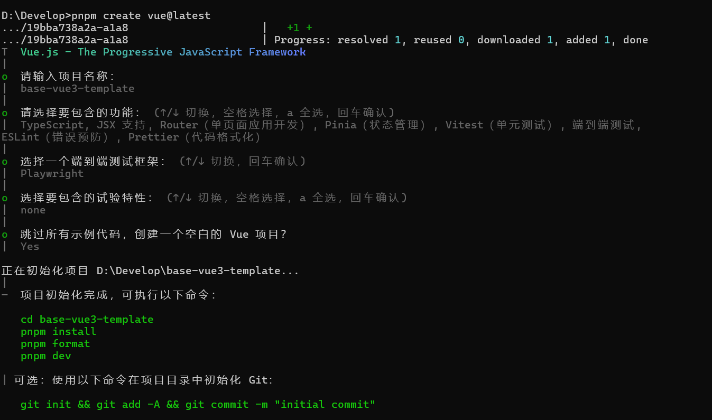
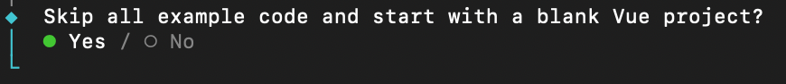
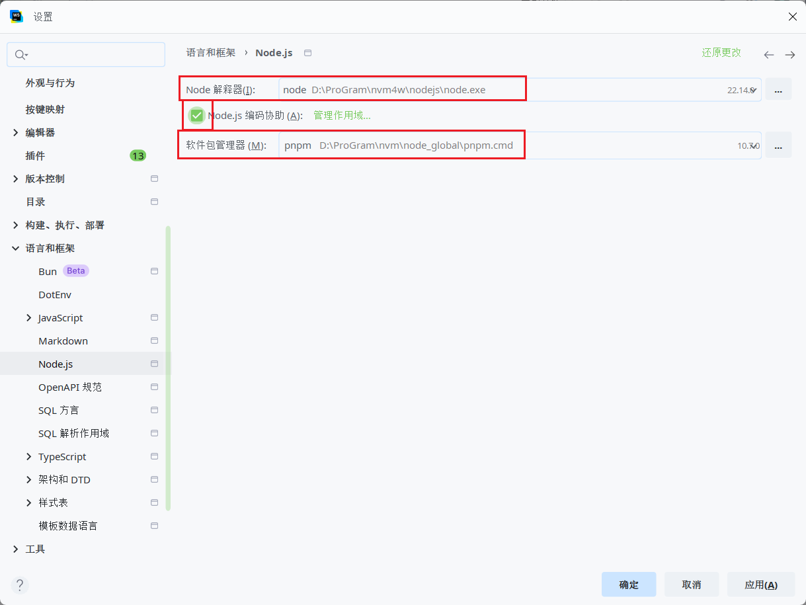
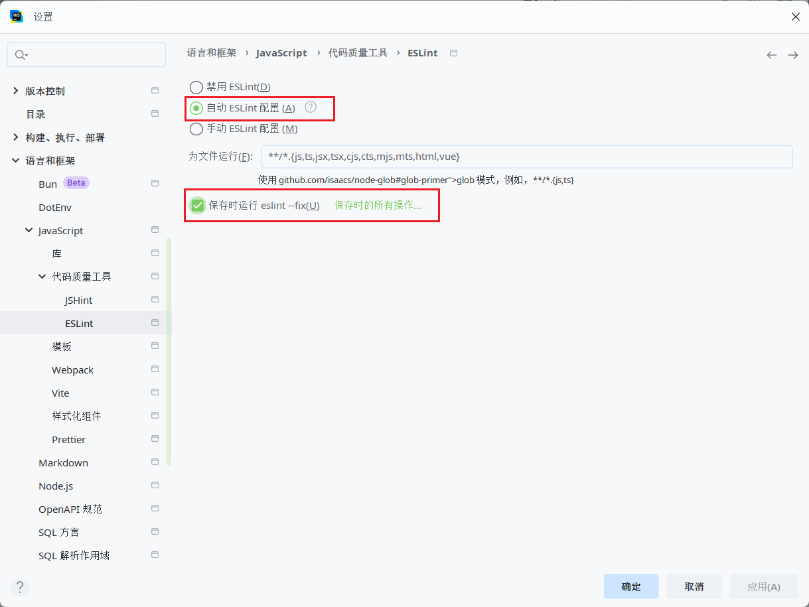
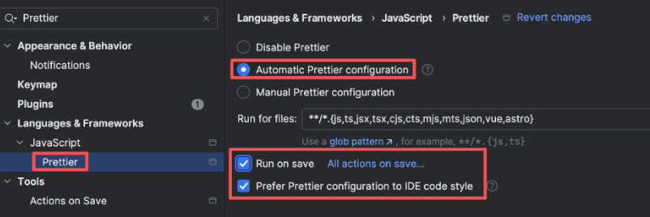
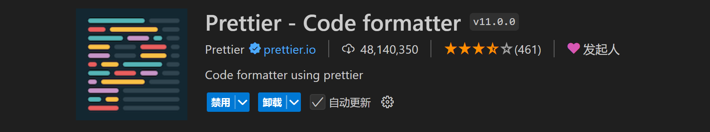
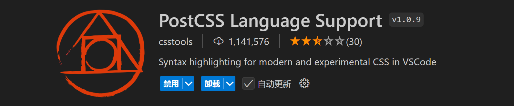
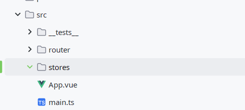
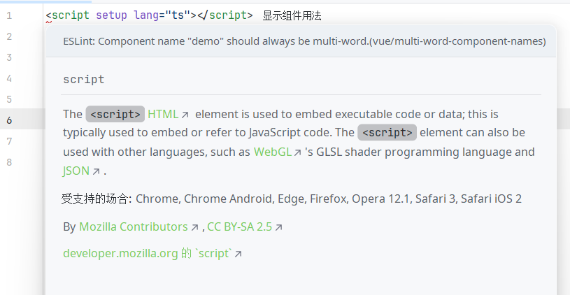
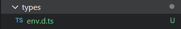

# 初始化项目

## 开发环境

开发环境使用当下主流的 NodeJS + pnpm 组合。可以使用 `node -v`、`pnpm -v`查看版本号。

:::info 当前使用的版本

- Node：v22.14.0
- pnpm：10.7.0

:::

:::tip

- 建议使用 nvm 来管理多个 Node 版本，方便在不同项目间切换。
- 可使用 `npm install -g pnpm`来安装 pnpm 版本。
- 可使用 `pnpm self-update`来更新 pnpm 版本。

:::

## 关于版本选择

通常情况下，选择依赖版本，主要考虑以下因素：

1. 稳定性：选择经过充分测试的稳定版本。
2. 兼容性：确保各依赖之间版本匹配，避免冲突。
3. 功能性：满足项目的基本需求。

但**兼容性**不能忽视，不兼容的版本千万别去乱搞，“志不同，不相为谋”，不同依赖的不同版本，一定要确保兼容！

使用 vue3  通过官方脚手架创建项目，默认配置好了最新的、可兼容的版本，其他的依赖直接上新版。

## 初始化项目

### 创建项目

使用 vue 官方脚手架创建项目即可：

```shell
pnpm create vue@latest
```

根据向导进行选择：



创建项目：

- 项目名为 base-vue3-template
- 添加了 TypeScript、TSX 的支持
- 集成 Vue Router、Pinia
- 使用 ESLint 和 Prettier 规范代码。
- 使用Vitest单元测试。
- 使用Playwright端到端测试。

回车后，在下一步的选择实验性功能时，两者都没有选择。

回车，是否不生成示例代码、仅创建空的项目，我选 Yes。如果选择 No，则会创建一堆乱七八糟的文件；如果选择 Yes，那啥都没有。咱选 Yes，从空白开始打磨：



回车，等待创建。项目创建完成后，在命令行中进入项目根目录，安装依赖：

```shell
cd base-vue3-template

pnpm i
```

如果使用 npm 官方注册中心 https://registry.npmjs.org/, 安装依赖速度可能会稍慢，可以切换为 taobao 注册中心 https://registry.npmmirror.com/

> 推荐使用 nrm 管理多个注册中心，可以很方便进行切换。

依赖安装完成后，启动项目，测试是否正常运行：

```shell
pnpm dev
```

项目正常启动后，在浏览器中访问：http://localhost:5173/

若页面能正常显示，且控制台不报任何异常，则项目创建成功。

这个时候建议初始化 Git 仓库以便进行版本管理：

```shell
# 初始化 Git 仓库
git init

# 添加所有文件
git add -A

# 提交初始化代码
git commit -m"chore: 初始化 Vue3 模板项目"
```

### 配置 IDE

使用习惯的 IDE 打开项目并进行相应配置。

#### WebStorm 配置

使用 WebStorm 打开项目，依次进行如下配置：

1. Node.js 配置 Node.js 的版本以及包管理工具：

   

2. ESLint 开启 ESLint，自动寻找 ESLint 的配置文件，并在保存时修复错误：

   

3. Prettier 开启 Prettier，自动寻找 Prettier 的配置，并且保存时格式化：

   

#### vscode 插件

::: tip

vscode 插件 eslint prettier stylelint unocss vue-official postcss

:::







## 调整项目文件

### 配置.npmrc

::: tip

.npmrc 是 npm 运行时配置文件，用于设置依赖包的安装来源。 [https://pnpm.io/zh/npmrc](https://gitee.com/link?target=https%3A%2F%2Fpnpm.io%2Fzh%2Fnpmrc)

:::

根目录新建 `.npmrc `以便于 pnpm

```shell [.npmrc]
# 使用淘宝镜像源
registry = https://registry.npmmirror.com
# registry = https://registry.npmjs.org

# 根据需要提升含有以下的依赖包到根 node_modules 目录下
public-hoist-pattern[]=husky
public-hoist-pattern[]=*eslint*
public-hoist-pattern[]=@eslint*
public-hoist-pattern[]=*prettier*
public-hoist-pattern[]=lint-staged
public-hoist-pattern[]=*stylelint*
public-hoist-pattern[]=@commitlint*
public-hoist-pattern[]=core-js

# 提升所有依赖到根 node_modules 目录下，相当于 public-hoist-pattern[]=*，与上面一种方式一般二选一使用
# 极不推荐用这样的方式解决依赖问题，这样没有充分利用 pnpm 依赖访问安全性的优势，又走回了 npm / yarn 的老路。
# shamefully-hoist=true

enable-pre-post-scripts=true
engine-strict=true
package-manager-strict=false
```

### 包管理器限制

调整package.json，添加限制：

```json [package.json]
{
  // 只允许使用pnpm来开发
  // preinstall: 在install之前（首次）执行
  // postinstall: 在install之后（首次）执行
  "scripts": {
    "preinstall": "npx only-allow pnpm"
  },
  // 防止最外层包被发布出去，设为true以后发布时会提醒你
  "private": true,
  "engines": {
    "node": "^20.19.0 || >=22.12.0",
    "pnpm": ">=10"
  }
}
```

### 删除文件

由于在创建项目的时候，选择了创建空项目、不生成示例代码，故项目文件比较少。src 中默认创建的目录只有 `router`和 `stores`。

这里只需要删除 stores 中的文件即可，目录保留着。



### 创建测试页面

在 `src`中创建目录 `views`, 并在该目录中创建 `demo.vue`作为测试页面：

```vue [src/views/demo.vue]
<template>
  <div class="demo">demo</div>
</template>
```

由于开启了 ESLint，创建该文件后，会提示错误：`Component name "demo" should always be multi-word`：

:::tip

在实际开发中，组件名使用多单词形式是一个好习惯，但对于测试页面和一些简单组件，单单词命名也可以接受，因此这里关闭该规则。

不同时期 create-vue 脚手架创建出来的项目中的 ESLint 配置文件都有很多变化，即使对应 vue 的版本都是 3.5.x，依然有一些不同的地方。

:::



在 `eslint.config.ts`中关闭该规则：

```json [eslint.config.ts]
export default defineConfigWithVueTs(
  ...

  {
    rules: {
      'vue/multi-word-component-names':'off',
    },
  },
)
```

### 配置路由

修改`src/router/index.ts`文件，在该文件中配置 demo.vue 的路由，并且在文件最后导出 **useRouter**方法，以便实现模块化注册：

```typescript [src/router/index.ts]
import{ createRouter, createWebHistory }from'vue-router'
import type { App }from'vue'

const router = createRouter({
  history:createWebHistory(import.meta.env.BASE_URL),
  routes:[
    {
      path:'/',
      redirect:'/demo'
    },
    {
      path:'/demo',
      name:'demo',
      component:()=>import('@/views/demo.vue')
    }
  ]
})

export const useRouter=(app: App)=>{
  app.use(router)
}

export default router
```

### 修改 main.ts 的代码

调整 `src/main.ts`，删除集成 pinia 和 router 的相关代码，并调用 `useRouter`方法安装路由：

```typescript [src/main.ts]
import{ createApp }from'vue'

import App from'./App.vue'
import{ useRouter }from'@/router' // [!code focus] [!code highlight]

const app =createApp(App)
useRouter(app) // [!code focus] [!code highlight]
app.mount('#app')
```

### 清理App.vue

删除 App.vue 中的无用代码，增加路由插座 router-view：

```vue [src/App.vue]
<template>
  <router-view/>
</template>
<script setup lang="ts"></script>
<style scoped></style>
```

现在可以启动项目，测试是否能正常运行。如果访问根路径能跳转 demo 路由，显示demo页面，并且浏览器控制台不报任何错误，则说明项目初始化成功。

### 调整声明文件

创建types文件夹用于存放类型声明文件，将`env.d.ts`移动至types：



调整`tsconfig.app.json`：

```json [tsconfig.app.json]
{
  "extends": "@vue/tsconfig/tsconfig.dom.json",
  "include": ["types/**/*.ts", "src/**/*", "src/**/*.vue"], // [!code focus] [!code highlight]
  "exclude": ["src/**/__tests__/*"],
  "compilerOptions": {
    "tsBuildInfoFile": "./node_modules/.tmp/tsconfig.app.tsbuildinfo",
    "module": "ESNext",
    "target": "ES2020",
    "moduleResolution": "Bundler",
    "allowImportingTsExtensions": true,
    "paths": {
      "@/*": ["./src/*"]
    }
  }
}
```

调整`tsconfig.vitest.json`：

```json [tsconfig.vitest.json]
{
  "extends": "./tsconfig.app.json",
  "include": ["src/**/__tests__/*", "types/**/*.ts"], // [!code focus] [!code highlight]
  "exclude": [],
  "compilerOptions": {
    "tsBuildInfoFile": "./node_modules/.tmp/tsconfig.vitest.tsbuildinfo",

    "lib": [],
    "types": ["node", "jsdom"]
  }
}
```
