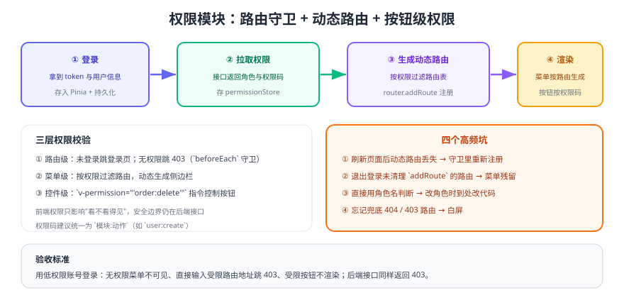

# 权限模块

模板默认只有"登录"没有"权限"。本模块补齐**路由级、菜单级、控件级**三层权限，形成可复用的权限骨架；后端接口的权限校验属于服务端职责，见 [认证与授权专题](../../../../docs/Backend/Auth/index.md)。



## 设计目标

| 层 | 目标 | 实现位置 |
| --- | --- | --- |
| 路由级 | 未登录跳登录页；无权限跳 403 | `router/guard.ts` |
| 菜单级 | 只展示有权限的菜单 | 由路由表过滤生成 |
| 控件级 | 无权限的按钮不渲染 | `v-permission` 指令 |

::: tip 权限码约定
统一使用 `模块:动作`，例如 `order:read`、`order:delete`。**不要在业务代码里判断角色名**（如 `role === 'admin'`），否则每次调整角色都要改代码。
:::

## 一、权限状态与接口

```ts [src/stores/permission.ts]
import { defineStore } from 'pinia'
import { getProfile } from '@/api/user'

export const usePermissionStore = defineStore('permission', {
  state: () => ({
    loaded: false,            // 是否已拉取过权限
    roles: [] as string[],    // 角色（仅用于展示，不用于判定）
    codes: [] as string[],    // 权限码：order:read / order:delete ...
    routes: [] as RouteRecordRaw[],  // 按权限过滤后的路由
  }),
  actions: {
    async load() {
      if (this.loaded) return
      const { roles, codes } = await getProfile()
      this.roles = roles
      this.codes = codes
      this.loaded = true
    },
    has(code: string) {
      return this.codes.includes(code)
    },
    reset() {
      this.loaded = false
      this.roles = []
      this.codes = []
      this.routes = []
    },
  },
})
```

## 二、动态路由

```ts [src/router/permission.ts]
import type { RouteRecordRaw } from 'vue-router'

/** 路由 meta 中声明所需权限：meta: { code: 'order:read' } */
export function filterRoutes(routes: RouteRecordRaw[], codes: string[]): RouteRecordRaw[] {
  return routes
    .filter((route) => {
      const code = route.meta?.code as string | undefined
      return !code || codes.includes(code)      // 未声明权限的路由默认放行
    })
    .map((route) => ({
      ...route,
      children: route.children ? filterRoutes(route.children, codes) : undefined,
    }))
}
```

```ts [src/router/guard.ts]
import router from './index'
import { useUserStore } from '@/stores/user'
import { usePermissionStore } from '@/stores/permission'
import { filterRoutes } from './permission'
import { asyncRoutes } from './routes'

const WHITE_LIST = ['/login', '/403', '/404']

router.beforeEach(async (to) => {
  const userStore = useUserStore()
  const permissionStore = usePermissionStore()

  if (!userStore.token) {
    return WHITE_LIST.includes(to.path) ? true : { path: '/login', query: { redirect: to.fullPath } }
  }

  // 刷新页面后动态路由会丢失，这里重新注册（只需要一次）
  if (!permissionStore.loaded) {
    await permissionStore.load()
    const routes = filterRoutes(asyncRoutes, permissionStore.codes)
    routes.forEach((route) => router.addRoute(route))
    return { ...to, replace: true }             // 重新进入当前目标路由
  }

  // 已加载但仍要校验目标路由权限（防止手输地址）
  const code = to.meta?.code as string | undefined
  if (code && !permissionStore.has(code)) return { path: '/403' }

  return true
})
```

::: danger 动态路由的两个必踩坑
1. **刷新后菜单消失**：`addRoute` 注册的路由不会持久化，必须在守卫里重新注册（上面的 `loaded` 判断）。
2. **退出登录后残留**：退出时要 `router.removeRoute` 或在重置状态后重新加载，否则下次登录会看到上一个账号的菜单。
:::

## 三、按钮级权限指令

```ts [src/directives/permission.ts]
import type { Directive } from 'vue'
import { usePermissionStore } from '@/stores/permission'

export const permission: Directive<HTMLElement, string> = {
  mounted(el, binding) {
    const permissionStore = usePermissionStore()
    if (!permissionStore.has(binding.value)) {
      el.parentNode?.removeChild(el)      // 直接移除，避免"隐藏但仍可触发"
    }
  },
}
```

```vue [src/main.ts（注册）]
import { createApp } from 'vue'
import App from './App.vue'
import { permission } from '@/directives/permission'

createApp(App).directive('permission', permission).mount('#app')
```

```vue [业务页面用法]
<template>
  <el-button v-permission="'order:read'">查看</el-button>
  <el-button v-permission="'order:delete'" type="danger">删除</el-button>
</template>
```

## 四、后端配合（不可省略）

前端权限只解决"看不看得见"，**真正的安全边界在后端**：

1. 接口按权限码校验（如 `@PreAuthorize("hasAuthority('order:delete')")`）。
2. 数据权限要校验资源归属，防止水平越权（见 [权限模型](../../../../docs/Backend/Auth/Authorization/index.md)）。
3. 前端传入的过滤条件只能收窄范围，不能放宽范围。

## 易错点

::: danger 权限模块的五个高频问题
1. 用角色名做判断：改角色要改代码，应改为权限码。
2. 只在菜单隐藏、不校验路由：手输地址即可访问。
3. 忘记 403/404 兜底路由：越权访问时白屏。
4. 登录后未清理上一个账号的权限状态：菜单串号。
5. 把权限数据只放内存：刷新后重新请求导致闪烁，需要与持久化配合。
:::

## 验证方式

1. 用低权限账号登录：受限菜单不可见，直接访问受限路由地址跳转 403。
2. 点击受限按钮：按钮不渲染（检查 DOM 中确实不存在，而不是仅 `display:none`）。
3. 登录后按 F5 刷新：菜单与路由仍然正常（验证动态路由重新注册）。
4. 退出后用高权限账号登录：菜单正确切换，无上一个账号残留。
5. 用低权限账号的 token 直接调后端受限接口：返回 403（验证服务端校验）。

## 参考资料

- Vue Router 导航守卫：https://router.vuejs.org/zh/guide/advanced/navigation-guards.html
- 本库权限设计：[权限模型](../../../../docs/Backend/Auth/Authorization/index.md)
