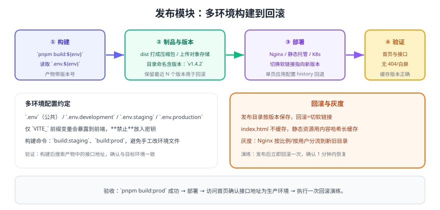

# 发布模块

模板写完要能"安全地发出去"。本模块补齐**多环境构建 → 制品版本化 → 部署 → 验证 → 回滚**的完整链路，前端部署以 Nginx 为例（K8s 场景规划见 [完整项目](../../../Complete/index.md) 的「全流程部署实战」）。



## 一、多环境约定

| 文件 | 用途 | 是否提交 |
| --- | --- | --- |
| `.env` | 公共变量（如应用名） | 提交 |
| `.env.development` | 本地开发 | 提交 |
| `.env.staging` | 预发/测试环境 | 提交 |
| `.env.production` | 生产环境 | 提交（**只放非敏感配置**） |
| `.env.local` | 个人本地覆盖 | 不提交 |

```text [.env.production]
VITE_APP_TITLE=订单管理平台
VITE_API_BASE_URL=/api
VITE_APP_VERSION=1.4.2
```

::: danger 环境变量的三条红线
1. **只有 `VITE_` 前缀的变量会进入前端产物**，其他前缀在浏览器里读不到。
2. **前端没有"秘密"**：任何写入 `.env` 的值都会打进 JS，禁止放密钥、私钥、内部地址。
3. **改完 `.env` 必须重启 dev 服务**，热更新不会重新读取环境变量。
:::

::: tip 发布前的最小验证
构建完成后，先在产物目录里搜一次接口域名（`grep -r "api" dist/ | head`），确认打进去的是目标环境地址——这一步能拦住绝大多数"发错环境"的事故。
:::

```json [package.json（脚本节选）]
{
  "scripts": {
    "build:staging": "vite build --mode staging",
    "build:prod": "vite build --mode production",
    "preview:prod": "vite preview --port 4173"
  }
}
```

## 二、Nginx 部署配置

```nginx [nginx.conf（站点配置节选）]
server {
    listen 80;
    server_name app.example.com;
    root /data/www/app/current;          # current 是指向具体版本的软链接

    # 静态资源长缓存（文件名带内容哈希）
    location /assets/ {
        expires 1y;
        add_header Cache-Control "public, immutable";
    }

    # 入口文件不缓存，保证版本切换立即生效
    location = /index.html {
        add_header Cache-Control "no-cache, no-store, must-revalidate";
    }

    # 单页应用：history 模式回退
    location / {
        try_files $uri $uri/ /index.html;
    }

    # 接口反向代理（与前端同域，规避跨域）
    location /api/ {
        proxy_pass http://backend:8080/;
        proxy_set_header Host $host;
        proxy_set_header X-Real-IP $remote_addr;
    }
}
```

## 三、版本化发布与回滚

```shell
# 目录结构：按版本存放，current 指向当前版本
# /data/www/app/
# ├─ v1.4.1/
# ├─ v1.4.2/
# └─ current -> v1.4.2

# 1. 上传新版本
scp -r dist/* server:/data/www/app/v1.4.2/

# 2. 原子切换（-sfn 先创建临时链接再替换，避免切换瞬间 404）
ssh server "ln -sfn /data/www/app/v1.4.2 /data/www/app/current"

# 3. 验证
curl -I https://app.example.com/                 # 200
curl -s https://app.example.com/ | grep -o 'v1.4.2'   # 版本号存在

# 4. 回滚（一条命令）
ssh server "ln -sfn /data/www/app/v1.4.1 /data/www/app/current"

# 5. 清理历史版本（保留最近 5 个）
ssh server "ls -1dt /data/www/app/v* | tail -n +6 | xargs rm -rf"
```

::: warning 清理命令要格外小心
上面第 5 步会**删除目录**。执行前先用 `ls -1dt /data/www/app/v* | tail -n +6` 单独查看将被删除的列表，确认无误后再拼接删除；生产环境建议改成"先移动到一个临时目录，观察一周后再删"。
:::

## 四、接入 CI/CD（可选）

```yaml [.github/workflows/deploy.yml（节选）]
name: deploy
on:
  push:
    tags: ['v*']
jobs:
  build-and-deploy:
    runs-on: ubuntu-latest
    steps:
      - uses: actions/checkout@v4
      - uses: pnpm/action-setup@v4
        with: { version: 10 }
      - run: pnpm install --frozen-lockfile
      - run: pnpm lint && pnpm build:prod
      - name: Upload artifact
        uses: actions/upload-artifact@v4
        with: { name: dist, path: dist }
```

要点：**用 tag 触发发布**（版本号可追溯）、`--frozen-lockfile` 保证依赖一致、制品先归档再部署。

## 五、发布检查清单

1. 构建产物中的接口地址与目标环境一致（搜索产物中的域名/IP）。
2. `index.html` 不缓存、静态资源长缓存，配置正确。
3. 版本号写入页面（如页脚或 `window.__APP_VERSION__`），便于确认线上版本。
4. 发布后验证首页、登录、一个核心接口，无 404 与白屏。
5. 保留上一个版本目录，并演练一次回滚。

## 验证方式

1. 执行 `pnpm build:staging` 与 `pnpm build:prod`，分别确认产物中的接口地址正确。
2. 部署到测试环境后，用浏览器强制刷新（Ctrl+F5）确认无缓存导致的版本错乱。
3. 执行一次"发布新版本 → 回滚"的完整演练，记录耗时。
4. 用 `curl -I` 检查 `index.html` 与静态资源的缓存头是否符合预期。

## 参考资料

- Vite 环境变量与模式：https://cn.vitejs.dev/guide/env-and-mode.html
- Nginx `try_files` 与缓存配置：https://nginx.org/en/docs/http/ngx_http_core_module.html#try_files
