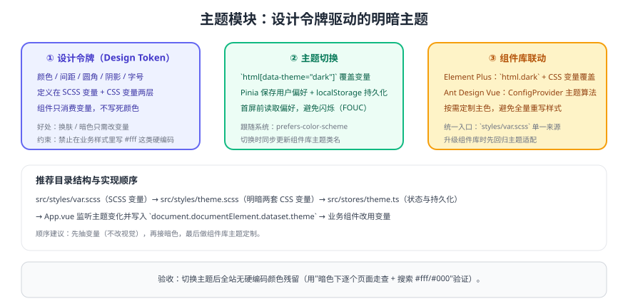

# 主题模块

主题不是"加一个暗色开关"，而是一套**设计令牌（Design Token）驱动的样式体系**：颜色、间距、圆角、阴影统一由变量提供，业务组件只消费变量，才能做到一次改动全站生效。



## 一、变量分层

```scss [src/styles/var.scss]
// ① 基础令牌：只定义"是什么"，不绑定语义
$color-primary: #409eff;
$color-success: #67c23a;
$color-danger: #f56c6c;
$radius-base: 6px;
$space-base: 8px;

// ② 语义令牌：业务只使用这一层
:root {
  --app-bg: #ffffff;
  --app-text: #1f2937;
  --app-border: #e5e7eb;
  --app-primary: #{$color-primary};
  --app-radius: #{$radius-base};
}
```

```scss [src/styles/theme-dark.scss]
// 暗色主题：只覆盖语义令牌，不动业务样式
html[data-theme='dark'] {
  --app-bg: #111827;
  --app-text: #e5e7eb;
  --app-border: #374151;
  --app-primary: #60a5fa;
}
```

::: danger 主题失效的根本原因
**业务样式里写了硬编码颜色**（如 `color: #333`）。变量再完善也盖不住它。所以主题模块的第一步不是写暗色，而是**把硬编码颜色替换为语义变量**。
:::

::: tip 实施顺序建议
先抽变量（不改视觉）→ 再接暗色 → 最后做组件库主题定制。一次性三件事一起做，出问题很难判断是哪一层引起的。
:::

## 二、主题状态与持久化

```ts [src/stores/theme.ts]
import { defineStore } from 'pinia'

export type ThemeMode = 'light' | 'dark' | 'auto'
const STORAGE_KEY = 'app-theme'

function applyTheme(mode: ThemeMode) {
  const prefersDark = window.matchMedia('(prefers-color-scheme: dark)').matches
  const resolved = mode === 'auto' ? (prefersDark ? 'dark' : 'light') : mode
  document.documentElement.dataset.theme = resolved
  // 组件库（Element Plus）需要同步 dark 类名
  document.documentElement.classList.toggle('dark', resolved === 'dark')
}

export const useThemeStore = defineStore('theme', {
  state: () => ({ mode: (localStorage.getItem(STORAGE_KEY) as ThemeMode) || 'auto' }),
  actions: {
    init() {
      applyTheme(this.mode)
      window.matchMedia('(prefers-color-scheme: dark)').addEventListener('change', () => {
        if (this.mode === 'auto') applyTheme('auto')
      })
    },
    setMode(mode: ThemeMode) {
      this.mode = mode
      localStorage.setItem(STORAGE_KEY, mode)
      applyTheme(mode)
    },
  },
})
```

```html [index.html（避免首屏主题闪烁）]
<script>
  // 在样式加载前就确定主题，避免"先白后黑"的闪烁
  (function () {
    var mode = localStorage.getItem('app-theme') || 'auto'
    var dark = mode === 'dark' ||
      (mode === 'auto' && window.matchMedia('(prefers-color-scheme: dark)').matches)
    document.documentElement.dataset.theme = dark ? 'dark' : 'light'
    if (dark) document.documentElement.classList.add('dark')
  })()
</script>
```

## 三、组件库联动

| 组件库 | 做法 | 注意 |
| --- | --- | --- |
| Element Plus | 引入其暗色变量文件，并在 `html` 上加 `dark` 类 | 自定义主色通过 CSS 变量覆盖，避免 `!important` |
| Ant Design Vue | 使用 `ConfigProvider` + 主题算法 | 主题算法切换要跟随 `themeStore.mode` |
| 自研组件 | 统一读取 `--app-*` 变量 | 禁止在组件内写死颜色 |

## 四、样式约定（写进代码规范）

1. 业务样式中**只允许使用语义变量**（`var(--app-*)`）与设计令牌。
2. 需要新增颜色时，先加令牌，再使用；禁止"就地取色"。
3. 图片/图标资源要提供暗色版本，或使用 `currentColor` 跟随文字色。
4. 第三方组件样式覆盖集中在 `src/styles/override/`，不要散落在页面里。

## 验证方式

1. 切换三种模式（亮/暗/跟随系统），确认全站配色同步变化且无闪烁。
2. 刷新页面，确认主题保持上次选择（持久化生效）。
3. 在项目内搜索硬编码颜色（`#fff`、`#000`、`rgb(`）确认无业务残留。
4. 逐个页面在暗色下走查，重点看：表格斑马纹、弹窗遮罩、图表配色、图片背景。

## 参考资料

- Element Plus 暗色模式：https://element-plus.org/zh-CN/guide/dark-mode.html
- CSS 自定义属性：https://developer.mozilla.org/zh-CN/docs/Web/CSS/Using_CSS_custom_properties
