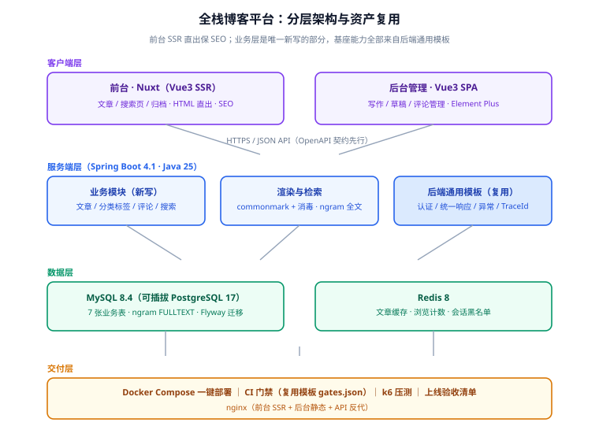

# 架构设计与技术选型

选型页回答「为什么这么搭」。原则沿用 [完整项目交付 · 架构设计](../../../../docs/Others/ProjectDelivery/Architecture/index.md)：**可逆决策从快，不可逆决策慎重**。本项目里真正不可逆的只有两个——前台渲染模式和搜索方案的升级路径，其余都留了退路。

## 一句话定位

三层结构（客户端 / 服务端 / 数据层）加一条交付横切层；**唯一新写的是业务模块**，认证、响应、异常、门禁全部来自 [后端通用模板](../../../Base/BackendTemplate/index.md)。



## 前台为什么是 SSR：本项目的第一个不可逆决策

| 方案 | SEO | 首屏 | 复杂度 | 结论 |
| --- | --- | --- | --- | --- |
| 纯 SPA（Vue3 CSR） | 差：爬虫拿到的 HTML 没有正文 | 依赖 JS 加载 | 低 | 博客的生命线是搜索流量，**直接否决** |
| 预渲染（静态生成） | 好 | 最好 | 低 | 文章频繁更新、要有搜索与评论动态区，纯静态不够 |
| **Nuxt SSR** | 好：HTML 直出含正文 | 好 | 中（要管服务端运行时） | **选定**；渲染模式可按路由混合（文章 SSR、归档可静态化） |

SSR 是「改起来要伤筋动骨」的那类决策——它决定了部署形态（Node 服务端进程、nginx 反代、进程守护），所以放第 1 周定死。具体落地（数据获取、Server Routes、缓存头）按 [Nuxt 专题](../../../../docs/Frontend/Frame/Nuxt/index.md) 的渲染模式与部署页执行，不重复展开。

## 后端：模板基座 + 业务模块

```text
blog-platform/
├─ blog-server/          # Spring Boot 多模块，直接继承 BackendTemplate 结构
│  ├─ blog-domain/       # 文章、分类、标签、评论、搜索（本项目唯一新写的核心）
│  ├─ blog-web/          # Controller + OpenAPI 契约（契约先行，第 92 天定稿）
│  └─ （common/spi/web/application 四层沿用模板）
├─ blog-front/           # Nuxt 前台
├─ blog-admin/           # Vue3 后台
├─ db/                   # Flyway 迁移（沿用模板双方言目录约定）
├─ deploy/               # docker-compose.yml + nginx 配置
└─ scripts/              # 冒烟、门禁、压测脚本
```

两条复用纪律：

1. **模板的模块改坏的代价由模板的门禁兜底**：`gates.json`、`parity_check.py`、验收脚本原样跟过来，本项目只往清单里**加**业务判据，不改模板判据；
2. **模板没有的能力才新写**：例如「模板的认证是面向管理 API 的，博客前台读者登录走同一套 JWT 但角色是 READER」——这是扩展而不是另起炉灶。

## 搜索方案：先 MySQL，后 ES，把升级点写下来

| 方案 | 中文支持 | 运维成本 | 适用数据量 | 结论 |
| --- | --- | --- | --- | --- |
| LIKE '%kw%' | 无分词概念 | 零 | 千级即慢 | 否决（仅作为正确性对照组） |
| **MySQL ngram FULLTEXT** | ngram 切词，够用 | 零（主库自带） | 十万级以内 | **第一期选定** |
| Elasticsearch | IK 分词 + 相关性排序 | 一套集群 | 百万级 | 预留升级路径，不提前上 |

:::danger 注意
「预留升级路径」必须落在具体设计上才有意义，本项目落成三条硬约定：

1. 搜索调用收敛在 `SearchService` **一个接口**后面，业务层不直接拼 SQL——未来换 ES 只换实现；
2. 全文索引建在**独立的只读字段**上（见数据库设计页），写入路径与展示路径解耦；
3. 升级触发条件写死：**文章数超过 20 万、或出现「按相关度排序」的真实需求**，两者满足其一才引入 ES（对接方式见 [Elasticsearch 专题](../../../../docs/DB/NoRelational/Elasticsearch/index.md)）。
:::

## 缓存与计数策略

| 数据 | 策略 | 理由 |
| --- | --- | --- |
| 文章详情（渲染后 HTML 片段） | Cache-Aside，TTL 10 分钟，发布/更新时主动失效 | 读多写少，失效时机明确 |
| 首页/列表 | 短 TTL（60s）不主动失效 | 列表页容忍秒级陈旧，省掉失效广播 |
| 浏览计数 | Redis `INCR`，定时任务每 5 分钟回写 MySQL | 高频写不压主库；丢窗口内几秒计数可接受 |
| 评论数 | 不缓存，跟随评论表 `COUNT`（索引覆盖） | 强一致展示，量级小 |

## 交付层

- **一键部署**：`deploy/docker-compose.yml` 起 nginx + 前台 Node + 后端 + MySQL + Redis，`deploy/deploy.sh` 沿用模板的「起服务 → 轮询健康 → 冒烟」三段式；
- **CI 门禁**：在模板 `gates.json` 基础上追加业务门禁（迁移可执行、契约不破坏、搜索冒烟），沿用 [统一门禁](../../../Base/BackendTemplate/Gates/index.md) 的单一来源机制；
- **配置与密钥**：全部环境变量注入、无默认值即 fail fast，沿用模板的 `StartupSecurityCheck` 思路。

## 验证方式

本页属于第 1 周设计产物，验收判据是：**四条主链路都能在这张架构图上找到落点**——写作发布（业务模块 + MySQL）、阅读渲染（SSR + 渲染管线）、评论（业务模块 + Redis 会话）、搜索（SearchService + ngram）。找不到落点的需求要么补设计、要么回需求页裁掉。
