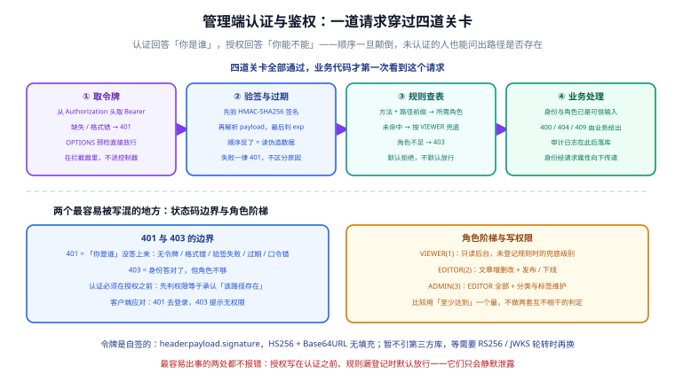

# 管理端认证与角色

第 98 天把「写 → 渲染 → 读」链路打通了，但管理端的接口**谁都能调**——契约里声明的 `401` / `403` 一直是空壳。本页把这一层补上：令牌怎么签发与校验、口令怎么存、角色怎么分级、鉴权规则怎么在「忘记登记」时偏向安全，以及为什么**认证必须排在授权前面**。



::: warning 本页只有设计，没有可运行代码
本仓是文档库，`project/` 下不存放源码。下面出现的 `TokenService.java`、`AuthInterceptor.java`、`auth_smoke.py` 等，都是**要你在自己工程里创建的文件**；代码块给的是关键实现与结构，不是本仓已提交的文件。
:::

## 一句话定位

管理端认证层要解决的不是「怎么把 JWT 用起来」，而是三个更容易出错的问题：**令牌校验的顺序**、**鉴权规则漏登记时的兜底方向**、以及 **`401` 与 `403` 谁先谁后**。这三处写错都不会报错，只会安静地泄露。

本节对应第 99 天，是第 2 周核心编码收尾的第一步。

## 认证与鉴权要回答的四个问题

| 问题 | 属于 | 失败时的语义 | 本项目落在 |
| --- | --- | --- | --- |
| 你是谁？ | 认证（Authentication） | `401` 未认证 | `TokenService` + `AuthInterceptor` |
| 你说的身份是真的吗？ | 认证 | `401` 未认证 | 验签 + `exp` 判断 |
| 你能不能做这件事？ | 授权（Authorization） | `403` 无权限 | `AuthorizationRules` + `AdminRole` |
| 你凭什么登录？ | 凭据校验 | `401` 未认证 | `AdminUserStore` + `PasswordHasher` |

::: tip 一句话理解
**认证与授权是两个独立的问题，且必须按顺序解决。** 把「查令牌」和「查角色」揉在一个方法里，最容易出现的后果不是漏判，而是**顺序颠倒**——先判权限，等于对还没出示身份的人承认「这个接口是存在的」。
:::

## 令牌设计

### 三段式结构

令牌沿用 JWT 的外观：三段 Base64URL（无填充）用 `.` 连接，中间段是签名的原始字节。

```text
eyJhbGciOiJIUzI1NiJ9.eyJzdWIiOiJhZG1pbiIsInJvbGUiOiJBRE1JTiIsImV4cCI6MTc5MDk5OTk5OX0.3f9c...（32 字节 HMAC）
└──── header ────┘ └──────────────── payload ─────────────────┘ └──────── signature ────────┘
```

| 段 | 内容 | 说明 |
| --- | --- | --- |
| header | `{"alg":"HS256"}` | 只声明算法；**校验时不读 header 决定算法**，否则会出现「把 alg 改成 none 就免签」的经典漏洞 |
| payload | `sub` / `name` / `role` / `exp` | `sub` 是用户名，`name` 是展示名（后台右上角直接用，省一次查询），`exp` 是过期时间戳（秒） |
| signature | `HMAC-SHA256(header + "." + payload, secret)` | 用 JDK 自带的 `Mac` 计算，密钥从环境变量注入 |

### 为什么先不引第三方 JWT 库

| 方案 | 代价 | 结论 |
| --- | --- | --- |
| 引 JWT 库 | 版本对齐、CVE 跟进、多一层构建期风险 | 当前只需要「签发 / 验签 / 判过期」三件事，不值 |
| 用 JDK 的 `Mac` 自签 | 约 40 行，需自己保证比较与解析顺序正确 | **本项目当前的选择** |

::: tip 这是可逆决策，所以从快
等到需要 **RS256 非对称签名**、**JWKS 公钥轮转**、**多受众（audience）校验**时，自签实现的成本就会超过引库。那时候再换——判断依据是「需求是否出现」，不是「库是否流行」。
:::

### 校验顺序：先验签、再解析、最后判过期

这是本节最关键的一段。三步顺序不能换：

```java [TokenService.java 结构示意]
// ① 格式：必须是三段，任何一段为空直接失败
String[] parts = token.split("\\.");
if (parts.length != 3) return null;

// ② 先验签：用恒定时间比较，签名不对就到此为止
byte[] expected = hmac(parts[0] + "." + parts[1]);
if (!MessageDigest.isEqual(expected, base64UrlDecode(parts[2]))) return null;

// ③ 签名通过后才解析 payload —— 上一步不通过，这里的字节根本不可信
JsonNode claims = mapper.readTree(base64UrlDecode(parts[1]));

// ④ 最后判过期（留 30 秒时钟偏移容忍）
long exp = claims.path("exp").asLong(0);
if (exp <= Instant.now().getEpochSecond() - 30) return null;
```

::: danger 顺序颠倒会发生什么
1. **先解析 payload 再验签**：伪造者的 payload 会被当合法数据读出，签名检查形同虚设——攻击者根本不需要密钥。
2. **只比较字符串前缀**（`signature.startsWith(...)`）：按字节短路比较会带来时间侧信道，理论上可被逐字节爆破。用 `MessageDigest.isEqual` 做**恒定时间**比较。
3. **读 header 里的 `alg` 决定算法**：把 `alg` 改成 `none` 就得到「免签令牌」。本项目固定 HS256，不看 header。
:::

## 口令存储

### 为什么不直接用摘要

| 方式 | 问题 |
| --- | --- |
| 明文 | 一次库泄露等于全站账号失守；日志、备份、堆转储里都是明文 |
| MD5 / SHA-1 | 已被广泛碰撞；GPU 每秒可跑百亿次，弱口令秒破 |
| 单轮 SHA-256 | 同上，缺**计算成本**这一维 |
| **PBKDF2 / bcrypt / Argon2** | 通过迭代次数把单次验证成本抬高若干数量级，**本项目的选择** |

### PBKDF2 参数与存储格式

```java [PasswordHasher.java 结构示意]
private static final int ITERATIONS = 120_000;   // OWASP 对 PBKDF2-HMAC-SHA256 的下限附近
private static final int SALT_BYTES = 16;        // 每个用户独立随机盐
private static final int KEY_BITS   = 256;

// 存储格式自描述：算法与参数都写进去，将来换算法能识别旧记录
// pbkdf2-sha256$120000$<saltBase64>$<hashBase64>
String stored = "pbkdf2-sha256$" + ITERATIONS + "$" + b64(salt) + "$" + b64(derived);

boolean matches(String raw, String stored) {
    String[] p = stored.split("\\$");               // 4 段
    int iter = Integer.parseInt(p[1]);
    byte[] salt = b64decode(p[2]);
    byte[] expect = b64decode(p[3]);
    byte[] actual = pbkdf2(raw.toCharArray(), salt, iter, KEY_BITS);
    return MessageDigest.isEqual(expect, actual);    // 恒定时间比较
}
```

| 决策点 | 选择 | 理由 |
| --- | --- | --- |
| 迭代次数放哪 | **写进存储串** | 将来调高迭代次数时，老用户仍可用老参数验证，登录成功后顺带重算升级——不需要强制改密 |
| 盐多长 | 16 字节随机 | 防彩虹表；逐用户独立，避免「同一口令哈希相同」被看出来 |
| 比较方式 | `MessageDigest.isEqual` | 恒定时间，避免按字节短路 |
| 口令从哪来 | `prod` 只接受预置哈希 | 见下文「配置」一节 |

## 角色模型

三级，且**用「至少达到」比较**，而不是为每类操作写一套独立判定：

```java [AdminRole.java 结构示意]
public enum AdminRole {
    VIEWER(1),   // 只读后台
    EDITOR(2),   // 文章增删改 + 发布 / 下线
    ADMIN(3);    // EDITOR 全部 + 分类与标签维护

    public boolean atLeast(AdminRole required) {
        return this.level >= required.level;
    }
}
```

| 角色 | 能做什么 | 对应业务动作 |
| --- | --- | --- |
| `VIEWER` | 读后台列表与详情 | 未命中规则时的兜底级别 |
| `EDITOR` | 文章创建、修改、软删除、发布、下线 | `POST/PUT/DELETE /api/v1/admin/posts**` |
| `ADMIN` | `EDITOR` 全部 + 分类与标签的增改 | `POST/PUT /api/v1/admin/categories`、`/tags` |

::: tip 为什么不做「一个操作一个布尔开关」
布尔开关的组合会随接口数量平方增长，且无法回答「新增一个接口时该给谁开」。**有序角色 + 一个阈值**让新增接口只需回答一个问题：它属于哪一级。
:::

## 鉴权规则表：默认拒绝

规则由一个纯函数给出，`AuthInterceptor` 只负责调用它：

```java [AuthorizationRules.java 结构示意]
/** 与认证无关的公开路径 */
boolean isPublic(String method, String path) { ... }

/** 返回该请求所需的最低角色；未命中规则时返回 VIEWER（= 默认拒绝） */
AdminRole requiredRole(String method, String path) {
    // 管理端：写操作按资源分级
    if (path.startsWith("/api/v1/admin/posts")) {
        return "GET".equals(method) ? AdminRole.VIEWER : AdminRole.EDITOR;
    }
    if (path.startsWith("/api/v1/admin/categories")
            || path.startsWith("/api/v1/admin/tags")) {
        return "GET".equals(method) ? AdminRole.VIEWER : AdminRole.ADMIN;
    }
    return AdminRole.VIEWER;   // ← 未登记 ≠ 放行
}
```

| 兜底方向 | 失效时的表现 | 能否被发现 |
| --- | --- | --- |
| 默认放行（未登记返回「无需权限」） | 新接口忘登记 = **对所有人开放** | 几乎不可能发现——请求返回 200，没人会去问「这个接口凭什么让我进」 |
| **默认拒绝（未登记返回 `VIEWER`）** | 新接口忘登记 = 读得到、写不了 | 第一次联调就撞上 `403`，**当场被发现** |

::: tip 这才是「默认拒绝」的准确含义
不是「拒绝一切」，而是**拒绝一切未被显式授予的动作**。落到实现上就是：兜底级别取最低权限，而不是取最高。
:::

## 401 还是 403：顺序不能反

```java [AuthInterceptor.java 结构示意]
public boolean preHandle(HttpServletRequest req, HttpServletResponse resp, Object handler) {
    // ① 预检直接放行：OPTIONS 不带 Authorization 头，挡下来会让跨域整体失效
    if ("OPTIONS".equalsIgnoreCase(req.getMethod())) return true;

    // ② 认证：任何失败都是 401，且不区分具体原因
    String token = TokenService.extractBearer(req.getHeader("Authorization"));
    AdminPrincipal principal = (token == null) ? null : tokenService.verify(token);
    if (principal == null) {
        write(resp, 401, ErrorCode.UNAUTHORIZED);
        return false;
    }

    // ③ 授权：走到这里说明身份已被证实，才谈「够不够」
    if (!principal.role().atLeast(AuthorizationRules.requiredRole(req.getMethod(), req.getRequestURI()))) {
        write(resp, 403, ErrorCode.FORBIDDEN);
        return false;
    }

    // ④ 把已验证的身份传给控制器，避免控制器再去解析一次令牌
    req.setAttribute(AdminPrincipal.REQUEST_ATTRIBUTE, principal);
    return true;
}
```

| 场景 | 状态码 |
| --- | --- |
| 没有 `Authorization` 头 | `401` |
| 头不是 `Bearer ` 开头 | `401` |
| 令牌不是三段式 | `401` |
| 签名不匹配（被篡改） | `401` |
| 已过期 | `401` |
| 用户名或口令错误（登录接口） | `401` |
| 身份合法但角色不足 | `403` |

::: danger 为什么不把「原因」回给客户端
`401` 一律不区分「没令牌 / 签名错 / 过期」，`403` 也不说明「你缺哪个角色」。返回细分原因等于给爆破与探测提供了反馈信号；**排障需要的细节写服务端日志，不写响应体**。
:::

## 配置：本地与生产的语义差异

同一份配置结构，在两种 profile 下的**约束强度不同**——这是刻意的。

```yaml [application-prod.yml（片段）]
blog:
  jwt:
    secret: ${JWT_SECRET}            # 无默认值：给了默认值等于把密钥写进仓库
    ttl-seconds: 7200
  auth:
    users:
      - username: admin
        display-name: 站长
        role: ADMIN
        password-hash: ${ADMIN_PASSWORD_HASH}   # 生产只收哈希
```

```yaml [application-local.yml（片段）]
blog:
  jwt:
    secret: local-dev-only-not-a-secret         # 本机专用，进不了生产
  auth:
    users:
      - username: admin
        display-name: 本站管理员
        role: ADMIN
        password: admin123                      # 本地允许明文，启动时派生哈希
```

| 行为 | `local` | `prod` |
| --- | --- | --- |
| 写成 `password`（明文） | 允许，**启动时打印告警**并派生哈希 | **直接启动失败**（fail-fast） |
| 写成 `password-hash` | 允许，直接使用 | 唯一允许的形式 |
| 用户名重复 | 启动失败（两个同名用户的角色取哪个都不对） | 同左 |
| 角色写错 | 启动失败，并列出合法取值 | 同左 |
| 凭据项占位符带默认值 | 不检查 | **构建期门禁直接报红** |

::: danger 把「本地方便」和「生产安全」做成同一份配置会怎样
最常见的结局是：为了本机调试方便写成明文，然后在生产配置里复制了同一段忘了改。**让两种 profile 的规则不同，而不是让人记得去改**——生产见到明文就起不来，这个错误不可能被忽略。
:::

## 契约补齐

`401` / `403` 不是某个接口的私有细节，而是管理端整条链路的公共分支。因此它们要进契约，且**认证本身也要有路径**：

| 契约变更 | 内容 |
| --- | --- |
| 新增标签 | `认证`，与文章 / 分类标签 / 评论 / 搜索并列 |
| 新增路径 | `POST /api/v1/admin/auth/login`、`GET /api/v1/admin/auth/me` |
| 新增 schema | `LoginRequest`（username / password）、`LoginView`（token / expiresIn / username / displayName / role）、`MeView` |
| 补响应分支 | 管理端各操作补 `401 未登录` 与 `403 权限不足` |
| 校验器 | `contract_check.py` 的链路前缀集合增加「认证」一组，缺路径即报红 |

## 如何验证

先在**你自己的工程**里按上面各节实现这些文件，再依次执行。判据分两层：**先证断言能被证伪，再看主流程**。

```shell
cd your-project/service

# ① 断言有效性：把响应换成空对象 / 换掉状态码，每步都至少要有一处报错
python auth_smoke.py --selftest

# ② 起服务（local profile，内存仓储，不需要数据库）
cd blog-application && SERVER_PORT=18080 mvn spring-boot:run

# ③ 主流程（另开终端）
cd .. && python auth_smoke.py --base http://127.0.0.1:18080

# ④ 契约仍自洽（认证链路 + 401/403 分支都在）
python api/contract_check.py
```

`auth_smoke.py` 的覆盖清单：

| 分组 | 断言要点 | 期望 |
| --- | --- | --- |
| 认失败 | 无令牌 / 非 Bearer / 非三段式 / 篡改签名 / 过期令牌 各请求一次 | 全部 `401` |
| 凭据 | 用户名错、口令错 | 全部 `401` |
| 越权 | `VIEWER` 令牌写文章；`EDITOR` 令牌改分类 | 全部 `403` |
| 正常 | `EDITOR` 建草稿 → 发布 → 软删除；`ADMIN` 建分类 → 建标签 | 全部业务码 `0` |
| 身份一致 | `GET /auth/me` 返回的 `username` / `role` 与登录时一致 | 一致 |
| 契约分支 | 上表每个 `401` / `403` 都在 `openapi.json` 里有声明 | 无缺口 |

::: warning 本页的验收清单尚未在编写环境跑过
设计定稿时实现还没完成构建，所以上表是**判据**，不是实测输出。请遵循页内顺序：先跑 `--selftest`，**如果 `--selftest` 不报红，说明断言本身是恒真的，后面的全绿没有意义**。
:::

## 易错点与最佳实践

::: danger 几处一写就错的地方
1. **先授权后认证**：先判角色再验令牌，等于对未认证的调用方承认「此路径存在」。正确顺序永远是认证 → 授权。
2. **规则表默认放行**：未命中的路径返回「无需权限」而不是最低权限，新增接口会静默全开放。正确做法是兜底 `VIEWER`。
3. **`OPTIONS` 被 401 拦下**：预检请求不带 `Authorization` 头，拦下来会让整个跨域链路失效，且表现为「本地 curl 正常、浏览器全挂」这种极难定位的症状。
4. **令牌校验读 header 的 `alg`**：改成 `none` 即免签。算法必须由服务端固定。
5. **比较签名用 `equals` 而不是恒定时间比较**：`String.equals` 按字节短路，理论上可被逐字节试探。
6. **`401` 响应体里写具体原因**（「令牌已过期」/「签名错误」）：给爆破提供了反馈。原因写日志。
7. **生产配置给凭据占位符加默认值**：`${JWT_SECRET:dev}` 这种写法等于把密钥提交进仓库；门禁应当直接报红。
8. **把「本地方便」的明文口令配置复制到生产**：不要靠人记得改，让 `prod` 见到明文就起不来。
:::

::: tip 两条值得照做的纪律
1. **权限规则写成纯函数**：`requiredRole(method, path)` 不依赖 Spring 上下文，因此可以脱离 Web 容器直接做单元测试——「哪些路径要什么角色」这张表本身就该被测试覆盖。
2. **身份只解析一次**：拦截器验证通过后把 `AdminPrincipal` 放进请求属性，控制器只读不算——重复解析既浪费，也给了「两处结论不一致」的机会。
:::

## 下一步（第 100 天）

1. **文章下线动作**：补 `PUBLISHED → OFFLINE → DRAFT` 的合法路径，非法迁移仍返回 `409`；下线必须同时清空可被读者命中的检索结果。
2. **Markdown 渲染能力补齐**：代码块高亮、目录生成、图片本地化——渲染管线已有消毒基础，这一步只加能力不加信任。
3. **鉴权断言上移**：把 `auth_smoke.py` 的 `401` / `403` 用例改写成 MockMvc 集成测试，让权限断言随 `mvn test` 一起跑，而不是依赖人记得起服务。

## 参考资料

- 项目总览：[全栈博客平台](../index.md)
- 本日与相邻章节：[文章写入链路](../WritePath/index.md) ｜ [工程骨架与验收门禁](../Skeleton/index.md) ｜ [接口契约](../Contract/index.md)
- 后端基座对应章节：[认证授权](../../../Base/BackendTemplate/Security/index.md) ｜ [登录业务闭环与令牌生命周期](../../../Base/BackendTemplate/AuthLifecycle/index.md)
- 外部规范：[RFC 7519 JSON Web Token](https://www.rfc-editor.org/rfc/rfc7519) ｜ [OWASP Password Storage Cheat Sheet](https://cheatsheetseries.owasp.org/cheatsheets/Password_Storage_Cheat_Sheet.html) ｜ [OWASP Authentication Cheat Sheet](https://cheatsheetseries.owasp.org/cheatsheets/Authentication_Cheat_Sheet.html)
