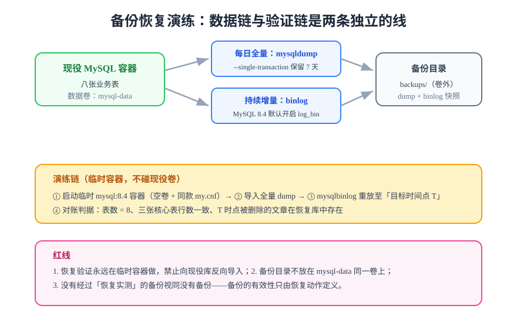

# 备份恢复演练与上线验收清单

> 第 4 周第三步（第 114 天）。[一键部署](../Deployment/index.md)解决了「起得来」，[监控接入](../Monitoring/index.md)解决了「看得见」，本页解决最后一根支柱：「数据丢了能回来」——并在三者之上定稿**上线验收清单**。

## 为什么必须有这一步

部署验收验证的是「现在能跑」，备份演练验证的是「坏了能回」。没有实测过恢复的备份等于没有备份：备份文件损坏、字符集不匹配、binlog 位点断档，全部只有**执行一次恢复**才会暴露。



## 备份策略（先定策略，再演练）

| 项 | 方案 | 理由 |
| --- | --- | --- |
| 全量 | 每日一次 `mysqldump --single-transaction` | 单实例博客量级，逻辑备份足够；`--single-transaction` 保证 InnoDB 一致性快照且不锁表 |
| 增量 | binlog 持续留存（MySQL 8.4 `log_bin` 默认开启） | 支持恢复到任意时间点（PITR） |
| 保留 | dump 7 天、binlog 7 天 | 与「最大可接受数据丢失窗口 ≤ 1 天」匹配 |
| 存放 | 宿主机 `backups/` 目录（**独立于 mysql-data 卷**） | 数据卷损坏不连带备份 |

## 演练四步（临时容器，不碰现役卷）

### ① 造一个「需要恢复」的场景

```shell
# 演练准备：记录当前时间与文章总数
cd deploy
docker compose exec -T mysql mysql -uroot -p"$DB_ROOT_PASSWORD" "$DB_NAME" \
  -e "SELECT NOW(6) AS t_before, COUNT(*) AS posts_before FROM posts;"
# 记下输出（例如 t_before = 2026-10-06 03:20:00，posts_before = 12）

# 然后制造事故：删除一篇文章（模拟误操作）
docker compose exec -T mysql mysql -uroot -p"$DB_ROOT_PASSWORD" "$DB_NAME" \
  -e "DELETE FROM posts WHERE slug='hello-chaos'; SELECT NOW(6) AS t_after;"
# 记下 t_after —— 恢复目标时间点 T 就选在 t_before 与 t_after 之间
```

### ② 启动临时容器并恢复全量

```shell
# 临时容器：空卷 + 与现役同款 my.cnf（ngram 配置必须一致，否则全文索引行为不同）
docker run -d --name mysql-restore \
  -v "$PWD/restore-data:/var/lib/mysql" \
  -v "$PWD/mysql/my.cnf:/etc/mysql/conf.d/my.cnf:ro" \
  -e MYSQL_ROOT_PASSWORD="$DB_ROOT_PASSWORD" -p 23306:3306 mysql:8.4

# 就绪探活：MySQL 首次初始化需要几十秒，探活通过再继续
sleep 40
docker exec mysql-restore mysql -uroot -p"$DB_ROOT_PASSWORD" -e "SELECT 1;"

# 恢复全量 dump
docker exec -i mysql-restore mysql -uroot -p"$DB_ROOT_PASSWORD" "$DB_NAME" \
  < backups/blog-$(date +%F -d yesterday).sql
```

### ③ 重放 binlog 到目标时间点

```shell
# 找出 dump 自带的位点（dump 文件头部 CHANGE MASTER TO ... MASTER_LOG_FILE / MASTER_LOG_POS）
# 从该位点重放到目标时间点 T（只重放业务库）
docker exec -i mysql-restore mysqlbinlog \
  --start-position="$DUMP_POS" \
  --stop-datetime="$T" \
  --database="$DB_NAME" \
  backups/binlog.000012 | \
docker exec -i mysql-restore mysql -uroot -p"$DB_ROOT_PASSWORD"
```

### ④ 对账判据（全部满足才算演练通过）

| 编号 | 判据 | 命令 | 期望 |
| --- | --- | --- | --- |
| R1 | 表数量正确 | `information_schema.tables` 计数 | 8 |
| R2 | 文章总数回到删除前 | `SELECT COUNT(*) FROM posts` | = `posts_before` |
| R3 | 被删的文章回来了 | `WHERE slug='hello-chaos'` | 恰好 1 行 |
| R4 | 读者表对账一致 | `SELECT COUNT(*) FROM users` | 与现役库同一时刻计数一致 |
| R5 | 字符集与排序规则正确 | `SHOW CREATE TABLE posts` | utf8mb4 / 大小写与现役一致 |
| R6 | 恢复耗时已记录 | 演练记录 | 全程（起容器到对账完成）留实测值 |

```shell
# 演练收尾：删除临时容器与临时卷，不留下任何对现役环境的干扰
docker rm -f mysql-restore && rm -rf restore-data
```

:::danger 三条红线
1. **恢复验证永远在临时容器做**——禁止向现役库反向导入，「顺手把数据补回去」是备份演练变成二次事故的第一路径；
2. **备份目录不与数据卷同盘同卷**——`mysql-data` 卷损坏时备份必须还活着；
3. **ngram 等 `my.cnf` 配置必须与现役一致**——配置漂移会让恢复库的全文索引行为与生产不同，验证等于白做。
:::

## 上线验收清单定稿

第 4 周三项支柱全部就位后，上线验收不再新增判据，只做**合并**——每项都来自已验收页面，标注出处：

| # | 验收项 | 判据 | 出处 |
| --- | --- | --- | --- |
| 1 | 五服务全部 Up / healthy | `docker compose ps` 全绿 | 一键部署 |
| 2 | DDL 实测 | 表数 = 8，ngram 运行时值 = 2 / OFF | 一键部署 |
| 3 | 三条冒烟门禁通过 | search 9/9、skeleton 27/0、coreflow 14/14 | 一键部署 |
| 4 | 指标可拉取 | `/actuator/prometheus` 含 `http_server_requests` | 监控接入 |
| 5 | 告警链路实测触达一次 | 值班渠道收到通知 | 监控接入 |
| 6 | traceId 三段日志闭环 | 任取请求 grep 三段日志同 ID | 监控接入 |
| 7 | 备份任务在跑 | `backups/` 有昨日 dump | 本页 |
| 8 | 恢复演练通过 | R1~R6 全部满足 | 本页 |
| 9 | 从零复现 | 按总览文档在新目录重建成功 | 一键部署 |

:::tip 验收清单的作用边界
清单只判定「能不能上线」，不替代压测（顺延第 119 天，口径与[第 3 周收口](../Week3Close/index.md)一致）与混沌演练（见[混沌工程实战](../../../../docs/Ops/ChaosEngineering/Practice/index.md)）。清单之外的每项专项能力各有自己的页面与判据。
:::

## 当日做了什么 / 如何验证 / 下一步

- **做了什么**：备份策略定稿（dump + binlog + 保留期）、恢复演练四步与 R1~R6 判据、上线验收清单九项合并定稿。
- **如何验证**：R1~R6 逐条给出实测输出（表数、行数、被删文章回归、字符集）；演练耗时留实测值；临时容器清理后 `docker ps -a | grep mysql-restore` 为空。
- **下一步**：第 115 天做**第 4 周收口**——对照上线验收清单九项逐条实测回填（与回归报告实测列同一纪律：只填真跑出来的输出），第 4 周里程碑四项对照定稿；压测仍顺延第 119 天。

## 深入阅读

- [备份与容灾：备份策略、RTO/RPO 与工具链选型](../../../../docs/Ops/BackupDR/index.md)
- [一键部署：环境就绪判据](../Deployment/index.md)
- [监控接入：指标口径与告警阈值](../Monitoring/index.md)
