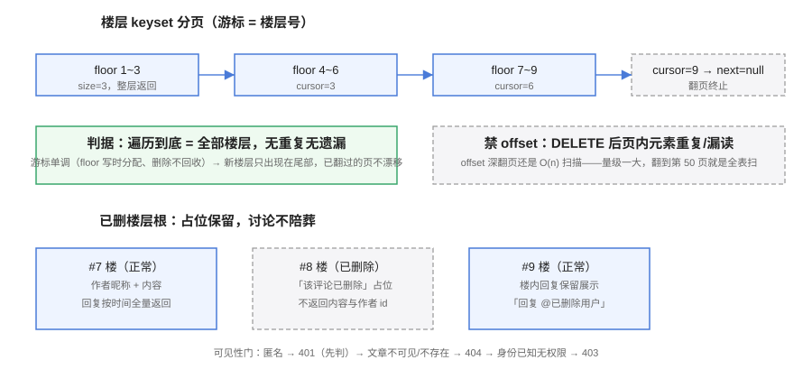

# 评论读侧：楼层分页、占位渲染与契约穷举

本页是「全栈博客平台」第 106 天的构建步骤（周期 4 第 3 周 · 第 2/4 步）。

::: warning 本页命令里的路径指「你自己的工程」
本仓是**文档库**，不存放代码。`service/`、`python xxx.py` 等路径指的是**你按对应章节搭起来的工程目录与脚本**。本页的验收清单是**判据**，不是实测输出。
:::

## 一、当日做了什么

第 105 天把评论的**写入侧**收口（两级楼层、写入三约束、楼层号写时分配）。本日补齐**读侧**：楼层怎么分页（keyset，禁 offset）、楼内回复要不要翻页（不翻）、被删楼层怎么渲染（占位保留）、以及第 104 天顺延下来的**契约 401/403 分支穷举**在评论路径上的落地。顺带定稿一个从第 102 天悬置至今的问题——审核状态（先发后审 / 先审后发）在**读侧**生效，写入侧继续不感知。



### 1.1 楼层 keyset 分页：游标就是楼层号

| 决策点 | 结论 | 理由 |
| --- | --- | --- |
| 游标 | 上一页最后一个楼层根的 `floor` | `floor` 写时分配、删除不回收（第 105 天定稿），单调且稳定——keyset 分页需要的一切它都有 |
| 查询 | `WHERE post_id=? AND root_id=post_id AND floor > ? ORDER BY floor ASC LIMIT ?` | 命中 `uk_comments_post_floor`，一条索引走完 |
| 上限 | `size` 封顶 50（超出按 50 取） | 游标分页一样要防大页；契约的「size 必须上限」规则照用 |
| 终止 | 取不满 `size` → `nextCursor = null` | 客户端翻页循环的唯一出口，不做「猜总数」 |
| offset | **禁止** | 删除会导致页内元素重复/漏读（floor 不回收但**别的东西会删**？不会——楼层不删号，但 offset 的深翻页 O(n) 扫描与「删 3 楼后第 2 页开头重复」仍然成立） |

```java
// 读侧分页骨架（写进你的工程后验证）
public CommentPage listPublished(String slug, Long cursor, int size) {
    Post post = postReader.requirePublishedBySlug(slug);      // 复用可见性 404 口径
    int cap = Math.min(size, 50);
    List<Comment> roots = comments.findRoots(post.getId(), cursor, cap + 1); // 多取一条探边
    boolean hasMore = roots.size() > cap;
    List<Comment> page = hasMore ? roots.subList(0, cap) : roots;
    List<FloorView> items = page.stream().map(root ->
        FloorView.of(root, comments.findReplies(root.getRootId())))   // 楼内回复全量
        .toList();
    Long next = hasMore ? page.get(page.size() - 1).getFloor() : null;
    return new CommentPage(items, next);
}
```

::: tip 为什么 keyset 在评论区是「免费」的
通用列表做 keyset 需要一个稳定的排序键，常常没有；评论区在第 105 天就为「引用锚点」造好了这个键（`floor` 写时分配 + 唯一索引 + 删除不回收）。**写侧的决策在读侧兑现**——这是分层决策复用的一个正面样本。
:::

### 1.2 楼内回复：全量返回，不翻页

| 决策点 | 结论 | 理由 |
| --- | --- | --- |
| 翻不翻页 | 楼内回复**全量返回**，按 `created_at ASC`（对话顺序） | 楼是回复的天然容器，读者要的是「这一层的完整对话」；再翻页就是把对话框切碎 |
| 排序 | 时间升序，与楼层的时间倒序（新的在上）相反 | 楼层找最新，楼内找过程——两类内容的阅读方向相反 |
| 超大楼层 | 不做分页防护，改用监控阈值（单楼回复 > 200 告警） | 超大楼层是产品设计问题（该引导开新楼），不是分页技术问题；分页是给「越滚越多的列表」的，不是给「被设计成有限的东西」的 |

### 1.3 已删楼层根：占位保留，讨论不陪葬

第 105 天的 S2 断言写的是「删除楼层根 → 整层从读者端消失」。本日定稿时发现**这个口径值得修订**——「整层消失」等于把别人的回复连带隐藏，删除发生扩散：

| # | 口径（v2，本日定稿） | 理由 |
| --- | --- | --- |
| ① | 楼层根软删后，原位置渲染**占位**：「该评论已删除」 | 楼层号是引用锚点，「8 楼」不能凭空消失 |
| ② | 占位**不返回**内容与作者 id（`content`/`userId` 置空） | 删除不留可读痕迹；不暴露「谁删的」 |
| ③ | 楼内**回复保留展示**，被回复人显示「已删除用户」 | 删除作者的评论 ≠ 删除别人的讨论；回复者没有同意陪葬 |
| ④ | 回复自己的删除行为不变（第 105 天约束③：已删不可回复） | 占位楼层同样不可回复——删除是讨论的终点 |

::: danger S2 断言修订（清单 v2）
`comment_smoke.py` 的 S2 由「删除楼层根 → 整层消失」修订为「**删除楼层根 → 原位置出现占位、内容与作者不可读、楼内回复仍可见且不可再回复**」。修订后的清单记 28 步（新增 S5/S6 与 401/403 外部可观测分支，见 1.5）。`assertion_audit.py` 的前缀唯一性核查不受影响——改的是断言内容，不是标识。
:::

审核状态也在读侧一并落定：评论表带 `review_status`（`VISIBLE` / `PENDING_REVIEW`），**读者端只渲染 `VISIBLE`**；「先发后审」（写入即 VISIBLE）与「先审后发」（写入即 PENDING_REVIEW）是后台开关，读侧只认状态不认开关——审核动作本身留给第 4 周的后台管理页。

### 1.4 契约 401/403 分支穷举：评论路径

第 104 天把契约的认证分支穷举做在了文章路径上，评论路径本日补齐。判据与文章路径一致：**401 先判 → 404 管不可见 → 403 管无权限**：

| # | 请求 | 调用方状态 | 期望 | 判据说明 |
| --- | --- | --- | --- | --- |
| C1 | `POST /posts/{slug}/comments` | 匿名 | **401** | 先于文章可见性判断（T7 已定，此处回归） |
| C2 | 同上 | 认证读者，文章不可见/不存在 | **404** | 四来源逐字节一致（第 105 天 T2 的读侧回归） |
| C3 | `GET /posts/{slug}/comments` | 匿名，文章 PUBLISHED | **200** | 读者端公开可读 |
| C4 | 同上 | 匿名，文章不可见/不存在 | **404** | 不泄漏存在性；评论随文章可见性走 |
| C5 | `GET` 携带已失效令牌 | 令牌过期 | **401** | 过期即匿名，不降级为 200/404 混合口径 |
| C6 | `DELETE /comments/{id}`（读者删自己评论） | 匿名 | **401** | — |
| C7 | 同上 | 认证读者，评论是别人的 | **403** | 身份已知、资源明确指向、无权限——403 的教科书场景 |
| C8 | 同上 | 认证读者，删自己的 | **204** | — |
| C9 | 同上 | 评论不存在或已删 | **404** | 与「别人的已删评论」同样 404：先 404 后 403，避免用 403 探测存在性 |
| C10 | `DELETE /admin/comments/{id}`（管理端） | 匿名 / 读者角色 / 管理员 | **401 / 403 / 204** | 角色矩阵回归（第 92 天 AuthRoles 判据） |

::: danger 404 与 403 的先后是一条安全边界
删除接口按 id 操作，先判存在性还是先判所有权？**先 404（不存在/已删）再 403（别人的）**。反过来，「403 先行」会让攻击者用一个有效 id 探测「这条评论存在且是别人的」——404/403 的区分本身就成了存在性预言机。文章路径（V1）的判据是「404 覆盖一切不可见」，评论删除路径的判据是「**404 覆盖一切不可达**」——两条判据同源不同形。
:::

### 1.5 断言清单 v2：新增与修订

| 标识 | 层 | 断言 |
| --- | --- | --- |
| T8 | `mvn test` | 分页切片是纯函数：给定 (cursor, size, 楼层列表)，切片结果确定；size>50 被钳制为 50 |
| T9 | `mvn test` | 占位渲染是纯函数：已删楼层根 → `deleted=true`、`content=null`、`userId=null`、回复保留且 `replyToName="已删除用户"` |
| T10 | `mvn test` | 审核状态：`PENDING_REVIEW` 评论不出现在读者端出参；作者自己的楼层视图可见并标注「审核中」 |
| S2（修订） | smoke | 删除楼层根 → 原位置占位、内容与作者不可读、回复保留、占位不可回复 |
| S5 | smoke | keyset 分页遍历到底：翻页收到的楼层并集 = 全部楼层，无重复无遗漏；翻页中途删除一个楼层根，剩余遍历仍不重不漏（删除不回收 floor 的读侧兑现） |
| S6 | smoke | 401/403 矩阵外部可观测面：C1/C4/C5/C6/C7/C10 六分支的响应码与响应体逐字节断言 |

`comment_smoke.py` 记 28 步（原 24 + S5/S6 + S2 修订后的三个占位断言并入计步）；T8~T10 上移 `mvn test`（CommentReadTest），门禁全景仍是八道。

## 二、如何验证

```shell
cd your-project/service

mvn test                            # 期望 BUILD SUCCESS；T1~T10 全绿（新增 CommentReadTest）

export SERVER_PORT=18080 && cd blog-application && mvn spring-boot:run   # 另开终端跑服务

cd your-project/service
python comment_smoke.py --base http://127.0.0.1:18080
# 期望 steps = 28  passed = 28（含 S5 分页遍历、S6 认证矩阵、修订后的 S2 占位口径）
python comment_smoke.py --selftest                 # 期望 selftest: 28/28（断言可证伪）
python assertion_audit.py                          # 期望 PASS：T1~T10 / S1~S6 各只出现一次

# keyset 分页手工抽查
curl -s 'http://127.0.0.1:18080/api/v1/posts/hello-world/comments?size=2'
# 期望出参含 items（≤2 个楼层）与 nextCursor；再以 nextCursor 作为 cursor 请求，楼层严格递增
curl -s -o /dev/null -w '%{http_code}\n' 'http://127.0.0.1:18080/api/v1/posts/hidden-post/comments'
# 期望 404（C4：匿名读不可见文章的评论，不泄漏存在性）

# 401/403 抽查（C6/C7）
curl -s -o /dev/null -w '%{http_code}\n' -X DELETE http://127.0.0.1:18080/api/v1/comments/1
# 期望 401（匿名删除）
curl -s -o /dev/null -w '%{http_code}\n' -X DELETE http://127.0.0.1:18080/api/v1/comments/1 -H "Authorization: Bearer <别人的令牌>"
# 期望 403（身份已知、无权限）
```

## 三、问题与决策

| 问题 | 决策 |
| --- | --- |
| 分页游标用 floor 还是 created_at？ | **floor**。created_at 会随编辑/导入变化且不唯一；floor 写时分配 + 唯一索引，第 105 天已把稳定性付清 |
| 楼内回复要不要也 keyset？ | 不翻页。回复量级被产品设计约束（超大楼层用监控阈值发现），分页是把技术方案错当产品方案 |
| 删除楼层根：整层消失还是占位保留？ | **占位保留（修订 S2）**。「整层消失」让删除扩散到别人的回复；楼层号是引用锚点，锚点不能蒸发 |
| 占位楼层里回复显示什么？ | 回复保留，「回复 @已删除用户」；被回复人 id 不返回——内容可读、身份不可读 |
| 先 404 还是先 403？ | **先 404 后 403**。403 先行会把「资源存在且属于别人」变成可探测信息（存在性预言机） |
| 过期令牌算 401 还是继续算登录态？ | **401**。过期即匿名，任何「过期但放行」的中间态都会让 C 系矩阵出现双解 |
| 审核开关为什么读侧不感知？ | 开关决定写入时的 `review_status` 初值，读侧只认状态——读写两侧解耦，后台改开关不影响已在途的评论 |

## 四、下一步（第 107 天）

进入第 3 周中段，开始**全文搜索**：MySQL ngram 全文索引先行（`ngram_token_size`、`FULLTEXT(title, content)`、搜索出参与排序口径），判据为「建索引后 `MATCH...AGAINST` 命中标题与正文、结果按相关度排序、空查询 400」。若 ngram 中文召回不达标，Elasticsearch 方案作为后备（依赖库内 [ES 专题](../../../../docs/DB/NoRelational/Elasticsearch/index.md)）。里程碑对照：第 3 周（105-111 天）进行中 2/4。
