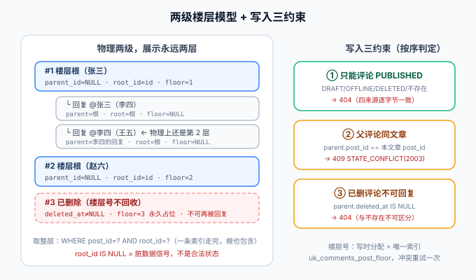

# 评论链路：两级楼层的建模与写入

本页是「全栈博客平台」第 105 天的构建步骤（周期 4 第 3 周 · 联调测试起点）。

::: warning 本页命令里的路径指「你自己的工程」
本仓是**文档库**，不存放代码。`service/`、`python xxx.py` 等路径指的是**你按对应章节搭起来的工程目录与脚本**。本页的验收清单是**判据**，不是实测输出。
:::

## 一、当日做了什么

第 1 周的[数据库设计](../DatabaseDesign/index.md)给 `comments` 表定了 `parent_id + root_id` 冗余的方向，契约里也留了 `/api/v1/posts/{slug}/comments` 两个路径——但**怎么写进去、写错怎么拒绝、楼层号从哪来**一直没有落点。本日把评论的**写入侧**一次收口：楼层模型定稿、写入三约束、楼层号分配策略，以及**先于实现定稿的 `comment_smoke.py` 断言清单**（第 103/104 天刚立好「语义进 `mvn test`、时序留 smoke」的分层判据，第 3 周第一件事就是按这个纪律开工，不能再破一次）。



### 1.1 楼层模型：物理两级，展示永远两层

| 规则 | 内容 | 理由 |
| --- | --- | --- |
| 楼层根 | `parent_id IS NULL`，**`root_id = 自身 id`** | 「取整层」= `WHERE post_id=? AND root_id=?` 一条索引走完，根也包含 |
| 楼内回复 | `parent_id = 父评论 id`，**`root_id = 楼层根 id`** | 任意深度的回复物理上只有一层，树不会长歪 |
| 展示层级 | 读者端永远只渲染两层：楼层 + 楼内回复 | 深层回复挂到楼层根，前端用「回复 @某人」表达被回复者 |
| 被回复人 | 冗余列 `reply_to_user_id`（= 父评论的 `user_id`） | 楼内回复扁平化后唯一的信息线索，不加它就无法区分「回复楼层」和「回复楼内某人」 |

::: danger 易错点：`root_id = NULL` 不是楼层根的合法状态
楼层根的 `root_id` 必须**等于自身 id**（写入时与 id 同值），而不是留 NULL。`root_id IS NULL` 的行只可能是**写入 bug 的脏数据**——把它定义成非法状态，巡检才能一句 SQL 抓住它；如果楼层根合法地留 NULL，「取整层」就要写成 `(root_id = X OR id = X)` 两段式，索引退化，判据也含糊。
:::

### 1.2 楼层号：写时分配 + 唯一索引

「#12 楼」是评论区最稳定的引用锚点（用户会说「12 楼说得对」），读时用 `row_number()` 现算会**随删除漂移**——删掉 3 楼后原 4 楼变 3 楼，所有历史引用失效。因此楼层号**写时分配、永不回收**：

```sql
ALTER TABLE comments
    ADD COLUMN floor BIGINT NULL COMMENT '楼层号，楼层根才有；回复为 NULL',
    ADD UNIQUE KEY uk_comments_post_floor (post_id, floor);
```

| 决策点 | 结论 | 理由 |
| --- | --- | --- |
| 谁有楼层号 | 只有楼层根；楼内回复 `floor = NULL` | 「楼层」是文章级概念，回复在楼层内部用时间排序 |
| 号源 | 当前文章最大 `floor` + 1（`SELECT ... FOR UPDATE` 锁文章行） | 单行锁冲突面最小；同一篇文章的评论天然串行 |
| 并发冲突 | 唯一索引兜底，`DuplicateKey` 捕获后重试一次 | 重试还冲突说明出现了意外的并发热点，第二次失败直接 500 暴露 |
| 删除 | 楼层号**不回收**，软删后号仍占位 | 引用稳定性优先于编号连续性；「3 楼已删除」是正常展示态 |

### 1.3 写入三约束

评论写入必须按顺序过三道关卡，任何一道不过都不产生数据：

| # | 约束 | 判定 | 失败返回 |
| --- | --- | --- | --- |
| ① | **只能评论 PUBLISHED 文章** | `posts` 行存在、`status='PUBLISHED'`、`deleted_at IS NULL` | 404（复用[可见性收敛](../Visibility/index.md)的 404 一致性判据：不存在与不可见逐字节一致，不泄漏存在性） |
| ② | **父评论必须属于同一篇文章** | `parent.post_id == 本文章 post_id` | 409 `STATE_CONFLICT(2003)`（跨文章挂靠是调用方状态错乱，不是「不存在」） |
| ③ | **软删除的评论不可再被回复** | `parent.deleted_at IS NULL` | 404（与「父评论不存在」不可区分——删除楼中楼后不留存在性痕迹） |

```java
// CommentService.create 的骨架（写进你的工程后验证）
@Transactional
public CommentItem create(String slug, CreateComment cmd) {
    Post post = postReader.requirePublishedBySlug(slug);      // 约束①：404 口径
    Long floor = null, rootId = null, replyTo = null;
    if (cmd.parentId() != null) {
        Comment parent = comments.findById(cmd.parentId())
            .filter(c -> c.getPostId().equals(post.getId()))  // 约束②：跨文章 409
            .filter(c -> c.getDeletedAt() == null)            // 约束③：已删 404
            .orElseThrow(CommentExceptions::parentNotFound);
        floor = null;
        rootId = parent.getRootId();                          // 物理仍是一层：挂到楼层根
        replyTo = parent.getUserId();
    } else {
        floor = floorAllocator.nextFloor(post.getId());       // 写时分配 + 冲突重试一次
    }
    Comment c = comments.insert(post.getId(), cmd, floor, rootId, replyTo);
    return CommentItem.of(c, post.getSlug());
}
```

::: tip 与既有判据的衔接
三约束里没有一条是新发明：①是[可见性收敛](../Visibility/index.md) V1 在评论侧的直接复用；②③的错误码沿用[契约](../Contract/index.md)里第 98 天就预留下来的 `2002/2003`——**契约里的错误码第一次在写链路之外有了真实用例**。
:::

::: info 第 109 天补上了「读者究竟是谁」
本页三条约束都建立在「有一个已登录读者」这个前提上：`T7` 断言匿名发评论 `401`，而 `comments.user_id` 与 `reply_to_user_id` 是 `NOT NULL` 的强引用。第 109 天把这个前提真正建了出来——注册、登录、令牌轮换与数据归属见[读者账号与权限](../ReaderAccount/index.md)。

两处衔接口径一并定死：

| 衔接点 | 口径 | 理由 |
| --- | --- | --- |
| 评论作者显示名 | **实时联表取 `users.nickname`**，不做昵称快照 | 改一次昵称，历史评论同步生效；快照与会话中的昵称不一致时无法自证谁对 |
| 作者账号被注销后 | 评论**保留**，作者显示「已注销用户」 | 注销的意义就是名字不再可见；评论里还挂着原名，等于注销是假的 |
| 作者账号被冻结后 | 评论**照常显示**，只是不能再发新评论 | 冻结是「停止写入」，不是「抹掉历史」——删历史属于处罚以外的动作 |
:::

### 1.4 断言清单先行：`comment_smoke.py` 的分层定稿

先定断言、再写实现——实现做完后每一行都要能对号入座：

**语义类（上移 `mvn test`，依赖少、可重复、无时序）**：

| 标识 | 断言 |
| --- | --- |
| T1 | 楼层树构建是纯函数：扁平列表 → 两层树，深层回复正确挂到楼层根、`replyToName` 正确 |
| T2 | 约束①：对 DRAFT / OFFLINE / DELETED / 不存在 slug 四来源发评论，404 响应逐字节一致 |
| T3 | 约束②：`parentId` 指向另一篇文章的评论 → 409 `2003` |
| T4 | 约束③：回复已软删评论 → 404，与父评论不存在不可区分 |
| T5 | 楼层号分配：连续发 N 条根评论，floor 严格递增且删除后不复用 |
| T6 | 内容 1~500 字边界：空串 400、501 字 400（错误信息含字段名）、500 字 201 |
| T7 | 匿名发评论 401 先于 403（未认证时不能先撞文章可见性判断泄漏状态） |

**时序类（留 smoke，跨请求 / 端到端 / 并发）**：

| 标识 | 断言 | 为什么不能上移 |
| --- | --- | --- |
| S1 | 发评论 → 读者端列表立即可见（缓存提交后失效） | 跨进程时序（缓存窗口） |
| S2 | 删除楼层根 → 整层（含回复）从读者端消失的端到端编排 | 端到端编排 |
| S3 | 同一脚本连跑两遍全绿（幂等：floor 继续递增，不因残留数据报错） | 可重复执行依赖真实状态 |
| S4 | 并发 5 线程同时发根评论 → floor 互不相同、无 500 | 真实并发只有集成环境能复现 |

::: info 门禁全景更新为八道
结构门禁（每次提交）/ `mvn test`（PR 门禁）/ **五道 smoke**（api / admin / lifecycle / visibility / comment，部署前）/ 判据唯一性 `assertion_audit.py`（每次提交，新增 `T*/S*` 前缀纳入唯一性核查）。
:::

## 二、如何验证

```shell
cd your-project/service

mvn test                                   # 期望 BUILD SUCCESS；T1~T7 在 CommentTreeTest / CommentWriteTest 中全绿

export SERVER_PORT=18080 && cd blog-application && mvn spring-boot:run   # 另开终端跑服务

cd your-project/service
python comment_smoke.py --base http://127.0.0.1:18080
# 期望 steps = 24  passed = 24：S1~S4 + 三约束的外部可观测面 + 分页边界
python comment_smoke.py --selftest
# 期望 selftest: 24/24 通过（把任一断言的期望值改坏必须变红——断言可证伪）
python assertion_audit.py                  # 期望 PASS：T*/S* 标识在两层中各只出现一次

# 三约束手工抽查（口径与 smoke 一致）
curl -s -o /dev/null -w '%{http_code}\n' -X POST http://127.0.0.1:18080/api/v1/posts/no-such-post/comments -H 'Content-Type: application/json' -d '{"content":"hi"}'
# 期望 404（约束① 的不存在来源）
```

## 三、问题与决策

| 问题 | 决策 |
| --- | --- |
| 楼层号写时分配还是读时计算？ | **写时分配**。「#12 楼」是用户引用锚点，读时 `row_number()` 会随删除漂移，历史引用全部失效 |
| 楼层根的 `root_id` 留 NULL 还是等于自身 id？ | **等于自身 id**。「取整层」一条索引走完；`root_id IS NULL` 定义为脏数据信号 |
| 父评论跨文章返回 404 还是 409？ | **409**。评论存在（不泄漏性问题不成立）、只是挂错了文章——这是调用方状态错乱，与「不存在」语义不同 |
| 父评论已删除返回 404 还是 409？ | **404**。与「不存在」不可区分，删除不留存在性痕迹，对齐可见性收敛的判据 |
| 深层回复为什么不上三级树？ | 两级是物理事实而非产品妥协：无限层嵌套的 UI 与分页都是灾难，「回复 @某人」是社区产品二十年验证过的答案 |
| 并发抢楼层号锁什么？ | 锁文章行（`FOR UPDATE`），不锁全局序列——不同文章的评论互不影响，热点面最小 |
| 断言为什么先于实现定稿？ | 第 103/104 天的教训：后补断言会朝着「实现长什么样」写而不是「语义该是什么」。先定清单，实现只是让清单变绿 |

## 四、下一步（第 106 天）

① **评论读侧**：楼层 keyset 分页（`WHERE root_id <= ?`，禁 offset 深翻页）、楼层内回复全量返回（楼内不翻页，条数天然少）、楼层根被删后的「已删除」占位渲染口径；② 承接第 104 天顺延项：契约 401/403 分支穷举补上评论路径；③ 全文搜索进入第 3 周议程（MySQL ngram 先行，判据见[架构页](../Architecture/index.md)）。
