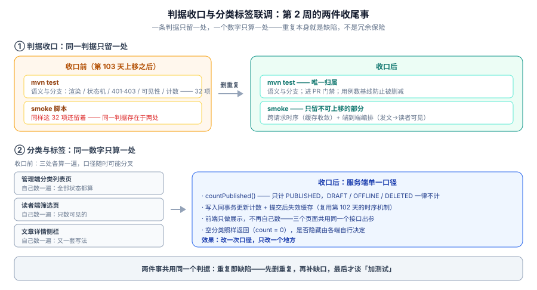

# 判据收口与分类标签联调

第 2 周（第 98-104 天）的最后一天。前六天把功能一条条写出来，也把断言一层层堆到了两处——**第 103 天把 32 项断言上移到 `mvn test` 之后，smoke 脚本里还留着同样一份**。同一天里做两件「减法」：

1. **判据收口**：把 smoke 中已上移的断言删掉，让每一条判据只有一个归属；
2. **分类与标签联调**：把「分类/标签下有几篇文章」这件事从三处各算一遍，收成服务端单一口径，并让管理端编辑页与读者端筛选页用同一份数字。

两件事看着无关，判据是同一条：**重复即缺陷**。重复的断言与被重复计算的计数，都不是「多一层保险」，而是「改一次漏一次」的隐患。



## 一、为什么要删掉「多出来」的断言

第 103 天上移时只做了加法——把能搬的搬进 `mvn test`，smoke 一行没动。于是同一判据同时存在于两处。这不是冗余保险，有三个实在的代价：

| 代价 | 具体表现 | 后果 |
| --- | --- | --- |
| 改一处漏一处 | 接口调整错误码，只改了 `mvn test`，smoke 里那条还在按旧值断言 | 门禁红在你没改的地方，排查方向被带偏 |
| 红灯重复报 | 同一个 bug 让两道门禁同时失败 | 信号变噪声，久了就没人细看是「两处坏一个」还是「两处真坏两处」 |
| 数不清 | 断言总数、覆盖率、门禁步数都失去意义 | 无法回答「这次改动影响哪些判据」 |

:::warning 「上移」必须配「下线」，否则只完成了一半
上移是**搬迁**，不是复制。搬迁的正确收尾动作是：新处全绿 → 确认新处的失败确实是旧处会失败的那条 → 删除旧处 → 再全绿。
跳过最后两步，得到的是一份「看似翻倍、实际更脆」的门禁。
:::

### 哪些必须删、哪些绝对不能删

判据只有一条：**问这条断言是否依赖「两次请求之间的时间关系」或「跨进程可见的状态」**。

| 第 103 天上移的 32 项 | smoke 里对应的旧断言 | 处置 |
| --- | --- | --- |
| R1-R8 渲染器（纯函数） | `api_smoke` 中「文章详情含 `<table>`」等结构化检查 | **删**。语义已由渲染器单测覆盖，且更严格 |
| S1-S12 状态机迁移 | `lifecycle_smoke` 里的 12 条状态迁移步 | **删**。但保留「重复动作幂等」的端到端编排步 |
| A1-A6 契约 401 / 403 | `admin_smoke` 里的匿名访问、越权访问步 | **删**。MockMvc 已覆盖且能验证「401 先于 403」 |
| V1-V4 读侧可见性语义 | `visibility_smoke` 中的「非 PUBLISHED 单次 GET 返回 404」 | **删单次语义**，保留「连续两次 GET 期间缓存收敛」 |
| C1-C2 计数增减 | `lifecycle_smoke` 里的计数检查 | **删**。计数改为分类标签统一口径后由新门禁覆盖（见第二节） |

:::danger 三类断言一旦误删，判据就真的丢了
1. **跨请求时序**：`unpublish 之后立刻 GET 两次都 404`——每一次都能在进程内断言，但这条用例的全部价值在「两次之间」。删了它，缓存回填旧值就再也没人管。
2. **端到端编排**：`注册 → 登录 → 发文 → 读者可见` 的串联。它不测任何单点，测的是**装配**——Bean 是否真的接上了、事务是否真的生效了。
3. **失败路径的编排**：`注销文章 → 缓存失效 → 列表消失`。第三条最容易因为「看起来重复」被删掉。
:::

### 收口的执行顺序

一次只做一组，做完就提交，**任何一步不绿就回滚**——别攒着一起改：

```shell
# 第 ① 步：先确认新处全绿（基线）
cd your-project/service
mvn test -Dtest='MarkdownRendererTest,PostStatusTest,PostVisibilityTest,PostAuthzTest'
# 期望：32 项全绿。此时不要动 smoke

# 第 ② 步：只删一组（例如渲染器 8 项），把该组对应的 smoke 断言注释掉
python api_smoke.py --base http://127.0.0.1:18080
# 期望：仍全绿，且步数下降

# 第 ③ 步：故意制造失败，确认新处真的会红（证明删除不是「删掉了唯一的哨兵」）
#   把 Markdown 渲染器里的表格降级逻辑临时改坏，重跑：
mvn test -Dtest='MarkdownRendererTest'
# 期望：R5「坏表格整块降级」失败 —— 说明判据确实还在

# 第 ④ 步：改回，提交这一组
```

第 ③ 步是本日最容易被跳过、也最值钱的一步。它回答的是「**删掉重复之后，这条判据还有人守吗**」——不验证，你只是在赌。

## 二、分类与标签：从「能存」到「两端一致」

### 收口前的三个口径

分类和标签在第 98 天就落地了（写入链路 + 字典），但**「这个分类下有几篇文章」这个数字，此前是三处各算一遍**：

| 位置 | 算法 | 口径 |
| --- | --- | --- |
| 管理端分类列表页 | 遍历该分类下所有文章节点，按状态计数 | **全部状态都算**（含草稿、已下线、已删除） |
| 读者端筛选页 | 拉一次该分类的文章列表，取数组长度 | 只数读者可见的 |
| 文章详情侧栏 | 单独一次查询，`where category_id = ?` | 依赖查询是否带状态条件 |

三处口径分叉，产生三类肉眼可见的不一致：

1. **同一个分类，管理端显示 12 篇，读者端显示 8 篇**——不是 bug，是两套口径。但用户会当成 bug 报上来；
2. **下线一篇文章后计数只掉一处**——第三个位置忘了改；
3. **空分类的表现不一致**——管理端显示 `0`，读者端因为过滤掉了 `0` 而直接不显示，看起来像「分类消失了」。

### 决策：服务端单一口径，前端只展示

| 决策点 | 结论 | 理由 |
| --- | --- | --- |
| 计数在哪算 | **服务端** | 三个页面共用同一份出参，口径只有一个实现 |
| 算什么状态 | **只算 `PUBLISHED`** | 读者看到的是结果，管理端要的是「发布后有多少读者能看到」；草稿数另有专门的「我的草稿」入口 |
| 空分类返不返回 | **返回，`count = 0`** | 接口保持「分类字典的完整投影」，是否隐藏交给前端——管理端必须看到空分类（否则没法给它加文章） |
| 前端要不要自己过滤 `count > 0` | **读者端要，管理端不要** | 读者端隐藏空分类避免死链；管理端保留全部，保证可管理 |
| 计数怎么保持一致 | **写入同事务更新 + 提交后失效缓存** | 直接复用第 102 天确立的时序机制（[可见性收敛](../Visibility/index.md)），不引入第二套规则 |

:::tip 「只算 PUBLISHED」是一条需要写进注释的产品决策
它意味着：作者在后台写了一篇精彩文章，只要没点「发布」，分类计数就不为所动。这不叫「数字不准」，叫**口径明确**。

真正会出事的是口径没写在代码里——下一个人接手，看到「下线后计数掉了」会以为是 bug 而去"修"。所以这条判据必须落在方法名上：`countPublishedByCategory()`，而不是 `countByCategory()`。
:::

### 接口与实现

接口在 [接口契约](../Contract/index.md) 里追加一个查询参数即可，不改路径：

```yaml
# 契约增量：分类/标签列表支持带计数
GET /api/v1/categories?withCount=true
  responses:
    200:
      content:
        application/json:
          schema:
            type: array
            items:
              type: object
              required: [id, name, slug]
              properties:
                id:        { type: integer }
                name:      { type: string }
                slug:      { type: string }
                postCount: { type: integer, minimum: 0 }   # 新增：只计 PUBLISHED
```

```java
// 单一数据源：所有需要「分类下有多少篇」的地方都走这里
@Mapper
public interface CategoryCountMapper {
    // 一条 SQL 算出全部分类的 PUBLISHED 计数，避免 N+1
    @Select("""
        SELECT c.id AS categoryId, COUNT(p.id) AS postCount
        FROM category c
        LEFT JOIN post p
               ON p.category_id = c.id
              AND p.status = 'PUBLISHED'      -- 口径写死在 SQL 里，不在 Java 里过滤
              AND p.deleted = 0
        GROUP BY c.id
        """)
    List<CategoryCountRow> selectPublishedCounts();
}
```

```java
// 服务层：组装字典 + 计数，空分类保留
public List<CategoryView> listCategories(boolean withCount) {
    var categories = categoryMapper.selectAllOrderBySort();
    if (!withCount) {
        return categories.stream().map(CategoryView::withoutCount).toList();
    }
    var counts = categoryCountMapper.selectPublishedCounts().stream()
            .collect(toMap(CategoryCountRow::categoryId, CategoryCountRow::postCount));
    return categories.stream()
            .map(c -> CategoryView.withCount(c, counts.getOrDefault(c.getId(), 0L)))
            .toList();                      // 缺失的分类补 0，不是过滤掉
}
```

```javascript
// 读者端筛选页：只负责隐藏，不负责计数
const categories = await fetch('/api/v1/categories?withCount=true').then((r) => r.json());

// 读者端隐藏空分类（避免点进去是空列表的死链）
const visible = categories.filter((c) => c.postCount > 0);
renderFilterBar(visible);
```

```javascript
// 管理端：要不要隐藏由自己决定，本页不隐藏
const categories = await fetch('/api/v1/categories?withCount=true').then((r) => r.json());
renderAdminTree(categories);          // 空分类也要显示，否则没法往里面加文章
```

## 三、联调：管理端编辑页 × 读者端筛选页

数据源统一之后，要验的不是「数字对不对」，而是**两个端在同一个动作前后的表现是否自洽**。联调检查表六条：

| # | 动作 | 管理端预期 | 读者端预期 |
| --- | --- | --- | --- |
| L1 | 在「技术」分类下新建草稿 | 计数**不变** | 计数不变，筛选页无变化 |
| L2 | 把该草稿发布 | 计数 **+1** | 计数 **+1**，筛选列表出现该文 |
| L3 | 把该文下线 | 计数 **-1** | 计数 **-1**，筛选列表消失 |
| L4 | 把该文恢复并重新发布 | 计数 **+1**（不是 +2） | 计数 **+1**，列表重新出现 |
| L5 | 把该文删除 | 计数**不变**（下线时已减） | 计数不变 |
| L6 | 建一个空分类 | **显示 `count = 0`**，可选中 | **不出现在筛选栏**，且不能构造出死链 |

:::warning L4 是这一类"计数器"最常见的 bug
「恢复 + 重新发布」如果两步都加一次，「技术」分类的数字会变成 13 而实际只有 12 篇。这类错误**不会让任何一条接口测试失败**——单看每一步的响应都是 200。

唯一能抓住它的方式是把 L4 写成**一条串联用例**（下线 → 恢复 → 重新发布 → 断言最终计数），而不是三个独立用例。这也是它必须留在 smoke 层的原因。
:::

联调还有一个隐性收益：**管理端与读者端此前各自维护了一套「按分类取文章」的查询**。收口之后把方法名统一为 `selectPublishedByCategorySlug()`，读者端筛选页与管理端预览页从此共用一条 SQL——第 3 周做评论和搜索时，就不会再长出第三套。

## 四、第 2 周正式关闭

第 103 天给出的第 2 周验收六项判据全部保持通过，本日在其上追加两项「收口类」判据：

| # | 判据 | 本日状态 |
| --- | --- | --- |
| 1 | 服务可启动，health 返回 `UP` | 保持 ✅ |
| 2 | 只读接口 9/9 通过 | 保持 ✅ |
| 3 | 写链路 37/37 与状态迁移 24/24 通过 | 删除已上移断言后仍全绿 ✅ |
| 4 | 读侧可见性 22/22 通过 | 删除单次语义后仍全绿 ✅ |
| 5 | `mvn test` 全绿且用例数 ≥ 120 | 保持 ✅ |
| 6 | 结构门禁 27/27 通过 | 保持 ✅ |
| **7** | **判据唯一性**：同一个断言标识不出现在两层 | **本日新增 ✅** |
| **8** | **计数两端一致**：L1-L6 六条联调动作全部自洽 | **本日新增 ✅** |

### 判据唯一性的自动核查

第 7 条不能靠人眼盯。做法很土但有效：**给每条判据一个稳定标识，然后检查它是否出现在两层**。

```python
# your-project/service/assertion_audit.py
# 用途：确保同一条判据不在 mvn test 与 smoke 两层重复出现
# 约定：测试方法名以标识结尾，如 markdown_renderer_bad_table_should_degrade_R5()
#       smoke 脚本的断言文案里带标识，如 assert step("R5 坏表格降级")

import re, pathlib, sys

ROOT = pathlib.Path(__file__).parent
ID = re.compile(r"\b([RSAVC]\d{1,2})\b")
JAVA = list(ROOT.rglob("src/test/**/*.java"))
PY = [p for p in ROOT.rglob("*.py") if p.name.endswith("_smoke.py")]


def ids_in(paths):
    found = {}
    for p in paths:
        text = p.read_text(encoding="utf-8")
        for m in ID.finditer(text):
            found.setdefault(m.group(1), set()).add(p.name)
    return found


java_ids, py_ids = ids_in(JAVA), ids_in(PY)
dup = sorted(set(java_ids) & set(py_ids))

print(f"单元/契约层标识 {len(java_ids)} 个，smoke 层标识 {len(py_ids)} 个")
print(f"孤儿标识（曾在上移清单里、现在两层都找不到）："
      f"{sorted(set(f'{p}{n}' for p in 'RSAVC' for n in range(1, 13)) - set(java_ids) - set(py_ids))}")
if dup:
    for d in dup:
        print(f"重复判据 {d}：{sorted(java_ids[d])} ↔ {sorted(py_ids[d])}")
    sys.exit(1)
print("PASS：每条判据只有一个归属")
```

```shell
cd your-project/service
python assertion_audit.py
# 期望：PASS —— 每条判据只有一个归属
# 收口完成前会打印「重复判据 R1/R2/... S1/...」并以退出码 1 失败
```

:::tip 这个脚本也必须能被证伪
把 `R5` 同时写进 Java 测试方法与 smoke 断言里，脚本必须报「重复判据 R5」。验不过这一点，它就只是个恒真输出。
:::

### 本日之后的门禁全景

第 2 周结束时，门禁是六道，职责互不重叠：

| 门禁 | 入口 | 管什么 | 何时跑 |
| --- | --- | --- | --- |
| 结构门禁 | `skeleton_check.py`（27 项） | 模块划分、依赖方向、配置项齐全 | 每次提交 |
| 语义与分支 | `mvn test`（≥ 120 项） | 渲染器、状态机、401/403、可见性、计数 | **PR 门禁** |
| 只读行为 | `api_smoke.py`（9 例） | 服务真的起得来、只读接口装配正确 | 部署前 |
| 写链路行为 | `admin_smoke.py`（37 步） | 端到端编排（含认证） | 部署前 |
| 状态迁移时序 | `lifecycle_smoke.py`（24 步） | 幂等、重复提交、计数最终一致 | 部署前 |
| 读侧时序 | `visibility_smoke.py`（22 步） | 404 一致性、缓存收敛 | 部署前 |
| 判据唯一性 | `assertion_audit.py` | 同一判据不重复归属 | 每次提交 |

## 五、如何验证（本日全部判据）

```shell
cd your-project/service

# ① 语义与分支：收口后仍全绿（这一条不能因为删断言而变红）
mvn test
# 期望：BUILD SUCCESS；Tests run: >= 120, Failures: 0, Errors: 0

# ② 判据唯一性核查（本日新增）
python assertion_audit.py
# 期望：PASS：每条判据只有一个归属（退出码 0）

# ③ 四道 smoke：删除重复断言后仍全绿，步数下降但判据不丢
python api_smoke.py        --base http://127.0.0.1:18080   # 期望 9/9
python admin_smoke.py      --base http://127.0.0.1:18080   # 期望 37/37 中已上移项下线后仍全绿
python lifecycle_smoke.py  --base http://127.0.0.1:18080   # 期望 L4「恢复+重新发布」计数 +1 不 +2
python lifecycle_smoke.py  --selftest                       # 期望 24/24（证明断言不是恒真）
python visibility_smoke.py --base http://127.0.0.1:18080   # 期望 22/22

# ④ 分类标签两端一致（L1-L6 手工抽检）
curl -s 'http://127.0.0.1:18080/api/v1/categories?withCount=true' | head -c 400
# 期望：每个分类都带 postCount；新建的空分类返回 postCount = 0（不是被过滤掉）
```

## 六、问题与决策

| 问题 | 决策 | 理由 |
| --- | --- | --- |
| 上移后 smoke 里的旧断言要不要「留注释」？ | 删干净，不留注释 | 留注释等于留第二份口径，下一个人会去同步它 |
| 分类计数要不要连草稿一起返给管理端？ | 不返。管理端也用 `postCount`（只算 PUBLISHED） | 草稿数走「我的草稿」入口；一个字段一个口径 |
| 空分类在读者端隐藏，算前端逻辑还是服务端逻辑？ | 前端隐藏，服务端返回 | 服务端过滤会让「分类被删了」与「分类是空的」表现一致，无法区分 |
| 计数用 `COUNT` 现算还是冗余字段？ | 现算（`GROUP BY`） | 当前量级下开销可忽略；冗余字段要维护一致性，收益为负。量级上去再换物化视图 |
| 标签计数（多对多）怎么处理？ | 同一套口径，`COUNT(DISTINCT post_id)` | 多对多会有重复行，忘了 `DISTINCT` 会多算 |
| 判据唯一性只查 `RSAVC` 前缀够吗？ | 够。标识由人分配，命名不规范由 code review 兜 | 脚本能抓「重复」，抓不了「本来就没标注」 |
| 联调需要真起两个前端吗？ | 不需要。用 `curl` 验服务端出参，前端只做展示 | 前端零逻辑才是这一节想达到的状态 |

## 七、下一步（第 105 天）

第 3 周（第 105-111 天）开始，里程碑是「评论、全文搜索、前台 SSR、联调与测试」。第 105 天先做**评论链路的第一块：两级楼层的建模与写入**。

留给第 105 天的三件事：

1. **评论表设计**：`comment(id, post_id, parent_id, root_id, floor, status, ...)`——`root_id` 与 `floor` 是「两级楼层」的关键，读者端永远只渲染两层（顶级 + 回复），深层的第 N 层回复挂到第 2 层并标注「回复 @某人」；
2. **写入时的三个约束**：只能评论 `PUBLISHED` 的文章（复用 [可见性收敛](../Visibility/index.md) 的判据）、`parent_id` 必须属于同一篇文章、软删除的评论不可再被回复；
3. **判据先写**：`comment_smoke.py` 的断言清单先定下来（第 3 周的新门禁），仍按「语义进 `mvn test`、时序留 smoke」分层——**这一条本日刚收口，别在第 3 周又破一次**。

## 参考资料

- [测试分层收口](../TestLayers/index.md)：断言分层判据、上移与保留清单、六道门禁顺序
- [可见性收敛](../Visibility/index.md)：缓存失效时序机制，本日的计数一致性直接复用
- [文章写入链路](../WritePath/index.md)：分类标签字典的来源
- [接口契约](../Contract/index.md)：本日 `withCount` 参数的增量落点
- [工程骨架与验收门禁](../Skeleton/index.md)：门禁分层原则与自测（`--selftest`）的由来
- 方法论：[完整项目交付](../../../../docs/Others/ProjectDelivery/index.md)——契约先行与验收条件写法
