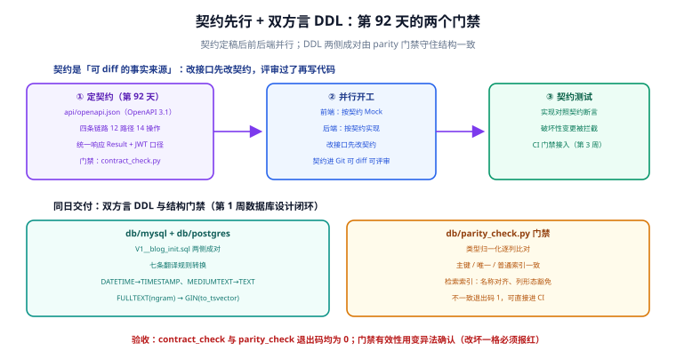

# 接口契约

第 92 天（第 1 周收尾）的产出：**契约先行**——四条链路的 OpenAPI 3.1 契约定稿入库，加上双方言 DDL 与工程骨架的 db 层切片。方法论出自 [完整项目交付 · 接口契约](../../../../docs/Others/ProjectDelivery/Contract/index.md)：接口写代码之前先定契约，前后端并行才有共同的事实来源。



## 当日做了什么

1. **OpenAPI 3.1 契约定稿**（`api/openapi.json`）：覆盖四条链路 12 条路径 / 14 个操作——
   | 链路 | 路径 | 说明 |
   | --- | --- | --- |
   | 文章 | `/api/v1/posts`、`/api/v1/posts/{slug}`、`/api/v1/admin/posts*` | 读者端只暴露 slug；未发布文章按 404（US-02）；发布接口承载渲染管线入口 |
   | 分类标签 | `/api/v1/categories`、`/api/v1/tags` + admin 创建 | name/slug 双唯一，冲突返回 409 |
   | 评论 | `/api/v1/posts/{slug}/comments`、`/api/v1/comments/{id}` | 楼层 + 楼内回复两级；删除为软删除 |
   | 搜索 | `/api/v1/search` | **SearchService 单接口**（架构页硬约定 1），升级 ES 不改契约 |
2. **统一响应与鉴权口径**：所有响应包 `Result<T>={code,message,data}`；写操作走 `Bearer JWT`，401/403/409 显式声明；
3. **双方言 DDL 入库**：`db/mysql/V1__blog_init.sql`（第 91 天设计定稿）+ `db/postgres/V1__blog_init.sql`（按基座模板七条翻译规则转换：DATETIME→TIMESTAMP、MEDIUMTEXT→TEXT、行内 COMMENT→COMMENT ON、内联索引→CREATE INDEX、FULLTEXT(ngram)→GIN(to_tsvector)、`ON UPDATE CURRENT_TIMESTAMP` 移交应用层）；
4. **两个本地门禁**（复用 [后端通用模板 · 主库可插拔](../../../Base/BackendTemplate/Database/index.md) 的机制）：
   - `db/parity_check.py`：双方言结构一致性（类型归一化 + 主键/唯一/普通索引逐列比对，全文检索索引按「名称对齐、列形态豁免」处理）；
   - `api/contract_check.py`：契约自检（版本、$ref 可解析、每个操作有响应结构、四条链路齐全、Result 注册）。

::: info 第 109 天增量：第五条链路「读者账号」
读者账号模块在契约里新增一组 `读者账号` 链路（与已有的文章 / 分类标签 / 评论 / 搜索并列），共 **11 条路径 / 12 个操作**：`/api/v1/auth/{register,verify-email,resend-verification,login,refresh,logout,logout-all}`、`/api/v1/me`（`GET` + `PUT`）、`/api/v1/me/password`、`/api/v1/me/comments`、`DELETE /api/v1/comments/{id}`。

同时新增**错误码段 `3xxx`**（`3001`~`3009`）与两个 schema（`RegisterRequest`、`TokenPairView`），并给已存在的评论删除路径补上 `403 归属不足` 分支。

契约总量随之变为 **五条链路 23 条路径 / 26 个操作**；`contract_check.py` 的链路前缀集合同步增加一组，缺路径即报红。设计与取舍见[读者账号 · 接口设计](../ReaderAccount/API/index.md)。
:::

## 如何验证

```shell
cd project/Complete/BlogPlatform

# ① 双方言结构一致性（退出码 0，可直接进 CI）
python db/parity_check.py
# 期望：OK: 8 张表 / 双方言结构一致（第 109 天 V2 新增 user_tokens 后由 7 张变 8 张）

# ② 契约自检
python api/contract_check.py
# 期望：OK: 23 条路径 / 26 个操作，$ref 全部可解析，五条链路齐全
#      （第 109 天新增「读者账号」链路 11 路径，此前为四条链路 12 路径）

# ③ Docker 验证 DDL（本机暂无 Docker，标注待验证；验证命令与第 91 天一致）
docker run --rm -i mysql:8.4 mysql -uroot -proot -e "
  CREATE DATABASE IF NOT EXISTS blog DEFAULT CHARSET utf8mb4;
  USE blog; SOURCE /dev/stdin;" < db/mysql/V1__blog_init.sql
# 期望：无报错；SHOW TABLES 列出 7 张表
docker run --rm -i mysql:8.4 mysql -uroot -proot blog -e "SOURCE /dev/stdin" \
  < db/mysql/V2__reader_account.sql
# 期望：无报错；此时 SHOW TABLES 列出 8 张表（增量与判据见第 109 天验收页）
```

门禁有效性已用**变异法**确认：把 PG 版一列类型改为 `INTEGER` 后 parity 退出码变 1 并报「类型不一致」；删掉一个响应的 content 后 contract_check 退出码变 1——门禁不是摆设。

## 问题与决策

| 问题 | 决策 |
| --- | --- |
| 全文检索索引两侧列形态不同，parity 怎么办？ | 建立「检索索引」注册表：名称两侧对齐，列形态豁免（FULLTEXT ngram 与 GIN to_tsvector 本就是方言特性，强行对齐列没有意义） |
| `ON UPDATE CURRENT_TIMESTAMP` PG 没有 | 移交应用层：更新时显式写 `updated_at`（Flyway 迁移不加触发器，保持两侧 DDL 可逐列对照） |
| 契约里 `contentMd` 会不会出读者端？ | 不会：`PostDetail` 只有 `contentHtml`；`contentMd` 只出现在 admin 写接口的请求体里 |
| 契约文件用 YAML 还是 JSON？ | JSON。零依赖可校验（`json` 标准库），不需要给 CI 加 YAML 解析依赖；需要 YAML 时 `yq` 一键互转 |

## 下一步（第 93 天）

工程骨架的 Maven 多模块初始化（以 BackendTemplate 为基座裁剪：common/web/data 三模块起步 + Flyway 装载 `db/mysql/V1__blog_init.sql`），第 2 周核心编码的第一个服务 `PostService` 按本契约实现——**先让 `GET /api/v1/posts` 返回真实数据**，跑通「契约 → 实现 → 契约测试」的最小闭环。
