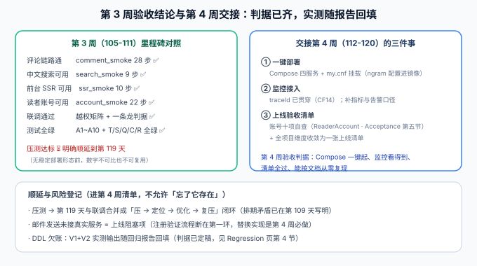

# 第 3 周验收结论与顺延项登记

本页是[核心业务流收口](../index.md)的最后一页，同时是周期 4 第 3 周（第 105~111 天 · 联调 + 测试）的**验收结论页**。第 109 天验收页给出了账号维度的结论，本页把它升到**全项目维度**：里程碑对照、顺延与风险登记、第 4 周交接清单。



::: warning 结论的口径
本页的 ✅ 指**判据已定稿且对应门禁/清单可执行**；「实测输出回填」是回归报告的职责（[Regression 页](./Regression/index.md)），两者不混。压测的 ⏳ 是**明确顺延**，不是遗漏。
:::

## 一句话定位

第 3 周的实际收口是两条——**联调通过**（十一道门禁 + 越权矩阵 + 一条龙 CF1~CF14）与**自动化测试全绿**（`mvn test` + 各 smoke）；「压测达标」因依赖第 4 周的稳定部署形态，明确顺延到第 119 天与联调合并成闭环。

## 一、第 3 周里程碑对照（全项目维度）

| 周里程碑判据 | 状态 | 依据 |
| --- | --- | --- |
| 评论链路通 | ✅ 第 105~106 天 | `comment_smoke` 28 步（写入三约束 + keyset 分页 + 占位保留） |
| 中文搜索可用 | ✅ 第 107 天 | `search_smoke` 9 步（Q7 走索引断言 + Q9 停用词回归） |
| 前台 SSR 可用 | ✅ 第 108 天 | `ssr_smoke` 10 步（hydration 三红线 + 软 404 透传） |
| 读者账号可用 | ✅ 第 109 天 | `account_smoke` 22 步 + 越权矩阵 18 格 |
| 联调通过 | ✅ 第 110 天 | 字段依赖清单 D1~D10 + 一条龙 CF1~CF14（本章落档） |
| 自动化测试全绿 | ✅ 第 110 天 | `mvn test`（A/T/S 全集）+ 十一道门禁，`assertion_audit` PASS |
| **压测达标** | ⏳ **顺延第 119 天** | 见下节 |

## 二、压测为什么顺延：把理由钉死

第 3 周里程碑原文含「压测达标」，轮换表第 119 行是「当月项目：联调与压测」——两处排期不一致，处理方式是**书面顺延**而不是含糊带过：

| 论点 | 内容 |
| --- | --- |
| 不可比 | 没有稳定部署形态（Compose 未定稿、连接池未按生产配置）时压出的数字，换环境即作废 |
| 不可复用 | 现在压出的瓶颈清单，到第 119 天要重新压一遍才能确认修复——一次都没省 |
| 正确的闭环 | 第 119 天做「压 → 定位瓶颈 → 优化 → 复压」，四个动作同日同环境，闭环成立 |
| 已登记 | 本页 + [第 109 天验收页](../../ReaderAccount/Acceptance/index.md) + [Progress](../../Progress/index.md) 三处一致 |

:::danger 顺延必须三处一致
「顺延」最危险的去向是**只在讨论里发生过**。它必须同时出现在：结论页（本页）、产生顺延决定的页面（第 109 天验收页）、进展记录（Progress）。三处任何一处缺失，第 119 天就会有人把它当漏项重新争论一遍。
:::

## 三、全项目风险与顺延登记表

汇总此前各章登记的「已知未做」，第 4 周逐项处置：

| # | 项 | 影响 | 处置与去向 |
| --- | --- | --- | --- |
| 1 | 压测未做 | 并发容量未知 | 第 119 天闭环（第二节） |
| 2 | 邮件发送未接真实服务 | 生产注册流程断在第一环 | **上线阻塞项**，第 4 周替换发送实现 |
| 3 | Docker DDL 欠账 | 双方言结构未经真实容器验证 | 判据已定稿，实测输出随回归报告回填（Regression 第 2 节） |
| 4 | ES 升级路径未实施 | 中文搜索深度受限于 ngram | 刻意不做（第 107 天取舍）；升级时按[状态机矩阵](./StateMachine/index.md)补索引同步格 |
| 5 | 无 MFA / 无第三方登录 | 口令泄漏即账号失守；注册转化受限 | 明确不做（需求页范围裁剪），协议知识见 Auth 专题 |
| 6 | 邮箱枚举（注册仅用户名 `409`） | 攻击者可判定邮箱是否注册 | 频控 + 审计缓解；接 SMTP 后补提示邮件 |
| 7 | `traceId` 贯穿只到日志层 | 无指标与告警口径 | 第 4 周监控接入的起点（CF14 已断言可串链） |

## 四、第 4 周交接清单（112~120 天）

第 4 周里程碑：**部署 + 文档沉淀**。从本章视角交接三件事与各自的判据入口：

1. **一键部署**：Compose 四服务（app / mysql / redis / 前台）+ `my.cnf` 挂载——**第 107 天的 ngram 两项配置必须进镜像**，否则新环境搜索静默失效（`search_smoke` Q9 是部署后的第一道验证）。
2. **监控接入**：CF14 已断言日志可按 traceId 串链；第 4 周在其上补指标（QPS / P95 / 缓存命中率）与告警口径。
3. **上线验收清单**：账号维度十项自查（[ReaderAccount · Acceptance 第五节](../../ReaderAccount/Acceptance/index.md)）与全项目风险表（本页第三节）**合并收敛为一张上线清单**，逐项可执行。

验收判据（第 4 周出口）：Compose 一键起、监控看得到、上线清单全过、**能按文档从零复现**。

## 五、验证方式

```shell
cd your-project/service

# 本页结论的可执行部分：门禁矩阵 + 一条龙 + 判据唯一性
mvn test                                   # 期望全绿
python assertion_audit.py                  # 期望 PASS
python coreflow_smoke.py --base http://127.0.0.1:18080   # 期望 14/14（服务已起）

# 十一道门禁完整命令见项目总览「在你自己的工程里跑起来」一节
```

| 判据 | 期望 |
| --- | --- |
| 第三节风险表 7 项 | 每项有明确去向（日期或「明确不做」），无「以后再说」 |
| 顺延三处一致 | 本页 / 第 109 天验收页 / Progress 三处口径相同 |
| 第 4 周交接 3 件事 | 每件指到具体判据入口，不悬空 |

## 六、相关页面

- 章节入口：[核心业务流收口](../index.md) ｜ 上一页：[一条龙回归](./Regression/index.md)
- 前序结论：[读者账号 · 验收与第 3 周收尾](../../ReaderAccount/Acceptance/index.md)（账号维度）
- 方法论：[完整项目交付 · 验收与上线](../../../../../docs/Others/ProjectDelivery/Delivery/index.md)
- 进展记录：[Progress](../../Progress/index.md)
