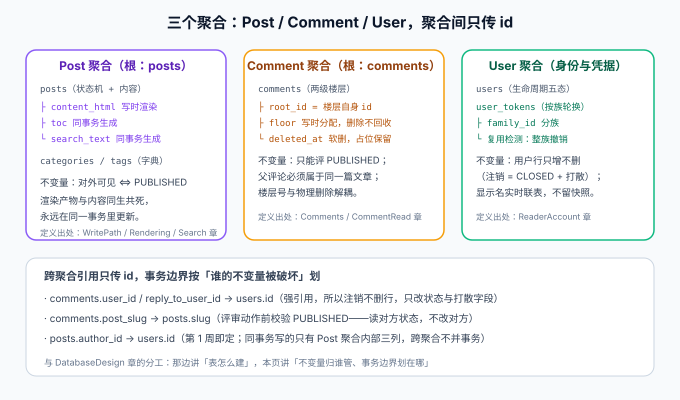

# 领域建模：三个聚合与一条身份主语

本页是[核心业务流收口](../index.md)的第一页。第 1 周的[数据库设计](../../DatabaseDesign/index.md)已经把 8 张表画进了 ER 图，但「表」是**存储视角**——它回答「数据长什么样」，不回答「不变量归谁管、事务边界划在哪」。本页把同一份数据重读一遍：**领域视角**。



::: warning 本页是建模决策的收口，不是新设计
三个聚合的边界在前 109 天的章节里**事实上已经形成**，本页只是把它们显式写下来。显式化的价值：下一个改代码的人不用从十二个章节里反推「这个校验为什么在这里」。
:::

## 一句话定位

博客平台的核心领域只有三个聚合：**Post**（内容与状态）、**Comment**（讨论与楼层）、**User**（身份与凭据）。聚合内强一致（同一事务），聚合间只传 id（跨聚合不并事务）。链路上的每一条业务规则，都能落到这三个聚合的某一条不变量上。

## 一、通用语言：每个术语只有一个出处

领域建模的第一步是让「通用语言」收敛——同一个词在两章里含义不同，是判据漂移的根源。本项目的关键术语与唯一定义出处：

| 术语 | 唯一定义 | 出处 |
| --- | --- | --- |
| `PUBLISHED` | 对读者可见的充要条件；列表/详情/搜索/评论四处的 `WHERE` 口径 | [可见性收敛](../../Visibility/index.md) |
| 楼层（floor） | 写时分配、唯一索引、删除不回收；游标分页的键 | [评论链路](../../Comments/index.md) |
| 占位保留 | 已删楼层在楼内留占位、回复不消失 | [评论读侧](../../CommentRead/index.md) |
| 写时渲染 | `content_html` / `toc` / `search_text` 与发布同事务生成 | [Markdown 渲染](../../Rendering/index.md) |
| 存在性不泄漏 | 四来源 404 逐字节一致；错误码统一 `ARTICLE_NOT_FOUND` | [可见性收敛](../../Visibility/index.md) |
| 登录族（family） | 一次登录签发的令牌集合；复用检测整族撤销的单位 | [读者账号 · 表设计](../../ReaderAccount/DataModel/index.md) |
| 打散 | 注销时用户名/邮箱改写为不可登录、不可复用的形式 | [读者账号 · 验收](../../ReaderAccount/Acceptance/index.md) |
| 数据归属 | 「我的 X」是过滤不是权限；读看内容、写看状态码 | [读者账号 · 验收](../../ReaderAccount/Acceptance/index.md) |

:::tip `assertion_audit.py` 的扩展口径与此一致
判据唯一性核查（第 104 天起）保证**断言**不重复登记；本表保证**术语**不重复定义。两件事是同一条原则在两个层面上的应用。
:::

## 二、三个聚合与各自的不变量

### 2.1 Post 聚合（根：posts）

**成员**：`posts` 本体 + 三个渲染产物列（`content_html`、`toc`、`search_text`）+ 分类标签的引用。

| 不变量 | 内容 | 违反后果 |
| --- | --- | --- |
| 可见性不变量 | 对外可见 ⇔ `status = PUBLISHED` | 泄漏草稿，或读者看到已下线内容 |
| 渲染同生共死 | 内容列与三个产物列**永远同一事务**更新 | 页面有内容但搜不到（或反之）的半边窗口 |
| 时间戳语义 | `publish` 刷新 `publishedAt` 并清空 `offlineAt` | 后台排序悄悄出错，接口全 200（lifecycle 第 ⑮ 步的教训） |

### 2.2 Comment 聚合（根：comments）

**成员**：`comments` 两级楼层（楼层根 `root_id = 自身 id`，楼内回复挂 `root_id`）。

| 不变量 | 内容 | 违反后果 |
| --- | --- | --- |
| 只评已发布 | 目标文章必须 `PUBLISHED`，否则 `404`（存在性不泄漏） | 草稿标题经评论接口泄漏 |
| 同文章约束 | 父评论与回复必须属于同一篇文章，否则 `409 2003` | 楼层树跨文章断裂 |
| 楼层不可回收 | `floor` 写时分配 + 唯一索引，删除只软删 | keyset 游标漂移，翻页重复/漏读 |

### 2.3 User 聚合（身份与凭据）

**成员**：`users`（生命周期五态）+ `user_tokens`（按族轮换）。

| 不变量 | 内容 | 违反后果 |
| --- | --- | --- |
| 行只增不删 | 注销 = `CLOSED` + 字段打散；历史评论保留 | 强引用悬空；用户的话被平台抹掉 |
| 族内单活跃 | 复用检测触发**整族**撤销 | 新旧令牌同时可用，谁也没发现 |
| 归属边界 | `sub` 即数据边界；改密当前族保留、其他族失效 | 越权读他人数据，或误踢当前设备 |

## 三、事务边界：按「谁的不变量被破坏」划

跨聚合不并事务不是教条，判据是：**一个事务里如果混进了两个聚合的写，任何一方的失败都会把另一方拖进未定义状态**。本项目的划分：

| 写操作 | 事务范围 | 为什么 |
| --- | --- | --- |
| 发布（首次与重新发布） | Post 聚合内：状态 + 三渲染产物列 + 时间戳 | 渲染同生共死是 Post 自己的不变量 |
| 发评论 | Comment 聚合内：楼层行 + `floor` 分配 | 读 Post 状态做校验（只读），不给 Post 写任何东西 |
| 刷新令牌 | User 聚合内：旧票撤销 + 新票插入（同事务） | 「轮换」的原子性是 User 自己的不变量 |
| 注销 | User 聚合内：状态 + 打散 + 整族撤销 | 评论、文章**不碰**——占位保留口径靠「不写」实现 |

:::danger 反面教材：把「注销」做成跨聚合大事务
如果注销时顺手「级联处理」文章与评论（改作者名快照、删评论、清缓存），会出现三个问题：事务巨大且持锁时间长；评论的「占位保留」口径被破坏（那是给读者看的承诺）；文章聚合被迫理解「注销」是什么。正确做法是**什么都不做**——显示名实时联表，`CLOSED` 用户自然显示为「已注销用户」，零代码跨聚合。这是第 109 天「不做昵称快照」决策在领域层的回响。
:::

## 四、跨聚合引用：只传 id，读侧负责解析

三个聚合之间的引用全部是 id（或 slug），且**引用方不持有被引用方的业务字段副本**：

| 引用 | 类型 | 解析方式 |
| --- | --- | --- |
| `comments.post_slug → posts.slug` | 强引用（NOT NULL） | 评论查询按 slug 联表 / 服务层校验状态 |
| `comments.user_id → users.id` | 强引用 | 显示名**实时联表**，注销后自然落到「已注销用户」 |
| `posts.author_id → users.id` | 强引用 | 同上 |

「不做昵称快照」意味着 User 聚合的展示字段**随时可改**（改昵称即时生效、注销即时生效），代价是每次联表——对博客的评论量级，这是正确的取舍；如果将来做「热评文章」，热点楼层可加短 TTL 缓存，但**缓存的是联表结果，不是快照列**。

## 五、问题与决策

| 问题 | 决策 | 理由 |
| --- | --- | --- |
| 渲染产物算不算独立读模型？ | 不算，归入 Post 聚合 | 它们与内容同生共死，拆出去必然出现半边更新 |
| `search_text` 为什么不是搜索聚合？ | 它是 Post 的冗余列，不是索引系统的镜像 | ngram FULLTEXT 就建在这张表上，没有第二个事实来源 |
| 注销为什么不级联评论？ | 占位保留是读者侧承诺 | 评论是文章上下文的一部分（第 109 天连带决定表） |
| 聚合间要不要领域事件？ | 单体阶段不要，直调 + 提交后钩子 | 事件总线引入的最终一致，比它解决的问题先到（见[状态机驱动](../StateMachine/index.md)） |
| 为什么不建 `BlogContext` 之类的大聚合？ | 三个聚合各有独立生命周期与不变量 | 大聚合 = 大锁 = 大事务；领域建模的第一课就是切边界 |

## 六、验证方式

建模正确性没法用单元测试直接断言，但**不变量都有归属的门禁**：

```shell
cd your-project/service
mvn test                    # 期望全绿：Post 不变量在 PostStatusTest/MarkdownRendererTest，
                            #        Comment 不变量在 CommentsTest，User 不变量在 A1~A10
mvn spring-boot:run         # 另开终端
python comment_smoke.py    --base http://127.0.0.1:18080   # 期望 28/28（只评已发布、同文章、楼层不回收）
python account_smoke.py    --base http://127.0.0.1:18080   # 期望 22/22（族轮换、整族撤销、归属）
python visibility_smoke.py --base http://127.0.0.1:18080   # 期望 22/22（可见性不变量）
```

| 判据 | 期望 |
| --- | --- |
| 每条不变量在门禁矩阵里能找到归属断言 | `assertion_audit.py` PASS |
| 跨聚合写操作清单 | 每一格都能回答「为什么不并事务」 |
| 通用语言表 | 每个术语在库内只有一个定义出处 |

## 七、相关页面

- 章节入口：[核心业务流收口](../index.md) ｜ 下一页：[状态机驱动的业务流](../StateMachine/index.md)
- 存储视角：[数据库设计](../../DatabaseDesign/index.md)（本页的镜像视角：表怎么建）
- 领域建模方法论：`docs/Backend/Ecommerce`（第 80 天，电商领域的同套方法）
- 进展记录：[Progress](../../Progress/index.md)
