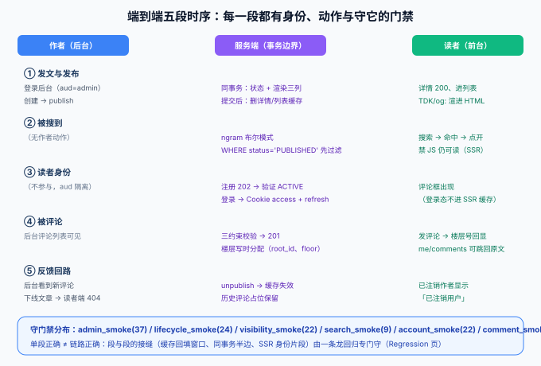

# 端到端走查：从发文到被评论的五段时序

本页是[核心业务流收口](../index.md)的第四页。前面三页把**概念**（聚合）、**规则**（状态机副作用）、**对话**（字段依赖）收了口，本页把它们放回**时间轴**上：一个真实的使用过程里，链路上依次发生什么、每一段的入口与出口是什么、哪条断言守着它。



::: warning 走查的口径
「走查」指**逐段人工核对一遍**：按本页表格，每一段用对应的身份与命令打一遍，确认出口符合预期。它是一条龙回归（[Regression 页](../Regression/index.md)）的**预演**——走查发现的问题在回归里固化成断言。
:::

## 一句话定位

核心业务流 = 五段时序：**作者发文 → 可见与可搜 → 读者身份 → 被评论 → 反馈回路**。每一段有明确的入口（上游给了什么）、动作（发生什么）、出口（下游拿到什么）；段与段的接缝处藏着单段验收看不到的错误。

## 一、五段时序逐段走查

### 第 ① 段：作者发文与发布

| 项 | 内容 |
| --- | --- |
| 身份 | 作者（管理端 Bearer，`aud = admin`） |
| 入口 | 后台编辑器提交，`POST /api/v1/admin/posts` 返回 `slug` |
| 动作 | `publish` 触发转移：同事务写状态 + 渲染三列 + 时间戳；提交后删缓存 |
| 出口 | 一条对读者可见、对搜索可命中的记录；`slug` 交给前台 URL |
| 门禁 | `admin_smoke`（37 步）、`lifecycle_smoke`（24 步） |

### 第 ② 段：可见与可搜

| 项 | 内容 |
| --- | --- |
| 身份 | 游客即可 |
| 入口 | 读者打开站点或输入搜索词 |
| 动作 | 列表/详情按 `status = PUBLISHED` 派生；搜索走 ngram 布尔模式，`WHERE` 先过滤 |
| 出口 | 读者看到正文（`contentHtml`、TDK 渲进 SSR HTML）、命中项可跳转 |
| 门禁 | `visibility_smoke`（22 步）、`search_smoke`（9 步）、`ssr_smoke`（10 步） |

### 第 ③ 段：读者身份

| 项 | 内容 |
| --- | --- |
| 身份 | 游客 → 读者 |
| 入口 | 注册（返回 `202`，不区分邮箱是否已注册）→ 邮件验证 → 登录 |
| 动作 | `PENDING` 升 `ACTIVE`；签发 access（Cookie）+ refresh（族内轮换） |
| 出口 | 浏览器持有可用会话；评论区解锁 |
| 门禁 | `account_smoke`（22 步） |

### 第 ④ 段：被评论

| 项 | 内容 |
| --- | --- |
| 身份 | 读者（`aud = reader`） |
| 入口 | 详情页评论框，`POST /api/v1/posts/{slug}/comments` |
| 动作 | 三约束校验（PUBLISHED 才可评 / 父评论同文章 / 已删不可回）→ 楼层写时分配 |
| 出口 | `201` + 楼层号回显；`me/comments` 可见且可跳回原文 |
| 门禁 | `comment_smoke`（28 步） |

### 第 ⑤ 段：反馈回路

| 项 | 内容 |
| --- | --- |
| 身份 | 作者（管理端）+ 读者（双向） |
| 入口 | 后台评论列表 / `GET /api/v1/me/comments` |
| 动作 | 作者看到新评论并处置；必要时 `unpublish` 下线 → 读者端 404 → 历史评论占位保留 |
| 出口 | 链路闭合：写侧发生的事，读侧在一致的时间内可见 |
| 门禁 | CF10（反馈可见）、CF11（下线收敛）、CF13（注销显示）——见[一条龙回归](../Regression/index.md) |

## 二、走查中重点盯的三个接缝

走查不是重跑门禁，是**盯接缝**。以下三处是全链路最容易「每段都对、连起来错」的地方：

1. **缓存回填窗口（①→② 接缝）**：`unpublish` 后**立刻**连续两次 GET 详情，两次都必须 404。第一次 200 第二次 404 = 先删缓存后提交事务的典型残留（`visibility_smoke` 第 ⑤ 步的走查复现）。
2. **同事务半边（①→② 接缝的另一面）**：发布后立即搜索，必须命中且详情正文完整。「有内容搜不到」与「搜得到没内容」各对应渲染与 `search_text` 的一半（CF3/CF4 固化）。
3. **SSR 缓存与身份片段（③ 接缝）**：未登录态抓文章页 HTML，搜不到「我的评论」等任何身份片段——登录态一旦混进 SSR 输出，A 的会话会被缓存给 B（`ssr_smoke` R 断言的走查复现）。

:::danger 走查最容易犯的错误：用作者身份验读者端
作者的后台永远能看到全部文章（管理读不走读者缓存）。如果你在**同一个浏览器**里既登着后台又开着前台，看到「正常」不等于读者正常——Cookie 同源共享，你根本没在测游客视角。走查纪律：**读者段全部用无痕窗口或独立 profile，或者直接 curl（不带任何管理端 Cookie）**。
:::

## 三、走查与门禁的对应关系

| 走查段 | 已有门禁覆盖 | 只能走查/一条龙覆盖 |
| --- | --- | --- |
| ① 发文 | admin 37 步 + lifecycle 24 步 | — |
| ② 可见可搜 | visibility 22 + search 9 + ssr 10 | 「发布后立即搜索命中」的即时性 |
| ③ 读者身份 | account 22 步 | 注册到评论的无缝衔接（邮件验证后的跳转体验） |
| ④ 被评论 | comment 28 步 | — |
| ⑤ 反馈 | — | **CF10/CF11/CF13 全部**（跨端可见性） |

这张表的读法：已有门禁覆盖「段内」，一条龙覆盖「接缝」。如果一个新需求改了某个段内行为，先跑对应门禁；改了任何**跨段**的东西（缓存、时序、身份、显示口径），直接跑一条龙。

## 四、验证方式

```shell
# 段内门禁快速回归（判据见项目总览的十一道门禁命令块）
python visibility_smoke.py --base http://127.0.0.1:18080   # 期望 22/22
python search_smoke.py     --base http://127.0.0.1:18080   # 期望 9/9
python account_smoke.py    --base http://127.0.0.1:18080   # 期望 22/22
python comment_smoke.py    --base http://127.0.0.1:18080   # 期望 28/28

# 接缝验证（一条龙，本页第二节的三个接缝对应 CF3/CF4/CF11/CF13）
python coreflow_smoke.py   --base http://127.0.0.1:18080   # 期望 14/14
```

## 五、相关页面

- 章节入口：[核心业务流收口](../index.md) ｜ 上一页：[接口联调](../Integration/index.md) ｜ 下一页：[一条龙回归](../Regression/index.md)
- 各段详设：[WritePath](../../WritePath/index.md) ｜ [Visibility](../../Visibility/index.md) ｜ [Search](../../Search/index.md) ｜ [ReaderAccount](../../ReaderAccount/index.md) ｜ [Comments](../../Comments/index.md)
- 进展记录：[Progress](../../Progress/index.md)
