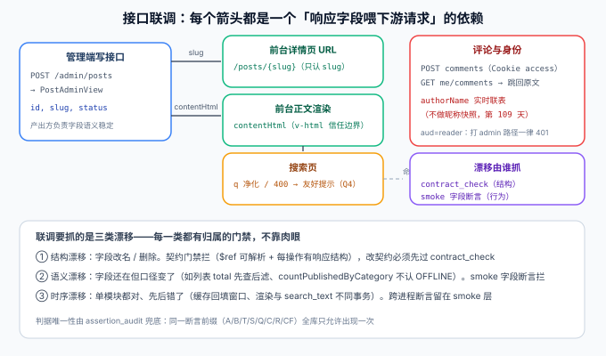

# 接口联调：谁依赖谁的哪个字段

本页是[核心业务流收口](../index.md)的第三页。第 92 天的[接口契约](../../Contract/index.md)管住了**结构**（路径、schema、$ref 可解析），第 104 天的[判据收口](../../Consolidation/index.md)管住了**口径**（服务端单一事实）。本页收口联调的第三个维度：**跨模块的字段级依赖**——A 接口响应里的哪个字段，喂给了 B 模块的哪个请求，漂移了由谁抓。



::: warning 本页的依赖清单是「联调地图」，不是新契约
所有字段在契约里都已声明。本页把它们之间的**消费关系**显式化：改契约的人能看到「动这个字段会波及哪里」。
:::

## 一句话定位

单模块验收全绿推不出链路可用，因为**模块之间靠字段对话**：`slug` 喂给前台 URL，`contentHtml` 喂给正文渲染，Cookie 里的 access 喂给评论接口，`authorName` 由实时联表解析。联调的本质是把这组「谁依赖谁」从口头约定变成可检查的清单。

## 一、核心链路的字段依赖清单

按[端到端五段时序](../EndToEnd/index.md)排列，每条依赖都标注「生产方 → 消费方」与守它的门禁：

| # | 生产方（响应字段） | 消费方（用途） | 断联时的症状 | 守门禁 |
| --- | --- | --- | --- | --- |
| D1 | `POST /admin/posts` → `slug` | 前台详情 URL `/posts/{slug}`；后台「查看」按钮 | 发布了但打不开；URL 与接口脱节 | admin_smoke + CF3 |
| D2 | `GET /posts/{slug}` → `contentHtml` | 前台 `v-html`（服务端消毒后的信任边界） | 页面空白或双份渲染 | ssr_smoke + CF3 |
| D3 | 发布事务 → `toc` | 详情页目录锚点（中文 slug 规则） | 目录点不动 | Rendering T 用例 |
| D4 | `GET /search?q=` → 命中项 + `<mark>` 摘要 | 搜索结果页；命中项跳 D1 的 URL | 搜到但跳错/跳不动 | search_smoke Q1~Q3 |
| D5 | `POST /search` 对 `q` 的 400 判据（Q4） | 搜索页把 400 转「至少输入 2 个字」提示 | 单字查询显示「无结果」误导读者 | ssr_smoke + 前台分支 |
| D6 | `POST /auth/login` → httpOnly Cookie `access` | 评论接口的隐式凭据（`aud=reader`） | 已登录却 401（Cookie 作用域错） | account_smoke B2/B6 |
| D7 | `POST /auth/refresh` → 新令牌族 | access 过期后无感续期 | 读者正评论时被登出 | account A7/A8 |
| D8 | `GET /posts/{slug}/comments` → `authorName` | 楼层作者显示（**实时联表**，无快照） | 注销用户显示旧昵称 | comment_smoke + CF13 |
| D9 | `GET /me/comments` → 列表含 `postSlug` | 「我的评论」跳回原文定位 | 能看到评论但回不去 | account_smoke + CF9 |
| D10 | 管理端评论列表（后台） | 作者可见反馈回路 | 读者发了评论作者看不到 | CF10（此前无门禁） |

:::tip D8 是全清单里最特殊的一条
其他依赖都是「字段值传递」，D8 是「字段值**不**传递」——`authorName` 故意不做快照，每次联表实时解析。把它写进清单的原因：将来任何人想「优化」成快照列，必须先过这道决策（快照会让注销显示、改昵称即时性全部失效），而不是顺手一改。
:::

## 二、三类漂移与各自的抓手

字段依赖会以三种方式坏掉，症状与抓手完全不同：

| 漂移类型 | 例子 | 症状 | 抓手 |
| --- | --- | --- | --- |
| **结构漂移** | 字段改名 / 删除 / 类型变化 | 消费方直接取不到值，前端报 undefined | `contract_check.py`（$ref 可解析）+ 契约评审 |
| **语义漂移** | 字段在但口径变了：`total` 先查后滤、计数认了 OFFLINE | 接口 200，数字错——最隐蔽 | 各 smoke 的字段断言（如 Q6、visibility ⑧） |
| **时序漂移** | 单模块都对、先后错了：缓存先删后提交、渲染与 `search_text` 不同事务 | 单测全绿、链路上偶发错误 | 跨进程断言留在 smoke 层（第 103 天分流原则） |

:::danger 语义漂移是三者中唯一「没有编译器帮忙」的
结构漂移在联调当天就炸，时序漂移有专门的 smoke 步守，唯独语义漂移——字段还在、类型还对、值悄悄不对——**只能靠行为断言**。这就是为什么每条 smoke 步骤都要求「断言到字段值」而不是「断言 200」：`assert total == baseline + delta` 拦得住先查后滤，`assert status == 200` 什么都拦不住。
:::

## 三、联调的执行顺序：先字段后链路

第 104 天的 L1~L6 已经给出「两端联调动作」的范式（同一口径两端各验一次）。本页把它推广成整条链的顺序：

1. **对清单**：按第一节表格逐条确认两端实现都在（这一步只读代码，不起服务）；
2. **对结构**：`contract_check.py` PASS，五条链路 23 条路径齐全；
3. **对口径**：`assertion_audit.py` PASS，确认没有同一判据两处登记；
4. **对行为**：十一道门禁全绿（各段）；
5. **对链路**：一条龙回归 CF1~CF14（[Regression 页](../Regression/index.md)）——接缝类问题（D6 的 Cookie 作用域、D10 的反馈回路）只有这一步能暴露。

:::warning 为什么 D10 直到第 110 天才有门禁
「读者发评论 → 作者看得到」横跨读者端写与管理端读，两侧各自的 smoke 都不覆盖对方的断言。它也不适合拆进 `comment_smoke`（那会让评论门禁依赖管理端登录态，破坏「一段一门禁」的分工）。一条龙回归是它唯一合理的归属——这正是「接缝问题要有接缝验收」的实例。
:::

## 四、验证方式

```shell
cd your-project/service

# ②③ 步：结构与口径（不起服务）
python api/contract_check.py               # 期望 OK: 23 条路径 / 26 个操作，五条链路齐全
python assertion_audit.py                  # 期望 PASS

# ④ 步：行为（起服务后，全部门禁，命令见项目总览）
python comment_smoke.py    --base http://127.0.0.1:18080   # 期望 28/28（D8、D9 的段内部分）
python account_smoke.py    --base http://127.0.0.1:18080   # 期望 22/22（D6、D7）

# ⑤ 步：链路（一条龙）
python coreflow_smoke.py   --base http://127.0.0.1:18080   # 期望 14/14（D1~D10 的接缝部分）
```

| 判据 | 期望 |
| --- | --- |
| D1~D10 每条都有归属门禁 | 对照第一节「守门禁」列，无悬空 |
| 语义漂移抽检 | 修改 `total` 口径为内存过滤后，visibility ⑧ / search Q6 必须报红 |
| Cookie 作用域 | `refresh_token` 的 `Path` 收窄后，非指定路径收不到该 Cookie（B2 相关断言绿） |

## 五、相关页面

- 章节入口：[核心业务流收口](../index.md) ｜ 上一页：[状态机驱动](../StateMachine/index.md) ｜ 下一页：[端到端走查](../EndToEnd/index.md)
- 契约本体：[接口契约](../../Contract/index.md) ｜ 联调范式：[判据收口与分类标签联调](../../Consolidation/index.md)
- 进展记录：[Progress](../../Progress/index.md)
