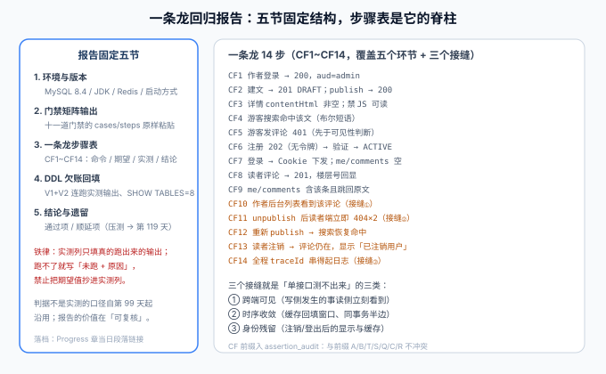

# 一条龙回归：报告结构与 CF1~CF14

本页是[核心业务流收口](../index.md)的第五页，也是第 3 周收尾三件事里「**一条龙回归报告落档**」的执行页。第 109 天验收页已经给出了「一个读者从注册到注销」的 9 步轨迹骨架，本页把它扩展成覆盖五个环节 + 三个接缝的 **14 步回归**，并定义回归报告的固定结构——报告不是「跑一遍贴输出」，而是一份**可复核**的记录。



::: warning 实测列的纪律：只填真跑出来的输出
本页与全库口径一致：**判据不是实测**。回归报告的价值在于「可复核」——任何人按报告的环境节重跑一遍，应当得到相同的结论。把期望值抄进实测列等于伪造记录，比不做更糟。
:::

## 一句话定位

一条龙回归 = **按真实使用顺序串起全部模块的 14 步冒烟**（`coreflow_smoke.py`，CF1~CF14），加上一份固定五节的回归报告。它不替代十一道门禁（段内正确性），专门覆盖**接缝**（跨段正确性）。

## 一、回归报告的固定五节

| 节 | 内容 | 复核方式 |
| --- | --- | --- |
| 1. 环境与版本 | MySQL 8.4（ngram 配置已重启生效）、JDK、Redis、服务启动命令、`SERVER_PORT` | 照抄环境节应能复现 |
| 2. 门禁矩阵输出 | 十一道门禁的 `cases/steps = N passed = N` 原样粘贴，不摘要 | 对照项目总览命令块 |
| 3. 一条龙步骤表 | CF1~CF14，四列：命令 / 期望 / **实测** / 结论 | 实测列与期望列同形（状态码、字段值） |
| 4. DDL 欠账回填 | V1+V2 连续执行的实测输出、`SHOW TABLES` 结果、`parity_check` PASS | 第二节的命令原样可跑 |
| 5. 结论与遗留 | 通过项、顺延项（压测 → 第 119 天）、新发现问题登记 | 与 [Acceptance 页](./Acceptance/index.md)风险表一致 |

## 二、DDL 欠账的回填口径

第 1 周遗留、第 109 天定稿判据的 Docker 验证 DDL，回填时报告第 4 节必须包含（命令与期望原样来自[第 109 天验收页](../../ReaderAccount/Acceptance/index.md)）：

```shell
# ① 基线：V1 建库建表（期望：无报错，SHOW TABLES 列出 7 张表）
# ② 增量：V2 读者账号（期望：无报错）
# ③ 结构核对（期望：tables_ = 8；users.status 存在；admin_role 可空）
# ④ 双方言一致性（期望：parity_check.py PASS）
```

回填合格的判据：四条都有**实测输出**，且 `tables_ = 8` 是查出来的数字，不是抄期望。若环境无 Docker，报告写明「未跑 + 原因」，该项保持 ⏳ 不得标 ✅。

## 三、CF1~CF14 步骤表

前缀 `CF` 已登记进 `assertion_audit.py` 的唯一性核查（与 A / B / T / S / Q / C / R 不冲突）。步骤设计沿用两条老规矩：**断言相对基线**（先抓 total）、**数据带随机位**（slug 带 RUN_TAG + uuid 片段，可重复跑）。

| # | 步骤 | 期望 | 守什么 |
| --- | --- | --- | --- |
| CF1 | 作者登录 | `200`，令牌 `aud = admin` | 身份主语就位 |
| CF2 | 创建文章 → `publish` | `201` DRAFT → `200` PUBLISHED，`publishedAt` 非空、`offlineAt` 空 | 第 ① 段主干 |
| CF3 | 游客 GET 详情 + 禁 JS 抓源码 | `200`，`contentHtml` 非空；源码含正文与 TDK | D1/D2 依赖 + SSR |
| CF4 | 游客搜索标题词 | 命中该文，布尔短语语义（不含只沾半个词的文） | D4 + 「发布后立即可搜」 |
| CF5 | 游客发评论 | `401`，且先于可见性判断（对 PUBLISHED 文章也 401） | T7 口径的链路复现 |
| CF6 | 注册 → 验证 → 查状态 | `202`（无令牌）→ `ACTIVE` | 第 ③ 段衔接 |
| CF7 | 读者登录 → `me/comments` | Cookie 下发；列表为空 | D6/D9 依赖就位 |
| CF8 | 读者发评论 | `201`，楼层号回显 | 第 ④ 段主干 |
| CF9 | `me/comments` 查询 | 含 CF8 那条，`postSlug` 可定位原文 | D9 |
| CF10 | 作者后台评论列表 | **能看到 CF8 的评论** | D10：跨端可见接缝 |
| CF11 | `unpublish` 后读者端连续两次 GET | 两次均 `404` | 缓存回填窗口接缝 |
| CF12 | 重新 `publish` 后搜索 | 恢复命中，`contentHtml` 与 CF3 一致 | 下线可逆 + 渲染产物留库口径 |
| CF13 | 读者注销后查评论列表 | 该评论仍在，作者显示「已注销用户」 | D8 + 占位保留 + 身份残留接缝 |
| CF14 | 抽取全程日志按 traceId 串链 | 五段日志可按同一 traceId 串联 | 可观测性接缝 |

:::tip 为什么 CF10 排在 CF11 之前
回归步骤的顺序即叙事顺序：先证明「读者说的话作者看到了」（正向反馈回路成立），再走「作者下线 → 读者不可见」（反向收敛）。调换顺序不影响正确性，但按使用叙事排，报告的阅读者（包括三个月后的自己）不需要在脑中重排事件。
:::

## 四、`coreflow_smoke.py` 的设计要点

与既有门禁同源（复用 [lifecycle](../../Lifecycle/index.md) / [visibility](../../Visibility/index.md) 的骨架），三个要点：

1. **有状态、可重复**：所有数据带 `RUN_TAG`，连跑两遍全绿（相对基线断言）；
2. **`--selftest` 变异测试**：14 步在空响应下各报错一次——防「永远为真」的断言（第 98 天教训）；
3. **身份隔离**：CF1 的管理端令牌与 CF6 的读者 Cookie 分开持有，CF5 用无令牌客户端——三个身份互不复用，防止「Cookie 污染」造成的假绿。

## 五、验证方式

```shell
cd your-project/service

# ① 先证断言可证伪
python coreflow_smoke.py --selftest          # 期望 selftest: 14/14

# ② 起服务（判据见项目总览），跑一条龙
python coreflow_smoke.py --base http://127.0.0.1:18080   # 期望 steps = 14  passed = 14

# ③ 连跑第二遍（不重启），仍应全绿——证明相对基线与随机位纪律生效
python coreflow_smoke.py --base http://127.0.0.1:18080   # 期望 14/14

# ④ 判据唯一性（CF 前缀加入后）
python assertion_audit.py                    # 期望 PASS

# ⑤ 报告落档：把 ①~④ 输出与 DDL 回填写入报告五节，链接挂到 Progress 当日段落
```

| 判据 | 期望 |
| --- | --- |
| 报告五节齐全 | 缺任何一节视为未落档 |
| 实测列与期望列同形 | 无「OK」「通过」这类不可比对的措辞 |
| CF1~CF14 无悬空 | 每步都能指回[依赖清单](../Integration/index.md)或接缝 |

## 六、相关页面

- 章节入口：[核心业务流收口](../index.md) ｜ 上一页：[端到端走查](../EndToEnd/index.md) ｜ 下一页：[第 3 周验收结论](./Acceptance/index.md)
- 轨迹骨架出处：[读者账号 · 验收](../../ReaderAccount/Acceptance/index.md)（第 109 天 9 步一条龙） ｜ 分层原则：[测试分层收口](../../TestLayers/index.md)
- 进展记录：[Progress](../../Progress/index.md)
