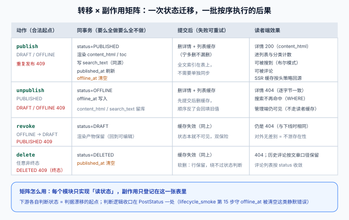

# 状态机驱动的业务流：一次转移，一批副作用

本页是[核心业务流收口](../index.md)的第二页。[文章下线动作](../../Lifecycle/index.md)定义了四态状态机**本身**（迁移矩阵、409 判据、时间戳语义），本页回答它的下游问题：**每次转移会连带动哪些后果、这些后果按什么顺序执行、放在哪一层**。整条核心业务流能不能自动对齐，取决于这张矩阵是否完整。



::: warning 本页矩阵是「收口」，不新增动作
四个动作（`publish` / `unpublish` / `revoke` / `delete`）与第 100 天完全一致。本页把它们各自牵动的副作用**从分散在五章里的描述收拢成一张表**——这张表就是「改状态机时必须同步改哪些地方」的清单。
:::

## 一句话定位

状态是链路上所有「能不能」的唯一事实来源：能不能被看到、被搜到、被评论，全部由 `status` 派生，**下游模块只读状态、不各自维护副本**。每一次状态转移则是一批按序执行的副作用：同事务的部分要么全做要么全不做，提交后的部分失败可重试。

## 一、为什么「搜索」不需要单独的索引同步

矩阵里最容易引起疑问的一格：`publish` 的副作用里**没有「写入搜索索引」**。原因在[全文搜索](../../Search/index.md)的选型——ngram FULLTEXT 索引**就建在 `posts` 表上**，`search_text` 与渲染同事务写入，发布后天然可搜：

| 对比项 | 表上索引（本项目） | 外部索引引擎（如 ES） |
| --- | --- | --- |
| 索引更新时机 | 与业务写同事务 | 事务提交后异步同步 |
| 一致性 | 强一致（同事务） | 最终一致（同步延迟窗口） |
| 下线可见性 | `WHERE status` 过滤，索引可以懒更新 | 必须删文档，否则下线内容仍可搜 |
| 链路复杂度 | 零额外组件 | 双写、对账、回放三件套 |

:::tip 这格是「升 ES」时最容易踩的坑
将来升级到 ES（预留路径见[数据库设计](../../DatabaseDesign/index.md)），这格矩阵就从「无操作」变成「事务提交后同步索引」——**同步失败重试、对账任务、下线删文档**三件事必须同时补上，否则下线内容会一直躺在 ES 里可搜。矩阵的价值就在这里：升级时按格检查，不会漏。
:::

## 二、副作用的分层：同事务 vs 提交后

矩阵把副作用分成两列，判据是**失败后的世界要不要回滚**：

| 层 | 成员 | 失败时的正确行为 |
| --- | --- | --- |
| **同事务** | 状态位、渲染三列、时间戳 | 整体回滚——「发布了但没有渲染产物」是不可接受状态 |
| **提交后** | 删详情/列表缓存、（未来）同步外部索引 | 记日志可重试——缓存 miss 会自动回源，错一时不会错一世 |

两条铁律（第 102 天已定，此处收口）：

1. **先提交事务、再删缓存**，顺序不能反。反了的窗口里并发读会 miss 回库、把旧状态回填进缓存。
2. **正确性靠失效、止损靠 TTL**。详情缓存 60 秒 TTL 不是优化，是失效逻辑有 bug 时的兜底。

:::danger 第三层不存在：「读者端主动刷新」
不要给读者端接口加「发布后主动通知前端」之类的机制——读者端的一切都从查询时的 `status` 派生，缓存失效已经覆盖。多一层「通知」就多一份要维护一致性的状态，而它解决的问题（秒级可见性）TTL + 提交后失效已经解决。
:::

## 三、下游模块怎么消费状态：只读，不判断两遍

「状态是事实来源」的完整含义：**判断逻辑收口在一处**，所有下游引用它，而不是各自写一遍 `if status == 'PUBLISHED'`：

| 消费方 | 读什么 | 判断写在哪 |
| --- | --- | --- |
| 读者端列表 / 详情 | `status` | `PostVisibility` 一处（MockMvc 上移，第 103 天） |
| 搜索查询 | `status` | 同一条 SQL 纪律：`WHERE` 里带，排序前过滤 |
| 评论写入校验 | 目标文章 `status` | `CommentsService` 调用同一判定函数 |
| 分类/标签计数 | `status` | `countPublishedByCategory` 服务端单一口径（第 104 天） |
| SSR 取数 | `status`（经 API，软 404 透传） | 前台不自己判断，后端 404 即 404 |

反面写法是每个模块各写一个 `isReadable(post)`——第 104 天的 `assertion_audit` 之所以要做判据唯一性核查，就是因为这种重复**迟早分叉**（比如有人只在搜索处记得改，列表处忘了）。

## 四、副作用放哪一层：单体阶段不引入领域事件

一个常见的问题是「要不要用领域事件（`PostPublishedEvent`）解耦副作用」。本项目的决策：**单体 + 单库阶段不引入**，理由写进决策表：

| 候选 | 取舍 | 本项目选择 |
| --- | --- | --- |
| 同事务直调 + 提交后钩子 | 副作用清单就在一个类里，`lifecycle_smoke` 逐格断言 | ✅ 采用 |
| 进程内事件总线 | 解耦了调用，但**时序变成隐式**：监听器失败是静默的，第 ⑮ 步那类「接口全绿数据悄悄错」的问题会从一处变成 N 处 | ❌ 引入事件的前提（多团队/多部署单元）不存在 |
| 消息队列异步 | 引入最终一致与幂等消费，第 3 周就要为它建对账 | ❌ 第 4 周部署形态都不该有它 |

:::tip 引入事件的时机判据
当**同一个事务边界装不下**副作用时（比如渲染要调外部服务、或索引同步要跨网络），才把那一条副作用从「同事务」挪到「事件 + 重试」。判据按条不按系统——不需要为整条链路引入事件基础设施，只为装不下的那一格。
:::

## 五、转移 × 副作用矩阵（完整收口版）

| 动作（合法起点） | 同事务 | 提交后 | 读者端效果 | 守它的断言 |
| --- | --- | --- | --- | --- |
| `publish`（DRAFT/OFFLINE） | 置 `PUBLISHED`；渲染 `content_html`/`toc`；写 `search_text`；刷新 `published_at`；**清空 `offline_at`** | 删详情 + 列表缓存 | 详情 200、进列表与计数、可搜、可评 | lifecycle ⑤⑥⑮、search Q1/Q5、visibility ⑥ |
| `unpublish`（PUBLISHED） | 置 `OFFLINE`；写 `offline_at`；渲染产物**留库** | 删详情 + 列表缓存 | 404（逐字节一致）、搜索不命中、管理端仍可见 | lifecycle ⑧⑨⑩、visibility ⑤⑦ |
| `revoke`（OFFLINE） | 置 `DRAFT` | 缓存失效（双保险） | 仍 404（对外无差别） | lifecycle ⑪⑫ |
| `delete`（任意非终态） | 置 `DELETED`；**清空 `published_at`** | 删缓存 | 404；评论按文章口径收敛 | lifecycle ⑰~㉑ |

## 六、验证方式

```shell
cd your-project/service

# 矩阵的机械验证：状态迁移门禁 + 读侧可见性门禁
python lifecycle_smoke.py  --base http://127.0.0.1:18080   # 期望 24/24（迁移与时间戳语义）
python visibility_smoke.py --base http://127.0.0.1:18080   # 期望 22/22（读者端派生行为）
python search_smoke.py     --base http://127.0.0.1:18080   # 期望 9/9（Q5：非 PUBLISHED 不命中）

# 「只读不判断两遍」的验证：grep 你的工程，状态判断应只有一处实现
grep -rn "PUBLISHED" your-project/service --include="*.java" | grep -v Test | wc -l
# 期望：命中集中在 PostStatus 与持久层查询条件，不出现第二个独立判定函数
```

| 判据 | 期望 |
| --- | --- |
| 矩阵每格都有归属断言 | `assertion_audit.py` PASS |
| `offline_at` 在重新发布时被清空 | lifecycle 第 ⑮ 步绿 |
| 缓存回填窗口 | visibility 第 ⑤ 步绿（unpublish 后立刻两次 GET 均 404） |
| 下线内容不可搜 | search Q5 绿 |

## 七、相关页面

- 章节入口：[核心业务流收口](../index.md) ｜ 上一页：[领域建模](../DomainModel/index.md) ｜ 下一页：[接口联调](../Integration/index.md)
- 状态机本体：[文章下线动作](../../Lifecycle/index.md) ｜ 渲染同事务：[Markdown 渲染](../../Rendering/index.md) ｜ 缓存失效：[可见性收敛](../../Visibility/index.md)
- 进展记录：[Progress](../../Progress/index.md)
