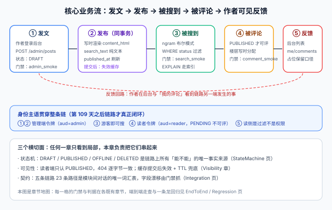

# 核心业务流收口：一条链路串起全部模块

本页是「全栈博客平台」第 110 天的构建步骤（周期 4 第 3 周 · 收尾）。第 98~109 天，十二个章节各自把「自己那段」做到了有门禁、有判据——但项目里**从没有一章把链路串起来**。本日补上这一章。

::: warning 本页命令里的路径指「你自己的工程」
本仓是**文档库**，不存放代码。`service/`、`python xxx.py` 等指的是**你按对应章节搭起来的工程目录与脚本**。本章各页的验收清单是**判据**，不是实测输出；实测输出的落档方式见[一条龙回归](./Regression/index.md)。
:::



## 一句话定位

博客平台的核心业务流是**「作者发文 → 发布 → 被搜到 → 被评论 → 作者可见反馈」**，第 109 天的读者账号让这条链有了完整的身份主语。本章做三件事：把链路里的**领域概念收口成三个聚合**、把**状态迁移的副作用收口成一张矩阵**、把**端到端验证收口成一份可复核的回归报告**。

## 一、为什么收口放在第 110 天

前两周的验收全是「模块级」的：`admin_smoke` 证明写链路对、`search_smoke` 证明搜索对、`account_smoke` 证明账号对。但模块级全绿**推不出链路级正确**——链路上真正的风险都藏在**模块与模块的接缝**里：

| 接缝 | 单模块验收看不到的失效方式 | 谁来守 |
| --- | --- | --- |
| 写入 → 可见 | 缓存先删后提交，旧状态回填，下线操作白做 | `visibility_smoke` 第 ⑤ 步 + 本章 CF11 |
| 发布 → 搜索 | 渲染与 `search_text` 不同事务，页面有内容但搜不到（或反之） | 渲染章同事务纪律 + 本章 CF12 |
| 身份 → 评论 | 注册流程没闭环（邮件未接），评论框永远等不到登录态 | `account_smoke` + 本章 CF6~CF8 |
| 读者 → 作者 | 读者发了评论，作者侧任何地方都看不到（两个「读侧」口径不一致） | 本章 CF10，此前无门禁 |
| 全链路 | 每段都对但日志串不起来，出问题定位不了 | 本章 CF14（traceId 贯穿断言） |

::: tip 第 3 周收尾三件事与本章的关系
第 109 天验收页把收尾定为三件事：十一道门禁全绿、一条龙回归落档、Docker DDL 欠账结清。本章就是这三件事的**承载结构**：门禁矩阵输出进报告第 2 节、一条龙步骤表是报告第 3 节、DDL 实测输出是报告第 4 节。
:::

## 二、与既有章节的分工

本章**不重复**任何已有内容，只做串联。每一页与既有章节的边界如下：

| 本章页面 | 讲什么 | 不讲什么（去看哪） |
| --- | --- | --- |
| [领域建模](./DomainModel/index.md) | 三个聚合、不变量归属、事务边界 | 表结构与 DDL（[数据库设计](../DatabaseDesign/index.md)） |
| [状态机驱动](./StateMachine/index.md) | 转移 × 副作用矩阵、副作用放哪一层 | 迁移矩阵与 409 判据本身（[文章下线动作](../Lifecycle/index.md)） |
| [接口联调](./Integration/index.md) | 跨模块字段依赖清单、三类漂移 | 契约文件与门禁实现（[接口契约](../Contract/index.md)） |
| [端到端走查](./EndToEnd/index.md) | 五段时序、每段的身份与门禁 | 各单段内部实现（各既有章节） |
| [一条龙回归](./Regression/index.md) | 回归报告结构、CF1~CF14 步骤表 | 冒烟脚本分层原则（[测试分层收口](../TestLayers/index.md)） |
| [第 3 周验收结论](./Acceptance/index.md) | 里程碑对照、顺延与风险登记 | 账号维度自查（[读者账号 · 验收](../ReaderAccount/Acceptance/index.md)） |

## 三、链路上的身份主语

第 109 天之前，这条链有一个洞：**评论写入需要读者身份，而系统里只有管理端身份**。补齐之后，链路上每个环节的身份是明确的，回归时每一步都标明「用哪个身份打」：

| 环节 | 身份 | 令牌特征 | 打错了会怎样 |
| --- | --- | --- | --- |
| ① 发文 / ⑤ 反馈 | 作者 | 管理端 Bearer，`aud = admin` | 读者令牌打 admin 路径 → `401`（aud 硬边界） |
| ② 被搜到 | 游客即可 | 无令牌 | 搜索是读者端接口，带 admin 令牌也不改变行为 |
| ③ 读者身份 | 读者 | Cookie access + refresh 族 | `PENDING` 未验证 → 发评论 `403` |
| ④ 被评论 | 读者 | 同上 | 游客发评论 → `401` 先于可见性判断（T7） |

## 四、本章不做什么

1. **不引入新模块**：链路上每个环节都已经建成，本章只做收口；出现「需要新模块才能串起来」的结论时，登记为风险而不是当天硬造。
2. **不做压测**：第 3 周里程碑里的「压测达标」已明确顺延到第 119 天（理由见[第 3 周验收结论](./Acceptance/index.md)），本章的回归是**正确性**回归，不含性能断言。
3. **不改既有判据**：各章的断言前缀（A / B / T / S / Q / C / R）与期望值一律不动；本章新增的 CF 前缀只增不改。

## 五、验证方式

```shell
cd your-project/service

# 本章是收口章：先跑十一道门禁确认「地基没动」
mvn test                                    # 期望 A1~A10 / T1~T14 / S1~S6 全绿
python assertion_audit.py                   # 期望 PASS（CF 前缀加入后仍唯一）
export SERVER_PORT=18080 && cd blog-application && mvn spring-boot:run

# 另开终端：一条龙回归（本章核心产出，14 步）
python coreflow_smoke.py --base http://127.0.0.1:18080
# 期望 steps = 14  passed = 14（CF1~CF14，判据见 Regression 页）
python coreflow_smoke.py --selftest         # 期望 selftest: 14/14
```

:::tip 一句话总结
模块验收回答「每块砖是好的」，核心业务流收口回答「房子能住人」——后者才是周期 4 第 3 周「联调 + 测试」的真正验收物。
:::

## 六、相关页面

- 上一环节章节：[读者账号与权限](../ReaderAccount/index.md)（链路的身份主语）
- 链路各段：[文章写入链路](../WritePath/index.md) ｜ [文章下线动作](../Lifecycle/index.md) ｜ [可见性收敛](../Visibility/index.md) ｜ [全文搜索](../Search/index.md) ｜ [评论链路](../Comments/index.md) ｜ [前台 SSR](../FrontendSSR/index.md)
- 进展记录：[Progress](../Progress/index.md)
