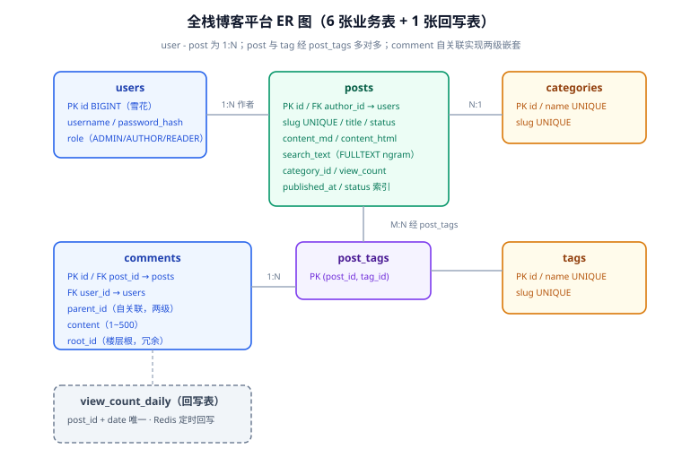

# 数据库设计

数据库是第 1 周最重要的一页：表结构一旦有数据写入，改造成本就按周上涨。方法沿用 [完整项目交付 · 数据建模](../../../../docs/Others/ProjectDelivery/DataModel/index.md)（建模反推法、命名规范、迁移六步法），本页只放本项目的设计结论与可执行 DDL。

## 一句话定位

6 张业务表 + 1 张回写表：**users / posts / categories / tags / post_tags / comments** + view_count_daily。雪花 ID 主键、`utf8mb4`、软删除只给 posts 与 comments（用户不可删）。

::: info 第 109 天的增量
读者账号模块在 V1 之上加了增量脚本 `db/mysql/V2__reader_account.sql`：给 `users` 补 6 列（`email` / `admin_role` / `status` / `email_verified_at` / `last_login_at` / `closed_at`）、新增第 7 张业务表 `user_tokens`，并**收敛了三处与实现不符的口径**。

本页只保留 V1 的原始 DDL 作为第 1 周的设计快照（历史不改写），增量与三处口径的完整论证见 [读者账号 · 表设计](../ReaderAccount/DataModel/index.md)。**注意本页第 29 行 `password_hash` 的列注释已在增量中修正**——它原来写的是「BCrypt 哈希」，而实现一直是自描述 PBKDF2 串。
:::



## 设计决策

| 决策 | 选择 | 理由 |
| --- | --- | --- |
| 主键 | 雪花 ID（BIGINT） | 沿用模板 `BaseEntity`；分页游标友好；双方言 DDL 能逐列对齐 |
| 文章 URL | `slug` 唯一，暴露 slug 不暴露 ID | SEO 友好；未发布文章按 slug 404（见需求页 US-02） |
| 正文存储 | `content_md`（原文）+ `content_html`（渲染后）双列 | 渲染结果落库，读路径零渲染成本；消毒在写 `content_html` 之前完成 |
| 搜索字段 | 冗余 `search_text` 列建 FULLTEXT | 检索字段与展示字段解耦（架构页硬约定 2） |
| 评论层级 | `parent_id` + `root_id` 冗余 | 物理两级、展示两层；`root_id` 让「取整层回复」一个索引搞定 |
| 删除 | posts/comments `deleted_at` 软删除 | 评论删除楼中楼同步消失是硬需求；users/categories/tags 物理不删。**第 109 天补充**：`users` 的「注销」因此只能是「状态位 + 打散用户名与邮箱」，`posts.author_id` 与 `comments.user_id` 两处强引用不允许悬空 |
| 浏览计数 | Redis 计数 + `view_count_daily` 回写 | 高频写不压主库；按天回写顺带产出访问趋势数据 |

## 建表 DDL（MySQL 8.4）

```sql [db/mysql/V1__blog_init.sql]
CREATE TABLE users (
    id            BIGINT       NOT NULL COMMENT '雪花 ID',
    username      VARCHAR(32)  NOT NULL COMMENT '登录名',
    password_hash VARCHAR(100) NOT NULL COMMENT 'BCrypt 哈希（注释已于第 109 天修正：实际是自描述哈希串）',
    nickname      VARCHAR(32)  NOT NULL COMMENT '展示昵称',
    role          VARCHAR(16)  NOT NULL DEFAULT 'READER' COMMENT 'ADMIN/AUTHOR/READER',
    created_at    DATETIME     NOT NULL DEFAULT CURRENT_TIMESTAMP,
    updated_at    DATETIME     NOT NULL DEFAULT CURRENT_TIMESTAMP ON UPDATE CURRENT_TIMESTAMP,
    PRIMARY KEY (id),
    UNIQUE KEY uk_users_username (username)
) ENGINE = InnoDB DEFAULT CHARSET = utf8mb4 COLLATE = utf8mb4_0900_ai_ci COMMENT '用户';

CREATE TABLE categories (
    id         BIGINT      NOT NULL COMMENT '雪花 ID',
    name       VARCHAR(32) NOT NULL COMMENT '分类名',
    slug       VARCHAR(64) NOT NULL COMMENT 'URL 标识',
    created_at DATETIME    NOT NULL DEFAULT CURRENT_TIMESTAMP,
    PRIMARY KEY (id),
    UNIQUE KEY uk_categories_name (name),
    UNIQUE KEY uk_categories_slug (slug)
) ENGINE = InnoDB DEFAULT CHARSET = utf8mb4 COLLATE = utf8mb4_0900_ai_ci COMMENT '分类';

CREATE TABLE tags (
    id         BIGINT      NOT NULL COMMENT '雪花 ID',
    name       VARCHAR(32) NOT NULL COMMENT '标签名',
    slug       VARCHAR(64) NOT NULL COMMENT 'URL 标识',
    created_at DATETIME    NOT NULL DEFAULT CURRENT_TIMESTAMP,
    PRIMARY KEY (id),
    UNIQUE KEY uk_tags_name (name),
    UNIQUE KEY uk_tags_slug (slug)
) ENGINE = InnoDB DEFAULT CHARSET = utf8mb4 COLLATE = utf8mb4_0900_ai_ci COMMENT '标签';

CREATE TABLE posts (
    id            BIGINT       NOT NULL COMMENT '雪花 ID',
    author_id     BIGINT       NOT NULL COMMENT '作者 → users.id',
    category_id   BIGINT       NOT NULL COMMENT '分类 → categories.id',
    slug          VARCHAR(128) NOT NULL COMMENT 'URL 标识',
    title         VARCHAR(128) NOT NULL COMMENT '标题',
    status        VARCHAR(16)  NOT NULL DEFAULT 'DRAFT' COMMENT 'DRAFT/PUBLISHED/OFFLINE',
    content_md    MEDIUMTEXT   NOT NULL COMMENT 'Markdown 原文',
    content_html  MEDIUMTEXT   NULL COMMENT '渲染并消毒后的 HTML，发布时生成',
    search_text   TEXT         NULL COMMENT '纯文本检索字段（FULLTEXT 专用，不对外展示）',
    view_count    BIGINT       NOT NULL DEFAULT 0 COMMENT '累计浏览（Redis 回写）',
    published_at  DATETIME     NULL COMMENT '首发时间',
    deleted_at    DATETIME     NULL COMMENT '软删除',
    created_at    DATETIME     NOT NULL DEFAULT CURRENT_TIMESTAMP,
    updated_at    DATETIME     NOT NULL DEFAULT CURRENT_TIMESTAMP ON UPDATE CURRENT_TIMESTAMP,
    PRIMARY KEY (id),
    UNIQUE KEY uk_posts_slug (slug),
    KEY idx_posts_status_published (status, published_at),
    KEY idx_posts_category (category_id, status),
    KEY idx_posts_author (author_id),
    FULLTEXT KEY ft_posts_search (title, search_text) WITH PARSER ngram
) ENGINE = InnoDB DEFAULT CHARSET = utf8mb4 COLLATE = utf8mb4_0900_ai_ci COMMENT '文章';

CREATE TABLE post_tags (
    post_id BIGINT NOT NULL,
    tag_id  BIGINT NOT NULL,
    PRIMARY KEY (post_id, tag_id),
    KEY idx_post_tags_tag (tag_id)
) ENGINE = InnoDB DEFAULT CHARSET = utf8mb4 COLLATE = utf8mb4_0900_ai_ci COMMENT '文章-标签关联';

CREATE TABLE comments (
    id         BIGINT       NOT NULL COMMENT '雪花 ID',
    post_id    BIGINT       NOT NULL COMMENT '文章 → posts.id',
    user_id    BIGINT       NOT NULL COMMENT '评论人 → users.id',
    parent_id  BIGINT       NULL COMMENT '父评论，NULL 为楼层根',
    root_id    BIGINT       NULL COMMENT '楼层根冗余，取整层回复用',
    content    VARCHAR(500) NOT NULL COMMENT '内容 1~500',
    deleted_at DATETIME     NULL COMMENT '软删除',
    created_at DATETIME     NOT NULL DEFAULT CURRENT_TIMESTAMP,
    PRIMARY KEY (id),
    KEY idx_comments_post_root (post_id, root_id, created_at),
    KEY idx_comments_parent (parent_id)
) ENGINE = InnoDB DEFAULT CHARSET = utf8mb4 COLLATE = utf8mb4_0900_ai_ci COMMENT '评论';

CREATE TABLE view_count_daily (
    post_id    BIGINT      NOT NULL,
    stat_date  DATE        NOT NULL,
    view_count BIGINT      NOT NULL DEFAULT 0,
    PRIMARY KEY (post_id, stat_date)
) ENGINE = InnoDB DEFAULT CHARSET = utf8mb4 COLLATE = utf8mb4_0900_ai_ci COMMENT '浏览量日回写';
```

:::tip 提示
索引设计的三条依据：① `idx_posts_status_published (status, published_at)` 服务「已发布文章按时间倒序」这个**全站最高频查询**；② `idx_comments_post_root (post_id, root_id, created_at)` 服务「取某篇文章的全部楼层与楼层内回复」一条索引走完；③ FULLTEXT 用 `ngram` 解析器是 MySQL 对中文的内置方案，`ngram_token_size` 默认 2，无需额外组件。
:::

:::danger 注意
`search_text` 与 `title` 的 FULLTEXT 联合索引要求两列**同时**出现在 MATCH 中才能吃到索引（`(title, search_text)` 上的布尔检索）。只搜正文时也写 `MATCH(title, search_text) AGAINST(? IN BOOLEAN MODE)`，只是给 `title` 传空串——这是 ngram 全文索引最常见的「建了但不走」误区，第 3 周搜索模块的测试会专门断言执行计划。
:::

## 与双方言能力的关系

基座模板已建「MySQL 8.4 / PostgreSQL 17 部署期二选一」能力，本项目 DDL 沿用 `db/mysql/` + `db/postgres/` 双份目录与 `parity_check.py` 结构一致性门禁。本页先给 MySQL 版；PostgreSQL 版翻译（TINYINT→SMALLINT 等）在第 92 天随工程骨架一起交付，并**必须通过 parity 门禁**才算第 1 周数据库设计完成。

## 验证方式

```shell
# 一条命令验证 DDL 可执行（需 Docker；无 Docker 时标注「待本地验证」）
docker run --rm -i mysql:8.4 mysql -uroot -proot -e "
  CREATE DATABASE IF NOT EXISTS blog DEFAULT CHARSET utf8mb4;
  USE blog; SOURCE /dev/stdin;" < db/mysql/V1__blog_init.sql
# 期望：无报错退出；SHOW TABLES 列出 7 张表
```

::: tip 这条命令的欠账在第 109 天结清
第 1 周写下这条命令时本机没有 Docker，标注为「待本地验证」，此后一直挂着。第 109 天新增了增量脚本 `V2__reader_account.sql`，正好把「V1 → V2 连续执行」一起验完，命令与判据见 [验收与第 3 周收尾](../ReaderAccount/Acceptance/index.md)。
:::

设计自检（第 1 周验收判据）：每个需求页的 US 都能在表结构上落位（US-04 评论两级 → `parent_id`/`root_id`；US-05 搜索 → `ft_posts_search`；**US-11 数据归属 → `comments.user_id` 与令牌里的 `sub` 比对**）；每个高频查询都有对应索引且被后续 EXPLAIN 验证。
