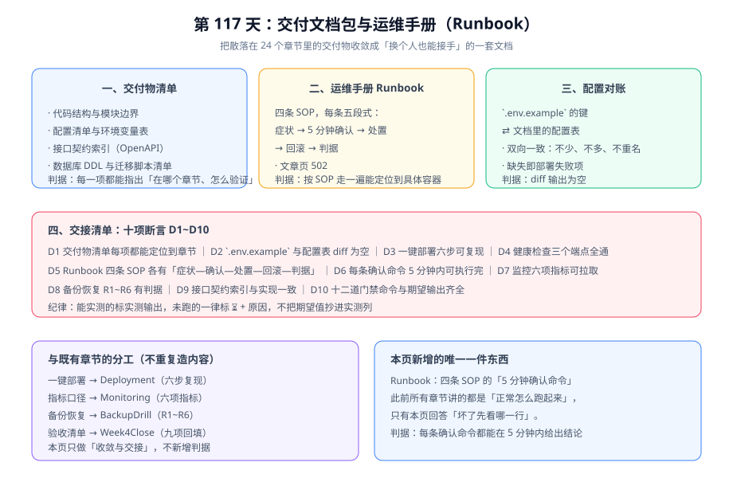

# 交付文档包与运维手册

本章是周期 4 第 4 周「部署 + 文档沉淀」的**收敛章**：前面 24 个章节分别回答了「怎么做」，本章回答「怎么交接」——把散落各处的交付物收敛成一份清单，并补上此前所有章节都没有的内容：**系统坏了，先看哪一行**。



::: tip 一句话定位
上线验收清单（[第 4 周收口](../Week4Close/index.md)）回答「**能不能上线**」；本章回答「**上线之后换个人来管，能不能接得住**」。两者的判据不重叠：前者是九项验收项，后者是十项交接断言。
:::

## 一、交付物清单

每一项都必须能回答两个问题：**在哪个章节**、**怎么验证**。答不出其中之一，就不是交付物，只是文档。

| 交付物 | 所在章节 | 验证方式 | 判据 |
| --- | --- | --- | --- |
| 需求与验收条件 | [需求拆分与验收条件](../Requirements/index.md) | 逐条对照用户故事与 Given/When/Then | 每个故事都有可判定的验收条件 |
| 架构与选型决策 | [架构设计与技术选型](../Architecture/index.md) | 核对每个选型是否有「为什么不用另一个」的说明 | 决策有理由、有代价、有重新评估条件 |
| 数据库 DDL 与索引 | [数据库设计](../DatabaseDesign/index.md) | 在空库执行全量 DDL | 执行成功、表数与设计一致、索引齐全 |
| 接口契约（OpenAPI 3.1） | [接口契约](../Contract/index.md) | 契约门禁 + 与实现比对 | parity 门禁 PASS、路径数一致 |
| 工程结构与运行路径 | [工程骨架与验收门禁](../Skeleton/index.md) | 本地直跑两条路径 | 两条路径均能启动并响应 |
| 十二道行为门禁 | [测试分层收口](../TestLayers/index.md)、[工程骨架](../Skeleton/index.md) | 逐条执行门禁命令 | 每道门禁输出与期望值一致 |
| 一键部署（Compose 五服务） | [一键部署](../Deployment/index.md) | 按六步从零复现 | 五服务全部 healthy |
| 监控接入与指标口径 | [监控接入](../Monitoring/index.md) | 拉取指标端点、核对六项指标 | 六项指标均有数据、口径与文档一致 |
| 备份与恢复判据 | [备份恢复演练与上线验收清单](../BackupDrill/index.md) | 按四步做一次临时容器恢复 | R1~R6 全部对得上 |
| 上线验收清单（九项） | [第 4 周收口](../Week4Close/index.md) | 逐项回填实测列 | 每项有实测输出或 ⏳ + 原因 |
| 运维手册（本章第三节） | 本章 | 按四条 SOP 各演练一次 | 每条都能在 5 分钟内定位 |

::: warning 「文档沉淀」不是把已有内容再抄一遍
本章**只做收敛与交接，不新增判据**。任何一条判据都只有一个归属页面：部署细节在 [一键部署](../Deployment/index.md)、指标口径在 [监控接入](../Monitoring/index.md)、恢复判据在 [备份恢复演练](../BackupDrill/index.md)、验收项在 [第 4 周收口](../Week4Close/index.md)。

重复定义是同一条判据的两份实现——它们必然分叉，然后你在某次故障里发现两份文档说的不一样。
:::

## 二、配置对账：环境变量与文档必须一致

部署失败最高频的原因不是代码问题，而是**环境变量少配或拼错**。因此把「配置清单」变成一条可执行的判据：

```shell
# 从 .env.example 提取键名（忽略注释与空行），排序后与文档配置表比对
grep -vE '^\s*#|^\s*$' .env.example | cut -d= -f1 | sort -u > /tmp/env_keys.txt
wc -l < /tmp/env_keys.txt
# 期望：得到键的总数（示例：14），与本章配置表的行数一致

# 配置表另存一份键名清单（与文档表逐行对应），双向 diff
diff /tmp/env_keys.txt docs-config-keys.txt
# 期望：无输出（完全一致）。有输出即为「文档里写了但模板里没有」或反过来
```

| 键 | 用途 | 默认值 | 缺失后果 |
| --- | --- | --- | --- |
| `MYSQL_ROOT_PASSWORD` | MySQL 初始口令 | 无（必须设） | 容器启动失败 |
| `MYSQL_DATABASE` | 业务库名 | `blog` | 首次 DDL 无处执行 |
| `MYSQL_USER` / `MYSQL_PASSWORD` | 应用连接账号 | 无（必须设） | 应用连不上库，启动即退出 |
| `REDIS_PASSWORD` | Redis 访问口令 | 无（必须设） | 应用侧连接报 NOAUTH |
| `JWT_SECRET` | 令牌签发密钥 | 无（必须设） | 认证接口全部 500 |
| `SERVER_PORT` | 后端端口 | `18080` | 与 Compose 端口映射不一致，健康检查失败 |
| `NUXT_PUBLIC_API_BASE` | 前台调用后端的地址 | `http://127.0.0.1:18080` | 前台 SSR 首屏取数失败，页面空白 |
| `MYSQL_NGRAM_TOKEN_SIZE` | ngram 分词长度 | `2` | 中文搜索返回空（见第 107 天） |
| `MYSQL_FT_STOPWORD` | 停用词开关 | `OFF` | 搜索命中率异常 |
| `BACKUP_RETAIN_DAYS` | 备份保留天数 | `7` | 备份被过早清理，恢复演练缺料 |
| `AI_ENDPOINT` | 模型端点 | 空（可留空） | AI 预审判失败并按 review 兜底（不阻断发布） |
| `AI_TIMEOUT_MS` | 模型调用超时 | `3000` | 设为过大时评论预审阻塞请求线程 |
| `LOG_LEVEL` | 日志级别 | `INFO` | 设为 DEBUG 时日志暴涨打满磁盘 |
| `TZ` | 容器时区 | `Asia/Shanghai` | 定时器与超时计算整体偏移，**最隐蔽的一个** |

::: danger 两个「不报错但错」的配置
1. **`TZ` 不一致**：容器用 UTC、业务按北京时间思考，超时与定时任务会整体偏移 8 小时——没有异常、没有日志，只是"审批总是慢8小时"。
2. **`AI_TIMEOUT_MS` 过大**：评论预审是**同步调用**模型，超时设成 30 秒意味着每个评论请求最多占用线程 30 秒。正确做法是设短超时（如 3 秒）+ fail-safe 到人审，而不是把请求挂在那里等。

**验证方法**：`docker compose exec backend date` 与宿主机 `date` 对比；压测评论接口时观察 P99 是否被 `AI_TIMEOUT_MS` 顶住。
:::

## 三、运维手册（Runbook）

四条 SOP（标准作业程序），每条五段式：**症状 → 5 分钟确认 → 处置 → 回滚 → 判据**。纪律是「确认命令必须在 5 分钟内给出结论」，否则它就不是 SOP，是大海捞针。

### SOP-1 文章详情页 502

| 段 | 内容 |
| --- | --- |
| **症状** | 访问 `/posts/{slug}` 返回 502/504；首页正常 |
| **5 分钟确认** | ① `docker compose ps` 看前台与后端容器状态；② `curl -sS -o /dev/null -w '%{http_code}\n' http://127.0.0.1:18080/actuator/health`；③ `docker compose logs --tail=100 backend \| grep -i 'error\|exception'` |
| **处置** | 若后端不健康 → 看日志末条异常；若后端健康但前台 502 → 检查 `NUXT_PUBLIC_API_BASE` 与容器网络（前台容器内能否解析到后端服务名） |
| **回滚** | 若是本次发布引入 → `docker compose up -d --no-deps --force-recreate frontend` 回退到上一镜像 tag |
| **判据** | ① 三个容器状态为 `running`；② 健康端点返回 `{"status":"UP"}`；③ 文章页返回 200 且 HTML 中含文章标题 |

### SOP-2 接口大面积超时（P95 突增）

| 段 | 内容 |
| --- | --- |
| **症状** | P95 从基线几十毫秒跳到秒级；错误率上升 |
| **5 分钟确认** | ① `curl -s http://127.0.0.1:18080/actuator/prometheus \| grep hikaricp_connections_pending`；② `docker compose exec mysql mysql -uroot -p"$MYSQL_ROOT_PASSWORD" -e "show processlist"`；③ 检查是否刚开放评论 AI 预审（`AI_ENDPOINT` 是否可达） |
| **处置** | 连接池 pending > 0 → 先扩容连接池或限流；模型端点不可达 → 临时把 `AI_ENDPOINT` 置空（fail-safe 回纯人审），恢复时间不受影响 |
| **回滚** | 参数类改动用 Compose 覆盖文件回退；代码类改动回退镜像 tag |
| **判据** | ① `hikaricp_connections_pending` 回到 0；② P95 回落到基线 1.5 倍以内；③ 评论接口仍返回 202/200（降级成功，不是 500） |

### SOP-3 Redis 不可达

| 段 | 内容 |
| --- | --- |
| **症状** | 日志出现 `RedisConnectionFailureException`；列表页仍可用但变慢 |
| **5 分钟确认** | ① `docker compose ps redis`；② `docker compose exec redis redis-cli -a "$REDIS_PASSWORD" ping`；③ 看应用是否已降级到直查数据库 |
| **处置** | 重启 Redis（`docker compose restart redis`）；确认缓存失效后**不会**出现"读到旧文章"（第 102 天的缓存失效时序仍是提交后失效 + TTL 兜底） |
| **回滚** | 无需回滚代码；若数据异常，清 key 后由 TTL 自然重建 |
| **判据** | ① `PING` 返回 `PONG`；② 缓存命中率逐步回升；③ 被下线文章在缓存重建后仍返回 404（可见性纪律不因重启而破坏） |

### SOP-4 磁盘写满 / 日志暴涨

| 段 | 内容 |
| --- | --- |
| **症状** | 容器启动失败或写入报 `No space left on device`；MySQL 写入报错 |
| **5 分钟确认** | ① `df -h`；② `docker system df`；③ `du -sh ./logs ./backup 2>/dev/null` |
| **处置** | 先清日志（保留最近 7 天）：确认 `LOG_LEVEL` 是否被误设为 `DEBUG`；再清无用镜像（`docker image prune -f`）；**备份目录不得整目录清理**——按 `BACKUP_RETAIN_DAYS` 只删过期文件 |
| **回滚** | 无（数据清理不可逆）。因此清理前必须先确认最近一次全量备份可用 |
| **判据** | ① 磁盘可用空间 > 20%；② MySQL 可正常写入；③ 最近一次备份文件仍在且大小非 0 |

::: danger SOP 的头号纪律：先确认备份，再动手清理
SOP-4 是四条里唯一**不可回滚**的。处置顺序必须是「**确认最近一次全量备份可恢复 → 再删**」，而不是反过来。备份恢复的四步与 R1~R6 对账判据见[备份恢复演练](../BackupDrill/index.md)——那份判据在故障现场同样适用。
:::

## 四、交接清单：十项断言

| 编号 | 断言 | 类型 | 状态 |
| --- | --- | --- | --- |
| D1 | 交付物清单每项都能定位到章节与验证方式 | 结构断言 | ✅ 本日核对（本节第一节） |
| D2 | `.env.example` 键名与本节配置表 diff 为空 | 对账断言 | ⏳ 待工程环境（读数为本仓无该文件） |
| D3 | [一键部署](../Deployment/index.md) 六步可复现 | 复现断言 | ⏳ 待 Docker |
| D4 | 健康检查三个端点全通（backend / mysql / redis） | 运行断言 | ⏳ 待 Docker |
| D5 | Runbook 四条 SOP 均满足五段式 | 结构断言 | ✅ 本日核对 |
| D6 | 每条 SOP 的确认命令可在 5 分钟内执行完 | 时长断言 | ⏳ 待 Docker（需真实容器才有意义） |
| D7 | 监控六项指标可拉取（第六项 JVM 只观察） | 运行断言 | ⏳ 待 Docker |
| D8 | 备份恢复 R1~R6 判据齐全 | 结构断言 | ✅ 第 114 天已收口 |
| D9 | 接口契约索引与实现一致（parity 门禁 PASS） | 运行断言 | ⏳ 待工程环境 |
| D10 | 十二道门禁命令与期望输出齐全 | 结构断言 | ✅ 第 116 天已收口 |

**实测列纪律**（与第 4 周收口、回归报告完全一致）：**本机没有 Docker 与工程环境，⏳ 项一律标注原因，不把期望值抄进实测列**。D2/D9 需要一个可运行的工程仓库，D3/D4/D6/D7 需要一台有 Docker 的机器——两者就是[第 4 周收口](../Week4Close/index.md)已经收敛出的那个单一前置条件。

## 五、当日做了什么 / 如何验证 / 下一步

**当日做了什么**：

1. **交付物清单收敛**：把 24 个章节的交付物整理成 11 行清单，每行标注「所在章节 + 验证方式 + 判据」，并明确**本章不新增判据**（避免同一条判据出现两份实现）。
2. **配置对账做成可执行判据**：给出 `.env.example` 键名提取 + 双向 diff 的命令，并列出 14 个关键配置项的「缺失后果」，其中 `TZ` 与 `AI_TIMEOUT_MS` 两项标注为「不报错但错」的隐蔽陷阱。
3. **新增 Runbook 四条 SOP**：文章页 502、接口大面积超时、Redis 不可达、磁盘写满/日志暴涨——这是前面所有章节都缺失的一块（此前讲的都是"正常怎么跑起来"）。
4. **交接清单十项断言 D1~D10**：四项本日核对 ✅、一项第 114 天已收口 ✅、一项第 116 天已收口 ✅，其余 ⏳ 附前置条件。
5. **同步**：项目总览进度表与章节列表、[进展记录](../Progress/index.md)、`project.ts` 侧边栏。

**如何验证**（读者可执行）：

```shell
# ① 交付物清单：每个章节文件存在
for p in Requirements Architecture DatabaseDesign Contract Skeleton TestLayers \
         Deployment Monitoring BackupDrill Week4Close Delivery; do
  [ -f "project/Complete/BlogPlatform/$p/index.md" ] && echo "OK  $p" || echo "MISS $p"
done
# 期望：11 行全为 OK

# ② Runbook 五段式完整性：四条 SOP 每条都有「症状/确认/处置/回滚/判据」
grep -c '^\*\*症状\*\*\|^\*\*5 分钟确认\*\*\|^\*\*处置\*\*\|^\*\*回滚\*\*\|^\*\*判据\*\*' \
  project/Complete/BlogPlatform/Delivery/index.md
# 期望：20（4 条 SOP × 5 段）

# ③ 配置对账（在自己的工程里）
grep -vE '^\s*#|^\s*$' .env.example | cut -d= -f1 | sort -u > /tmp/env_keys.txt
diff /tmp/env_keys.txt docs-config-keys.txt
# 期望：无输出（文档与模板完全一致）

# ④ SOP-1 演练（需要 Docker 环境；无环境时标注 ⏳ 待环境）
docker compose ps
curl -sS -o /dev/null -w '%{http_code}\n' http://127.0.0.1:18080/actuator/health
# 期望：五服务 running；健康端点返回 200
```

**下一步**：第 118-120 天收口第 4 周——文档沉淀已在本日落地，剩余动作是**等待 Docker 环境兑现九项验收实测回填与本章 D3/D4/D6/D7**；第 119 天做**压测**（口径三处不变，见[第 3 周收口](../Week3Close/index.md)、[验收结论](../CoreFlow/Acceptance/index.md)、项目总览）。

## 相关页面

- 上一任务章节：[评论 AI 预审与文章摘要](../AiModeration/index.md)
- 部署与验收：[一键部署](../Deployment/index.md) ｜ [监控接入](../Monitoring/index.md) ｜ [备份恢复演练](../BackupDrill/index.md) ｜ [第 4 周收口](../Week4Close/index.md)
- 方法论：[完整项目交付](../../../../docs/Others/ProjectDelivery/index.md) ｜ [工作流与规则引擎](../../../../docs/Backend/WorkflowEngine/index.md)（引擎类系统的可观测与运维判据）
- 进展记录：[Progress](../Progress/index.md)
