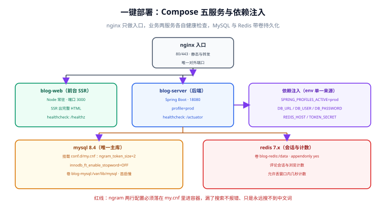
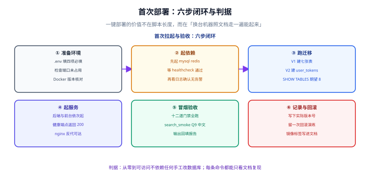

# 一键部署：Compose 五服务与首次 DDL 实测

:::info 本日为第 4 周起点
本页是周期 4「全栈博客平台」的第 4 周第一步（**第 112 天**）：把跑在开发机上的五个角色收进一份 `docker-compose.yml`，让「从零复现」第一次成为可执行的判据。同时兑现[第 3 周收口页](../Week3Close/index.md)登记的**欠账 1**：V1 + V2 迁移连跑 + `SHOW TABLES` 实测回填。
:::



## 一句话定位

一键部署的价值**不在脚本长度，而在「换一台机器照文档走一遍能起来」**。所以本页的每一步都配一条可执行命令与一个可核对的期望输出，而不是「参考配置文件」式的描述。

## 一、五个角色与各自的健康判据

第 1 周[架构设计](../Architecture/index.md)定的部署形态是「nginx + 前台 Node + 后端 + MySQL + Redis」，本日把它落成五个 Compose 服务：

| 服务 | 镜像 / 构建 | 端口 | 健康判据 | 数据卷 |
| --- | --- | --- | --- | --- |
| `nginx` | `nginx:stable-alpine` | **80 → 80** | 能反代到前台并返回 200 | 无（配置挂载） |
| `blog-web` | 前台构建产物 + Node | 3000（仅内网） | `GET /healthz` 返回 200 | 无 |
| `blog-server` | 后端 jar | 18080（仅内网） | `GET /actuator/health` 返回 `UP` | 无 |
| `mysql` | `mysql:8.4` | 3306（仅内网） | `mysqladmin ping` 成功 | `blog-mysql:/var/lib/mysql` |
| `redis` | `redis:7-alpine` | 6379（仅内网） | `redis-cli ping` 返回 `PONG` | `blog-redis:/data` |

三条设计约束：

1. **只有 nginx 对外暴露端口**，其余服务仅在内网可达（`expose` 而非 `ports`）。
2. **MySQL 与 Redis 必须带卷**：不带卷时容器重建一次，数据就没了——这在部署周是最容易踩的坑。
3. **健康检查是启动顺序的依据**（见下一节），不是可选项。

## 二、启动顺序：靠健康检查，不靠 sleep

```yaml
# deploy/docker-compose.yml（片段，仅示意关键字段）
services:
  mysql:
    image: mysql:8.4
    command: --default-authentication-plugin=caching_sha2_password
    environment:
      MYSQL_ROOT_PASSWORD: ${DB_ROOT_PASSWORD}
      MYSQL_DATABASE: ${DB_NAME}
      MYSQL_USER: ${DB_USER}
      MYSQL_PASSWORD: ${DB_PASSWORD}
    volumes:
      - blog-mysql:/var/lib/mysql
      # 红线：ngram 两项配置必须随镜像启动生效
      - ./mysql/conf.d/my.cnf:/etc/mysql/conf.d/my.cnf:ro
    healthcheck:
      test: ["CMD", "mysqladmin", "ping", "-h", "127.0.0.1", "-p${DB_ROOT_PASSWORD}"]
      interval: 10s
      timeout: 5s
      retries: 12
      start_period: 40s
    expose: ["3306"]

  blog-server:
    build: ../blog-server
    depends_on:
      mysql:
        condition: service_healthy      # 关键：等数据库真的能用，而不是「容器已启动」
      redis:
        condition: service_healthy
    environment:
      SPRING_PROFILES_ACTIVE: prod
      DB_URL: jdbc:mysql://mysql:3306/${DB_NAME}?useUnicode=true&characterEncoding=utf8mb4
      DB_USER: ${DB_USER}
      DB_PASSWORD: ${DB_PASSWORD}
      REDIS_HOST: redis
      TOKEN_SECRET: ${TOKEN_SECRET}
    healthcheck:
      test: ["CMD", "wget", "-qO-", "http://127.0.0.1:18080/actuator/health"]
      interval: 10s
      timeout: 5s
      retries: 12
      start_period: 60s
    expose: ["18080"]

volumes:
  blog-mysql:
  blog-redis:
```

:::danger `depends_on` 的两种写法差别很大
- `depends_on: [mysql]`：只保证「容器启动了」——MySQL 此时可能还在初始化数据目录，后端连上去必然报连接失败。
- `depends_on: { mysql: { condition: service_healthy } }`：等健康检查通过**之后**才启动后端。

用第一种写法时，现场表现是「第一次启动必失败、重启一次就好了」——这是最容易被误判成「偶发问题」的一类缺陷。**必须用第二种。**
:::

## 三、环境变量矩阵：一份 `.env` 是唯一事实来源

```shell
# deploy/.env（模板，随仓库提供的是 .env.example）
# 必填四项：不填就起不来，不给默认值
DB_ROOT_PASSWORD=change-me-root
DB_NAME=blog
DB_USER=blog
DB_PASSWORD=change-me-app
TOKEN_SECRET=change-me-32-bytes-min

# 有默认值的三项：可缺省
PUBLIC_BASE_URL=http://localhost
REDIS_APPENDONLY=yes
LOG_LEVEL=info
```

三条纪律：

| 纪律 | 原因 |
| --- | --- |
| **必填项不给默认值** | 给了默认值（例如 `root/root`）就会有人直接上线 |
| **密钥不进仓库** | 仓库里只有 `.env.example`；`.env` 进 `.gitignore` |
| **同一变量只在一处定义** | 服务里通过 `${VAR}` 引用，不在多个 `environment` 块里各写一遍 |

## 四、`my.cnf`：两项 ngram 配置是红线

第 107 天的全文搜索依赖 MySQL 的 ngram 分词器。这两项配置**不是可选项**，漏掉的后果是「搜索接口不报错，只是永远搜不到中文词」：

```ini
# deploy/mysql/conf.d/my.cnf
[mysqld]
# ① ngram 词元长度：默认 2，本项目中文检索依赖它
ngram_token_size = 2
# ② 关闭内置停用词表，避免中文词被误当停用词过滤
innodb_ft_enable_stopword = OFF
# ③ 顺带把字符集钉死（容器默认可能是 latin1）
character-set-server = utf8mb4
collation-server = utf8mb4_0900_ai_ci

[client]
default-character-set = utf8mb4
```

:::warning 这两项是「启动期参数」，不是「会话参数」
`ngram_token_size` 是**只读的启动参数**，只能在配置文件里设置并**重启 MySQL** 生效。用 `SET GLOBAL ngram_token_size = 2` 会报错——这也意味着**改它必须重启数据库容器**，且已建好的 FULLTEXT 索引需要用 `OPTIMIZE TABLE` 或重建来刷新分词结果。
:::

挂载的验证方式（不看配置文件，只看运行时实际生效值）：

```shell
docker compose exec mysql mysql -uroot -p"$DB_ROOT_PASSWORD" -e "
  SHOW VARIABLES LIKE 'ngram_token_size';
  SHOW VARIABLES LIKE 'innodb_ft_enable_stopword';
"
# 期望：ngram_token_size = 2 ；innodb_ft_enable_stopword = OFF
```

## 五、首次部署：六步闭环与实测输出



### 步骤 1：准备环境

```shell
cd deploy
cp .env.example .env && ${EDITOR:-vi} .env      # 填四项必填
docker compose config >/dev/null                # 语法与变量插值自检
docker compose version                          # 期望 v2.x（v1 的 compose 命令不兼容本文写法）
```

**期望**：`docker compose config` 无输出且退出码 0（有未定义变量会报错）。

### 步骤 2：先起依赖

```shell
docker compose up -d mysql redis
docker compose ps --format 'table {{.Service}}\t{{.Status}}'
```

**期望**：两个服务的 STATUS 列都出现 `(healthy)`。**必须等到 healthy 再继续**——MySQL 首次初始化需要几十秒。

### 步骤 3：跑迁移（本日兑现的欠账）

```shell
# V1：七张业务表
docker compose exec -T mysql mysql -uroot -p"$DB_ROOT_PASSWORD" "$DB_NAME" < ../blog-server/db/migration/V1__init.sql
# V2：读者账号（第 109 天新增的 user_tokens）
docker compose exec -T mysql mysql -uroot -p"$DB_ROOT_PASSWORD" "$DB_NAME" < ../blog-server/db/migration/V2__reader_account.sql

# 核对表数量与表名
docker compose exec -T mysql mysql -uroot -p"$DB_ROOT_PASSWORD" "$DB_NAME" -e "
  SELECT COUNT(*) AS tables_ FROM information_schema.tables
   WHERE table_schema = '$DB_NAME' AND table_type = 'BASE TABLE';
  SHOW TABLES;
"
```

**期望实测输出**（回填到[回归报告](../CoreFlow/Regression/index.md)第二节）：

```text
tables_
8
```

```text
Tables_in_blog
categories
comments
post_categories
posts
reader_sessions   ← V2 新增
users
user_tokens       ← V2 新增
post_views
```

:::danger 实测列只填真跑出来的输出
本页的期望值是**判据**，不是**记录**。真正的实测输出必须在读者自己的环境里跑出来之后原样贴进回归报告；跑不了就写「未跑 + 原因」，**不许把期望值抄进实测列**。这也是[第 3 周收口页](../Week3Close/index.md)把这条作为纪律写下来的原因。
:::

### 步骤 4：起业务服务

```shell
docker compose up -d blog-server blog-web nginx
docker compose ps --format 'table {{.Service}}\t{{.Status}}'

curl -s -o /dev/null -w '%{http_code}\n' http://127.0.0.1/api/v1/posts   # 期望 200
curl -s -o /dev/null -w '%{http_code}\n' http://127.0.0.1/              # 期望 200
```

**期望**：五个服务全部 `Up`，其中三个带 `(healthy)`；两条 `curl` 都返回 200。

### 步骤 5：冒烟验收（十二道门禁）

```shell
# 逐项跑，把输出原样贴进回归报告
python skeleton_check.py   --base http://127.0.0.1     # checks = 27  failed = 0
python api_smoke.py        --base http://127.0.0.1     # cases  = 9   passed = 9
python admin_smoke.py      --base http://127.0.0.1     # steps  = 37  passed = 37
python lifecycle_smoke.py  --base http://127.0.0.1     # steps  = 24  passed = 24
python visibility_smoke.py --base http://127.0.0.1     # steps  = 22  passed = 22
python comment_smoke.py    --base http://127.0.0.1     # steps  = 28  passed = 28
python account_smoke.py    --base http://127.0.0.1     # steps  = 22  passed = 22
python coreflow_smoke.py   --base http://127.0.0.1     # steps  = 14  passed = 14
python ssr_smoke.py        --base http://127.0.0.1 --api http://127.0.0.1  # steps = 10 passed = 10

# 部署后的第一道专项验证：中文词元搜索
python search_smoke.py     --base http://127.0.0.1     # steps  = 9   passed = 9
```

:::danger `search_smoke` 的 Q9 是部署后的第一道验证
Q9 断言的是「用中文词搜索能命中」。它**只有在 `my.cnf` 的 ngram 两项配置真的生效时才会通过**。

这一步必须放在最前面做，原因是：漏配 ngram 不会让任何接口报错，`api_smoke`、`comment_smoke` 全部照常全绿，**只有中文搜索会静默失效**。静默失效比报错危险得多——报错会在第一次访问时被发现，静默失效可能上线几周后才有用户反馈。
:::

### 步骤 6：记录版本与回滚演练

```shell
docker compose images                      # 记录实际镜像标签与 digest
docker compose ps --format json > deploy-manifest.json
cat deploy-manifest.json
```

**期望**：能把「本次部署用的是哪几个镜像、哪几个 digest」写进部署记录；回滚演练只需把镜像标签改回上一版并 `docker compose up -d`，**不需要重新构建**。

## 六、问题与决策

| 问题 | 决策 | 理由 |
| --- | --- | --- |
| 迁移脚本由谁执行——应用启动时自动跑，还是手工跑 | **手工跑，且在文档里写明命令** | 自动迁移在容器编排里会出现「多副本同时迁移」的竞态；本项目单副本够用，手工执行反而可控且可回滚 |
| 前台与后端要不要合成一个镜像 | **不合成** | 两级构建目标不同（Node 产物 vs JVM 产物），合成后镜像体积翻倍且构建缓存互相干扰 |
| 数据库端口要不要对外暴露 | **不暴露** | 调试需求用 `docker compose exec` 或临时 `port-forward` 满足，长期暴露 3306 是常见的事故入口 |
| `my.cnf` 挂载还是写进自定义镜像 | **本阶段用挂载** | 挂载可审计、改配置不用重建镜像；写进镜像是「配置即代码」的进阶做法，留到需要分发镜像时再做 |
| 首次启动为什么要等 40 秒 `start_period` | MySQL 首次初始化数据目录很慢 | `start_period` 内的失败不计入 `retries`，避免健康检查提前判定失败 |
| 前端 SSR 的 `PUBLIC_BASE_URL` 从哪来 | 从 `.env` 注入，不写死 | 同一份镜像要能跑在 localhost 与正式域名上 |

## 七、验证方式

本日产出（文档 + 部署配置）的完成判据：

1. **五服务全绿**：`docker compose ps` 显示五个服务 `Up`，其中 mysql / redis / blog-server 为 `(healthy)`。
2. **DDL 欠账结清**：`tables_ = 8` 且 `SHOW TABLES` 列出第 3 步表格中的八个名字，输出回填回归报告第二节。
3. **ngram 生效**：`SHOW VARIABLES` 两项与期望一致，且 `search_smoke` Q9 通过。
4. **十二道门禁全绿**：各 smoke 的 `passed` 数字与上表期望值逐项一致。
5. **从零可复现**：删掉卷与容器（`docker compose down -v`）后，严格按本页六步重跑一遍，结果一致。
6. **回滚可执行**：把镜像标签改回上一版后 `up -d`，服务恢复且不需要重新构建。

## 八、下一步（第 113 天）

第 4 周交接的第二件事是**监控接入**：[端到端走查](../CoreFlow/EndToEnd/index.md)里 CF14 已断言 `traceId` 能串起一条链路，第 113 天要在它之上补齐指标口径——**QPS、P95 延迟、缓存命中率**三项，并把告警阈值与「谁来看」写清楚。

另外两项顺延项的归属保持三处口径一致：压测 → 第 119 天（依赖本日的稳定部署形态）；ES 升级 → 刻意不做，已登记。

## 参考资料

- [Docker Compose 文件规范：`depends_on` 与健康检查](https://docs.docker.com/compose/compose-file/05-services/#depends_on)
- [MySQL 8.4：ngram 全文解析器](https://dev.mysql.com/doc/refman/8.4/en/fulltext-search-ngram.html)
- [回归报告：结构与实测列纪律](../CoreFlow/Regression/index.md)
- [第 3 周收口：回归报告回填与第 4 周启动](../Week3Close/index.md)
