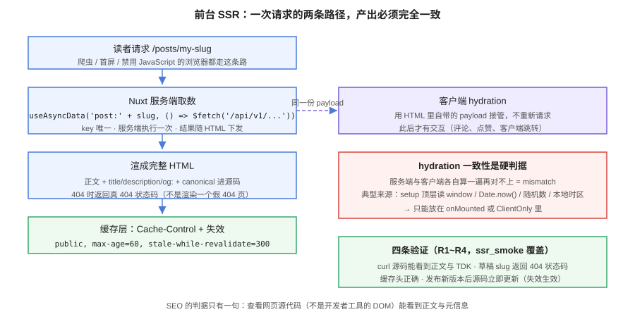

# 前台 SSR：服务端取数、hydration 一致与 SEO 元信息

::: info 本日为文档产出
沿用「只沉淀文档」口径。本页记录**第 108 天**的前台实现：Nuxt 服务端取数与 hydration 一致性、SEO 元信息由服务端渲进 HTML、SSR 缓存头与失效时序、搜索页的服务端渲染与 400 转友好提示。代码与配置在你自己的工程里落地后验证。
:::

博客是 SEO 密集型业务（第 91 天立项时的第一条选型理由）。这一页把「前台能用」升级成「前台**可被搜索引擎正确收录**」：判据从「页面能打开」变成「**查看网页源代码能看到正文与元信息**」。



## 做了什么

### 1. 服务端取数：`useAsyncData` 的四条纪律

前台所有首屏数据走服务端，判据是「HTML 里已经带着内容」。`useAsyncData` 用对四条纪律：

| 纪律 | 写法 | 违反的后果 |
| --- | --- | --- |
| key 全局唯一且稳定 | `useAsyncData('post:' + slug, ...)` | key 冲突会串数据；key 不稳定会让 payload 无法对上 |
| 服务端执行、客户端不重复请求 | 默认行为，**不要**传 `server: false` | 关掉就退化成 CSR，SEO 直接失效 |
| 结果进 payload | 默认行为 | 客户端 hydration 时会再发一次请求，首屏闪烁 |
| 错误用 `createError` 抛真状态码 | `throw createError({ statusCode: 404 })` | 渲染一个「未找到」组件但返回 200 = **软 404**，搜索引擎照样收录 |

::: danger 软 404 是这一页最贵的错误
读者端可见性（第 102 天）的后端判据是「非 PUBLISHED 一律 404」，但那是 **API 层**的 404。前台如果把它捕住、渲染一个漂亮的「文章不存在」组件并返回 **200**，搜索引擎会把这个 URL 当正常页面收录——第 102 天做的存在性不泄漏就白做了。**前台必须把 404 透传为 HTTP 404**，这是 `ssr_smoke` 的 R3 断言。
:::

### 2. hydration 一致性：三条红线

服务端和客户端各自渲染一遍，结果必须逐字节一致，否则浏览器控制台报 mismatch、内容闪一下再重画：

```text
红线一：setup 顶层不碰浏览器对象
  window / document / localStorage —— 服务端没有。
  需要它们（主题偏好、滚动位置）只能放 onMounted 或 <ClientOnly>。

红线二：不用「每次都变」的值参与渲染
  Date.now()、Math.random()、本地时区格式化 —— 两端各算一遍必然不同。
  时间统一在服务端格式化成字符串再下发；随机内容放 ClientOnly。

红线三：列表渲染的 key 与顺序稳定
  服务端与客户端拿到同一份数据（payload），key 一致才不会整段重画。
```

### 3. SEO 元信息：`useSeoMeta` 一处写全

```typescript
// your-project/web/pages/posts/[slug].vue（节选，服务端渲染阶段执行）
const { data: post } = await useAsyncData('post:' + slug, () =>
  $fetch(`/api/v1/posts/${slug}`)
)
if (!post.value) throw createError({ statusCode: 404, statusMessage: 'Post Not Found' })

useSeoMeta({
  title: post.value.title,
  description: post.value.summary,          // 无摘要时取正文前 80 字（服务端纯文本）
  ogTitle: post.value.title,
  ogDescription: post.value.summary,
  ogType: 'article',
})
useHead({
  link: [{ rel: 'canonical', href: `${SITE_URL}/posts/${post.value.slug}` }],
})
```

| 页面 | title | description | canonical |
| --- | --- | --- | --- |
| 文章详情 | 文章标题 | 摘要（服务端渲染时已有，不必前端截） | `/posts/{slug}` |
| 列表页 | 分类名 / 标签名 + 站名 | 分类描述 | `/categories/{slug}` 等 |
| 搜索页 | 「{q} 的搜索结果 + 站名」 | **不写 description、不加 canonical**（结果页不该被收录） | 不设 |

::: info 搜索页为什么不给 canonical
搜索结果页是同一 URL 对应无限多内容的状态（`?q=` 任意值），收录它只会稀释站内权重并给爬虫一个廉价入口。做法：`robots` 元标签 `noindex` + 不设 canonical。搜索页本身的服务端渲染仍要做——空结果与 400 都要渲染成**带状态码的正确响应**（见第 5 点）。
:::

### 4. SSR 缓存头与失效：接上第 102 天的时序

| 内容 | Cache-Control | 理由 |
| --- | --- | --- |
| 文章详情 HTML | `public, max-age=60, stale-while-revalidate=300` | 允许 1 分钟陈旧 + 5 分钟后台刷新；博客内容低频变更 |
| 列表 / 首页 HTML | `public, max-age=30, stale-while-revalidate=60` | 变更感知更敏感 |
| `/_payload.json` 与静态资源 | 带 content hash，`max-age=31536000, immutable` | 指纹不变即永久缓存 |
| 搜索结果 | `no-store` | 每个查询串都是不同资源，缓存无意义 |

**失效口径与第 102 天一致**：发布 / 下线动作在**提交成功后**主动失效对应详情与列表（后端缓存键里带 `updated_at` 版本，前台通过响应头的版本号判断），TTL 只做兜底。R9 断言验证「发布新版本后，下一次请求源码立即是新版」。

### 5. 搜索页的服务端渲染：把 400 变成友好提示

第 107 天的 Q4 断言规定「空查询 / 单字查询返回 400」。前台在**服务端**就接住它：

```text
服务端渲染搜索页时：
  - q 缺失或长度 < 2 → 不发请求，直接渲染「至少输入 2 个字」提示（HTTP 200）
  - q 合法 → 服务端调用 SearchService，渲染结果列表
  - 上游 500 → 渲染「搜索暂时不可用」，HTTP 返回 200 + 页面内错误态
    （搜索是站内功能，出错不该伪装成站点故障；但**不得**把 500 裸抛成 SSR 错误页）
```

判据（R8）：`curl '.../search?q='` 返回的 HTML 里有「至少输入 2 个字」且状态码 200——**服务端渲染的页面里用户就已经看到提示**，而不是等客户端 JS 起来再提示。

### 6. 断言清单与门禁

**T15~T16 上移 `mvn test`**（纯逻辑、不起服务）：

| 编号 | 断言 | 归属 |
| --- | --- | --- |
| T15 | 详情页摘要的取值纯函数：有 `summary` 用 `summary`，否则取正文前 80 字（纯文本、去 markdown 记号） | `SummaryTest` |
| T16 | 缓存头计算纯函数：按内容类型返回正确的 `Cache-Control` 串 | `CacheHeaderTest` |

**R1~R10 留在 `ssr_smoke.py`**（要起前台服务、要 curl 源码）：

| 编号 | 断言 |
| --- | --- |
| R1 | `GET /` 源码包含已发布文章标题（首屏 SSR 生效） |
| R2 | `GET /posts/{slug}` 源码包含正文片段、`<title>`、`og:title`、`canonical` |
| R3 | `GET /posts/{草稿slug}` 返回 **404 状态码**（不是 200 + 假 404 页） |
| R4 | 详情响应头 `Cache-Control` 为 `public, max-age=60` 前缀 |
| R5 | `search?q=` 源码包含「至少输入 2 个字」且状态 200 |
| R6 | `search?q=全文搜索` 源码包含命中标题（服务端渲染结果，非空壳） |
| R7 | 禁用 JavaScript 语义：源码中正文为纯文本可见（不依赖 hydration） |
| R8 | 搜索页响应含 `noindex` 且不含 canonical |
| R9 | 发布新版本后再次请求，源码立即更新（缓存失效生效，TTL 兜底） |
| R10 | 构建产物检查：`nuxt build` 产物里详情路由为 SSR 路由（非 `ssr: false`） |

门禁全集从九道扩到**十道**；`assertion_audit.py` 前缀核查扩展到 `T1~T16` / `S1~S6` / `Q1~Q9` / `R1~R10` / `C1~C10`。

**如何验证**：

```shell
# 前提：后台已按第 105~107 天起好（API 在 18080），前台 Nuxt 工程已按本页落地
cd your-project/web
npx nuxt build                    # 期望：构建成功，产物含 SSR 服务端入口
node .output/server/index.mjs &   # 期望：监听 3000（或你配置的端口）

python ssr_smoke.py --base http://127.0.0.1:3000 --api http://127.0.0.1:18080
# 期望 steps = 10  passed = 10
python ssr_smoke.py --selftest    # 期望 selftest: 10/10（断言可证伪）
python assertion_audit.py         # 期望 PASS：每条判据只有一个归属

# 手工抽查（SEO 的最终判据：看源码，不看开发者工具的 DOM）
curl -s http://127.0.0.1:3000/posts/hello-world | grep -o '<title>[^<]*</title>'
#   期望：输出文章标题（若为空壳站点名，说明取数没走服务端）
curl -s -o /dev/null -w '%{http_code}\n' http://127.0.0.1:3000/posts/draft-slug
#   期望：404（若为 200，说明前台把后端 404 吞成了软 404 —— R3）
curl -sI http://127.0.0.1:3000/posts/hello-world | grep -i cache-control
#   期望：public, max-age=60, stale-while-revalidate=300
```

## 问题与决策

| 问题 | 决策 |
| --- | --- |
| 详情页要不要 SSG（构建时预渲染）？ | 不做。文章随时发布/下线，ISR/预渲染的失效复杂度大于收益；SSR + 60 秒缓存头已满足 TTFB 与新鲜度的平衡 |
| 软 404 谁负责？ | 前台。后端 404 是对的，前台把它吞成 200 就错了——所以 R3 断言打在**前台的 HTTP 状态码**上 |
| 搜索出错页返回什么？ | 200 + 页内错误态。搜索是站内增强功能，5xx 会让爬虫把整站降权；但必须带 `noindex` |
| hydration mismatch 怎么发现？ | 构建期 + 运行期双查：`nuxt build` 的警告不忽略；`ssr_smoke` 的 R7 验证「禁 JS 语义」兜底 |
| 缓存失效放前台还是后端？ | 版本号在后端（`updated_at` 进缓存键），前台只读响应头——与第 102 天「提交后失效 + TTL 兜底」是同一条原则，不另起炉灶 |
| TDK 里 description 谁截？ | 服务端已有纯文本（第 101 天写时渲染的产物），前台只取不加工——两端各截一遍必然不一致 |

## 下一步（第 109 天）

第 3 周（105-111 天）进入收尾：**联调与测试收口**——① 十道门禁在本机全绿并记录实测输出；② 评论 / 搜索 / SSR 三条链路的跨链路回归（发布文章 → 出现在列表 → 被搜到 → 可评论 → SSR 源码同步，一条龙用例）；③ 第 1 周遗留的 Docker 验证 DDL 补跑（进入部署周前的最后窗口）。里程碑对照：第 3 周 4/4。

## 相关章节

- [全文搜索：MySQL ngram 先行](../Search/index.md)：R5/R6/R8 承接其 Q4 与 Q7 判据
- [可见性收敛](../Visibility/index.md)：R3 的 404 一致性口径来源
- [Markdown 渲染能力补齐](../Rendering/index.md)：description 的纯文本来源（写时渲染）
- [测试分层收口](../TestLayers/index.md)：T15/T16 上移 `mvn test` 的分层判据
- [核心业务流 · 端到端走查](../CoreFlow/EndToEnd/index.md)：SSR 在五段时序中的位置——「身份片段不进 SSR 输出」是走查重点盯的第三个接缝，一条龙 CF3 把「源码含正文与 TDK」固化为链路断言
