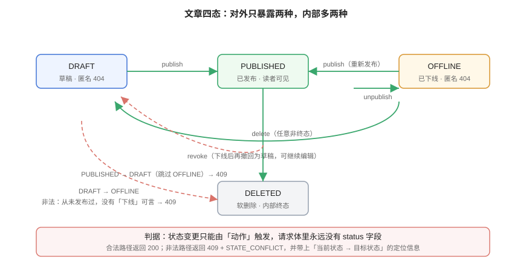

# 文章下线动作：四态状态机与第二道写链路门禁

本页是「全栈博客平台」第 100 天的构建步骤（周期 4 第 2 周 · 核心编码）。

::: warning 本页命令里的路径指「你自己的工程」
本仓是**文档库**，不存放代码。`service/`、`api/` 等路径指的是**你按对应章节搭起来的工程目录**，`python xxx.py` 指的是**你按本页实现出来的脚本**。本页的验收清单是**判据**，不是实测输出。
:::

## 一、当日做了什么

第 98 天落地了「写入链路」：`POST / PUT / DELETE / POST {id}/publish`，状态机只有 `DRAFT → PUBLISHED` 一条边，且**状态只能由动作改变**（入参 `PostUpsert` 刻意不含 `status`）。

本日把这条边扩成一个**闭合的四态状态机**，补齐「发布出去之后又想撤下来」这条最常用的路径——这是内容系统里仅次于「写」的高频操作，而它在第 98 天的设计里**完全没有落点**。



### 1.1 四态与两条正交的维度

| 状态 | 对外可见性 | 谁能改 | 进入方式 |
| --- | --- | --- | --- |
| `DRAFT` | 匿名 404 | 作者 | 创建时默认；`revoke` 撤回 |
| `PUBLISHED` | **读者可见** | 作者 | `publish` |
| `OFFLINE` | 匿名 404 | 作者 | `unpublish` |
| `DELETED` | 匿名 404（内部终态） | 作者 | `delete`（任意非终态） |

::: tip 关键抽象：把「可见性」与「生命周期」分成两个维度
最容易写错的做法是把状态当成一条直线（草稿 → 发布 → 下线 → 删除）。但 `DRAFT` 与 `OFFLINE` 的**对外表现完全相同**（都是匿名 404），差别只在**它处于生命周期的哪一段**：

- `DRAFT`：**从未发布过**，所以「下线」这个动作对它是无意义的；
- `OFFLINE`：**曾经发布过**，所以它可以再次 `publish`（回到读者可见），也可以 `revoke`（回到可编辑的草稿）。

把这一点想清楚，下面所有「哪些迁移非法」的判断就都只是它的推论。
:::

### 1.2 合法迁移与 409 判据

| 动作 | 合法起点 | 终点 | 非法起点 |
| --- | --- | --- | --- |
| `publish` | `DRAFT` / `OFFLINE` | `PUBLISHED` | `PUBLISHED`（重复发布 → 409）、`DELETED` |
| `unpublish` | `PUBLISHED` | `OFFLINE` | `DRAFT`（从未发布 → 409）、`OFFLINE`（重复下线 → 409） |
| `revoke` | `OFFLINE` | `DRAFT` | `PUBLISHED`（必须经 `unpublish` → 409） |
| `delete` | `DRAFT` / `PUBLISHED` / `OFFLINE` | `DELETED` | `DELETED`（重复删除 → 409） |

两条设计决策需要写进契约的 `description`：

1. **`PUBLISHED → DRAFT` 不直接开放**。必须先 `unpublish` 再 `revoke` 是**两步**。理由不是"规范"，而是：直接撤回会让「这篇文章曾经对外可见过」这段事实消失，而它在下线审计里是需要的。两步操作让这段时间线可追溯。
2. **`delete` 对任意非终态开放，且会清空 `publishedAt`**（与第 98 天一致）。软删除的语义是「有人绕过状态判断也放不出来」。

### 1.3 时间戳字段的取舍

第 98 天只有 `publishedAt`。本日新增一个语义：

| 字段 | 何时写 | 何时清 |
| --- | --- | --- |
| `publishedAt` | `publish` 时**刷新**为当前时刻 | 不下线时清（保留历史），`delete` 时清 |
| `offlineAt` | `unpublish` 时写入 | `publish`（重新发布）时清空 |

设计意图：**重新发布时刷新 `publishedAt`**，因为读者侧的排序与「最近更新」语义依赖它；而 `OFFLINE` 期间保留 `publishedAt` 让后台能显示「曾于 X 时间发布」。

::: danger 一个容易写反的地方
`offlineAt` 必须在 `publish` 时被**清空**，否则重新发布的文章会带着一个「下线时刻」，后台列表的排序与筛选都会出错——而且**接口全部返回 200，看不出来**。这类「字段值不对但接口不报错」的问题，只能靠门禁里的字段断言兜住（见第 3 节第 21 步）。
:::

## 二、契约补齐

`api/openapi.json` 新增两个路径与两个响应分支。

```yaml
# 管理端：下线与撤回（与已有的 publish / delete 并列）
/api/v1/admin/posts/{id}/unpublish:
  post:
    operationId: unpublishPost
    tags: [admin-posts]
    security:
      - bearerAuth: [EDITOR]
    parameters:
      - name: id
        in: path
        required: true
        schema: { type: integer, minimum: 1 }
    responses:
      '200':
        description: 已下线
        content:
          application/json:
            schema: { $ref: '#/components/schemas/PostView' }
      '401': { $ref: '#/components/responses/Unauthorized' }
      '403': { $ref: '#/components/responses/Forbidden' }
      '404': { $ref: '#/components/responses/NotFound' }
      '409':
        description: 状态冲突（如当前是 DRAFT，从未发布过）
        content:
          application/json:
            schema: { $ref: '#/components/schemas/Problem' }
```

`revoke` 同构，不再重复列出。

::: warning `OFFLINE` 不进对外契约的枚举
对外可见的状态只有 `draft` / `published` 两个值。`OFFLINE` 与 `DELETED` 是**内部终态/中间态**，一律表现为读者侧的 404。

判断依据：一旦把内部状态写进对外枚举，客户端就会开始「按状态分支」，此后**任何内部状态的增减都会变成一次破坏性变更**。契约里应当明确写：

> 读者端接口永远只返回 `draft` / `published`；未发布内容（含草稿、已下线、已删除）一律 404，不区分原因——区分等于泄露存在性。
:::

## 三、第二道写链路门禁：`lifecycle_smoke.py`

第 98 天的 `admin_smoke.py` 覆盖的是「写 → 渲染 → 读」主链路（37 步，且已回归为**有状态写链路**）。本日新增 `lifecycle_smoke.py` 专测**状态迁移**，与既有三道门禁形成分工：

| 门禁 | 管什么 | 用例数 | 是否有状态 |
| --- | --- | --- | --- |
| `skeleton_check.py` | **结构**（模块、依赖方向、配置、迁移命名） | 27 断言 | 否 |
| `api_smoke.py` | **只读行为**（列表、详情、过滤、健康检查 + 错误路径） | 9 用例 | 否 |
| `admin_smoke.py` | **写链路**（创建 → 更新 → 发布 → 软删） | 37 步 | 是 |
| **`lifecycle_smoke.py`（本日新增）** | **状态迁移**（四态的合法/非法路径 + 时间戳语义） | 24 步 | 是 |

### 3.1 24 步的顺序设计

状态机测试的关键是**每一步都有明确的预期状态**，且**非法路径必须在正确的起点上尝试**（在 `DRAFT` 上测 `unpublish` 才是有效的 409 用例，在 `PUBLISHED` 上测只会得到 409 但原因不同——**假通过**）。

```text
① 基线：抓取列表 total 与某篇已发布文章的 slug
② 创建草稿 A  → 201，status=draft，publishedAt 为空
③ A: unpublish → 409（DRAFT 从未发布 → 状态冲突）
④ A: revoke    → 409（DRAFT 没有可撤回的下线状态）
⑤ A: publish   → 200，status=published，publishedAt 非空、offlineAt 为空
⑥ A: publish   → 409（重复发布，不是幂等 200）
⑦ 读者端按 slug 查询 A → 200（可见）
⑧ A: unpublish → 200，status=offline，offlineAt 非空
⑨ 读者端按 slug 查询 A → 404（下线后不可见）
⑩ A: unpublish → 409（重复下线）
⑪ A: revoke    → 200，status=draft
⑫ A: revoke    → 409（已是草稿）
⑬ A: publish   → 200（DRAFT → PUBLISHED 重走一遍）
⑭ A: unpublish → 200
⑮ A: publish   → 200，offlineAt 被清空（关键断言）
⑯ 读者端查询 A → 200（重新发布后重新可见）
⑰ A: delete    → 204
⑱ 读者端查询 A → 404
⑲ A: publish   → 409（DELETED 是终态）
⑳ A: delete    → 409（重复删除）
㉑ 后台端查询 A → 404（软删除对外一律 404）
㉒ 新建草稿 B 并直接 delete → 204（草稿也能删）
㉓ 列表 total 相对基线 +2（A、B 两条已删除记录不计入读者端，后台端计入）
㉔ 收尾：确认无残留可读的测试文章（按 RUN_TAG 前缀自查）
```

::: tip 第 ⑮ 步是这一版门禁的核心
「重新发布时 `offlineAt` 被清空」是**唯一一处「接口全绿但数据悄悄错」**的断言。它不写，接口照样 200，后台列表排序却会出错。**门禁的价值恰恰在于把这类肉眼不可见的错误变成可断言的。**

同类断言还有第 ⑤ 步的「`publishedAt` 非空且 `offlineAt` 为空」——第一次发布时 `offlineAt` 必须为空，否则说明字段初始化漏了。
:::

### 3.2 门禁自身的三个设计要点

与 `admin_smoke.py` 同源（第 98 天踩过的坑），这里重申因为它们会**同样地**咬一次：

| 要点 | 做法 | 不这么做的后果 |
| --- | --- | --- |
| **断言相对基线** | 开跑先抓 `total`，之后断言 `基线 + delta` | 第二遍必然误报（写死了绝对值） |
| **测试数据带随机位** | `slug = f"{RUN_TAG}-{uuid.uuid4().hex[:4]}"` | 同一秒内连跑两遍撞唯一键，以 409 伪装成业务缺陷，级联失败十几步 |
| **`--selftest` 用空上下文做变异测试** | 每步断言在空响应下必须报错 | 会出现「永远为真」的断言（第 98 天就抓到过一条「读上下文而非读响应」的无效断言） |

## 四、如何验证

```shell
cd your-project/service

# ① 先证断言能被证伪（这一步失败，后面的全绿都不算数）
python lifecycle_smoke.py --selftest        # 期望：24/24（每步在空响应下都至少报错一次）

# ② 结构门禁（不需要数据库与运行中的服务）
python skeleton_check.py                    # 期望：checks = 27  failed = 0

# ③ 停服务后再 install（运行中的 JVM 会锁住本地仓库里的 jar）
mvn -o install -DskipTests                  # 期望：BUILD SUCCESS，四模块全绿

# ④ 起服务（profile=local：内存仓储）
cd blog-application && SERVER_PORT=18080 mvn -o spring-boot:run
# 期望：Started BlogApplication，Tomcat 监听 18080

# ⑤ 三道既有门禁 + 本日新增门禁（另开终端）
cd .. && python api_smoke.py       --base http://127.0.0.1:18080
# 期望：cases = 9   passed = 9
python admin_smoke.py              --base http://127.0.0.1:18080
# 期望：steps = 37  passed = 37
python lifecycle_smoke.py          --base http://127.0.0.1:18080
# 期望：steps = 24  passed = 24

# ⑥ 连跑第二遍（不重启服务），仍应全绿 —— 证明断言是相对基线的
python lifecycle_smoke.py          --base http://127.0.0.1:18080
# 期望：steps = 24  passed = 24

# ⑦ 契约仍自洽
python api/contract_check.py
# 期望：契约校验通过；本次新增的 2 条路径与 409 分支齐全
```

::: danger 三条容易踩的坑
1. **改了 `blog-data` / `blog-web` 却没重新 `mvn install`**：`spring-boot:run` 在子模块目录下**只编译该模块**，其余从本地仓库取——跑的是旧 jar，于是「修好的改动不生效」。纪律：**改过下游模块，先回 `service/` 跑一次 `mvn install`**。
2. **先起服务再 install**：`clean install` 报 `...jar.tmp -> ...jar` 失败，真因是**运行中的 JVM 锁住了本地仓库的 jar**。顺序必须是「停服务 → install → 起服务」。
3. **门禁连跑两遍第二遍开始报错**：几乎总是测试数据撞名或断言写死了绝对值，**不是接口的问题**。这类假失败最耗时间，要在数据生成源头消掉。
:::

## 五、问题与决策

| 问题 | 决策 |
| --- | --- |
| `PUBLISHED → DRAFT` 一步到位还是两步？ | **两步**（先 `unpublish` 再 `revoke`）。一步会抹掉「曾经对外可见」这段事实，而后台审计需要它 |
| `OFFLINE` 要不要进对外契约的枚举？ | **不进**。对外只有 `draft` / `published`；内部状态进枚举会让「增减状态」变成破坏性变更 |
| 重新发布时 `publishedAt` 刷新还是保留首次值？ | **刷新**。读者侧排序与「最近更新」语义依赖它；首次发布时刻由 `createdAt` 与历史记录承担 |
| 重复发布返回 409 还是幂等 200？ | **409**（沿用第 98 天结论）。假幂等会掩盖调用方手里的过期状态 |
| 状态迁移门禁要不要并进 `admin_smoke.py`？ | **不并**。`admin_smoke` 是写链路冒烟（37 步），生命周期是迁移矩阵（24 步）；合成一个文件用开关区分，等于把边界交给人的记忆——与第 98 天「只读脚本与写脚本结构性分开」同一条理由 |
| 为什么非法迁移要在「正确的起点」上测？ | 在 `PUBLISHED` 上测 `unpublish` 会得到 200，测不出 409；只有把用例摆到 `DRAFT` 上才是有效的 409 用例。**起点错了，409 用例会假通过** |

## 六、下一步（第 101 天）

1. **文章列表的可见性收敛**：读者端列表目前只查 `Published`，需确认下线后的文章不会因缓存残留而继续出现（缓存失效与状态迁移的顺序）。
2. **Markdown 渲染能力补齐**（第 99 天登记的待办）：代码块高亮、目录生成、图片本地化——它们是「已发布内容更新时必须重算 `contentHtml`」这条纪律的延伸。
3. **把 `lifecycle_smoke.py` 的状态迁移步骤上移成 MockMvc 集成测试**，让状态机断言进 `mvn test`（与第 99 天登记的 `auth_smoke` 上移合并做）。

## 七、相关页面

- [文章写入链路](../WritePath/index.md)：第 98 天落地的管理端 CRUD、发布状态机与第三道门禁
- [管理端认证与角色](../AuthRoles/index.md)：本日新增的两个动作沿用 `EDITOR` 角色与「默认拒绝」的鉴权规则
- [工程骨架与验收门禁](../Skeleton/index.md)：四模块结构与两道门禁的设计
- [接口契约](../Contract/index.md)：契约文件的位置与校验方式
- [进展记录](../Progress/index.md)：每天的做了什么 / 如何验证 / 下一步
- 方法论参考：[API 设计与治理 · 版本策略](../../../../docs/Tools/APIDesign/Versioning/index.md)——资源状态迁移与接口下线共享同一套「合法路径 + 非法路径 + 宽限」的思考方式
