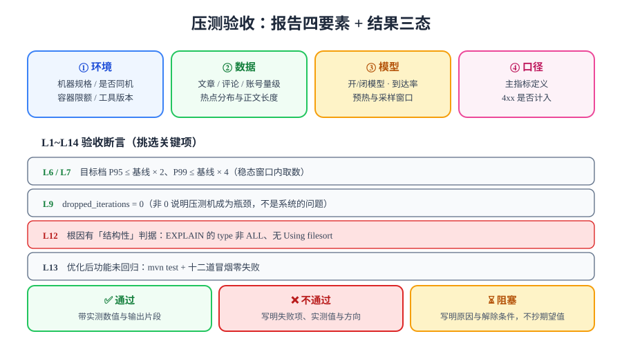

# 压测验收与闭环

> 本章的收口页。压测跑完不等于事情做完——能不能算「通过」、结论怎么留痕、失败了怎么记、以及它和上线验收清单是什么关系，都在这一页说清。



## 一句话定位

验收页做三件事：给出一份**必须填满的压测报告模板**、一张**可逐条执行的断言表 L1~L14**、以及一条**不把期望值写成实测值**的记录纪律——后者是本项目从第 111 天起一直沿用的规矩。

## 一、压测报告模板

一份合格的压测报告由**四要素 + 三段结论**组成。四要素缺任何一个，结论都不成立：

| 要素 | 必须写什么 | 为什么缺了就不成立 |
| --- | --- | --- |
| **环境** | 机器规格、是否同机压测、容器资源限额、工具与版本 | 换台机器数字就变，不写环境的数字无法比较 |
| **数据** | 文章 / 评论 / 账号数量、热点分布、正文长度 | 空库与万级库的结论可以差一个数量级 |
| **模型** | 开模型还是闭模型、并发/到达率、时长、预热与采样窗口 | 闭模型的 P99 会因协调遗漏系统性偏乐观 |
| **口径** | 三项主指标的定义、4xx 是否计入、在哪一时段取数 | 「P95」这个词本身不足以定义 |

三段结论：

| 段 | 内容 | 形式 |
| --- | --- | --- |
| **结果** | 基线档 / 目标档 / 破坏档的三项主指标 | 表格，含实测值与目标值两列 |
| **瓶颈与措施** | 每条：症状 → 根因 → 改动 → 复压结果 | 表格，与[优化落地](../Optimization/index.md)同格式 |
| **边界与遗留** | 系统拐点在哪、哪些场景没测、什么条件下需要重测 | 列表，**必须写明未测项** |

```markdown
<!-- 报告骨架（写在你自己工程的 perf/REPORT.md 里） -->
# 压测报告 — v<版本> — <日期>
## 环境
- 机器：8 核 / 16 GB；**同机压测**（压测进程与目标同宿主）
- 服务形态：docker compose，五服务；blog-server 限额 1g
- 工具：k6 <version>（AGPL-3.0）；shiki 无关项略
## 数据
- posts=10000（热文 200）、comments=5000、users=200
## 模型
- 开模型 constant-arrival-rate；预热 60s / 采样 180s / 丢弃前 60s
## 口径
- P95/P99 取服务端处理耗时；错误率 = 5xx ÷ 总请求（4xx 不计）
## 结果 / 瓶颈与措施 / 边界与遗留
```

## 二、L1~L14 验收断言

| 编号 | 断言 | 命令要点 | 期望 |
| --- | --- | --- | --- |
| **L1** | 五服务全绿且带健康检查 | `docker compose ps` | 全 `Up`，mysql/redis/blog-server `(healthy)` |
| **L2** | 联调复核全通过 | I1~I8 | 全通过 |
| **L3** | 数据量达标 | `SELECT COUNT(*)` 三张表 | posts ≥ 10000、comments ≥ 5000、users ≥ 200 |
| **L4** | 旁路变量已排除 | DevTools 两项勾选 + 脚本固定 `no-cache` 头 | 勾选已确认；脚本内置 |
| **L5** | 基线档已跑并留档 | `results/baseline.json` | 文件存在且含 P95 值 |
| **L6** | 目标档 P95 达标 | `summary-export` 中 `p(95)` | ≤ 基线 × 2 |
| **L7** | 目标档 P99 达标 | `summary-export` 中 `p(99)` | ≤ 基线 × 4 |
| **L8** | 目标档错误率达标 | `http_req_failed` | < 1% |
| **L9** | 压测机未成为瓶颈 | 摘要中的 `dropped_iterations` | = 0，或已记录并调整并发 |
| **L10** | 缓存命中率达标 | 面板④ / `cache_gets_total` | ≥ 90%（优化后） |
| **L11** | 连接池稳态无等待 | `hikaricp_connections_pending` | 稳态 = 0 |
| **L12** | 根因有**结构性**判据 | `EXPLAIN` 输出 | `type` 非 `ALL`，无 `Using filesort` |
| **L13** | 优化后功能未回归 | `mvn test` + 十二道冒烟 | 零失败 |
| **L14** | 报告四要素齐全 | 文档自查 | 四个小节无「待补」 |

::: tip L12 是这套断言里最重要的设计
只看 P95 的验收表，会在下一次索引被误删时**完全失效**——P95 达标可能是因为缓存恰好命中、可能是因为数据量刚好小。把 `EXPLAIN` 的形态写进断言，意味着**原因本身也是被断言的对象**。这与[判据收口](../../Consolidation/index.md)的判据唯一性原则同源：能被证伪的才是判据。
:::

## 三、结果三态：通过 / 不通过 / 阻塞

验收不是二元的。本项目的每一轮压测都按三态登记：

| 状态 | 判定依据 | 记录要求 |
| --- | --- | --- |
| **✅ 通过** | L6~L13 全部满足，且是在**稳态窗口**内的实测值 | 带实测数值与命令输出片段 |
| **❌ 不通过** | 存在明确的实测失败值 | 写明失败项、实测值、失败方向（延迟/吞吐/错误率） |
| **⏳ 阻塞** | 前置条件不满足，无法执行 | **必须写明原因与解除条件**，不得写期望值 |

::: danger 实测列纪律（本项目第 111 天起沿用）
本机不具备 Docker 与可运行的工程仓库，因此本日的 L1~L13 **一律记 ⏳ 阻塞**，并逐条写明原因；**绝不把期望值抄进实测列**。

这条纪律在[回归报告](../../CoreFlow/Regression/index.md)、[第 4 周收口](../../Week4Close/index.md)、[交付文档包](../../Delivery/index.md)三次被写死过。理由很简单：**「期望 240ms」和「实测 240ms」看起来一样，含义完全相反**——前者是设计目标，后者是证据。混在一起，报告就失去了被反驳的能力。
:::

本日登记：

| 断言 | 状态 | 原因 / 解除条件 |
| --- | --- | --- |
| L1~L5 | ⏳ 阻塞 | 需要 Docker 环境 + 按文档搭好的工程；解除条件 = 一台有 Docker 的机器 |
| L6~L12 | ⏳ 阻塞 | 依赖 L1~L5；解除条件同上（脚本已就绪，缺的是运行环境） |
| L13 | ⏳ 阻塞 | 依赖已搭建的工程；解除条件同上 |
| L14（报告骨架） | ✅ 本日 | 模板与四要素检查表已在[观察]本节定稿（文档产出，不依赖环境） |

## 四、与上线验收清单的衔接

[上线验收清单九项](../../BackupDrill/index.md)（第 114 天定稿）判定的是「**能不能上线**」；本章判定的是「**扛到什么程度**」。两者不重合，衔接点只有一处：

| 上线清单第 9 项「从零复现」 | 本章的补充 |
| --- | --- |
| 按总览文档在新目录重建成功 | 重建后的形态**必须能跑通压测脚本的 smoke 档**（1 VU × 30s，checks 100%） |

也就是说：重建成功 ≠ 形态正确。压测的 smoke 档是「重建得对不对」的**最便宜的一次验证**——它同时检验了服务启动、反向代理规则、数据库连接与两条主要链路。

::: warning 不要把压测结论写进上线清单
上线清单的九项必须是**与机器无关的、可复现的**判据。压测结论依赖环境与数据量，把它塞进上线清单会让清单失去「在任何机器上都成立」这个性质。正确做法是：清单答「能不能上线」，本章答「上线的形态能扛多少」。
:::

## 五、第 4 周收尾状态与第 120 天交接

| 里程碑 | 验收判据 | 状态 |
| --- | --- | --- |
| 一键部署 | Compose 一键起、五服务健康 | ✅ 形态就绪（[一键部署](../../Deployment/index.md)） |
| 监控接入 | 指标可拉、告警链路实测触达 | ✅ 形态就绪（[监控接入](../../Monitoring/index.md)） |
| 备份恢复 | R1~R6 对账 | ✅ 判据就绪（[备份恢复演练](../../BackupDrill/index.md)） |
| 文档沉淀 | 交付物 11 项、Runbook 四条 | ✅ 本周期已落地（[交付文档包](../../Delivery/index.md)） |
| **联调与压测** | I1~I8 + L1~L14 | ✅ **判据与脚本就绪**（本章）；实测 ⏳ 待环境 |
| 上线验收九项实测回填 | 九项逐条回填 | ⏳ 随 Docker 环境兑现（[第 4 周收口](../../Week4Close/index.md)） |

**交接给第 120 天（部署与验收日）**：

1. 本章的 I1~I8 与 L1~L14 是第 120 天上线验收清单的**输入**，不是替代；
2. 本章新增的待办只有一条：`sw_ttfb` 与 k6 脚本随 Docker 环境跑一次，回填 L5~L12 实测列；
3. 第 118 天遗留的 F2/F3/F8/F9、第 117 天遗留的 D3/D4/D6/D7 与本章共享**同一个前置条件**（Docker 环境），应合并兑现，不要分三次开环境。

## 六、当日做了什么 / 如何验证 / 下一步

- **做了什么**：
  1. 新建章节 6 页（[联调复核](../Integration/index.md) / [压测前置](../Preparation/index.md) / [压测脚本](../Scripting/index.md) / [瓶颈定位](../Bottleneck/index.md) / [优化落地](../Optimization/index.md) / 本页）；
  2. 定稿三段编号判据：联调 I1~I8、前置 Pr1~Pr8、验收 L1~L14；
  3. 把「压测归属第 119 天」的**书面欠账**从登记状态转为「判据 + 脚本就绪」，实测列随环境兑现；
  4. 登记第 118 天的旁路变量纪律（SW Bypass）进入压测前置清单 Pr6。
- **如何验证**：见本页 L1~L14；本机执行时 L1~L13 记 ⏳ 并附原因，L14 本日已 ✅。
- **下一步**：第 120 天「部署与验收」——把本章判据并入上线验收清单，随 Docker 环境一次性兑现第 115/117/118 天的全部实测回填。

## 七、问题与决策

| 问题 | 决策 | 理由 |
| --- | --- | --- |
| 要不要引入压测平台 | **不引入** | 单机五服务、单条链路；k6 + `--summary-export` 已覆盖全部所需。触发条件：需要在多台机器上并行注入 |
| 要不要把压测接进 CI | **只接 smoke 档** | smoke 档（1 VU × 30s）能拦「形态被改坏」，成本可接受；目标档进 CI 会因共享环境互相干扰 |
| 要不要做 soak 浸泡 | **登记不做** | 同机环境不满足长时间稳定的前提；解除条件见[压测脚本](../Scripting/index.md)场景表 |
| 压测结论要不要写进 README | **不写死数字** | 数字随环境失效；只写「怎么复现」与「判据是什么」 |

## 深入阅读

- [联调复核：I1~I8](../Integration/index.md)｜[压测前置：Pr1~Pr8](../Preparation/index.md)｜[压测脚本](../Scripting/index.md)｜[瓶颈定位](../Bottleneck/index.md)｜[优化落地](../Optimization/index.md)
- [上线验收清单九项](../../BackupDrill/index.md)｜[第 4 周收口](../../Week4Close/index.md)｜[交付文档包与运维手册](../../Delivery/index.md)
- [测试工具专题](../../../../../docs/Tools/TestingTools/index.md)｜[JMeter 性能测试](../../../../../docs/Tools/TestingTools/JMeter/index.md)
- [完整项目交付方法论](../../../../../docs/Others/ProjectDelivery/index.md)｜[交付验收](../../../../../docs/Others/ProjectDelivery/Delivery/index.md)
- k6 官方文档 · 结果输出与阈值：[grafana.com/docs/k6/latest/results-output](https://grafana.com/docs/k6/latest/results-output/)
