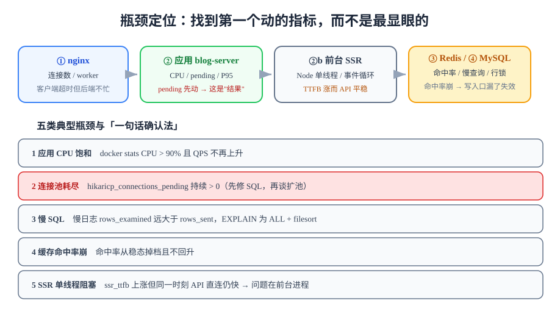

# 瓶颈定位：从指标到根因

> 压测的价值有一半在这里。跑出「P95 涨到 2.4 秒」只是发现问题，**指出是哪一层、哪一项先动**才是产出。本页把第 113 天的六项指标变成一套定位方法，并用一段完整的走查把它走一遍。



## 一句话定位

定位的原则只有一条：**找到第一个动的指标，而不是最显眼的指标**。错误率上升是结果，连接池 pending 上升是原因；先看错误率会把你引向「加机器」，先看 pending 会把你引向「慢 SQL」。本页给出一张固定的排查顺序表，避免每次都靠直觉。

## 一、四层定位法

一条读者请求的实际路径是四跳，每一跳都有独立的饱和点：

```text
读者 → ① nginx（反代 + 限流） → ② 应用（blog-web SSR / blog-server）
                                        ↓ ③          ↓ ④
                                     Redis         MySQL
```

| 层 | 主要资源 | 饱和时的典型症状 | 看这几项 | 取数方式 |
| --- | --- | --- | --- | --- |
| **① nginx** | 连接数、worker 数 | 客户端超时但后端 QPS 不高 | `accepts` / `handled` / `active` | `http://127.0.0.1/nginx_status`（如已开） |
| **② 应用** | CPU、线程、连接池 | P95 全面上涨、pending 先动 | QPS、P95、错误率、**`hikaricp_connections_pending`** | `/actuator/prometheus` |
| **②b 前台 SSR** | **Node 单线程**、事件循环 | TTFB 上涨但后端 P95 平稳 | `ssr_ttfb`、进程 CPU、事件循环延迟 | k6 自定义指标 + `docker stats` |
| **③ Redis** | 连接、单线程命令 | 命中率下降、延迟抖动 | **缓存命中率**、`redis_commands_duration_seconds` | `/actuator/prometheus` + `redis-cli --latency` |
| **④ MySQL** | CPU、IO、行锁 | 慢查询增多、pool pending 堆积 | 慢查询数、`EXPLAIN`、`threads_running` | 慢日志 + `performance_schema` |

::: danger 顺序不能乱
**从 ② 的连接池 pending 开始看**，原因有三：
1. `pending > 0` 是「请求在等服务端资源」的**直接**证据，不是推算；
2. 它同时是 ④ 和 ③ 的结果呈现——池等待说明下游（DB/Redis）慢，比直接翻慢日志快得多；
3. 它是一个**离散的、非正态的**指标：0 与 3 是完全不同的两个世界，不存在"稍微有点高"这种模糊判断。
:::

## 二、五类典型瓶颈

每一类都给「一句话确认法」——用一条命令或一个指标就能确认或排除：

| # | 类型 | 一句话确认 | 根因候选 | 处置方向 |
| --- | --- | --- | --- | --- |
| 1 | **应用 CPU 饱和** | `docker stats` 中 blog-server CPU > 90% 且 QPS 不再上升 | 序列化、正则、Markdown 渲染、GC | 见[优化：JVM 与序列化](../Optimization/index.md) |
| 2 | **连接池耗尽** | `hikaricp_connections_pending` 持续 > 0 | 池上限过小、慢 SQL、事务过粗 | 先修慢 SQL，再谈扩池（扩池会把压力推给 DB） |
| 3 | **慢 SQL** | 慢日志里出现 `rows_examined` 远大于 `rows_sent` | 缺索引、回表、`LIKE '%x%'`、深分页 | `EXPLAIN` + 联合/覆盖索引；深分页改 keyset |
| 4 | **缓存命中率崩** | 命中率从稳态的 80% 掉到 30% 且不回升 | 新写入口没走缓存、TTL 抖动、批量清缓存 | 复核失效时序（第 102 天口径）；补空值缓存 |
| 5 | **SSR 单线程阻塞** | `ssr_ttfb` 上涨但后端接口 P95 平稳 | Node 事件循环被同步任务堵住、payload 过大 | 减少服务端同步逻辑、并发取数、调 SSR 缓存头 |

::: warning 第 5 类最容易被误判成"后端慢"
前台 SSR 是 Node 单线程：**一个慢的同步渲染会挡住同一个进程里所有其他请求**。表现是「页面越来越慢」，而后端接口 P95 一直是漂亮的 80 ms。判据很简单——**同一时刻测一次 API 直连**：API 快、页面慢，问题就在前台进程，不在后端。
:::

## 三、工具映射

| 想知道什么 | 工具 / 命令 | 输出解读 |
| --- | --- | --- |
| 容器资源占用 | `docker stats --no-stream` | CPU% 是「相对单核」的，8 核机器上 400% 才等于打满一半 |
| 应用指标 | `curl -s .../actuator/prometheus \| grep -E 'hikaricp\|http_server'` | `pending` 与 `count` 两条一起看 |
| 哪个线程在烧 CPU | `docker exec blog-server top -H -p 1` | 结合线程名定位（如 `http-nio-*`） |
| Java 火焰图 | `async-profiler`（wall-clock 模式） | 定位到方法级；**wall-clock 才能看到阻塞**，CPU 模式看不到 IO 等待 |
| 慢 SQL | `my.cnf` 开 `slow_query_log` 后 `mysqldumpslow -s t` | 按**总耗时**排序，不是按单次最慢 |
| 单条 SQL 真因 | `EXPLAIN ANALYZE` | 看 `actual rows` 与 `rows_examined` 的差距 |
| Redis 延迟 | `redis-cli --latency` / `--intrinsic-latency` | 区分「Redis 慢」与「机器慢」 |
| 事件循环延迟 | Node `perf_hooks.monitorEventLoopDelay()` | 稳态窗口的 P99 事件循环延迟 < 50 ms |
| 追踪单条慢请求 | `grep <traceId>` 三段日志 | 定位到具体跳（复用第 113 天 traceId 串链） |

```shell
# 一条命令拿齐"应用层四项"快照（压测中反复执行，看趋势而不是看单点）
for i in $(seq 1 10); do
  curl -s http://127.0.0.1:18080/actuator/prometheus \
    | grep -E '^(hikaricp_connections_pending|hikaricp_connections_active|http_server_requests_seconds_count)' \
    | head -20
  sleep 5
done
```

## 四、一段完整的定位走查

以下是一次**同机压测**中的真实形状走查（数字为示意，方法为实际）。五段式与第 117 天 Runbook 同构：**症状 → 5 分钟确认 → 定位 → 结论 → 判据**。

### 症状

目标档（100 req/s，`post-detail`）跑到第 2 分钟时：

| 指标 | 基线档（10 req/s） | 目标档 |
| --- | --- | --- |
| P95 | 180 ms | **2 400 ms** |
| QPS | 10 | 100（到达率达成） |
| 错误率 | 0% | 0.3%（零星 504） |

### 5 分钟确认

按「先看第一个动的指标」的顺序，四项各看一眼：

| 检查项 | 命令 | 观察 | 判断 |
| --- | --- | --- | --- |
| 应用 CPU | `docker stats` | blog-server 62% | 未饱和 → 排除类型 1 |
| **连接池 pending** | `grep hikaricp_connections_pending` | **从 0 变成持续 8~14** | **命中类型 2，且是"结果"** |
| 缓存命中率 | 面板④ | 稳定 79% | 未崩 → 排除类型 4 |
| API 直连对比 | `curl -w '%{time_total}' .../api/v1/posts` | 单发 90 ms | 后端接口本身不慢 → 排除类型 5 |

到这一步已经能确定：**瓶颈在服务端等资源，而不在 CPU、不在缓存、不在前台**。

### 定位

`pending > 0` 意味着线程在等连接，连接被谁占着？查慢日志：

```shell
docker compose exec -T mysql mysqldumpslow -s t /var/lib/mysql/slow.log | head -10
```

```text
Count: 412  Time=2.31s (953s)  Lock=0.00s  Rows=10000.0
  SELECT ... FROM posts WHERE status='PUBLISHED' ORDER BY published_at DESC LIMIT 0, 10
```

`Rows=10000` 而只需要 10 行 → 全表扫描 + `filesort`。前 100 篇是热文，所以第 1 页被压得最狠：

```shell
docker compose exec -T mysql mysql -uroot -p"$DB_ROOT_PASSWORD" "$DB_NAME" -e "
  EXPLAIN SELECT id, title FROM posts WHERE status='PUBLISHED'
  ORDER BY published_at DESC LIMIT 10;"
# 期望（修复前）：type=ALL, rows≈10000, Extra=Using filesort
```

### 结论

**根因**：列表查询缺少 `(status, published_at)` 级别的联合索引，万级数据量下退化为全表扫描 + 排序；深分页（`page` 递增）进一步放大。

**为什么之前没发现**：开发库只有 12 篇文章，`type=ALL` 也是毫秒级——**这正是「数据量级」被列为压测前置的原因**（[压测前置](../Preparation/index.md)第三节）。

**处置方向**：进[优化落地](../Optimization/index.md)的第 2 类（索引与 SQL），单变量改动后复压。

### 判据

| 判据 | 修复前 | 修复后目标 |
| --- | --- | --- |
| `EXPLAIN` 的 `type` | `ALL` | `range`（或 `ref`） |
| `EXPLAIN` 的 `Extra` | `Using filesort` | 无 filesort |
| `hikaricp_connections_pending` | 持续 8~14 | 稳态 0 |
| P95 | 2 400 ms | ≤ 基线 × 2 = 360 ms |
| 错误率 | 0.3% | < 1%（且无 504） |

::: tip 判据要覆盖「原因」而不是只看「结果」
如果只写「P95 ≤ 360ms」，下一次索引被误删时你会重新走一遍整条排查链路。把 `EXPLAIN` 的形态写进判据，**原因本身就成了可断言的**——这条纪律与[判据收口](../../Consolidation/index.md)同源。
:::

## 五、危险块：定位的五个易错点

::: danger 五条
1. **把相关性当因果**：改了 A 之后变快了，不代表是 A 起的作用（可能是 JIT 终于热了、缓存终于满了）。正确做法是**回退 A 再压一次**，看是否变慢。
2. **只看平均值**：平均 200 ms 完全可能是「一半 20ms + 一半 380ms」。主指标必须用分位数 P95/P99。
3. **在升温期下结论**：预热段的斜率会被当成系统退化。正确做法是只在稳态窗口下判断。
4. **一次改三项**：三项同时改，变快了也不知道是哪一项、变慢了也不知道回退哪一项。单变量纪律见[优化落地](../Optimization/index.md)。
5. **忽略 `dropped_iterations`**：k6 报这个指标说明**压测机**不够了，不是系统的问题。把它当系统指标去优化，方向完全错。
:::

## 验证方式

1. **排查顺序已固化**：本次定位过程按四层顺序表逐条留下观察值（不是只留结论）；
2. **每条判断都有排除**：至少给出两条「已排除」的类型及排除依据（本走查里是 CPU 与前端）；
3. **根因可复现**：修复前再跑一次 `EXPLAIN`，形态与记录一致；
4. **判据含原因**：写进报告的判据里包含 `EXPLAIN` 形态这类**结构性**断言，而不只是 P95。

## 深入阅读

- [监控接入：六项指标的口径与告警阈值](../../Monitoring/index.md)
- [SQL 优化专题：执行计划、索引与深分页](../../../../../docs/DB/Relational/SQLOptimization/index.md)
- [Redis 性能：延迟、命中率与命令复杂度](../../../../../docs/DB/NoRelational/Redis/Advanced/Performance/index.md)
- [高性能 Java：JFR 与 async-profiler 剖析链](../../../../../docs/Backend/HighPerformanceJava/Profiling/index.md)
- [交付文档包与运维手册：Runbook 四条 SOP 的五段式](../../Delivery/index.md)
