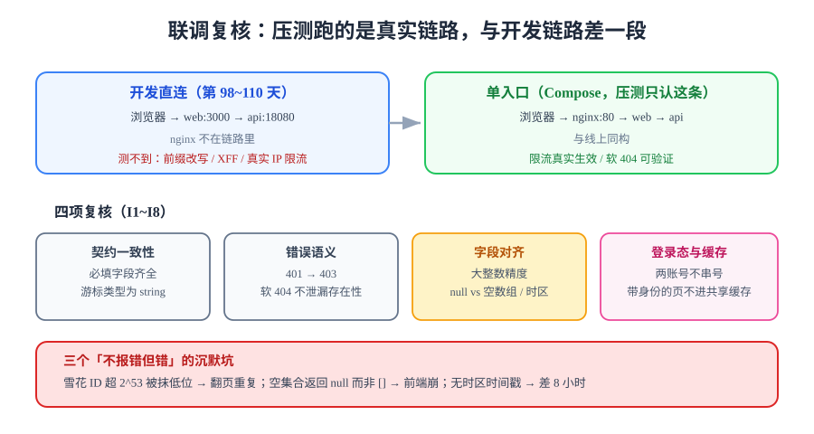

# 前后端联调复核

> 压测之前先做一次联调复核。压测跑的是**真实链路**，而真实链路与前 20 天联调用的那条链路不是同一条——差的那一段恰好是最容易出错的一段。



## 一句话定位

联调复核回答一个很具体的问题：**前端以为的响应，和后端真正发出的响应，是同一个东西吗**。它不看业务对不对（那是门禁的职责），只看两端的**约定**有没有对齐——字段名、类型、空值语义、错误码、登录态边界。

## 为什么第 108/109 天做过联调，这里还要再来一次

不是重复劳动，是**覆盖范围不同**：

| 维度 | 第 98~110 天的联调 | 本次联调复核 |
| --- | --- | --- |
| 链路 | 开发机三个直连进程（web:3000 → api:18080） | **只有 nginx 一个入口**（80 → 前台 → 后端） |
| 覆盖到 | 请求/响应本身、状态机、可见性、越权 | 上面这些 **加上**路径前缀、`X-Forwarded-For`、真实 IP 限流、软 404 的最终呈现 |
| 没覆盖到 | nginx 的 `proxy_pass` 改写、SSR 页面缓存与用户态的相互作用 | — |
| 谁在用 | 开发者手动 curl + smoke 脚本 | 真实读者的浏览器 |
| 失败表现 | 断言报红，很显眼 | **页面上看起来正常，数据悄悄错** |

::: danger 第 3 条最容易漏
第 108 天为 SSR 加过缓存头，第 109 天为登录态做过「个人化数据不进缓存」的口径。但这两条**单独看都对、合起来才出问题**：SSR 页面一旦按 URL 缓存，登录用户的头像是别人的；而这条路径只有在**单入口 + 两个账号交替请求**时才会暴露——直连进程的开发联调永远碰不到。
:::

## 两项联调环境：先分清你压的是哪一条

| 项 | 直连三进程（开发） | 单入口（Compose） |
| --- | --- | --- |
| 入口 | 前端 `http://127.0.0.1:3000`、后端 `http://127.0.0.1:18080` | 只有 `http://127.0.0.1/` |
| 路径前缀 | **与线上不同**（少了 nginx 的 `/api` 转发规则） | 与线上一致 |
| `X-Forwarded-For` | 缺失 → 限流按 `127.0.0.1` 统计，永远打不到阈值 | 由 nginx 注入 → 限流真实生效 |
| CORS | 跨端口，需要后端放开 | 同源，不涉及 |
| 软 404 | 需要手动判断 | 经 nginx 后是否仍是 404 带页面 |
| 用途 | 日常开发、跑 smoke | **压测与验收只认这一条** |

```shell
# 单入口探活：三个都通，才说明 nginx 的转发规则是对的
cd your-project/deploy && docker compose up -d
curl -s -o /dev/null -w '%{http_code}\n' http://127.0.0.1/                 # 期望 200（前台 SSR 首页）
curl -s -o /dev/null -w '%{http_code}\n' http://127.0.0.1/api/v1/posts     # 期望 200（后端列表，经 /api 前缀转发）
curl -s -o /dev/null -w '%{http_code}\n' http://127.0.0.1/api/v1/nope      # 期望 404（不能是 200，也不能是 502）
```

三条里任何一条不对，**先修 nginx，不要开始压测**——压一条错链路的性能没有意义。

## 复核一：契约一致性

[接口契约](../../Contract/index.md)（第 92 天）声明的是「后端应该长什么样」，但契约是**写的**，响应是**跑的**。两件事之间会有漂移：加了字段忘了写进 OpenAPI、改了类型没改示例、`@JsonIgnore` 让某个字段静默消失。

不引入额外工具，用 `curl + jq` 做一次机器可比对：

```shell
# 列表接口：只取"契约里声明过的必填字段"，缺一个就报出来
curl -s http://127.0.0.1/api/v1/posts?page=1\&size=5 \
  | jq -e '(.data | length > 0) and (all(.data[]; has("id") and has("title") and has("slug") and has("publishedAt")))'
# 期望：true（jq -e 下 true 退出码 0）

# 类型核对：分页游标契约声明为字符串，不能是数字
curl -s 'http://127.0.0.1/api/v1/posts?page=1&size=5' | jq -r '.nextCursor | type'
# 期望：string（若返回 number，前端拼 URL 时精度与比较语义都会变）
```

::: warning 为什么 `nextCursor` 必须是字符串
第 105 天的楼层分页用了 keyset 游标。游标在后端可能是 `bigint`，但一旦以 JSON 数字形式传出，前端 `JSON.parse` 会把它变成 IEEE-754 双精度浮点——**超过 2^53 之后低位被抹掉**，游标悄悄指到隔壁一条。这类问题不报错、不抛异常，表现是「翻页偶尔重复或跳过」。类型断言比数值断言便宜得多，所以契约里把它钉成 `string`。
:::

## 复核二：错误语义

两端的错误语义是**四类**，不是一类。混淆的代价是「该给用户看错误页的场景给了空白页」：

| 状态码 | 谁该处理 | 两端约定 | 复核命令 |
| --- | --- | --- | --- |
| **401** | 前端跳登录 | 必须在 **403 之前**（[读者账号](../../ReaderAccount/index.md)第 99 天定死） | `curl -s -o /dev/null -w '%{http_code}' -X POST .../api/v1/posts` |
| **403** | 前端提示无权限 | 已登录但角色不够 | 用读者令牌打 `/api/v1/admin/*` |
| **404** | **前台渲染友好页** | 非 PUBLISHED 一律 404，且存在性不泄漏（第 102 天） | `curl -s -o /dev/null -w '%{http_code}' .../posts/draft-slug` |
| **409** | 前端提示冲突 | 非法状态迁移（第 100 天四态机） | 对已下线文章再下线 |

```shell
# 软 404 必须"带页面"，否则读者看到的是空白
curl -s http://127.0.0.1/posts/definitely-not-exists | grep -c '<title>'
# 期望：1（前台把 404 渲染成完整页面；抓取工具与读者都拿到可读内容）

# 存在性不泄漏：草稿与不存在的 slug 必须返回同一个状态码
a=$(curl -s -o /dev/null -w '%{http_code}' http://127.0.0.1/api/v1/posts/draft-only-slug)
b=$(curl -s -o /dev/null -w '%{http_code}' http://127.0.0.1/api/v1/posts/no-such-slug-at-all)
[ "$a" = "$b" ] && echo "OK $a" || echo "LEAK: draft=$a missing=$b"
# 期望：OK 404
```

::: danger 软 404 与 PWA 的相互作用
第 118 天的 Service Worker 约定「只缓存 `statuses: [200]`」正是为了不把 404 缓存下来。联调复核要**再确认一次**这条约定在单入口下仍然成立：`.html` 兜底不得把 404 响应替换成 `offline.html`（缓存策略与红线见[前台 PWA 与离线可读](../../PwaOffline/index.md)）。
:::

## 复核三：字段对齐（三个沉默的坑）

这三个坑的共同点是：**不报错、不抛异常、页面看起来正常**。

| # | 坑 | 现象 | 正确做法 |
| --- | --- | --- | --- |
| 1 | **大整数精度** | 雪花 ID 传到 JS 后末几位变成 `0`，两条记录的 id 相等 | id / 游标一律以 **string** 出参；或后端统一序列化为字符串 |
| 2 | **`null` vs 缺字段** | 前端 `data.items.length` 抛异常，但只在「这个作者还没发过文章」时出现 | 空集合返回 `[]` 而不是 `null` 或省略字段；契约里写清「缺失」与「空」的区别 |
| 3 | **时间格式** | 后端返 `2026-10-06T03:20:00`（无时区），前端按本地时区解析 → 差 8 小时 | 统一 **ISO-8601 带偏移**（`...Z` 或 `+08:00`），并在契约中声明 |

```shell
# 三条抽检
curl -s http://127.0.0.1/api/v1/posts?page=1\&size=1 | jq -r '.data[0].id | type'      # 期望 string
curl -s http://127.0.0.1/api/v1/authors/999/posts | jq -c '.data'                      # 期望 []
curl -s http://127.0.0.1/api/v1/posts?page=1\&size=1 | jq -r '.data[0].publishedAt'    # 期望带 Z 或 +08:00
```

::: tip 时区这条与 `TZ` 配置是同一个根因
[交付文档包](../../Delivery/index.md)列出的 14 项配置里，`TZ` 被标为「不报错但错」。字段对齐的时区问题就是它在**接口层**的同一次表现——容器时区不一致时，返回的时间戳本身也会偏。两处要一起改。
:::

## 复核四：登录态与缓存切分

这是本章最值得做的一项，因为它只在**单入口 + 多账号交替**时暴露：

```shell
# 用 A 账号取一次个人页，再用 B 账号取同一路径，观察是否串号
curl -s -b jar_a.txt http://127.0.0.1/me | grep -o 'user-a@example.com' | head -1
curl -s -b jar_b.txt http://127.0.0.1/me | grep -o 'user-b@example.com' | head -1
# 期望：第一条只出现 A 的邮箱、第二条只出现 B 的邮箱；任一为空即为串号或缓存吞了身份
```

四条切分判据：

1. **带身份的页面不进共享缓存**：`/me`、`/admin/*` 的响应头必须带 `Cache-Control: private, no-store`；
2. **接口不进 Service Worker 缓存**：`/api/v1/me`、`/api/v1/admin/*`、评论写接口在 SW 的 denylist 内（第 118 天三条红线之一）；
3. **SSR 缓存键含身份维度**：若为 `/me` 做 SSR 缓存，缓存键必须包含会话标识，且这些标识**不得**成为 Prometheus 标签（高基数红线，见[监控接入](../../Monitoring/index.md)）；
4. **换账号不补发离线队列**：第 118 天的离线评论队列必须按账号隔离，换人登录后不得把上一个人的待发评论发出去。

## I1~I8 联调复核清单

| 编号 | 复核项 | 命令要点 | 期望 |
| --- | --- | --- | --- |
| **I1** | 单入口三探活 | `/`、`/api/v1/posts`、`/api/v1/nope` | 200 / 200 / 404 |
| **I2** | 契约必填字段齐全 | `jq -e 'all(...; has(...))'` | `true`，退出码 0 |
| **I3** | 游标与大整数为字符串 | `jq -r '... \| type'` | `string` |
| **I4** | 空集合返回 `[]` | 取一个无文章的作者 | `[]`，不是 `null` |
| **I5** | 时间带时区 | `jq -r '...publishedAt'` | 含 `Z` 或 `+08:00` |
| **I6** | 401 先于 403 | 无令牌 / 读者令牌打管理接口 | 401 / 403 |
| **I7** | 软 404 带页面且不泄漏存在性 | `grep -c '<title>'`；草稿 vs 不存在 | `1`；两者状态码相同 |
| **I8** | 两账号不串号 | 交替请求 `/me` | 各返回自己的邮箱 |

## 危险块：联调复核的四个易错点

::: danger 四条
1. **用开发直连链路做压测**：路径前缀与限流都不同，压出来的数字不可比。正确做法是压测与验收一律走 `docker compose` 的单入口（`http://127.0.0.1/`）。
2. **只测「有数据」的分支**：`data: []`、字段为 `null`、文章只有一条评论——这三个分支是最容易崩的地方，且平时看不见。正确做法是把它们写进 I2/I4。
3. **把 `jq` 的 `type` 断言换成数值断言**：`(.id == 1234567890123456789)` 在 jq 里也会先经过浮点，断言本身就不成立。正确做法是断 `type`。
4. **以为「状态码一样」就等于「不泄漏」**：还要比对**响应体大小与耗时**的量级差，否则 404 与 404 之间仍可能通过响应时间区分。正确做法是在同一条命令里比较两者的响应体长度。
:::

## 验证方式

```shell
cd your-project/deploy && docker compose up -d
# ① 逐条执行 I1~I8，全部满足才算联调复核通过
# ② 补一条"量级一致"抽检：草稿与不存在的 slug 响应体长度差异 < 20%
for s in draft-only-slug no-such-slug-at-all; do
  curl -s -o /dev/null -w "%{size_download} %{time_total}\n" "http://127.0.0.1/api/v1/posts/$s"
done
# 期望：两行长度接近、耗时接近（同一错误模型）
```

联调复核通过之后，才可以进入[压测前置](../Preparation/index.md)。

## 深入阅读

- [接口契约：OpenAPI 3.1 与 parity 门禁](../../Contract/index.md)
- [读者账号与权限：令牌轮换、数据归属与登录态](../../ReaderAccount/index.md)
- [可见性收敛：读者端只看得到 PUBLISHED](../../Visibility/index.md)
- [前台 SSR：`useAsyncData` 纪律与 SEO 元信息](../../FrontendSSR/index.md)
- [前台 PWA 与离线可读：三条硬红线与 F1~F10](../../PwaOffline/index.md)
