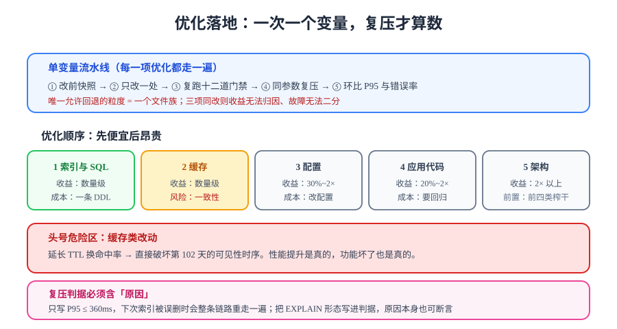

# 优化落地与复压验证

> 定位给出方向，优化给出动作。这一步最容易失控的地方是「一次改一堆」——改完变快了，没人知道是谁的功劳；改完变慢了，也没人知道该回退哪一项。本页把优化变成一条**单变量、可复压、可回退**的流水线。



## 一句话定位

优化不是「把代码写快一点」，而是**用最小的改动换取最大的 P95 收益，并证明收益是真的**。所以每个优化项都必须带三样东西：改动内容、期望形态、复压判据。

## 一、四条纪律

| # | 纪律 | 为什么 |
| --- | --- | --- |
| 1 | **一次只改一个变量** | 三项同改，收益无法归因；出问题无法二分定位 |
| 2 | **每改一次复压一次** | 期待值与实测值必须分开记录；不复压的优化等于没做 |
| 3 | **复压参数与基线完全一致** | 并发、时长、数据量、旁路变量设置都必须相同，否则环比无意义 |
| 4 | **改完复跑十二道门禁** | 优化最常见的副作用是**把功能改坏**（尤其缓存类与索引类改动） |

```shell
# 每次复压前跑一遍功能门禁，确认优化没有破坏正确性
cd your-project/service
mvn test                                        # 期望：全绿
python coreflow_smoke.py --base http://127.0.0.1:18080   # 期望 steps=14 passed=14
python visibility_smoke.py --base http://127.0.0.1:18080 # 期望 steps=22 passed=22
```

::: danger 缓存类改动是头号危险区
第 102 天已经为缓存定过时序：**提交后失效 + TTL 兜底**。压测期为了让数字好看而延长 TTL、或把失效时机挪到事务外，会立刻破坏「读者端只看得到 PUBLISHED」这条可见性判据——**性能提升是真的，功能坏了也是真的**。所以纪律 4 不是形式主义。
:::

## 二、优化顺序：先便宜后昂贵

| 优先级 | 类别 | 典型收益 | 改动成本 | 风险 |
| --- | --- | --- | --- | --- |
| 1 | **索引与 SQL** | 数量级（秒 → 毫秒） | 极低（一条 DDL） | 低（但要复跑判据） |
| 2 | **缓存** | 数量级（毫秒 → 亚毫秒） | 低 | **中高**（一致性） |
| 3 | **配置**（池、GC、线程） | 30% ~ 2× | 极低（改配置） | 低 |
| 4 | **应用代码** | 20% ~ 2× | 中（要改代码 + 回归） | 中 |
| 5 | **架构**（读写分离、缓存层拆分） | 2× 以上 | 高 | 高 |

::: tip 别急着升级到第 5 类
架构级优化的前提是「前四类已经榨干」。单机五服务、万级数据量的博客，前四类几乎总能解决问题；一上来就加 Redis 集群或读写分离，是在用一个高成本方案掩盖一个低成本的索引缺失。
:::

## 三、按瓶颈类型的措施表

| 类型 | 现状（本项目） | 改法 | 期望形态 | 复压判据 |
| --- | --- | --- | --- | --- |
| **索引缺失** | 列表查询 `type=ALL` + `filesort` | 加 `(status, published_at)` 联合索引；确认最左前缀被用到 | `type=range`，`Extra` 无 filesort | `EXPLAIN` 形态 + P95 回落 |
| **深分页** | `LIMIT 0,10` 逐页加深后退化 | 改 keyset（游标）分页，`WHERE published_at < ?` | 任何页码耗时同一量级 | 第 1 页与第 100 页 P95 差 < 2× |
| **连接池** | `pending > 0` | **先修 SQL**；确认无改进后再调 `maximum-pool-size`，且满足 `N服务 × pool ≤ max_connections − 预留` | steady 期 `pending == 0` | `hikaricp_connections_pending` 稳态为 0 |
| **缓存未命中** | 详情缓存命中率 79% | 补列表缓存；**空值缓存**防穿透（缓存空结果的短 TTL） | 命中率 ≥ 90% | 命中率平台期 + 功能门禁全绿 |
| **缓存击穿** | 热点文章失效瞬间打满 DB | 单飞（single-flight）重建；或逻辑过期（返回旧值 + 异步刷新） | 无周期性 DB 尖峰 | 瞬间探针：手动删 key 后压 5s，DB QPS 不跳变 |
| **SSR 阻塞** | `ssr_ttfb` P95 高于后端 P95 | `useAsyncData` 并发取数；减少服务端同步逻辑；校对 SSR 缓存头 | TTFB 与后端 P95 差距 < 150 ms | 同刻 API 直连对比 |
| **响应体积** | 列表返回完整 `content` | 列表投影只取摘要字段 | 单次响应体下降 > 60% | `curl -w '%{size_download}'` 对比 |
| **GC 停顿** | 堆使用锯齿、P99 尾部尖刺 | 设 `-XX:MaxRAMPercentage` 与容器 limit 对齐；G1 调 `MaxGCPauseMillis` | P99 与 P95 差距收敛 | P99/P95 < 4 |

::: warning 池大小不是越大越好
`maximum-pool-size` 调大只是把排队从**应用侧**挪到**数据库侧**。MySQL 的 `max_connections` 是硬上限，`threads_running` 过高会让上下文切换吃掉收益。正确顺序永远是：**先让每个查询变快，再决定要多少个并发连接**。
:::

## 四、一轮完整的优化记录

以下是本章记录的三项优化，格式即报告的「措施」栏格式：**改动 → 期望 → 实测（同机，未跑时标 ⏳） → 判据**。

### 优化 1：列表查询联合索引

```sql
-- V3 增量迁移（与 V1/V2 同目录，按序执行）
CREATE INDEX idx_posts_status_published ON posts (status, published_at DESC);
```

| 项 | 内容 |
| --- | --- |
| 改动 | 新增联合索引 `(status, published_at DESC)` |
| 期望 | `EXPLAIN` 的 `type` 从 `ALL` 变 `range`，`Extra` 无 `Using filesort` |
| 复压判据 | P95 ≤ 360 ms；`hikaricp_connections_pending` 稳态 0 |
| 实测 | ⏳ 待 Docker 环境（原因见[压测验收](../Acceptance/index.md)的结果三态） |

### 优化 2：列表响应投影裁剪

```sql
-- 列表查询只取必要字段：不再回传 content，改为摘要
SELECT id, title, slug, summary, published_at, author_id
FROM posts WHERE status = 'PUBLISHED' ORDER BY published_at DESC LIMIT 10;
```

| 项 | 内容 |
| --- | --- |
| 改动 | 列表投影由「全字段」改为「摘要字段」，正文只在详情接口返回 |
| 期望 | 单次响应体下降 > 60%；`ssr_ttfb` 同步下降 |
| 复压判据 | `curl -w '%{size_download}'` 对比；TTFB P95 下降 ≥ 20% |
| 风险 | 列表页若依赖 `content` 做摘要渲染会显示异常 → **必须复跑 `ssr_smoke`（10 步）** |
| 实测 | ⏳ 待环境 |

### 优化 3：整定容器内存与 JVM 堆

```yaml
# deploy/docker-compose.yml 片段
  blog-server:
    deploy:
      resources:
        limits: { memory: 1g }      # 与 -XX:MaxRAMPercentage 配合
    environment:
      JAVA_TOOL_OPTIONS: "-XX:MaxRAMPercentage=70 -XX:+UseG1GC -XX:MaxGCPauseMillis=200"
```

| 项 | 内容 |
| --- | --- |
| 改动 | 容器内存限额与 JVM 堆上限对齐（堆不超过 limit 的 70%，留出元空间与直接内存） |
| 期望 | 不再出现因超限被 OOM Killer 杀掉；GC 停顿可控 |
| 复压判据 | P99/P95 < 4；`jvm_gc_pause_seconds` 无长停顿；容器无重启 |
| 风险 | `MaxRAMPercentage` 设太高会挤占直接内存（SSR 代理、NIO）→ 观察 `jvm_memory_used_bytes` 的非堆部分 |
| 实测 | ⏳ 待环境 |

::: tip 完整改动的组织方式
三项改动分别落在 `db/migration/V3__*.sql`、`PostMapper.xml`、`docker-compose.yml` 三处，**互不重叠**——这正是「单变量」在工程上的落地形态：一次改动只碰一个文件族，回退就是回退一个文件。
:::

## 五、危险块：优化引入回归的五条路径

::: danger 五条
1. **延长 TTL 换命中率**：直接破坏第 102 天的可见性时序。正确做法是优化**失效时机**（提交后精确失效 + 短 TTL 兜底），而不是拉长兜底时间。
2. **加缓存但没加失效**：命中率漂亮，写后读到旧值。正确做法是「写路径必须显式失效」，并在复压前跑 `visibility_smoke`。
3. **为省一次查询把两次查询合并**：合并后的语句往往更复杂，`EXPLAIN` 可能从两个走索引变成一个全表扫。正确做法是**先 EXPLAIN 再合并**。
4. **调大池但没算 `max_connections`**：多实例扩容时立刻打满数据库。正确做法是把「`N服务 × pool ≤ max_connections − 预留`」写进部署检查项。
5. **优化完不复跑门禁**：性能数字变好，功能悄悄坏了，而这条路要等到上线后由读者发现。正确做法是把「复跑十二道门禁」写成优化流程的**固定一步**，不是可选项。
:::

## 六、验证方式

```shell
# 单轮优化的完整闭环（每项优化都走一遍）
# ① 改前：快照现状
k6 run -e BASE=http://127.0.0.1 --summary-export results/before.json post-detail.js
curl -s http://127.0.0.1:18080/actuator/prometheus > results/prom-before.txt

# ② 改动（只改一处）

# ③ 功能门禁：确认没改坏
mvn test && python coreflow_smoke.py --base http://127.0.0.1:18080

# ④ 改后：同参数复压
k6 run -e BASE=http://127.0.0.1 --summary-export results/after.json post-detail.js
curl -s http://127.0.0.1:18080/actuator/prometheus > results/prom-after.txt

# ⑤ 环比：P95 与错误率两项
#    期望：P95 下降且错误率未上升；若变慢则回退该单项改动
```

**判据**：

| 判据 | 期望 |
| --- | --- |
| 环比有改善 | `after` 的 P95 < `before` 的 P95 |
| 错误率未上升 | 两者都 < 1%，且 `after` 不高于 `before` |
| 门禁全绿 | `mvn test` + 十二道冒烟零失败 |
| 可回退 | 改动是单文件族的，`git revert` 一个提交即可 |

## 深入阅读

- [瓶颈定位：四层定位法与五类典型瓶颈](../Bottleneck/index.md)
- [可见性收敛：缓存失效时序与 404 一致性](../../Visibility/index.md)
- [SQL 优化专题：索引、执行计划与深分页改造](../../../../../docs/DB/Relational/SQLOptimization/index.md)
- [Redis 进阶：缓存设计与穿透/击穿/雪崩](../../../../../docs/DB/NoRelational/Redis/Advanced/CacheDesign/index.md)
- [高性能 Java：分配优化、锁优化与 JVM 调参](../../../../../docs/Backend/HighPerformanceJava/index.md)
