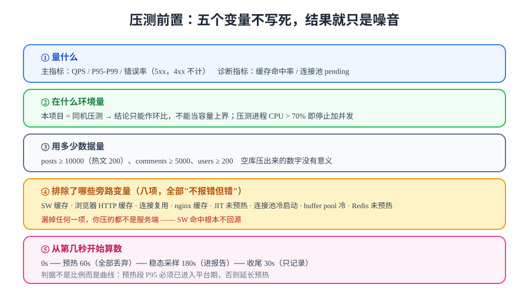

# 压测前置：把口径钉死

> 压测最容易失败的地方不在脚本，而在**没说清口径就开跑**。同一套代码、同一台机器，换个预热时长、换个数据量、换个并发模型，能得出相差十倍的 QPS。本页把这些变量全部写死，让结论可复现、可反驳。



## 一句话定位

压测前置回答五个问题，每个问题都要有一个**写在文档里的答案**：量什么指标、在什么环境量、用多少数据量、排除了哪些旁路变量、从第几秒开始算数。五个问题里有任何一个没答案，压出来的数字就只是噪音。

## 一、先定口径：目标指标与通过判据

### 三件必须先写死的事

| 项 | 本项目的答案 | 为什么必须现在写 |
| --- | --- | --- |
| **量什么** | QPS、P95/P99 延迟、错误率（三项主指标）；缓存命中率、连接池 pending（两项诊断指标） | 主指标判通过，诊断指标只在**没通过时**用来找原因 |
| **压到什么程度** | 分三档：基线档（10 VU）→ 目标档（100 VU）→ 破坏档（300 VU，找拐点） | 只压一档，你得到的是一个数字；压三档，你得到的是**曲线** |
| **什么算通过** | 见下方 SLO 表 | 「快了」「不慢」不是判据 |

::: danger 目标值不能拍，必须由基线推导
第 113 天的监控口径明确写过：**阈值 = 基线推导，不拍脑袋**。压测同理——先跑一次基线档（低并发）拿到当前真实水平，目标档的通过线再由基线乘一个系数得出。直接写「P95 ≤ 200ms」是把别人的机器当成了你的机器。
:::

### 三项主指标的口径定义

| 指标 | 口径 | 取自 | 本项目起点目标（待基线修正） |
| --- | --- | --- | --- |
| **QPS** | 目标档稳态窗口内，每秒**完成**的请求数 | k6 `http_reqs` 速率；服务端 `http_server_requests_seconds_count` | 与基线档相比不明显下降（< 20%） |
| **P95 / P99** | 服务端**处理**耗时分位（不含压测机排队） | k6 `http_req_duration{p(95)}`；服务端 histogram | P95 ≤ 基线 × 2，P99 ≤ 基线 × 4 |
| **错误率** | 5xx ÷ 总请求（**4xx 不计**） | k6 `http_req_failed`；服务端 `status=~"5.."` | < 1% |

::: warning 错误率为什么排除 4xx
第 113 天把这条口径写死过：401/403/404 是**契约语义**，不是故障。压测定向流量里若有「读者试密码」「扫不存在的文章路径」这类请求，4xx 会凭空拉高错误率，把真实的 5xx 淹掉。压测脚本里的 4xx 断言单独统计，不并入错误率。
:::

## 二、环境：先承认你在哪台机器上压

| 方案 | 优点 | 代价 | 结论可信度 |
| --- | --- | --- | --- |
| **压测机与目标同机**（本项目现状） | 零额外资源，随时能跑 | 压测进程与目标争抢 CPU / 内存 / 网络；QPS 上限可能由压测机决定 | 只能作**相对比较**（改前 vs 改后），不能当容量上界 |
| 独立压测机（同内网） | 压测机压力不干扰目标，数字接近真实容量 | 需要第二台机器与内网连通 | 可作为容量参考 |
| 云压测 / 分布式注入 | 能打出单机打不出的并发 | 引入费用与外网抖动 | 需额外排除网络变量 |

本项目的选择是**同机**，并因此接受了三条纪律：

1. **每个结论都必须标注「同机压测」**——缺少这句前提的容量数字一律不算数；
2. **判定压测机是否成为瓶颈**：压测进程自身 CPU 持续 > 70%，说明当前 QPS 由压测机封顶，此时**停止往上加并发**，改为延长稳态；
3. **不同批次之间不比较绝对值，只比较同一批次内的环比**。

```shell
# 前置：确认机器规格与容器资源，写进报告模板的"环境"一栏
sysctl -n hw.ncpu hw.memsize            # macOS：核数与内存字节
docker stats --no-stream --format 'table {{.Name}}\t{{.CPUPerc}}\t{{.MemUsage}}'
```

## 三、数据量级：空库压出来的数字没有意义

压测结果对数据量极其敏感，三个原因：

- **索引全在内存**：一万行与一千万行的 `EXPLAIN` 结果可能完全不同；
- **缓存全 miss**：空库时 Redis 命中率恒为 0，压出来的是「最坏情况」；
- **热点分布不存在**：真实流量是长尾的（少数文章吃掉大部分请求），空库没有长尾。

### 本项目的造数口径

| 数据 | 量级 | 分布要求 | 为什么是这个量级 |
| --- | --- | --- | --- |
| 文章 | **10 000 篇** | 80% 请求集中在 200 篇「热文」上 | 个人博客一年的真实量级；长尾决定了缓存是否有意义 |
| 分类 / 标签 | 20 / 80 | 每篇文章 1~3 个标签 | 关系表连接规模 |
| 读者账号 | 200 | 全部可用、密码统一 | 写链路与登录态压测需要 |
| 评论 | 5 000 条 | 集中在 100 篇热文，含两级嵌套 | 楼层分页与占位渲染是读侧最重的一段 |
| 正文长度 | 2 KB ~ 40 KB | 中位数 8 KB | Markdown 渲染与响应体积的主要变量 |

```sql
-- 造数思路（在你自己工程里执行；本项目只用「自乘」快速铺量，再打散字段）
-- ① 以 100 篇种子文章为基，连续自乘 7 次得到约 12800 篇
INSERT INTO posts (title, slug, content, status, author_id, published_at)
SELECT CONCAT(title, ' x2'), CONCAT(slug, '-x2'), content, 'PUBLISHED', author_id, published_at
FROM posts WHERE status = 'PUBLISHED';
-- 重复执行 6~7 次即到万级；随后按 slug 打散分类与标签

-- ② 关键：把 80% 的"阅读热度"压到 200 篇上（造热点）
--    本项目的做法不是建热度表，而是让压测脚本按幂律挑选 slug（见压测脚本页）
```

::: tip 造数脚本不要进仓库
项目侧只写文档、不写项目代码：`project/` 下只放 Markdown 与配图（见[交付文档包](../../Delivery/index.md)对交付物边界的说明）。造数 SQL 写在文档里，读者在自己工程里执行——本仓不提供可运行副本。
:::

## 四、旁路变量清单：不排除它们，压的不是服务端

这是本页**最短但最重要**的一节。以下每一条都会让压测结果偏乐观，且**都不会报错**：

| # | 旁路变量 | 它偷走了什么 | 排除方式 |
| --- | --- | --- | --- |
| 1 | **Service Worker 缓存** | 缓存命中的请求根本不回源，压到的是浏览器 | DevTools → Application → Service Workers → 勾 **Bypass for network**（第 118 天登记的前置纪律） |
| 2 | 浏览器 HTTP 缓存 | 同上，且更难察觉 | DevTools → Network → 勾 **Disable cache**；脚本侧统一加 `Cache-Control: no-cache` |
| 3 | 压测脚本内复用同一连接 | 少了 TCP/TLS 建连成本 | k6 默认按 VU 复用连接是**对的**（贴近真实），但要在报告里写明 |
| 4 | nginx 层缓存 | 请求根本没到应用 | 确认本项目 nginx **不缓存 API**；若配了 `proxy_cache`，压测时必须关掉并单独记录 |
| 5 | **JIT 未预热** | 前 10 万次请求跑在解释执行上，P99 巨大 | 预热 ≥ 60 s，前 30% 数据**不计入** |
| 6 | **连接池冷启动** | 首批请求排队建连 | 预热阶段自然覆盖；报告里写明池大小 |
| 7 | MySQL buffer pool 冷 | 首次查询大量磁盘读 | 预热阶段用热文打一遍；或 `SELECT COUNT(*)` 全表扫一次 |
| 8 | Redis 预热 | 命中率从 0 爬到稳态需要时间 | 预热阶段即纳入命中率曲线，稳态窗口再看 |

```shell
# 前置自检：确认旁路变量已排除（在压测脚本里断言，而不是靠记得勾）
# k6 脚本中固定加这两个头，保证"脚本侧不缓存"
#   headers: { 'Cache-Control': 'no-cache', 'Pragma': 'no-cache' }
# 浏览器侧（I8 之外的抽查）：
#   打开 DevTools → Application → Service Workers → 确认 Bypass for network 为勾选状态
#   打开 DevTools → Network → 确认 Disable cache 为勾选状态
```

::: danger 三条
1. **不预热直接压**：数字偏低且不可复现，第 1 分钟与第 5 分钟能差 3 倍——这不是"系统不稳"，是 JIT 与池在爬坡。
2. **忘了关 SW**：压测曲线会异常平坦且 QPS 高得离谱（因为大部分请求没出浏览器），然后你会得出「系统性能很好」的结论。
3. **改了 nginx 缓存没记录**：把「开了缓存」的数字当成「没开缓存」的数字，是容量结论失真最常见的一种。
:::

## 五、预热与采样窗口

```text
时间轴（单档一次运行，总计 ≥ 4 分钟）

0s                60s                     240s        270s
├──── 预热（丢弃） ────┼──── 稳态采样 180s ────┼── 收尾 ──┤
      JIT / 池 /          ← 只有这段的指标     排水、落盘
      buffer pool          进入报告
```

| 阶段 | 时长 | 做什么 | 数据处置 |
| --- | --- | --- | --- |
| 预热 | 60 s | 把 JIT、连接池、buffer pool、Redis 命中率都推到稳态 | **全部丢弃** |
| 稳态采样 | 180 s | 恒定并发，采集三项主指标 | 全部进入报告 |
| 收尾 | 30 s | 停止加压，等待在途请求完成（k6 自动 `gracefulStop`） | 只记录，不判定 |

::: warning 「前 30% 丢弃」是经验值，不是定律
本项目把预热定为 60 s / 总时长 270 s ≈ 22%，与第 103 天 JMH 的「预热轮次」是同一个思路（见[JMH 基准测试](../../../../../docs/Backend/HighPerformanceJava/JmhBenchmark/index.md)）。**判据不是比例，而是曲线**：预热段的 P95 曲线必须已经进入平台期——如果 60 s 后仍在下降，就把预热延长，而不是硬套比例。
:::

## Pr1~Pr8 前置清单

| 编号 | 前置项 | 命令要点 | 期望 |
| --- | --- | --- | --- |
| **Pr1** | 联调复核通过 | I1~I8 全满足 | 全通过 |
| **Pr2** | 单入口服务全绿 | `docker compose ps` | 五服务 `Up`，mysql/redis/blog-server `(healthy)` |
| **Pr3** | 机器规格已记录 | 核数 / 内存 / 容器限额 | 写入报告「环境」栏 |
| **Pr4** | 数据量达标 | `SELECT COUNT(*)` 文章 / 评论 / 账号 | ≥ 10000 / 5000 / 200 |
| **Pr5** | 基线档已跑 | 10 VU × 稳态 180 s | 得到 baseline.json |
| **Pr6** | SW 与浏览器缓存已旁路 | DevTools 两项勾选 | 已勾选（截图留存） |
| **Pr7** | 目标档与破坏档参数已写进脚本 | `options.scenarios` | 三档可独立触发 |
| **Pr8** | 指标端点可达 | `curl .../actuator/prometheus` | 含 `http_server_requests` |

```shell
# Pr4 一条命令核数据量
docker compose exec -T mysql mysql -uroot -p"$DB_ROOT_PASSWORD" "$DB_NAME" -e "
  SELECT (SELECT COUNT(*) FROM posts)    AS posts,
         (SELECT COUNT(*) FROM comments) AS comments,
         (SELECT COUNT(*) FROM users)    AS users;"
# 期望：posts ≥ 10000, comments ≥ 5000, users ≥ 200
```

## 验证方式

1. **口径表已填满**：三项主指标的定义、取数来源、起点目标都有值，没有「待定」；
2. **环境已标注**：报告里的每一次运行都写着「同机压测」；
3. **曲线而非单点**：预热段 P95 已进入平台期（截取 k6 输出中的时间序列佐证）；
4. **八个旁路变量逐条有结论**：C1~C8 每条要么已排除、要么已记录为「未排除 + 影响方向」。

八条齐全后进入[压测脚本](../Scripting/index.md)。

## 深入阅读

- [测试分层收口：为什么性能不进功能门禁](../../TestLayers/index.md)
- [监控接入：六项指标口径与基线推导的阈值](../../Monitoring/index.md)
- [一键部署：五服务、健康检查与从零复现](../../Deployment/index.md)
- [JMH 基准测试：预热、分位数与"微基准 ≠ 系统压测"](../../../../../docs/Backend/HighPerformanceJava/JmhBenchmark/index.md)
- k6 官方文档 · 测试类型（smoke / load / stress / spike / soak）：[grafana.com/docs/k6/latest/testing-guides/test-types](https://grafana.com/docs/k6/latest/testing-guides/test-types/)
