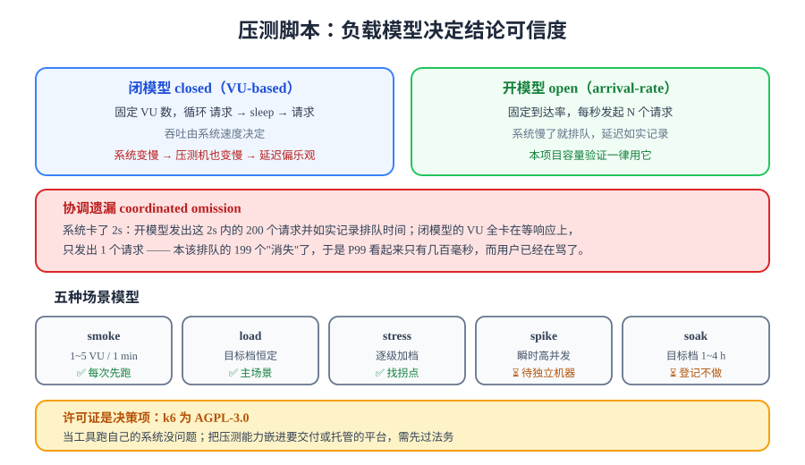

# 压测脚本：k6 与场景模型

> 压测脚本不是「循环发请求」。它要同时表达三件事：**负载长什么样**、**什么算通过**、**结果怎么留痕**。本页给出一套可读、可评审、可进 CI 的 k6 脚本，并把压测里最容易犯的那个方法论错误单独拆出来讲。



## 一句话定位

脚本是把「前置页定下的口径」翻译成可执行代码的地方。翻译得好，一次运行就能同时得到**结果**与**结论**；翻译得差，你会拿到一堆数字，然后花两小时手工算 P95。

## 一、工具选型

### 版本与技术事实（2026-10 核对）

| 工具 | 语言 | 最新稳定版 | 许可证 | 定位 |
| --- | --- | --- | --- | --- |
| **Grafana k6** | JS / TS | **2.x**（2026-05 起的大版本线，2026-09 已到 2.3.0） | **AGPL-3.0** | 脚本即代码、资源占用低、内置阈值 |
| Apache JMeter | Java / Groovy（GUI + XML） | 5.6.3（长期稳定末版）；6.0.0 需 **Java 17** 起 | Apache-2.0 | 协议面最广（JDBC/JMS/LDAP/FTP），`.jmx` 不易 review |
| Locust | Python | 2.46.3（2026-08-01，**需 Python 3.11+**；2.46.0 是最后一个支持 3.10 的版本） | MIT | Python 团队友好，分布式 worker 简单 |
| Vegeta | Go | 活跃 | MIT | 命令行恒定速率，适合快速探测 |
| oha | Rust | 活跃 | MIT | 轻量、带 TUI，适合单接口基准 |
| Gatling | Scala | 活跃 | Apache-2.0 | 报表精美，DSL 学习成本高 |
| wrk | C | **最后提交 2023-12，已停更** | 自定义 | 单机 HTTP 基准；不适合当长期维护的测试套件 |

::: danger 许可证是决策项，不是脚注
**k6 是 AGPL-3.0**，而 Locust / Vegeta / oha 是 MIT，JMeter / Gatling 是 Apache-2.0。AGPL 的 copyleft 会延伸到**通过网络提供服务的软件**：把 k6 **当工具**对着自己的系统跑，没有问题；把压测能力**嵌进你要交付或托管的平台**，就需要先过法务。这一条在选型时很容易漏，事后返工代价很大。
:::

### 本项目为什么选 k6

| 理由 | 具体到这个项目 |
| --- | --- |
| 脚本即代码 | 脚本进 Git、能 review、能 diff——`.jmx`（XML）做不到 |
| 阈值内置 | `thresholds` 直接表达 L1~L5 的通过线，退出码非 0 即失败，可接 CI |
| 资源占用低 | 同机压测的现实约束下，Go 运行时的注入器开销远小于 thread-per-VU 模型 |
| 指标可对接 | 结果可 `--summary-export` 落盘，也可 remote write 到 Prometheus，与第 113 天的监控面板同源 |

::: info 版本注意事项
k6 在大版本切换期（0.x → 1.x → 2.x）会有少量破坏性变更，不同发行渠道的版本线也可能滞后。**以 `k6 version` 的实际输出为准**，并在报告里记录运行时的版本号——压测结论必须能追溯到工具版本。
:::

## 二、脚本骨架

```javascript
// perf/post-detail.js —— 读链路压测（文章详情）
import http from 'k6/http';
import { check, sleep } from 'k6';
import { SharedArray } from 'k6/data';
import { Trend } from 'k6/metrics';

// ① 自定义指标：把"读者端感知延迟"单独拆出来，与 k6 的 http_req_duration 区分
const ssrTtfb = new Trend('ssr_ttfb', true);

// ② 测试数据：SharedArray 在 VU 之间共享，只解析一次（大数组必须用它，否则每 VU 一份内存）
const slugs = new SharedArray('slugs', () =>
  JSON.parse(open('./data/hot-slugs.json')),
);

// ③ 负载模型与通过判据：全部写在这里，不散落在脚本各处
export const options = {
  scenarios: {
    baseline: {
      executor: 'constant-arrival-rate',   // 到达率模型：每秒"发起"N 个请求
      rate: 10, timeUnit: '1s',
      duration: '270s',
      preAllocatedVUs: 20, maxVUs: 100,
      startTime: '0s',
    },
    target: {
      executor: 'constant-arrival-rate',
      rate: 100, timeUnit: '1s',
      duration: '270s',
      preAllocatedVUs: 100, maxVUs: 400,
      startTime: '300s',                    // 与 baseline 串行，避免相互干扰
    },
  },
  thresholds: {
    // 只统计稳态窗口之外会失真，所以用 delayAbortEval 之外的思路：
    // 阈值按整段评估，但报告只看后 180s 的曲线（预热段曲线一并留存佐证）
    'http_req_duration{expected_response:true}': ['p(95)<600', 'p(99)<1200'],
    'http_req_failed': ['rate<0.01'],
    'ssr_ttfb': ['p(95)<900'],
  },
  summaryTrendStats: ['avg', 'min', 'med', 'p(90)', 'p(95)', 'p(99)', 'max'],
  discardResponseBodies: false,   // 测 SSR 页面时必须保留 body，否则拿不到真实传输量
};

export function setup() {
  // 登录一次拿令牌，供写链路场景使用；读链路不需要身份
  const res = http.post(`${__ENV.BASE}/api/v1/auth/login`, JSON.stringify({
    email: __ENV.READER_EMAIL, password: __ENV.READER_PASSWORD,
  }), { headers: { 'Content-Type': 'application/json' } });
  check(res, { 'login 200': (r) => r.status === 200 });
  return { token: res.json('data.token') };
}

export default function (data) {
  // 幂律挑选：模拟"少数热文吃掉多数请求"的真实长尾
  const idx = Math.floor(Math.pow(Math.random(), 3) * slugs.length);
  const slug = slugs[idx];

  const res = http.get(`${__ENV.BASE}/posts/${slug}`, {
    headers: { 'Cache-Control': 'no-cache', 'Pragma': 'no-cache' }, // 排除浏览器/SW 缓存
    tags: { kind: 'read-detail' },
  });

  check(res, {
    'status 200': (r) => r.status === 200,
    'SSR 正文在源码里': (r) => r.body.includes('<title>'),   // 与 F10 同源：SSR 未被牺牲
  });
  ssrTtfb.add(res.timings.waiting);      // TTFB：服务端处理 + 网络

  sleep(0.2);
}
```

```shell
# 运行（三档靠环境变量切换，避免改脚本）
cd your-project/perf
k6 run -e BASE=http://127.0.0.1 -e READER_EMAIL=perf@example.com post-detail.js \
  --summary-export results/detail-baseline.json
k6 run -e BASE=http://127.0.0.1 post-detail.js                  # target 档（脚本内 startTime 控制）
```

## 三、关键概念：闭模型、开模型与协调遗漏

这是本页唯一需要「讲透原理」的地方，也是压测里最经典的**方法论错误**。

### 两种负载模型

| 模型 | 表达方式 | 加压逻辑 | 何时用 |
| --- | --- | --- | --- |
| **闭模型**（closed / VU-based） | 固定 VU 数，每个 VU 循环「请求 → sleep → 再请求」 | 并发数固定，**吞吐由系统速度决定** | 模拟"固定用户在持续操作" |
| **开模型**（open / arrival-rate） | 固定到达率，每秒发起 N 个请求 | 请求速率固定，**系统慢了就排队** | 模拟"真实到达流量"（推荐做容量验证） |

### 协调遗漏（coordinated omission）

闭模型有一个致命缺陷：**系统变慢时，压测机也会跟着变慢**。VU 在等响应，就不会发下一个请求——于是「系统最慢的那段时间」被自动少打了请求，延迟统计**系统性偏乐观**。

```text
真实情况：请求应每 10ms 到达一次，某段时间系统卡了 2s
                   ↓
开模型（正确）：这 2s 内 200 个请求全部发出并排队 → 它们的延迟被如实记录（含 2s）
闭模型（错误）：VU 卡在等响应上，这 2s 内只发出了 1 个请求 → 200 个本该排队的请求"消失"了
              结论：P99 看起来只有几百毫秒，而真实用户已经在骂了
```

**本项目的处置**：容量验证一律用 `constant-arrival-rate`（开模型），并用 `preAllocatedVUs` / `maxVUs` 保证系统变慢时有足够的 VU 承接排队；闭模型只在「模拟固定用户行为」时使用，且必须在报告里注明模型类型。

::: danger 四条
1. **用闭模型出容量结论**：这是协调遗漏的直接来源，P99 会偏乐观数倍。正确做法是容量验证用开模型，并把模型类型写进报告。
2. **`maxVUs` 设得过小**：系统一慢，VU 用尽，k6 会**丢弃**本该发出的请求并报 `dropped_iterations`——这个指标必须纳入报告，它不是噪音而是"你的压测机不够了"的证据。
3. **在脚本里 `sleep` 完就当真实用户**：真实读者的阅读时间不进服务端负载，`sleep` 只是为了让节奏不失控；不要用它推导"单用户 QPS"。
4. **只压一个接口**：详情页、列表页、搜索、评论写的资源消耗结构完全不同（见[瓶颈定位](../Bottleneck/index.md)），只压一条会得出局部结论。
:::

## 四、五种场景模型

| 模型 | 形状 | 时长 | 回答什么问题 | 本项目是否做 |
| --- | --- | --- | --- | --- |
| **smoke** | 1~5 VU 恒定 | 1 min | 脚本与链路是否通 | ✅ 每次改脚本先跑 |
| **load** | 升到目标档后恒定 | 5 min | 目标档下是否达标 | ✅ 主场景（基线 + 目标） |
| **stress** | 逐级加档到系统退化 | 10 min | 拐点在哪 | ✅ 破坏档 300 VU |
| **spike** | 瞬间拉到高并发再回落 | 3 min | 突发流量下是否雪崩 | ⏳ 依赖独立压测机 |
| **soak** | 目标档跑 1~4 h | 长 | 内存泄漏、连接泄漏、缓存衰减 | ⏳ 本项目只登记不执行 |

::: tip 为什么本项目不做 soak
浸泡测试的前提是「环境长时间稳定」，而同机压测 + 开发机不具备这个前提。把它登记为「已知未做 + 触发条件」（拿到独立环境时补）比糊一个 20 分钟的短跑更有价值——这正是[第 3 周收口](../../Week3Close/index.md)「顺延要写出来」的同一条纪律。
:::

## 五、三条脚本的差异

| 脚本 | 目标 | 关键差别 | 特有断言 |
| --- | --- | --- | --- |
| `post-detail.js` | 文章详情（SSR 页面） | 请求 `/posts/{slug}`，保留 body，量 TTFB；幂律挑 slug | 正文在源码里（SEO 未被牺牲） |
| `post-list.js` | 列表 + 缓存 | 请求 `/api/v1/posts?page=N`，**打乱页码**避免只压第一页 | 缓存命中率随预热上升并进入平台期 |
| `comment-write.js` | 评论写入 | 需要令牌；**每个 VU 用不同文章**避免楼层竞争变成串行 | 201 且服务端只落一条（幂等） |

```javascript
// perf/comment-write.js 的关键片段：把"同一篇文章被所有 VU 抢写"
// 换成"每 VU 固定一篇"，否则你压的是行锁排队，不是写入能力
export default function (data) {
  const postId = postIds[__VU % postIds.length];
  const res = http.post(`${__ENV.BASE}/api/v1/posts/${postId}/comments`, JSON.stringify({
    content: `perf-${__VU}-${__ITER}`,
    idempotencyKey: `perf-${__VU}-${__ITER}`,   // 幂等键沿用第 110 天评论链路约定
  }), { headers: { 'Content-Type': 'application/json', Authorization: `Bearer ${data.token}` } });
  check(res, { 'created': (r) => r.status === 201 });
}
```

::: warning 写链路压测必须清理数据
评论写入会真的落库。压测后要么用独立库、要么按 `content LIKE 'perf-%'` 清理，否则第二轮压测的数据量与第一轮不同——**结论不可比**。这一条写进[压测验收](../Acceptance/index.md)的收尾清单。
:::

## 六、结果留存

| 产物 | 生成方式 | 用途 |
| --- | --- | --- |
| 摘要 JSON | `--summary-export results/xxx.json` | 归档、与上一轮环比 |
| 完整日志 | `k6 run ... 2>&1 \| tee results/xxx.log` | 追溯 `dropped_iterations` 等非摘要指标 |
| 服务端指标快照 | `curl .../actuator/prometheus > results/prom-xxx.txt` | 与 k6 侧数字交叉验证 |
| 运行元信息 | 手工记：版本、机器、数据量、是否同机 | 报告的「环境」栏，**缺了结论就失效** |

```shell
k6 version > results/tool-version.txt          # 工具版本必须留痕
```

## 验证方式

```shell
# ① 脚本先跑 smoke（1 VU × 30s），确认链路与断言都对
k6 run --vus 1 --duration 30s -e BASE=http://127.0.0.1 post-detail.js
# 期望：checks 100%，无 dropped_iterations，退出码 0

# ② 再跑基线档，确认阈值能通过且曲线进入平台期
k6 run -e BASE=http://127.0.0.1 --summary-export results/baseline.json post-detail.js

# ③ 故意把阈值调到不可能通过，确认门禁真的会拦
k6 run --thresholds 'http_req_duration=p(95)<1' -e BASE=http://127.0.0.1 post-detail.js; echo "exit=$?"
# 期望：exit≠0（证明 thresholds 不是装饰）
```

三条都过，进入[瓶颈定位](../Bottleneck/index.md)。

## 深入阅读

- [JMeter 性能测试：组件模型、报告判读与 CLI](../../../../../docs/Tools/TestingTools/JMeter/index.md)
- [测试工具专题：从单元到 UI 的全景与分工](../../../../../docs/Tools/TestingTools/index.md)
- [高性能 Java：JMH 微基准与系统压测的边界](../../../../../docs/Backend/HighPerformanceJava/index.md)
- k6 官方文档 · 执行器与场景：[grafana.com/docs/k6/latest/using-k6/scenarios](https://grafana.com/docs/k6/latest/using-k6/scenarios/)
- k6 官方文档 · 阈值：[grafana.com/docs/k6/latest/using-k6/thresholds](https://grafana.com/docs/k6/latest/using-k6/thresholds/)
