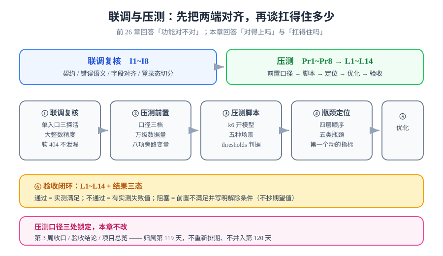

# 联调与压测

> 第 4 周的联调与压测日（第 119 天）。前 26 章回答的是「功能对不对」——十二道门禁、越权矩阵、一条龙回归、SSR 元信息、离线可读。本章回答另外两个问题：**两端真的对得上吗**（联调复核），以及**这套东西扛不扛得住**（压测）。

## 一句话定位

本章结清第 3 周登记的**书面欠账**「压测达标」：先用一份联调复核把「契约、错误语义、字段、登录态」四项两端一致性钉死，再按「前置 → 脚本 → 定位 → 优化 → 验收」五步，产出一份**可复现、带环境前提的容量结论**。

::: info 压测口径三处锁定，本章不改
从第 111 天起，「压测归属第 119 天」这句话在三处写过：[第 3 周收口](../Week3Close/index.md)、[验收结论](../CoreFlow/Acceptance/index.md)、[项目总览](../index.md)。本章**沿用该口径**——不重新排期、不并入第 120 天、不与部署验收混为一谈。
:::

## 与相邻章节的分工

| 相邻章节 | 它讲什么 | 本章讲什么 | 为什么不互相替代 |
| --- | --- | --- | --- |
| [测试分层收口](../TestLayers/index.md)（第 103 天） | 断言按「依赖什么」分流，**性能不进功能门禁** | 功能门禁之外的容量验证 | 口径不同：正确性断言必须 100% 可复现，容量结论**必须**带环境与预热前提，两者混在一起两边都不可信 |
| [核心业务流收口](../CoreFlow/index.md)（第 110 天） | 一条龙**正确性**回归 CF1~CF14 | 正确性通过之后才谈容量 | CF 系列秒级跑完即结束；压测要跑分钟级稳态并采样，跑得快问不出容量 |
| [监控接入](../Monitoring/index.md)（第 113 天） | 六项指标口径、告警阈值、traceId 串链 | **用**这六项指标定位压力下的瓶颈 | 监控回答「正常时看得见」，本章回答「加压后哪一项先动、动了意味着什么」 |
| [第 3 周收口](../Week3Close/index.md)（第 111 天） | 「压测达标」的**书面顺延登记** | 兑现该欠账并给出结论 | 一个是登记待办，一个是执行 + 结论；登记不产生数字 |
| [交付文档包与运维手册](../Delivery/index.md)（第 117 天） | Runbook 四条 SOP（**坏了之后**怎么办） | 压测（**还没坏之前**先知道边界在哪） | SOP 是事后处置，压测是事前度量；容量边界是 SOP 判据的输入 |
| [前台 PWA 与离线可读](../PwaOffline/index.md)（第 118 天） | Service Worker、离线缓存、离线评论队列 | 压测必须**排除** SW 这个旁路变量 | 两者直接冲突：不排除 SW，压到的是浏览器缓存而不是服务端，QPS 数字没有意义 |

## 页面导航

| # | 页面 | 讲什么 |
| --- | --- | --- |
| 1 | [前后端联调复核](./Integration/index.md) | 契约一致性、错误语义、字段对齐、登录态与缓存切分；I1~I8 联调清单 |
| 2 | [压测前置：把口径钉死](./Preparation/index.md) | 目标指标、环境选择、数据量级、旁路变量清单、预热与采样窗口；Pr1~Pr8 |
| 3 | [压测脚本：k6 与场景模型](./Scripting/index.md) | 工具选型与许可证红线、脚本骨架、五种场景模型、协调遗漏、阈值与断言 |
| 4 | [瓶颈定位：从指标到根因](./Bottleneck/index.md) | 四层定位法、五类典型瓶颈、工具映射、一段完整的五段式定位走查 |
| 5 | [优化落地与复压验证](./Optimization/index.md) | 单变量纪律、按瓶颈分类的措施、优化顺序、一轮完整的优化记录 |
| 6 | [压测验收与闭环](./Acceptance/index.md) | 报告模板、L1~L14 断言表、结果三态、与上线验收清单的衔接 |

## 为什么这一天值得单独存在

三个理由，按重要性排序：

1. **正确性通过不等于能用**。十二道门禁能证明「功能没写错」，但证明不了「一百个读者同时打开会怎样」。这两件事的断言形式、执行成本、结论寿命完全不同——功能门禁今天绿、明年还绿；容量结论离开当时的环境与数据量立刻失效。
2. **联调的错误只会在双端同时运行时才暴露**。第 98~110 天的联调发生在**开发机的三个直连进程**上，nginx 不在链路里：路径前缀、`X-Forwarded-For`、真实 IP 限流、以及「只有 nginx 一个入口」下的软 404 语义，都没被这条链路覆盖过。
3. **第 118 天新增了一个会污染压测结果的变量**。Service Worker 一旦命中缓存就根本不回源，加压加到最后压的是浏览器。这个变量必须在压测前置清单里被显式排除，而不是靠运气。

## 联调与压测解决的是两个不同问题

| 维度 | 联调复核 | 压测 |
| --- | --- | --- |
| 问的问题 | 两端**对得上**吗 | 系统**扛得住**吗 |
| 失败表现 | 字段缺失、类型不符、错误码错位、串号 | 延迟上涨、错误率上升、吞吐上不去 |
| 典型发现 | 「后端返回 `id` 是数字，前端当字符串比」 | 「连接池 pending 先动，慢 SQL 后动」 |
| 执行成本 | 分钟级，可随手跑 | 十几分钟起，需要预热与稳态 |
| 结论寿命 | 永久（契约不变就一直有效） | **短**（换机器、换数据量即失效） |
| 本章判据 | I1~I8 | L1~L14 |

::: tip 一句话记住两者关系
联调让系统**是对的**，压测让你知道**对到什么程度**。压测跑出来的所有数字，都建立在「联调已经通过」这个前提上——如果两端本身对不上，压出来的就是一个错误系统的性能。
:::

## 判据编号约定

本章沿用项目既有的编号风格，三段互不重叠：

| 前缀 | 含义 | 数量 | 出现在 |
| --- | --- | --- | --- |
| `I` | 联调复核项（Integration） | I1~I8 | [联调复核](./Integration/index.md) |
| `Pr` | 压测前置项（Preparation） | Pr1~Pr8 | [压测前置](./Preparation/index.md) |
| `L` | 压测验收断言（Load） | L1~L14 | [压测验收](./Acceptance/index.md) |

编号与既有的 `CF1~CF14`（正确性回归）、`M1~M10`（AI 评估）、`F1~F10`（PWA）、`R1~R6`（备份演练）、`D1~D10`（交付交接）**互补而不重叠**。判据唯一性原则见[判据收口](../Consolidation/index.md)：同一条判据只允许有一个归属，本章不重复断言任何已有编号覆盖的内容。

## 建议阅读顺序

1. 已经熟悉本项目 → 直接看 [压测前置](./Preparation/index.md)，那里是唯一会改变结论可信度的地方；
2. 第一次接触压测 → 按 1 → 2 → 3 → 4 → 5 → 6 顺序读；
3. 只想拿结论 → 看 [压测验收](./Acceptance/index.md)的 L1~L14 与结果三态表。

## 本章不做什么

| 不做的事 | 理由 |
| --- | --- |
| 不新增行为门禁 | 性能断言依赖环境，进不了「门禁 = 可证伪且可重复」的集合（[监控接入](../Monitoring/index.md)已定死「不虚增门禁」） |
| 不做混沌演练 | 故障注入是另一条线，见[混沌工程实战](../../../../docs/Ops/ChaosEngineering/Practice/index.md)；压测只加**正常负载** |
| 不做全链路压测平台 | 单机五服务、日 PV 量级，一套 k6 脚本 + Prometheus 就是全部所需；上平台的时机写在[压测验收](./Acceptance/index.md)的决策表里 |
| 不做容量规划结论 | 单机部署给不出「需要几台机器」的答案；本章给的是**这套形态的边界在哪**，扩容决策等形态变了再做 |

## 参考资料

- 交付方法论：[完整项目交付](../../../../docs/Others/ProjectDelivery/index.md)｜[交付测试](../../../../docs/Others/ProjectDelivery/Testing/index.md)
- 测试工具全景：[测试工具专题](../../../../docs/Tools/TestingTools/index.md)｜[JMeter 性能测试](../../../../docs/Tools/TestingTools/JMeter/index.md)
- 性能工程原理：[高性能 Java](../../../../docs/Backend/HighPerformanceJava/index.md)（JMH、JIT、锁与内存）
- 观测手段：[监控告警专题](../../../../docs/Ops/Monitoring/index.md)｜[Prometheus](../../../../docs/Ops/Monitoring/Prometheus/index.md)
- 数据库侧调优：[SQL 优化](../../../../docs/DB/Relational/SQLOptimization/index.md)｜[Redis 性能](../../../../docs/DB/NoRelational/Redis/Advanced/Performance/index.md)
- Grafana k6 官方文档：[grafana.com/docs/k6](https://grafana.com/docs/k6/latest/)
