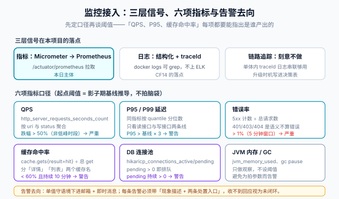

# 监控接入：指标口径、告警阈值与 traceId 串链

:::info 本日为第 4 周第二步
本页是周期 4「全栈博客平台」第 4 周第二步（**第 113 天**）。[一键部署](../Deployment/index.md)让系统能跑起来，本日让它「跑得可观察」：核心业务流收口页的 CF14 已断言 `traceId` 能串起一条链路，本日在它之上补齐指标口径——**QPS、P95 延迟、缓存命中率**三项，以及告警阈值与「谁来看」。
:::



## 一句话定位

监控的价值不在「装了 Prometheus」，而在**异常发生时，第一个看到的人知道该看什么、该动哪里**。所以本页的每项指标都写清三件事：数值从哪来、阈值怎么定、响了以后怎么办。

## 一、三层信号在本项目的落点

| 层 | 本项目的做法 | 刻意不做 | 理由 |
| --- | --- | --- | --- |
| 指标 | Micrometer（Spring Boot Actuator 自带）→ Prometheus 拉取 `/actuator/prometheus` | 不自建采集器 | Boot 内建零成本，指标名与标签由框架统一 |
| 日志 | 结构化日志 + `traceId` 字段，`docker logs` 可 grep | 不上 ELK | 单机五服务，ELK 的成本远大于收益；升级时机见决策表 |
| 链路追踪 | `traceId` 日志串联（复用[后端模板](../../../Base/BackendTemplate/index.md)的 TraceId 机制） | 不引入 SkyWalking / Tempo | 单体架构跨服务跳数为零，追踪系统的价值还没出现 |

::: tip 刻意不做也是决策
「不上 ELK、不上链路追踪」和「要做 Prometheus」一样是本日的产出：每一条都写明**升级时机**（见问题与决策表），避免后人把「没做」当成「没想到」。
:::

## 二、六项指标口径

| 指标 | 口径定义 | Micrometer 指标（Prometheus 名义） | 聚合维度 |
| --- | --- | --- | --- |
| **QPS** | 每秒完成的 HTTP 请求数 | `http_server_requests_seconds_count` | 按 `uri`、`status` |
| **P95 / P99 延迟** | 请求耗时分位数 | `http_server_requests_seconds`（histogram） | 按 `uri` 分读/写两条线 |
| **错误率** | 5xx 计数 ÷ 总请求数（5 分钟窗口） | 同上按 `status=~"5.."` 过滤 | 全局 |
| **缓存命中率** | hit ÷（hit + miss） | `cache_gets_total{result="hit\|miss"}` | 按 `cache`（详情 / 列表两个缓存名） |
| **DB 连接池** | HikariCP 活跃 / 等待连接数 | `hikaricp_connections_active`、`_pending` | 全局 |
| **JVM 内存 / GC** | 堆使用与 GC 停顿 | `jvm_memory_used_bytes`、`jvm_gc_pause_seconds` | 只观察不告警 |

三条标签纪律（错一条，Prometheus 的基数会在几周内拖垮存储）：

1. **禁止高基数标签**：`uri` 用路由模板（`/api/v1/posts/{id}`），**不是**真实 URL；绝不打 `userId`、`traceId` 标签。
2. **缓存名是有限集合**：详情、列表两个名字，新增缓存名要连告警规则一起评审。
3. **状态码不过滤就聚合**：401/403/404 是[契约](../Contract/index.md)语义不算错误，错误率只统计 5xx——口径写死，否则「错误率突然升高」经常是「有人在暴力试密码」而不是系统故障。

## 三、阈值：先测基线，再定告警

阈值不是拍的。流程与[数据同步与 CDC](../../../../docs/DB/CDC/Ops/index.md) 的运维判据同源：**影子期测基线 → 阈值 = 基线推导 → 按误报率修正**。

| 指标 | 起点阈值（待基线修正） | 级别 | 响应动作 |
| --- | --- | --- | --- |
| P95 延迟 | `> 基线 × 3` 持续 5 分钟 | 警告 | 看慢查询与连接池 pending |
| 错误率 | `> 1%`（5 分钟窗口） | 严重 | 看 `docker logs` 按 traceId 定位 |
| QPS | 低峰时段外 `跌幅 > 50%` | 严重 | 五服务健康检查逐个排查 |
| 缓存命中率 | `< 60%` 持续 10 分钟 | 警告 | 检查是否有批量清缓存/新写入口未走缓存 |
| 连接池 pending | `持续 > 0` | 警告 | 慢 SQL 排查，必要时临时扩连接池 |
| 服务不可用 | 健康检查连续失败 3 次 | 严重 | `docker compose restart` + 定位根因 |

**「谁来看」**：单值守语境下，告警进邮箱 + 即时消息，由作者本人响应；**每条告警必须带「现象描述 + 两条处置入口」**（如：错误率告警 → ① 按 traceId grep 日志 ② 看连接池面板）。没有处置入口的告警是噪音，第一次响就应该被改掉或删掉。

## 四、traceId 串链（CF14 的运维侧落点）

一条读者请求要能用一个 id 串起三段日志：

```text
nginx access log → blog-web(SSR) 服务端取数日志 → blog-server 业务日志
        同一个 traceId 贯穿三段，grep 一次拿到全链
```

判据三条：

1. **透传**：nginx 与前台 SSR 对后端的请求都要携带/透传 `X-Trace-Id`，后端缺失时自行生成并在响应头返回；
2. **落日志**：三段日志格式都含 `traceId` 字段（复用后端模板的统一日志格式）；
3. **可验证**：用 CF14 的走查方式，任取一条请求的 traceId，三段日志各能 grep 到 ≥ 1 行。

```shell
# 验证：拿一次真实请求的响应头 traceId，逐段检索
curl -sD - -o /dev/null http://127.0.0.1/api/v1/posts | grep -i x-trace-id
# 期望：x-trace-id: <32 位 id>
docker compose logs blog-server 2>&1 | grep -c "<该 traceId>"   # 期望 ≥ 1
docker compose logs blog-web    2>&1 | grep -c "<该 traceId>"   # 期望 ≥ 1
```

## 五、最小面板与查询

Grafana 六格面板，每格一条查询（起点值，随基线修正；`promql` 非内置高亮语言，此处按纯文本展示）：

```text
# ① QPS：近 5 分钟每秒请求数
sum(rate(http_server_requests_seconds_count[5m]))

# ② P95 延迟（读接口）
histogram_quantile(0.95, sum(rate(http_server_requests_seconds_bucket{uri=~"/api/v1/posts.*"}[5m])) by (le))

# ③ 错误率
sum(rate(http_server_requests_seconds_count{status=~"5.."}[5m])) / sum(rate(http_server_requests_seconds_count[5m]))

# ④ 缓存命中率（详情缓存）
sum(rate(cache_gets_total{cache="postDetail",result="hit"}[5m])) / sum(rate(cache_gets_total{cache="postDetail"}[5m]))

# ⑤ 连接池等待
hikaricp_connections_pending

# ⑥ 服务存活
up{job="blog-server"}
```

## 六、验证方式

1. **指标可拉**：`curl -s http://127.0.0.1:18080/actuator/prometheus | grep -c http_server_requests` 期望 ≥ 1（只在内网暴露，不经 nginx）。
2. **口径正确**：对详情页连续请求 20 次，QPS 与命中率两条曲线都有对应变化；未请求时段错误率恒为 0。
3. **阈值有效**：临时把错误率阈值调成 0.01% 制造一次告警，确认邮箱/消息触达，再改回——**告警链路必须实测过一次，不能假设它通**。
4. **traceId 闭环**：按第四节三条判据执行，全部满足。
5. **监控检查的定位**：这五条是**部署验收项**，不新增行为门禁——十二道门禁的数量与职责保持不变（虚增门禁会稀释「门禁 = 可证伪断言」的严肃性）。

## 七、问题与决策

| 问题 | 决策 | 理由 |
| --- | --- | --- |
| Prometheus 拉还是推 | **拉**（pull） | 短任务才需要 pushgateway；本项目是常驻服务，拉模式天然带存活检测（`up`） |
| 监控组件要不要进 Compose 一起部署 | **进，但标注可选 profile** | 读者复现时可以只起五个业务服务；`--profile monitor` 时才带 Prometheus/Grafana，避免把演示链路的资源需求翻倍 |
| 日志要不要上 ELK | **不上** | 单机五服务 grep 够用；升级时机 = 多实例部署或日志保留需求超过本地盘 |
| 何时引入链路追踪系统 | **拆出第二个服务时** | 单体内「traceId 日志串联」已覆盖全部跨段场景；追踪系统的价值随服务数增长 |
| 401/403 要不要计入错误率 | **不计入** | 它们是契约语义（见 [读者账号](../ReaderAccount/index.md)），计入后暴力试探会污染告警；改用独立的「401 突增」告警盯滥用 |
| JVM 指标设不设阈值告警 | **只观察** | 单实例固定内存下堆曲线平稳，先攒一周数据再决定，避免为拍参数制造噪音 |

## 八、下一步（第 114 天）

第 4 周里程碑还差两件事：**上线验收清单定稿**与**备份恢复演练**。备份演练与 [binlog 原理](../../../../docs/DB/CDC/Binlog/index.md)一节同源——`mysqldump` 全量 + binlog 增量恢复到指定时间点（PITR），恢复目标库用临时容器，不碰正在运行的数据卷；验收清单在第 4 周收口时与 [一键部署](../Deployment/index.md)的判据合并成最终上线检查表。

压测归属不变：仍顺延第 119 天，三处口径一致（[第 3 周收口](../Week3Close/index.md)、[验收结论](../CoreFlow/Acceptance/index.md)、[一键部署](../Deployment/index.md)）。

## 参考资料

- Spring Boot Actuator：https://docs.spring.io/spring-boot/reference/actuator/index.html
- Micrometer 与 Prometheus：https://docs.micrometer.io/micrometer/reference/implementations/prometheus.html
- Prometheus 查询基础：https://prometheus.io/docs/prometheus/latest/querying/basics/
- [核心业务流 · 一条龙回归（CF14 traceId）](../CoreFlow/Regression/index.md)
