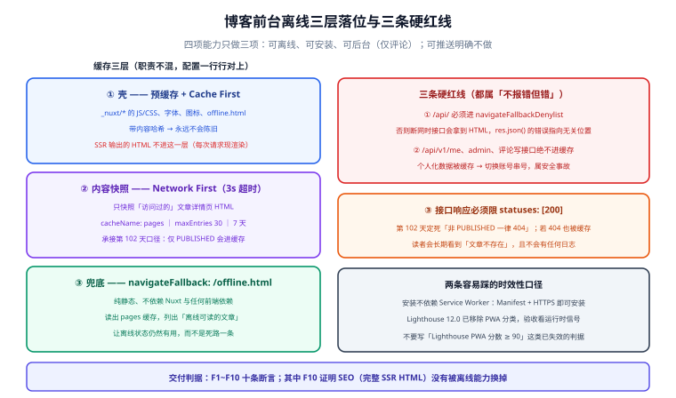

# 前台 PWA 与离线可读

第 115 天把上线验收清单九项逐条回填后，第 4 周只剩「等 Docker 环境兑现」这一条待办。本章不碰那条待办，而是补上一个**此前整个项目都没有回答的问题**：**用户在地铁里、在弱网下、在断网时打开这个博客，看到的是什么？**

一句话定位：**本章给前台（Nuxt SSR 读者端）加装离线能力——断网不白屏、读过的文章能回看、离线评论不丢失——并把每一项都做成可本地验证的判据。**

::: info 与技术专题的分工
本章只写**这个项目里怎么落地**：具体文件路径、`nuxt.config.ts` 的配置、与第 108 天 SSR 口径和评论链路的接缝、以及本项目自己的验收断言 F1~F10。原理、策略矩阵、iOS 六条限制等通用内容不在这里重复，见 [PWA 与离线应用](../../../../docs/Frontend/PWA/index.md)；缓存策略的判据见[缓存策略](../../../../docs/Frontend/PWA/CachingStrategy/index.md)，安装判据见[安装体验](../../../../docs/Frontend/PWA/Installability/index.md)。
:::

## 一、为什么是这几件事，不是「把 PWA 全做一遍」

PWA 有四项能力（可安装、可离线、可推送、可后台），**四项不是打包出售的**。本项目按业务价值筛选，只做三件，另一件明确不做：

| 能力 | 本项目决策 | 理由 |
| --- | --- | --- |
| **可离线** | ✅ 做（本章主体） | 博客是**读密集型**业务，读者在弱网下回看已读文章是真实需求；且第 108 天已经把前台做成 SSR，离线兜底的成本很低 |
| **可安装** | ✅ 做（顺带） | Manifest 是纯声明，**不需要 Service Worker 也能安装**（见[安装判据](../../../../docs/Frontend/PWA/Installability/index.md)）。成本几乎为零，收益是「读者有一个图标点开」 |
| **可后台（离线写）** | ✅ 做，但**只做评论** | 评论是本项目唯一的读者写入动作；离线评论丢失是「用户以为成功、其实没有」的信任事故 |
| **可推送** | ❌ **明确不做** | 判据来自[推送章节](../../../../docs/Frontend/PWA/Push/index.md)第八节：博客更新频率低、推送价值低；且 VAPID 私钥要进密钥管理，本项目当前的运维面还不支持（第 117 天的配置对账里没有这一项）。**不做比半做更好** |

::: warning 一条口径
「本项目没做推送」写在页面上，而不是留白。原因是第 117 天的交付物清单要求**每条交付物标注判据出处**；留白会让下一个人以为「漏了」，从而重新评估一遍。
:::

## 二、三层落位：缓存到底缓存什么

这是本章唯一需要「设计」的地方，其余都是配置。三层职责不混，配置也就能一行行对上。



| 层 | 缓存对象 | 策略 | 缓存名 | 与既有章节的关系 |
| --- | --- | --- | --- | --- |
| **壳** | `_nuxt/*` 的 JS/CSS、字体、图标、`offline.html` | 预缓存 + **Cache First** | `workbox-precache-*` | 第 108 天 SSR 输出的 HTML **不进这一层** |
| **内容快照** | **访问过的**文章详情页 HTML | **Network First**（3s 超时） | `pages` | 承接第 102 天的可见性口径（非 PUBLISHED 一律 404） |
| **兜底** | `offline.html` | 预缓存 + `navigateFallback` | `workbox-precache-*` | 独立于框架的纯静态页 |

### 三条硬红线

1. **`/api/` 必须进 `navigateFallbackDenylist`**。否则断网时接口请求会拿到 `offline.html` 的 HTML，前端 `res.json()` 抛出的错误会指向完全无关的位置——第 108 天已经因为「搜索页 400 转友好提示」踩过一次同类问题（错误信息与真实原因不对应）。
2. **`/api/v1/me`、`/api/v1/admin/*`、评论写接口绝不进缓存**。承接第 109 天的数据归属矩阵：个人化数据一旦被缓存，切换账号就会串号——这是**安全事故**，不是体验问题。
3. **接口响应必须限 `statuses: [200]`**。第 102 天定死了「读者端对非 PUBLISHED 一律 404」，如果 404 也被缓存，读者会**长期**看到「文章不存在」，而这个错误不会有任何日志。

## 三、落地步骤

### 第 1 步：Manifest（不依赖 Service Worker）

```json [public/manifest.webmanifest]
{
  "name": "博客平台",
  "short_name": "博客",
  "id": "/?source=pwa",
  "start_url": "/?source=pwa",
  "scope": "/",
  "display": "standalone",
  "theme_color": "#2563eb",
  "background_color": "#ffffff",
  "icons": [
    { "src": "/icons/pwa-192.png", "sizes": "192x192", "type": "image/png" },
    { "src": "/icons/pwa-512.png", "sizes": "512x512", "type": "image/png" },
    { "src": "/icons/maskable-512.png", "sizes": "512x512", "type": "image/png", "purpose": "maskable" }
  ]
}
```

前台 `app.vue` 的 head 里引上，并补齐 iOS 需要的 `apple-touch-icon`（iOS 优先读它，只配 manifest 会导致主屏图标是网页截图）：

```ts [app.vue]
useHead({
  link: [
    { rel: 'manifest', href: '/manifest.webmanifest' },
    { rel: 'apple-touch-icon', sizes: '180x180', href: '/icons/apple-touch-icon-180.png' },
  ],
  meta: [{ name: 'theme-color', content: '#2563eb' }],
})
```

**判据**：`curl -sI http://127.0.0.1:3000/manifest.webmanifest` 的 `Content-Type` 为 `application/manifest+json`；DevTools → Application → Manifest 无红色错误。

### 第 2 步：Service Worker 配置

```ts [nuxt.config.ts]
export default defineNuxtConfig({
  modules: ['@vite-pwa/nuxt'],
  pwa: {
    registerType: 'prompt',
    manifest: false,                        // 用 public/ 下自维护的 manifest
    workbox: {
      // ① 预缓存只放壳（HTML 不进预缓存——SSR 的 HTML 是每次请求现渲染的）
      globPatterns: ['**/*.{js,css,svg,woff2,png}'],
      globIgnores: ['**/screenshots/**'],
      maximumFileSizeToCacheInBytes: 2 * 1024 * 1024,
      cleanupOutdatedCaches: true,
      // ② 导航请求：网络优先，3 秒超时后回兜底页
      navigateFallback: '/offline.html',
      // ③ 接口、后台路径绝不回退成 HTML
      navigateFallbackDenylist: [/^\/api\//, /^\/admin\//],
      // ④ 运行时缓存
      runtimeCaching: [
        {
          urlPattern: /^https?:\/\/[^/]+\/posts\/[^/]+\/?$/,
          handler: 'NetworkFirst',
          options: {
            cacheName: 'pages',
            networkTimeoutSeconds: 3,
            expiration: { maxEntries: 30, maxAgeSeconds: 7 * 24 * 60 * 60 },
            cacheableResponse: { statuses: [200] },
          },
        },
        {
          urlPattern: /\/api\/v1\/(posts|categories|tags)(\/|\?|$)/,
          handler: 'NetworkFirst',
          options: {
            cacheName: 'api-public',
            networkTimeoutSeconds: 3,
            expiration: { maxEntries: 50, maxAgeSeconds: 5 * 60 },
            cacheableResponse: { statuses: [200] },
          },
        },
        {
          urlPattern: ({ request }) => request.destination === 'image',
          handler: 'CacheFirst',
          options: {
            cacheName: 'images',
            expiration: { maxEntries: 60, maxAgeSeconds: 30 * 24 * 60 * 60 },
            // 0 = opaque（跨域图片），不加这一项跨域图片永远进不了缓存
            cacheableResponse: { statuses: [0, 200] },
          },
        },
      ],
    },
    // 开发期不注册 SW（这是插件的默认值，显式写出来避免被后人误以为漏配）
    devOptions: { enabled: false },
  },
})
```

### 第 3 步：离线兜底页（含「离线可读的文章」）

`public/offline.html` 是纯静态页，**不依赖 Nuxt 与任何前端依赖**——它要在最坏的情况下可用。除文案外，它多做一件事：读 `pages` 缓存，把已缓存的文章路径列出来，让离线状态**仍然有用**。

```html [public/offline.html]
<!doctype html>
<html lang="zh-CN">
  <head>
    <meta charset="utf-8" />
    <meta name="viewport" content="width=device-width,initial-scale=1" />
    <title>当前离线 · 博客平台</title>
    <style>
      body { font-family: system-ui, sans-serif; max-width: 34rem; margin: 12vh auto; padding: 0 1.5rem; color: #0f172a; }
      .badge { display: inline-block; padding: .25rem .6rem; border-radius: 999px; background: #fef3c7; color: #92400e; font-size: .8rem; }
      button { margin-top: 1.5rem; padding: .6rem 1.1rem; border: 0; border-radius: .5rem; background: #2563eb; color: #fff; font-size: 1rem; }
    </style>
  </head>
  <body>
    <p class="badge">离线模式</p>
    <h1>当前没有网络连接</h1>
    <p>页面壳已缓存，但这条内容还没有离线副本。</p>
    <p><button onclick="location.reload()">重新加载</button>　<a href="/">返回首页</a></p>
    <script>
      // 把已缓存的文章列出来，让离线状态有用而不是死路一条
      if ('caches' in window) {
        caches.open('pages').then(async (cache) => {
          const urls = (await cache.keys()).map((r) => new URL(r.url).pathname)
          if (!urls.length) return
          const h = document.createElement('h2')
          h.textContent = '离线可读的文章'
          const ul = document.createElement('ul')
          urls.slice(0, 10).forEach((u) => {
            const li = document.createElement('li')
            const a = document.createElement('a')
            a.href = u
            a.textContent = decodeURIComponent(u.replace(/^\/posts\//, '').replace(/\/$/, ''))
            li.appendChild(a)
            ul.appendChild(li)
          })
          document.body.append(h, ul)
        })
      }
    </script>
  </body>
</html>
```

### 第 4 步：更新提示（与第 108 天的 hydration 纪律对齐）

新版本 SW 会停在 `waiting`。这一步把它变成用户可见的一条提示，**并由用户点击决定何时切换**：

```ts [plugins/pwa.client.ts]
export default defineNuxtPlugin(() => {
  if (!('serviceWorker' in navigator)) return

  let refreshing = false
  // 新 SW 接管后刷新一次，让「页面代码」与「SW 版本」对齐
  navigator.serviceWorker.addEventListener('controllerchange', () => {
    if (refreshing) return
    refreshing = true
    location.reload()
  })

  navigator.serviceWorker.ready.then((reg) => {
    const notify = (worker: ServiceWorker) => {
      const el = document.querySelector('#pwa-update')
      if (!el) return
      el.hidden = false
      el.querySelector('button')?.addEventListener('click', () => {
        worker.postMessage({ type: 'SKIP_WAITING' })
      })
    }
    if (reg.waiting) notify(reg.waiting)
    reg.addEventListener('updatefound', () => {
      reg.installing?.addEventListener('statechange', (e) => {
        const sw = e.target as ServiceWorker
        if (sw.state === 'installed' && navigator.serviceWorker.controller) notify(sw)
      })
    })
    // 长驻页面定期检查：PWA 的典型用法就是一直开着，只靠导航触发更新会几天拿不到新版
    setInterval(() => void reg.update(), 60 * 60 * 1000)
  })
})
```

::: danger 为什么不能直接在 `install` 里 `skipWaiting()`
本项目前台是 SSR + 按路由懒加载的 chunk。新 SW 在旧页面还在运行时接管并删掉旧缓存，**正处于页面上的读者可能立刻拿到 404 的资源**（他手上的 HTML 引用的 chunk 已被清理）。所以顺序只能是：`waiting` → 提示 → 用户点击 → `skipWaiting` → `controllerchange` → 刷新。
:::

### 第 5 步：安装引导（Chromium 与 iOS 分开处理）

```vue [components/InstallHint.vue]
<script setup lang="ts">
import { onMounted, ref } from 'vue'

const visible = ref(false)
const isIos = ref(false)
let deferred: any = null

onMounted(() => {
  const standalone =
    window.matchMedia('(display-mode: standalone)').matches ||
    (window.navigator as any).standalone === true
  if (standalone) return                       // 已安装，不显示

  isIos.value = /iphone|ipad|ipod/i.test(navigator.userAgent)
  if (isIos.value) {
    visible.value = true                       // iOS 无程序化 API，只能图文引导
    return
  }
  window.addEventListener('beforeinstallprompt', (e) => {
    e.preventDefault()
    deferred = e
    visible.value = true
  })
})

async function onClick() {
  if (!deferred) return
  await deferred.prompt()
  await deferred.userChoice
  deferred = null                              // event 一次性，必须置空
  visible.value = false
}
</script>

<template>
  <button v-if="visible" @click="onClick">
    {{ isIos ? '如何安装到主屏幕？' : '安装到桌面' }}
  </button>
</template>
```

### 第 6 步：离线评论队列（复用第 110 天的评论链路）

评论是本项目唯一的读者写入动作。承接第 110 天的**字段依赖清单**（`authorName` 实时联表、`Cookie` 决定身份），离线队列要额外带一件东西：**客户端生成的幂等键**。

| 环节 | 做法 | 与本项目既有约定的衔接 |
| --- | --- | --- |
| 落盘 | 写 `IndexedDB` 的 `outbox`，`keyPath: 'id'`（UUID） | 承接第 105 天「断言清单先行」的做法：先定判据再实现 |
| 幂等键 | 随请求发 `Idempotency-Key: <uuid>` | 与第 116 天 AI 预审的「输出只进白名单字段」同一原则：**不可信输入要有可追溯的唯一标识** |
| 补发触发 | ① `online` 事件 ② `sync` 事件（Chromium） ③ **每次应用启动** | ③ 是唯一跨平台的可靠兜底——iOS 与 Firefox 都没有 Background Sync |
| 归属校验 | 队列项只在**同一账号**下补发 | 承接第 109 天的数据归属矩阵：换账号后不得补发上一个人的评论 |
| 终态 | 4xx 丢弃并提示；重试上限 8 次后标 `failed` | 不把失败静默吞掉 |

```ts [composables/useCommentOutbox.ts]
// 关键片段：先落盘再发送；幂等键在入队时就写死
export async function submitCommentOffline(payload: CommentPayload) {
  const id = crypto.randomUUID()
  await enqueue({
    id,
    url: '/api/v1/comments',
    method: 'POST',
    headers: { 'Content-Type': 'application/json', 'Idempotency-Key': id },
    body: JSON.stringify(payload),
  })

  const reg = await navigator.serviceWorker.ready
  if ('sync' in reg) await reg.sync.register('outbox')   // Chromium：页面关了也能发
  else void flushOutbox()                                 // 其他平台：立刻试一次，失败等下次启动
}
```

::: warning 与「登录态」的接缝
离线队列天生跨会话：读者周五离线发评论、周一才联网。因此补发前**必须重新校验登录态**——令牌失效时这条评论应当标记为「需要重新登录后重试」，而不是带着过期令牌反复重试（第 109 天的 `account_smoke` 已覆盖「令牌失效」这一类断言）。
:::

## 四、验收断言 F1~F10

与第 110 天的 `CF1~CF14`、第 116 天的 `M1~M10` 同一形态：**每条断言都有可执行的操作与明确期望**。本章不新增跑批脚本（`project/` 只沉淀文档），断言由读者在自己工程里按操作验证。

| # | 断言 | 操作 | 期望 |
| --- | --- | --- | --- |
| F1 | Manifest 合法 | `curl -sI .../manifest.webmanifest` | 200 且 `Content-Type: application/manifest+json` |
| F2 | SW 已激活且作用域为根 | DevTools → Application → Service Workers | 状态 activated，Scope 为 `/` |
| F3 | 预缓存只含静态资源 | 控制台列出 precache 的 URL | 全是 `_nuxt/*`、图标、字体；**无 `.html`、无 `/api/`** |
| F4 | 断网有兜底 | 勾 Offline → 访问未读文章 | 显示 `offline.html`，含「离线模式」文案 |
| F5 | 读过的文章离线可读 | 正常访问一篇文章 → 勾 Offline → 刷新该页 | 正文完整显示（承接第 102 天的可见性口径：仅 PUBLISHED 会进缓存） |
| F6 | 联网永远最新 | 取消 Offline → 强制刷新 | 内容与后台一致（Network First 生效） |
| F7 | 不缓存个人化数据 | 登录后查看 Cache Storage | 无 `/api/v1/me`、无 `/api/v1/admin/*` 响应 |
| F8 | 更新提示可走通 | 改 `offline.html` 文案 → 重新构建 → 刷新 | 出现提示；点击后加载到新文案，且旧缓存名被删除 |
| F9 | 离线评论不丢不重 | 断网提交 → 恢复网络 | UI 翻成「已发送」，服务端**只有一条**记录 |
| F10 | SEO 未被牺牲 | `curl -s http://127.0.0.1:3000/posts/hello` | 返回完整 SSR HTML（含标题与正文 TDK），**不依赖 JS** |

F10 是本章与第 108 天的**守门断言**：离线能力绝不能把 SEO 换掉。抓取工具不执行 Service Worker，它拿到的必须是服务端渲染好的 HTML。

## 五、当日做了什么 / 如何验证 / 下一步

**当日做了什么**：

1. **能力取舍定稿**：四项能力只做三项，**推送明确不做**并写明理由（判据来自[推送章节](../../../../docs/Frontend/PWA/Push/index.md)第八节 + 第 117 天配置对账里没有 VAPID 这一项）。
2. **三层落位**：壳（预缓存 Cache First）/ 内容快照（Network First 3s，仅文章详情页，`maxEntries: 30`）/ 兜底（`offline.html` 进预缓存 + `navigateFallback`）。
3. **三条硬红线写死**：`/api/` 进 denylist、个人化与写接口绝不进缓存、接口响应限 `statuses: [200]`——三条**都属「不报错但错」**，只能靠判据拦。
4. **更新提示与安装引导按平台分叉**：Chromium 走 `beforeinstallprompt`，iOS 走图文引导（不调用不存在的 API）；`skipWaiting` 只在用户点击后触发。
5. **离线评论队列**：`IndexedDB` + 客户端 UUID 幂等键 + 三个补发触发点（`online` / `sync` / **每次启动**），并补齐「登录态失效」与「换账号不补发」两条接缝。
6. **F1~F10 十条断言定稿**：形态与 `CF1~CF14`、`M1~M10` 一致。

**如何验证**（本页是文档产出，以下是读者在自己工程里可执行的命令与期望）：

```shell
# 1) 生产构建 + 本地静态服务（不要用 dev server 验证 PWA——开发期默认不注册 SW）
pnpm build && pnpm preview

# 2) F1：Manifest 的 MIME 类型
curl -sI http://127.0.0.1:4173/manifest.webmanifest | grep -i content-type
#    期望：application/manifest+json

# 3) F3：列出预缓存内容，确认没有 HTML 与 /api/
#    在浏览器控制台执行：
#    const c = await caches.open((await caches.keys()).find(k => k.startsWith('workbox-precache')))
#    console.log((await c.keys()).map(r => new URL(r.url).pathname))
#    期望：全是 _nuxt/*、/icons/*、/offline.html；不得出现 /api/

# 4) F4/F5/F6：Application → Service Workers 勾 Offline，按断言表逐条走
# 5) F8：改 offline.html 文案 → pnpm build → 刷新 → 应出现更新提示
# 6) F9：勾 Offline 提交一条评论 → 恢复网络 → 服务端应只有一条记录
# 7) F10：SEO 不依赖 JS
curl -s http://127.0.0.1:3000/posts/hello | grep -c '<title>'
#    期望：1（且正文出现在源码里）
```

**实测列纪律**（与第 4 周收口、回归报告、第 117 天完全一致）：本机**没有 Docker、没有可运行的工程仓库**，因此 F2/F3/F8/F9 的浏览器侧实测一律标 **⏳ 未跑 + 原因**，F1/F10 的 `curl` 判据也需先起服务才能跑。**不把期望值抄进实测列**——本章交付的是**判据**，兑现前置条件与第 115 天收敛出的那条同源：**一台能跑 Node 构建的机器 + 一个按文档搭起来的工程**。

**下一步**：第 119 天做**压测**（口径三处不变：[第 3 周收口](../Week3Close/index.md)、[验收结论](../CoreFlow/Acceptance/index.md)、[项目总览](../index.md)）。

::: tip 压测前必做一件事
**在 DevTools 里勾上 Application → Service Workers → Bypass for network**。本章新增的 Service Worker 会显著降低服务端实际压力（缓存命中根本不回源），不排除这个旁路变量，压测得到的 QPS 与服务端负载**没有可比性**。这一条已登记进第 119 天的压测前置清单。
:::

## 相关章节

- [前台 SSR](../../../../project/Complete/BlogPlatform/FrontendSSR/index.md)：本章的**前置口径**——HTML 不预缓存、首访不触发接口请求，两条都源自它
- [可见性收敛](../Visibility/index.md)：F5 的判据来源（仅 PUBLISHED 可见，非 PUBLISHED 一律 404）
- [评论链路](../Comments/index.md) 与 [评论读侧](../CommentRead/index.md)：离线队列补发的写入三约束与楼层口径
- [读者账号与权限](../ReaderAccount/index.md)：F7 的数据归属矩阵与「换账号不补发」的依据
- [一键部署](../Deployment/index.md)：`sw.js` 与 `manifest` 的 `no-cache`、部署原子性属于**部署侧接缝**，判据在那里
- [监控接入](../Monitoring/index.md)：缓存命中率会改变服务端指标口径，第 113 天的六项指标要配套读
- [PWA 与离线应用](../../../../docs/Frontend/PWA/index.md)：本专题的通用原理与全部工具链
