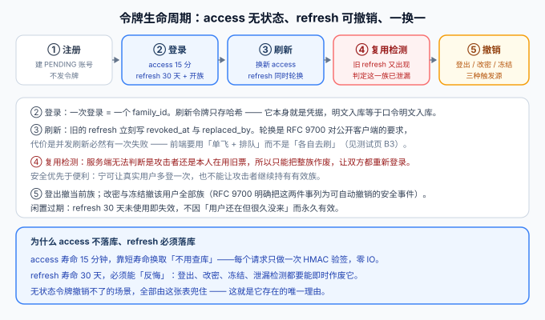

# 接口设计：注册、登录与令牌轮换

本页是[读者账号与权限](../index.md)的接口侧收口。十一个路径、一张错误码表，以及三个**取舍**：注册接口该不该告诉你邮箱已被占用、登录接口怎么防撞库、刷新令牌被偷了怎么发现。



::: warning 本页只有设计，没有可运行代码
`AccountController.java`、`RefreshService.java`、`openapi.yaml` 的增量片段都是**要你在自己工程里创建的内容**。契约风格沿用[接口契约](../../Contract/index.md)（OpenAPI 3.1，契约先行）。
:::

## 一句话定位

这一页的重点不是「有哪些接口」，而是**每个接口在失败时告诉对方多少信息**。账号接口是整站唯一一组「失败响应本身就是攻击面」的接口——多写一个字，就等于多给对方一次判定。

## 一、十一个路径

| 方法 | 路径 | 说明 | 认证 | 成功码 |
| --- | --- | --- | --- | --- |
| `POST` | `/api/v1/auth/register` | 注册（创建 `PENDING` 账号） | 公开 | `202` |
| `POST` | `/api/v1/auth/verify-email` | 消费验证令牌，`PENDING → ACTIVE` | 公开（令牌自带身份） | `200` |
| `POST` | `/api/v1/auth/resend-verification` | 重发验证 | 公开 | `202` |
| `POST` | `/api/v1/auth/login` | 登录，下发 access + refresh | 公开 | `200` |
| `POST` | `/api/v1/auth/refresh` | 用 refresh 换新对（**轮换**） | 凭 refresh Cookie | `200` |
| `POST` | `/api/v1/auth/logout` | 撤销当前登录族 | 需登录 | `204` |
| `POST` | `/api/v1/auth/logout-all` | 撤销该用户全部登录族 | 需登录 | `204` |
| `GET` `PUT` | `/api/v1/me` | 读/改本人资料（昵称） | 需登录 | `200` |
| `PUT` | `/api/v1/me/password` | 改口令（撤销其他族） | 需登录 + 当前口令 | `200` |
| `GET` | `/api/v1/me/comments` | 我的评论（分页） | 需登录 | `200` |
| `DELETE` | `/api/v1/comments/{id}` | 删自己的评论（**归属判据**） | 需登录 | `204` |

::: tip 为什么注册返回 `202` 而不是 `201`
`202 Accepted` 的语义是「请求已受理，但结果尚未确定」——而本模块的注册**确实如此**：账号建出来了，但还不能用，要先过邮箱验证。

这正好把「注册」和「验证」两件事在协议层就分开了：`201` 会诱导客户端以为「资源已可用」，于是忽略那封验证邮件。
:::

## 二、注册：该不该告诉你邮箱已被占用

这是本模块唯一一处**两条正确原则打架**的地方。

| 原则 | 指向 |
| --- | --- |
| 可用性：用户提交了就该知道能不能过 | 邮箱占用 → 直接 `409`，别让用户等一封永远不会来的邮件 |
| 安全性：不泄漏「某邮箱在本站有账号」 | 一律 `202`，占用与否不体现在响应里 |

**本模块的分线处理**：

| 字段 | 策略 | 为什么可以这样分 |
| --- | --- | --- |
| 用户名 | **占用就 `409`** | 用户名**本来就是公开的**：评论列表、作者页都显示它，隐藏一个「来访者已经能看到」的事实没有意义 |
| 邮箱 | **一律 `202`，不区分是否已占用** | 邮箱是否注册，直接关系到「能否用找回口令功能判定某人在此站有账号」——**泄漏面比用户名大得多**，而且它是撞库与钓鱼的定位手段 |

```java [AccountController.java 注册端点（结构示意）]
@PostMapping("/api/v1/auth/register")
public ResponseEntity<Void> register(@Valid @RequestBody RegisterRequest req) {
    // 用户名占用是公开信息，可以直说；冲突由唯一索引判定，不做「先查再插」
    if (users.existsByUsername(req.username())) {
        throw AccountExceptions.usernameTaken();          // 409 / 3005
    }
    // 邮箱一律按「已受理」返回；是否已注册只写审计日志，不出现在响应里
    accountService.registerOrNoteDuplicate(req);           // 内部捕获 uk_users_email 冲突
    return ResponseEntity.accepted().build();              // 恒定 202
}
```

::: danger 一律 `202` 的代价，必须配一个补偿动作
「不告诉你邮箱是否占用」会让一类真实用户卡住：**他其实注册过，只是忘了**。提交后什么反馈都没有，他会一直等邮件——而验证邮件确实会发（如果服务可用），只是他更想要的是「直接登录」。

所以 `202` 这条策略**不能单独存在**，必须配三件事：

1. **响应文案与成功时完全一致**（不能写「邮件已发送至你的邮箱」这种带具体后果的话，只能写「若该邮箱可用，验证邮件已发出」）；
2. **提供「重发验证」入口**，且重发接口同样一律 `202`（否则重发就成了新的枚举面）；
3. **服务端审计日志记录「命中已存在邮箱」的次数**——如果这个数异常升高，说明有人在批量探测。

**本模块的已知缺口**（诚实标注）：业界更完整的做法是给已占用的邮箱发一封「有人尝试用你的邮箱注册」的提示邮件。本模块不接真实邮件服务（见[需求页的范围裁剪](../Requirements/index.md)），这一条**做不到**，只能用频控与审计缓解，留待接上 SMTP 后补齐。
:::

## 三、登录：撞库防护写在两处

```text
Given 同一用户名在 5 分钟内失败 5 次
When 第 6 次提交登录
Then 返回 429（不再比对口令），窗口过后自动恢复
```

| 维度 | 限制 | 为什么两个维度都要 |
| --- | --- | --- |
| 账号维度 | 同一用户名 5 分钟 5 次 | 挡住针对单个账号的口令爆破 |
| IP 维度 | 同一 IP 5 分钟 20 次 | 挡住「用户名撒网、每账号试一次」的撞库——只按账号限速时，攻击者换账号就绕过了 |

::: danger 三个细节决定限速是不是真的有效
1. **计数必须在「口令比对之前」**：否则每一次失败的登录仍然要跑一次 600,000 轮的 PBKDF2——限速只挡住了响应，没挡住 CPU，攻击者转为打资源。
2. **命中限速的响应不能比失败响应更「有信息量」**：如果「不存在的用户名」永远不会被限速，那么「被限速」本身就说明「这个用户名存在」。因此**不存在的用户名也要计数、也要限速**。
3. **计数不能只存在进程内存里**：多实例部署时内存计数等于把阈值除以实例数；本模块沿用第 107 天搜索侧的口径——**有状态的东西放 Redis，键为 `login:fail:{username}` 与 `login:fail:ip:{ip}`，并给键设过期时间**（不设过期就会产生一张永不清理的表）。
:::

## 四、刷新：轮换与复用检测

这是本模块技术上最要紧的一段。

```java [RefreshService.java 刷新（结构示意）]
@Transactional
public TokenPair refresh(String rawRefresh, String uaHash) {
    String hash = sha256Hex(rawRefresh);
    TokenRow row = tokens.findByHashForUpdate(hash)          // ① 行锁：并发双花变串行
            .orElseThrow(AccountExceptions::invalidRefresh); // 查不到 → 401

    if (row.revokedAt() != null) {                           // ② 被撤销的票又出现了
        tokens.revokeFamily(row.familyId(), "REUSE");        //    整族撤销
        audit.reuseDetected(row, uaHash);
        throw AccountExceptions.invalidRefresh();            //    仍然 401，不承认检测到了
    }
    if (row.expiresAt().isBefore(Instant.now())) {
        throw AccountExceptions.invalidRefresh();            // ③ 闲置过期
    }

    TokenPair next = issue(row.userId(), row.familyId());     // ④ 同族签发一对新票
    tokens.markRotated(row.id(), next.refreshId());           // ⑤ 旧行置 revoked + replaced_by
    return next;
}
```

| 位置 | 做了什么 | 不做会怎样 |
| --- | --- | --- |
| ① 行锁 | `SELECT ... FOR UPDATE` 锁住这一行 | 两个并发刷新都能读到「未撤销」，各发一对新票，一次登录变成两条有效链 |
| ② 复用检测 | 被撤销的票再次出现 → 撤销整族 | 令牌被偷后攻击者可以静默续期，**服务端直到用户登出都不会知道** |
| ③ 闲置过期 | 30 天未使用即失效 | 一次泄漏的票永久有效，RFC 9700 明确建议对闲置令牌设过期 |
| ④ 同族签发 | `family_id` 不变 | 无法「只撤销某一次登录」，只能全撤，用户被误伤 |
| ⑤ 记 `replaced_by` | 旧行指向新行 | 无法区分「用错票」与「用旧票」，复用检测会误报登出后的重放 |

::: danger 两个必须一起做的决定
1. **复用检测命中后返回的还是普通 `401`**：不要回「检测到令牌复用（`3007`）」这种精确错误码。那等于告诉攻击者「你被发现了」，而正确的处置是让他继续以为一切正常、同时他的整族已经被作废——**检测的价值在于争取时间，不在于通知对方**。
2. **前端必须做「单飞刷新」**：轮换的必然代价是「一个 refresh 只能换一次」。如果页面上十个请求同时收到 `401` 然后各自去刷新，只有第一个会成功，其余九个会带着刚作废的票重试——**而其中一个可能正好触发复用检测，把整族撤了**。

   正确做法：**全局只允许一个刷新请求在飞，其余请求排队等它的结果**。这条纪律要写进前台请求封装，不能指望每个调用点自己记得（验收断言 `B3` 专门抓这个）。
:::

## 五、`aud`：读者令牌不得进入管理端

两类令牌共用同一套签发格式，所以必须有一个**显式的受众**字段：

```json
{
  "sub": "1852041966380236800",
  "aud": "reader",
  "name": "张三",
  "exp": 1790999999
}
```

```java [AdminAuthInterceptor.java 的判定顺序（结构示意）]
// ① 验签（第 99 天已有）→ 失败 401
AdminPrincipal p = tokenService.verify(token);
if (p == null) { write(resp, 401, ErrorCode.UNAUTHORIZED); return false; }

// ② 受众校验：不属于这个入口的身份，按「未认证」处理，不是「无权限」
if (!"admin".equals(p.aud())) { write(resp, 401, ErrorCode.UNAUTHORIZED); return false; }

// ③ 到这里才谈角色够不够 → 不足才 403
if (!p.adminRole().atLeast(AuthorizationRules.requiredRole(req.getMethod(), req.getRequestURI()))) {
    write(resp, 403, ErrorCode.FORBIDDEN); return false;
}
```

| 场景 | 状态码 | 语义 |
| --- | --- | --- |
| 读者令牌打 `/api/v1/admin/**` | `401` | 这个身份**不适用于**这个入口 |
| 管理端令牌打 `/api/v1/me` | `401` | 同上，方向相反 |
| 管理端令牌而 `admin_role` 等级不足 | `403` | 身份有效，权限不够（第 99 天的口径不变） |

::: tip 加 `aud` 的理由不止「防越权」
它同时解决一个部署期问题：**多环境共用同一套密钥时，测试环境的令牌在预发环境是「验签通过」的**。`aud` 里带上环境标识（或直接让各环境密钥不同）能让这类「跨环境令牌」变成 `401` 而不是一个静默的越权入口。
:::

## 六、错误码表

沿用[接口契约](../../Contract/index.md)的分组方式，账号链路用 `3xxx` 段：

| 码 | 常量 | HTTP | 触发条件 | 响应是否给出精确原因 |
| --- | --- | --- | --- | --- |
| `3001` | `INVALID_CREDENTIALS` | `401` | 令牌无效/过期、用户名或口令错、账号已注销 | **否**，四种情形响应逐字节一致 |
| `3002` | `ACCOUNT_LOCKED` | `423` | 账号为 `FROZEN` | 是（冻结不需要保密，用户需要知道找谁） |
| `3003` | `ACCOUNT_NOT_VERIFIED` | `403` | `PENDING` 账号尝试写操作 | 是（用户自己知道有没有验证） |
| `3005` | `USERNAME_TAKEN` | `409` | 注册用户名重复 | 是（公开信息） |
| `3006` | `PASSWORD_TOO_WEAK` | `400` | 口令过短/纯数字/含用户名/超长 | 是（规则必须可反馈，**但不回显口令**） |
| `3007` | `TOO_MANY_ATTEMPTS` | `429` | 登录频控命中 | 是 |
| `3009` | `FORBIDDEN_OWNERSHIP` | `403` | 动别人的评论或资料 | 是（对方已经知道这条资源存在） |

::: danger `3001` 是唯一一个「四合一」错误码，这是刻意的
如果为「令牌过期」「签名错」「口令错」「账号已注销」各给一个码，攻击者就得到了一个**免费的判定器**：拿一批邮箱逐个试，只要响应码不同，就能列出一份「本站已注册邮箱」清单——**注销账号的信息也在其中**。

代价是排障变难了。补偿办法只有一条：**服务端审计日志里写精确原因**（`reason=TOKEN_EXPIRED` / `BAD_PASSWORD` / `CLOSED_ACCOUNT`），排障查日志，不查响应。
:::

## 七、验证方式

```shell
cd your-project/service

# ① 契约自洽：新增标签与路径都在 openapi.yaml 里
python api/contract_check.py          # 期望 PASS，「读者账号」链路的 11 个路径齐全

# ② 枚举防护：三种失败情形的响应必须完全相同
for body in '{"username":"nobody","password":"Whatever12345"}' \
            '{"username":"alice","password":"WrongPass12345"}'; do
  curl -s -o /tmp/r.json -w '%{http_code} ' -X POST http://127.0.0.1:18080/api/v1/auth/login \
    -H 'Content-Type: application/json' -d "$body"; cat /tmp/r.json; echo
done
# 期望：两次都是 401，且响应体逐字节一致（含 traceId 之外的字段）

# ③ 邮箱不泄漏：已占用的邮箱注册仍返回 202
curl -s -o /dev/null -w '%{http_code}\n' -X POST http://127.0.0.1:18080/api/v1/auth/register \
  -H 'Content-Type: application/json' \
  -d '{"username":"alice2","email":"alice@example.com","password":"Str0ngPassw0rd","nickname":"Alice2"}'
# 期望 202（与全新邮箱注册的响应码一致）

# ④ aud 边界：读者令牌打管理端必须 401
curl -s -o /dev/null -w '%{http_code}\n' http://127.0.0.1:18080/api/v1/admin/posts \
  -H "Authorization: Bearer $READER_TOKEN"
# 期望 401（不是 403）
```

| 判据 | 期望 |
| --- | --- |
| 契约路径齐全 | `contract_check.py` PASS |
| 登录失败不可区分 | 两种失败响应体逐字节相同，状态码同为 `401` |
| 邮箱不泄漏 | 已占用邮箱注册返回 `202`，与全新邮箱一致 |
| aud 边界 | 读者令牌打管理端 `401`；管理端令牌打 `/me` `401` |
| 频控 | 5 分钟内第 6 次失败返回 `429`，且**不存在的用户名也会被限速** |

## 参考资料

- 上一页：[表设计：扩一列、加一表](../DataModel/index.md) ｜ 下一页：[页面与登录态](../Pages/index.md)
- 相邻章节：[接口契约](../../Contract/index.md) ｜ [管理端认证与角色](../../AuthRoles/index.md) ｜ [可见性收敛](../../Visibility/index.md)
- 技术专题：[API 设计与治理](../../../../../docs/Tools/APIDesign/index.md)（状态码收敛集合与错误结构）｜ [认证与授权 · 服务端落地](../../../../../docs/Backend/Auth/Implementation/index.md) ｜ [认证与授权 · 安全最佳实践](../../../../../docs/Backend/Auth/Security/index.md)
- 外部规范：[RFC 9700 §4.14.2 刷新令牌轮换与撤销](https://www.rfc-editor.org/rfc/rfc9700) ｜ [RFC 6749 §5.2](https://www.rfc-editor.org/rfc/rfc6749#section-5.2) ｜ [RFC 9110 §15.5.6 423 Locked 的来源（RFC 4918）](https://www.rfc-editor.org/rfc/rfc4918#section-11.3)
