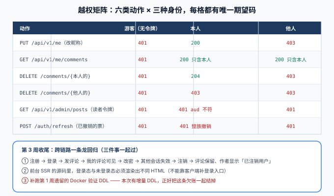

# 验收与第 3 周收尾

本页是[读者账号与权限](../index.md)的验收侧收口，同时也是周期 4 第 3 周（第 105~111 天 · 联调 + 测试）的收尾记录。



::: warning 本页的验收清单是判据，不是实测输出
账号模块的实现与构建没有在编写环境落地，因此下表是**判据**。请遵循「先证断言可被证伪，再看主流程」的顺序——这条纪律从第 103 天起就没变过。
:::

## 一句话定位

第 3 周的验收不是「功能都做了」，而是**三条链路上的判据同时成立**：账号自身的越权矩阵、跨链路的一条龙回归、以及十一道门禁全绿。前两条靠人对表，第三条靠机器。

## 一、越权矩阵：6 类动作 × 3 种身份

**每一格都用 `curl` 打，不走前端。**

| # | 动作 | 游客（无令牌） | 本人 | 他人 |
| --- | --- | --- | --- | --- |
| 1 | `PUT /api/v1/me`（改昵称） | `401` | `200` | `403` |
| 2 | `GET /api/v1/me/comments` | `401` | `200` **只含本人** | `200` **只含本人** |
| 3 | `DELETE /comments/{本人的评论}` | `401` | `204` | `403` |
| 4 | `DELETE /comments/{他人的评论}` | `401` | `403` | `403` |
| 5 | `GET /api/v1/admin/posts`（读者令牌） | `401` | `401`（`aud` 不符） | `401` |
| 6 | `POST /api/v1/auth/refresh`（已撤销的票） | `401` | `401`（整族撤销） | `401` |

::: tip 第 2 行的期望不是状态码，而是内容——这不影响它是一条判据
`/me/comments` 对本人和他人**都返回 `200`**，区别在列表内容。这说明一个容易搞混的点：**「我的评论」是过滤，不是权限**。它不是「能不能看」的问题，而是「看哪些」的问题。

所以它不能被写成 `403` 判据，只能写成**内容判据**：「返回的每一条评论的 `userId` 都必须等于令牌里的 `sub`」。第 4 行的写操作才是真正的权限判据——**同一份数据，读是过滤、写是权限**，两件事不能用同一条断言糊过去。
:::

| 反向也要有判据 | 期望 | 为什么 |
| --- | --- | --- |
| 管理端令牌打 `/api/v1/me` | `401` | 边界是双向的；只堵一个方向等于留了条反向通道 |
| 管理端令牌而 `admin_role = NULL` | `403` | 身份有效但无后台权限（第 99 天「默认拒绝」的兜底方向不变） |
| 游客令牌打 `POST /api/v1/posts/{slug}/comments` | `401` 先于所有可见性判断 | 沿用[评论链路](../../Comments/index.md) 的 `T7` |

::: danger 第 6 行是最容易被漏掉的一格
「已撤销的 refresh 再请求」看起来只是「会失败」，但它必须**同时**满足两件事：返回 `401`，**并且该族其他票也全部失效**。

只测前半句会漏掉整族撤销，而整族撤销正是复用检测的全部价值。反过来说：如果实现里只把「被使用的那一张票」标为撤销、没有处理同族，那么攻击者拿到一张旧票后，用户正常刷新的那条链**仍然有效**——两边都能用，谁也不会发现。
:::

## 二、账号模块自身的验收清单

| # | 判据 | 期望 | 对应断言 |
| --- | --- | --- | --- |
| 1 | 注册创建的账号是「待验证」 | 新账号 `status = PENDING`，且**不带任何令牌** | `A3` `B1` |
| 2 | 未验证不可写 | `PENDING` 发评论 `403` | `A6` |
| 3 | 登录失败不可区分 | 用户名不存在 / 口令错 / 已注销，三者在剥掉 `traceId` 后逐字节相同 | `A5` |
| 4 | 邮箱不泄漏 | 已占用邮箱注册返回 `202`，与全新邮箱一致 | `A4` `B1` |
| 5 | 冻结账号状态码 | 登录返回 `423`，响应不含冻结原因 | `A6` |
| 6 | 注销不删行 | 注销后行仍在、`status = CLOSED`、用户名与邮箱已被打散；历史评论保留 | `B1` |
| 7 | 注销显示口径 | 其评论作者显示为「已注销用户」 | `B1` |
| 8 | 令牌轮换 | 旧 refresh 用一次即失效，新票可用 | `A7` |
| 9 | 复用检测整族撤销 | 用已撤销票后，该族其他票全失效 | `A8` |
| 10 | 登出即时生效 | 不等 access 自然过期 | `B2` |
| 11 | 改密影响面 | 当前族保留、其他族失效、旧口令不可再登录 | `B4` |
| 12 | 并发刷新 | 同一 refresh 并发两次，恰好一成一败 | `B3` |
| 13 | 频控 | 窗口内第 6 次 `429`；不存在的用户名也计数 | `B5` |
| 14 | 口令上限 | 257 字节 `400`，不进入哈希计算 | `A2` |
| 15 | 哈希参数升级 | 旧参数记录登录成功后自动重算 | `A1` |
| 16 | 不串号 | 两账号并发请求互不污染 | `B6` |
| 17 | 公共页无身份片段 | 未登录抓到的文章页 HTML 里搜不到「我的评论」 | 见[页面页](../Pages/index.md) |
| 18 | 回跳白名单 | `//evil.com`、`https://evil.com`、`/\evil.com` 都不发生站外跳转 | 见[页面页](../Pages/index.md) |

## 三、跨链路一条龙回归

第 3 周的收尾是三件事一起过，缺一件都不算收口。

### ① 十一道门禁全绿

```shell
cd your-project/service
python skeleton_check.py                                  # 结构：checks = 27  failed = 0
mvn test                                                  # 语义：A1~A10 全绿
export SERVER_PORT=18080 && cd blog-application && mvn spring-boot:run
cd .. && python api_smoke.py        --base http://127.0.0.1:18080   # cases = 9   passed = 9
python admin_smoke.py      --base http://127.0.0.1:18080   # steps = 37  passed = 37
python lifecycle_smoke.py  --base http://127.0.0.1:18080   # steps = 24  passed = 24
python visibility_smoke.py --base http://127.0.0.1:18080   # steps = 22  passed = 22
python comment_smoke.py    --base http://127.0.0.1:18080   # steps = 28  passed = 28
python search_smoke.py     --base http://127.0.0.1:18080   # steps = 9   passed = 9
python account_smoke.py    --base http://127.0.0.1:18080   # steps = 22  passed = 22  ← 本日新增
cd your-project/frontend && pnpm build && node .output/server/index.mjs &
cd .. && python ssr_smoke.py --base http://127.0.0.1:3000 --api http://127.0.0.1:18080  # steps = 10  passed = 10
python assertion_audit.py                                  # PASS
```

### ② 一条龙：一个读者从注册到注销的完整轨迹

```text
注册（PENDING，不发令牌）
  → 邮件验证（本地：验证链接从服务端日志取）→ ACTIVE
  → 登录（下发 access + refresh，access 走 Cookie）
  → 在一篇 PUBLISHED 文章下发一条评论（201，楼层号分配成功）
  → GET /api/v1/me/comments 能看到这条，且能跳回原文定位
  → 改口令（当前会话保留，另一个「设备」的会话失效）
  → 注销（status = CLOSED，用户名与邮箱被打散）
  → 该评论仍出现在文章评论列表里，作者显示为「已注销用户」
  → 用原用户名登录 → 401，且与「用户名不存在」逐字节一致
```

::: danger 这条链路上有三处「单接口测不出来」的地方
1. **改口令的「当前会话保留」**：如果实现是「撤销该用户全部令牌」，本机也会被踢下线——单看「旧口令不能登录」是绿的，用户体验是坏的。必须有一格专门断言「当前会话仍然可用」。
2. **注销与评论的先后语义**：注销后评论必须**仍然可见**。如果实现里顺手做了「注销即删除评论」，功能测试全绿、合规上是灾难（用户说的话被平台单方面抹掉）。这一格要留断言。
3. **注销后原用户名仍不可登录**：因为用户名被「打散」（如改成 `closed_<id>`），原用户名在唯一索引上是空闲的——**但它不能被复用**，否则新用户注册同一名字就会「继承」历史评论的显示。判据是：注销后原用户名登录 `401`，且注册该用户名时**是否允许**必须有一个明确决定（本项目的决定是**不允许**，理由见下）。
:::

| 连带决定 | 结论 | 理由 |
| --- | --- | --- |
| 注销后原用户名可否被别人注册 | **不允许，进保留名单** | 允许复用会让「张三」这个显示名继承另一位张三的历史评论，等于身份混淆 |
| 注销后原邮箱可否再注册 | **允许** | 邮箱是私有凭据，不像用户名那样对外可见；不允许等于把用户的邮箱永久锁在本站 |
| 注销是否级联删评论 | **不删** | 评论是「文章上下文的一部分」，删掉会让别人的楼中楼出现断裂；显示为「已注销用户」即可 |

### ③ 补跑第 1 周遗留的 Docker 验证 DDL

这是第 1 周就该结、一直挂着的欠账（[数据库设计](../../DatabaseDesign/index.md)里那条命令当时标注为「无 Docker 时待本地验证」）。本日新增了增量 DDL，正好一起结掉。

```shell
cd your-project/service

# 基线与增量连续执行
docker run --rm -i mysql:8.4 mysql -uroot -proot -e "
  CREATE DATABASE IF NOT EXISTS blog DEFAULT CHARSET utf8mb4;
  USE blog; SOURCE /dev/stdin;" < db/mysql/V1__blog_init.sql
# 期望：无报错，SHOW TABLES 列出 7 张表

docker run --rm -i mysql:8.4 mysql -uroot -proot blog -e "SOURCE /dev/stdin" \
  < db/mysql/V2__reader_account.sql
# 期望：无报错

# 结构核对
docker run --rm -i mysql:8.4 mysql -uroot -proot blog -e "
  SELECT COUNT(*) AS tables_ FROM information_schema.tables WHERE table_schema='blog';
  SHOW COLUMNS FROM users LIKE 'status';
  SHOW COLUMNS FROM users LIKE 'admin_role';"
# 期望：tables_ = 8（7 张业务表 + user_tokens）；status 存在；admin_role 可空

# 双方言一致性
python api/parity_check.py          # 期望 PASS
```

## 四、第 3 周验收结论

| 周里程碑判据（周期 4 第 3 周） | 状态 | 说明 |
| --- | --- | --- |
| 联调通过 | ✅ 判据已定 | 十一道门禁 + 越权矩阵 + 一条龙回归三段清单 |
| 自动化测试全绿 | ✅ 判据已定 | `A1~A10` 进 `mvn test`、`B1~B6` 留冒烟，共 16 条断言 |
| 评论链路通 | ✅ 第 105~106 天 | `comment_smoke` 28 步 |
| 中文搜索可用 | ✅ 第 107 天 | `search_smoke` 9 步，`Q7` 断言走 `ft_posts_search` |
| 前台 SSR 可用 | ✅ 第 108 天 | `ssr_smoke` 10 步 |
| 读者账号可用 | ✅ 第 109 天（本日） | `account_smoke` 22 步 |
| **压测达标** | ⏳ **顺延到第 119 天** | 见下 |

::: warning 一处刻意的排期调整，写清楚以免被当成漏项
第 3 周的里程碑里有「压测达标」，但轮换表第 119 行是「当月项目：联调与压测」。两处对「压测该在哪天」的说法不一致。

**本日的处理是明确顺延**：压测需要稳定的部署形态与监控口径（第 4 周的事），现在压出来的数字既不可比、也不会被复用。把它和联调放在同一天（第 119 天）做，才能「压测 → 定位瓶颈 → 优化 → 复压」形成闭环。

所以第 3 周的实际收口是**两条**（联调通过、自动化测试全绿），压测作为已知顺延项登记在案——**顺延要写出来，不能靠「反正以后会做」**。
:::

## 五、上线前自查（账号维度）

| # | 自查项 | 期望 |
| --- | --- | --- |
| 1 | `JWT_SECRET` 无默认值 | 缺少环境变量时**启动失败**，不是回落到开发密钥 |
| 2 | 引导管理员凭据来自环境变量 | 表里已有管理员时跳过引导，并打印一行「已跳过」 |
| 3 | 引导用的环境变量是否仍存在 | 上线后应移除；留着也只是多一行日志，但应移除 |
| 4 | 生产配置里没有任何明文口令 | 出现 `password:`（而非 `password-hash:`）时启动失败（第 99 天口径） |
| 5 | Cookie 属性 | `HttpOnly` + `Secure` + `SameSite=Lax`；`refresh_token` 的 `Path` 已收窄 |
| 6 | 登录频控键有 TTL | Redis 里不存在永不过期的 `login:fail:*` 键 |
| 7 | 审计日志可查 | 登录成功/失败、改密、注销、整族撤销五类都有记录 |
| 8 | 验证邮件未接真实服务 | 上线前必须替换发送实现，否则用户永远等不到验证链接 |
| 9 | `public` 页无身份片段 | 文章页 HTML 的缓存头仍是 `public`，且响应体与用户无关 |
| 10 | 种子数据已清 | 本地调试造的 `alice/bob` 等账号不进生产库 |

## 六、已知未做与风险登记

| 项 | 影响 | 处置 |
| --- | --- | --- |
| 注册接口接受邮箱枚举（仅用户名 `409`） | 攻击者可判定邮箱是否注册 | 本模块用频控 + 审计缓解；接 SMTP 后补「有人尝试注册」提示邮件 |
| 无 MFA | 口令泄漏即账号失守 | 明确不做（见[需求页范围裁剪](../Requirements/index.md)） |
| 无第三方登录 | 注册转化受限 | 明确不做，协议层知识见 [OAuth 2.1 与 OIDC](../../../../../docs/Backend/Auth/Oauth2/index.md) |
| 会话列表的设备识别只到 UA 摘要 | 无法精确到设备 | 可接受：它的用途是「看见异常会话」，不是取证 |
| 压测未做 | 并发容量未知 | 顺延到第 119 天，届时与联调合并成闭环 |
| 邮件服务未接 | 生产环境注册流程断在第一环 | **上线阻塞项**，必须在上线前替换发送实现 |

## 七、验证方式

```shell
cd your-project/service

# 判据：先证可证伪，再看全绿
python account_smoke.py --selftest                    # 期望 22/22
mvn test                                              # 期望 A1~A10 全绿
python assertion_audit.py                             # 期望 PASS

# 一条龙回归（第 3 周收尾）
python account_smoke.py --base http://127.0.0.1:18080 # 期望 steps = 22  passed = 22
python assertion_audit.py                             # 期望 PASS

# DDL 欠账
docker run --rm -i mysql:8.4 mysql -uroot -proot blog -e "SOURCE /dev/stdin" \
  < db/mysql/V2__reader_account.sql                   # 期望无报错
python api/parity_check.py                            # 期望 PASS
```

| 判据 | 期望 |
| --- | --- |
| 越权矩阵 18 格 | 逐格命中期望（状态码或内容） |
| 账号验收 18 项 | 全部满足 |
| 一条龙回归 | 从注册到注销全链路无阻塞，注销后评论可见且作者显示「已注销用户」 |
| 十一道门禁 | 全绿 |
| DDL 欠账 | V1 + V2 连续执行无报错，`parity_check.py` PASS |

## 参考资料

- 上一页：[测试与断言分层](../Tests/index.md) ｜ 章节入口：[读者账号与权限](../index.md)
- 相邻章节：[测试分层收口](../../TestLayers/index.md) ｜ [判据收口与分类标签联调](../../Consolidation/index.md) ｜ [进展记录](../../Progress/index.md)
- 方法论：[完整项目交付 · 验收与上线](../../../../../docs/Others/ProjectDelivery/Delivery/index.md)
- 外部规范：[OWASP Authentication Cheat Sheet](https://cheatsheetseries.owasp.org/cheatsheets/Authentication_Cheat_Sheet.html) ｜ [RFC 9700](https://www.rfc-editor.org/rfc/rfc9700)
