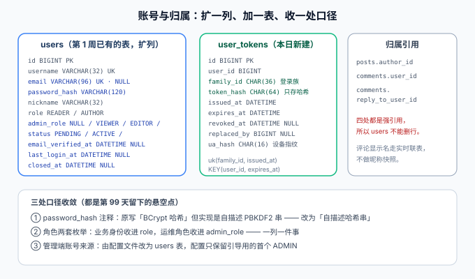

# 表设计：扩一列、加一表、收三处口径

本页是[读者账号与权限](../index.md)的数据侧收口。第 1 周的[数据库设计](../../DatabaseDesign/index.md)已经把 `users` 表画进 ER 图，本页只做三件事：**给 `users` 补上读者真正需要的列**、**新建 `user_tokens`**、以及**把第 99 天留下的三处悬空口径收敛掉**。



::: warning 本页只有设计，没有可运行 SQL 文件
下面的 `V2__reader_account.sql` 是**要你在自己工程里创建的文件**，代码块给的是完整内容。本仓不提交 SQL。
:::

## 一句话定位

这一页最重要的不是新列，而是三个**「文档写了 A、实现做了 B」的悬空点**——它们不会让构建失败，只会让下一个人照着文档改出问题。

## 一、`users` 的增量列

```sql [db/mysql/V2__reader_account.sql（第 1 段）]
-- ① 先把存量账号按「它们本来就已验证」的语义加进来
ALTER TABLE users
    ADD COLUMN email             VARCHAR(96)  NULL COMMENT '登录邮箱，未填为 NULL',
    ADD COLUMN admin_role        VARCHAR(16)  NULL COMMENT '后台角色 VIEWER/EDITOR/ADMIN，NULL=无后台权限',
    ADD COLUMN status            VARCHAR(16)  NOT NULL DEFAULT 'ACTIVE' COMMENT 'PENDING/ACTIVE/FROZEN/CLOSED',
    ADD COLUMN email_verified_at DATETIME     NULL COMMENT '邮箱验证通过时间',
    ADD COLUMN last_login_at     DATETIME     NULL COMMENT '最近一次登录成功时间',
    ADD COLUMN closed_at         DATETIME     NULL COMMENT '注销时间，仅 CLOSED 有值',
    MODIFY COLUMN password_hash  VARCHAR(120) NOT NULL COMMENT '自描述哈希串：算法与参数都写在串里',
    MODIFY COLUMN role           VARCHAR(16)  NOT NULL DEFAULT 'READER' COMMENT '业务身份 READER/AUTHOR',
    ADD UNIQUE KEY uk_users_email (email),
    ADD KEY idx_users_status (status);

-- ② 回填存量行的语义（管理端账号第 99 天就已存在并已验证）
UPDATE users SET email_verified_at = created_at WHERE status = 'ACTIVE' AND email_verified_at IS NULL;

-- ③ 最后才把默认值改成「新注册账号该有的值」
ALTER TABLE users ALTER COLUMN status SET DEFAULT 'PENDING';
```

::: danger `ADD COLUMN ... DEFAULT` 会连带改写存量行，顺序不能反
MySQL 给已有表加一个带 `DEFAULT` 的列时，**存量行会一次性被写成那个默认值**。如果一上来就 `DEFAULT 'PENDING'`，第 99 天建的、本来能正常工作的管理端账号会全部变成「待验证」——登录还能进，但任何写操作都会被 `US-07` 的「未验证不可写」拦下，而且现象是「昨天还好好的，今天全部 `403`」。

正确顺序是三步：**按存量语义加列 → 回填 → 再改默认值**。这也正是[完整项目交付 · 数据建模](../../../../../docs/Others/ProjectDelivery/DataModel/index.md)里「迁移六步法」强调「先备份、再改结构、最后改语义」的原因：改结构和改语义必须是两个可分别回滚的动作。
:::

| 新列 | 为什么需要它 | 不用它会怎样 |
| --- | --- | --- |
| `email` | 验证与找回的唯一凭据 | 只能靠用户名找回，而用户名是公开标识 |
| `admin_role` | 把运维角色与业务身份分开（见下文口径 ②） | 两套枚举挤在一列，`VIEWER` 与 `READER` 谁大谁小无法回答 |
| `status` | 账号生命周期（`US-07`~`US-09`）的状态载体 | `PENDING` / `FROZEN` / `CLOSED` 三种语义无处表达 |
| `email_verified_at` | 「未验证不可写」的时间证据 | 只能靠布尔位，审计时问不出「什么时候验的」 |
| `last_login_at` | 会话列表与异常登录排查 | 无法回答「这个账号最近有没有在用」 |
| `closed_at` | 注销时间点 | 注销后无法判定「注销发生在某条评论之前还是之后」 |

::: tip `uk_users_email` 与 NULL 的关系
`email` 允许 `NULL`（本地调试、老账号），而唯一索引下**多个 `NULL` 不算重复**——这是 MySQL 与 PostgreSQL 一致的行为，所以双方言都不需要额外处理。反过来说：**不能**为了「绕过唯一索引」把空邮箱写成空字符串 `''`，那样第二个空邮箱就会撞唯一键。
:::

## 二、`user_tokens`：这张表存在的唯一理由是「反悔」

```sql [db/mysql/V2__reader_account.sql（第 2 段）]
CREATE TABLE user_tokens (
    id             BIGINT      NOT NULL COMMENT '雪花 ID',
    user_id        BIGINT      NOT NULL COMMENT '归属用户 → users.id',
    family_id      CHAR(36)    NOT NULL COMMENT '登录族：一次登录一个，整族一起撤销',
    token_hash     CHAR(64)    NOT NULL COMMENT 'SHA-256(令牌明文) 的十六进制，不存明文',
    issued_at      DATETIME    NOT NULL DEFAULT CURRENT_TIMESTAMP,
    expires_at     DATETIME    NOT NULL COMMENT '到期时间，同时用于闲置过期',
    revoked_at     DATETIME    NULL COMMENT '撤销时间，NULL = 仍然有效',
    revoked_reason VARCHAR(24) NULL COMMENT 'LOGOUT/PASSWORD_CHANGE/FROZEN/REUSE',
    replaced_by    BIGINT      NULL COMMENT '轮换后指向新记录，复用检测的线索',
    ua_hash        CHAR(16)    NULL COMMENT 'User-Agent 摘要，仅用于会话列表展示',
    PRIMARY KEY (id),
    UNIQUE KEY uk_user_tokens_hash (token_hash),
    KEY idx_user_tokens_family (family_id),
    KEY idx_user_tokens_user_alive (user_id, expires_at)
) ENGINE = InnoDB DEFAULT CHARSET = utf8mb4 COLLATE = utf8mb4_0900_ai_ci COMMENT '刷新令牌';
```

| 设计点 | 结论 | 理由 |
| --- | --- | --- |
| access 要不要落库 | **不落库** | 寿命 15 分钟，靠 HS256 验签兜住成本；每个请求零 IO |
| refresh 落不落库 | **必须落** | 登出、改密、冻结、泄漏检测四件事都要求它**能即时作废**；无状态令牌做不到 |
| 存明文还是哈希 | **只存 `SHA-256`** | 令牌本身就是凭据；明文入库等价于把「登录态」明文写进数据库备份 |
| 为什么是 SHA-256 而不是 PBKDF2 | **因为令牌是 256 位随机数，不是人选的** | 慢哈希是为了抵抗「弱口令 + 字典」，对高熵随机串没有收益，反而让每 15 分钟一次的刷新变慢。口令与令牌要用两套不同的哈希，这是常见误区 |
| 一行一个令牌还是按用户一行 | **一行一个令牌** | 一次登录一行，才能表达「多设备并存」与「单独撤销某一台设备」 |
| `family_id` 解决什么 | **整族撤销** | 检测到泄漏时，作废的不是「这一个旧令牌」，而是「这一次登录派生出的全部令牌」 |
| `replaced_by` 解决什么 | **区分「用错」与「用旧」** | 撤销原因是 `LOGOUT` 时收到旧令牌属于异常；原因是「已被轮换」时才进入复用检测。没有这一列就无法区分 |
| `ua_hash` 存原文行吗 | **不行** | `User-Agent` 是可识别的个人数据，会话列表只需要「是不是同一台设备」，摘要足够 |

::: danger 两个高频写错点
1. **`token_hash` 上必须有唯一索引**：刷新接口的第一步是「按哈希查这一行」，没有索引就是每次刷新一次全表扫描——而刷新是**最高频**的鉴权操作，比登录频繁得多。
2. **`token_hash` 不能是 `VARCHAR` 却按前缀查询**：曾经有人为了「支持模糊匹配」把哈希存成前 16 位，结果碰撞概率从天文数字级掉到生日问题级——**把全域哈希截断，等于把签名算法降级成校验和**。
:::

## 三、三处悬空口径的收敛

这三处都是第 99 天与第 1 周之间留下的「文档与实现各说各话」，不会报错，但会误导下一个人。

### 口径 ①  `password_hash` 到底存的是什么

| 出处 | 说的是什么 | 问题 |
| --- | --- | --- |
| 第 1 周[数据库设计](../../DatabaseDesign/index.md) | 列注释写「BCrypt 哈希」 | 与实际实现不符 |
| 第 99 天[管理端认证与角色](../../AuthRoles/index.md) | 实现是自描述串 `pbkdf2-sha256$迭代$盐$哈希` | 那注释就是错的 |

**收敛为**：列注释改成「自描述哈希串：算法与参数都写在串里」，列宽从 `VARCHAR(100)` 放宽到 `VARCHAR(120)`（为将来换 Argon2id 预留——`$argon2id$v=19$m=19456,t=2,p=1$` 这类前缀比 PBKDF2 更长）。

同时**把迭代参数对齐到当前基线**：第 99 天写的是 120,000 次，而 OWASP 现行基线是 **PBKDF2-HMAC-SHA256 ≥ 600,000 次**（见[参考资料](#参考资料)，核对时间 2026-10）。120,000 不是「错」，是**按旧基线定的、随硬件贬值**的参数——这正是自描述串存在的价值：**不用改表、不用改密，登录成功时顺手重算一次就完成了升级**。

```java [PasswordHasher.java 升级判据（结构示意）]
// 参数写进存储串，因此「当前参数」与「这条记录的参数」可以不同
private static final String PREFIX = "pbkdf2-sha256";
private static final int ITERATIONS = 600_000;   // 现行基线；旧记录可能是 120_000
private static final int SALT_BYTES = 16;
private static final int KEY_BITS  = 256;

/** 验证 + 顺带升级：只在这一个地方改，调用方无需知道 */
boolean verifyAndUpgrade(String raw, UserRow row, Consumer<String> persistNewHash) {
    StoredHash stored = StoredHash.parse(row.passwordHash());
    boolean ok = MessageDigest.isEqual(stored.derive(raw), stored.expected());
    if (ok && stored.iterations() < ITERATIONS) {
        persistNewHash.accept(hash(raw));        // 参数落后的记录，登录即升级
    }
    return ok;
}
```

::: tip 换算法（而不只是换参数）时同理
先让**新注册/新改密的用户**用新算法，老记录靠「登录即升级」逐步迁移，最后剩下的就是长期不登录的僵尸账号——那时候再决定要不要强制重置。**永远不要为了换算法搞一次「全员改密」**。
:::

### 口径 ②  两套角色枚举挤在一列

| 出处 | 枚举 | 语义 |
| --- | --- | --- |
| 第 1 周 DDL | `users.role` ∈ `ADMIN` / `AUTHOR` / `READER` | 业务身份 |
| 第 99 天实现 | `AdminRole` ∈ `VIEWER` / `EDITOR` / `ADMIN` | 后台权限，**有序**、可按「至少达到」比较 |

**收敛为**：一列一件事。

| 列 | 取值 | 使用者 |
| --- | --- | --- |
| `role` | `READER` / `AUTHOR` | 读者端。决定「能不能写文章」，与后台无关 |
| `admin_role` | `NULL` / `VIEWER` / `EDITOR` / `ADMIN` | 管理端。`NULL` = **无后台权限**，与第 99 天「默认拒绝」的兜底方向一致 |

::: danger 为什么不能继续挤在一列
两套枚举取值有重叠（都有 `ADMIN`），但**语义不同**：`role=ADMIN` 说的是「这个人是站长」，`AdminRole.ADMIN` 说的是「这个人的后台权限等级是 3」。

挤在一列的直接后果：`AdminRole.VIEWER` 该映射成 `role=READER` 吗？如果映射，那么「只读后台的运营」和「纯读者」在库里长得一模一样——**权限系统里最危险的词就是「长得一样」**。拆成两列后，`admin_role IS NULL` 是一个可判定的、明确的「没有后台权限」。
:::

### 口径 ③  管理端账号从哪来

第 99 天管理端账号写在 `application-prod.yml` 的 `blog.auth.users` 里——那时还没有任何「用户表可用于登录」的设计，配置是最短路径。

**收敛为**：账号进 `users` 表，配置只保留**引导用的首个管理员**。

| 阶段 | 账号来源 | 说明 |
| --- | --- | --- |
| 第 99 天 | 配置文件（`password-hash`） | 无表可用，配置是最短路径 |
| 第 109 天起 | `users` 表（`admin_role IS NOT NULL`） | 与读者共用一张表，账号治理只有一处 |
| 引导通道 | 环境变量（`BOOTSTRAP_ADMIN_*`） | 只在「表里一个管理员都没有」时生效，创建完成后即失效 |

::: danger 引导通道必须自失效
「首个管理员由环境变量创建」是一个**只能发生一次**的动作。如果它每次都生效，那么只要环境变量还在，任何人都能用一个已知凭据重新造出一个管理员账号——而这通常发生在「上线后忘了删变量」。

判据写成：**启动时先查 `SELECT COUNT(*) FROM users WHERE admin_role = 'ADMIN'`，非 0 则跳过引导，并打印一行「已存在管理员，跳过引导」**。这样「忘记删变量」的后果退化成一个日志行，而不是一个后门。
:::

## 四、归属关系：显示名走实时联表，不做快照

`comments.user_id`、`comments.reply_to_user_id`、`posts.author_id` 三处都是指向 `users.id` 的强引用，本页新增列不改变它们。这里只需要定一件事：**评论列表里的作者显示名，是存快照还是联表取？**

| 方案 | 优点 | 缺点 | 结论 |
| --- | --- | --- | --- |
| 存昵称快照（`comments.author_name`） | 读侧零 JOIN | 改一次昵称，历史评论全是旧名字；且快照与会话中的昵称不一致时无法自证哪个是对的 | 否 |
| **实时联表（本方案）** | 改昵称全局即时生效；数据只有一处 | 评论列表多一次 JOIN | **采用** |
| 只存 `user_id` 且不联表，前端补 | — | 前端拿不到其他用户的昵称，等于泄漏一个用户查询接口 | 否 |

::: warning 顺带确定的注销显示口径
读者注销后（`status = CLOSED`），历史评论**保留**，作者显示为「已注销用户」。

判据：`GET /api/v1/posts/{slug}/comments` 中，`CLOSED` 用户的评论作者名必须是「已注销用户」而不是原昵称——**注销的意义就是名字不再可见**，如果评论里还挂着原名，注销就是假的。
:::

## 五、双方言与索引核对

| 站点 | MySQL 8.4 | PostgreSQL 17 | 说明 |
| --- | --- | --- | --- |
| 时间列 | `DATETIME` | `TIMESTAMP` | 沿用第 92 天 parity 规则的既有映射 |
| 定长字符 | `CHAR(36)` / `CHAR(64)` | `CHAR(36)` / `CHAR(64)` | 一致，无需翻译 |
| 幂等建表 | `CREATE TABLE IF NOT EXISTS` | 同 | 一致 |
| 加列改默认值 | `ALTER TABLE ... ALTER COLUMN ... SET DEFAULT` | 同语法 | 一致（MySQL 8 起统一） |
| 唯一索引下的 NULL | 多个 `NULL` 不冲突 | 同 | 一致，`email` 允许 `NULL` 无需额外处理 |

`parity_check.py` 要求两份 DDL 的**列名、类型类别、可空性、索引名**逐项对齐；本页新增的两个索引名 `uk_users_email`、`uk_user_tokens_hash` 在两份文件里必须完全同名。

## 六、验证方式

```shell
cd your-project/service

# ① 增量 DDL 可执行（结掉第 1 周遗留的这条欠账）
docker run --rm -i mysql:8.4 mysql -uroot -proot -e "
  CREATE DATABASE IF NOT EXISTS blog DEFAULT CHARSET utf8mb4;
  USE blog; SOURCE /dev/stdin;" < db/mysql/V1__blog_init.sql
# 期望：无报错退出，SHOW TABLES 列出 7 张表
docker run --rm -i mysql:8.4 mysql -uroot -proot blog -e "SOURCE /dev/stdin" \
  < db/mysql/V2__reader_account.sql
# 期望：无报错退出

# ② 结构核对（两份方言 + 索引名）
python api/parity_check.py
# 期望：PASS，列与索引逐项对齐

# ③ 三处口径的实际效果
docker run --rm -i mysql:8.4 mysql -uroot -proot blog -e "
  SHOW COLUMNS FROM users LIKE 'password_hash';   -- 期望 VARCHAR(120)，注释为自描述哈希串
  SHOW COLUMNS FROM users LIKE 'admin_role';      -- 期望可空，默认 NULL
  SELECT COUNT(*) FROM users WHERE admin_role IS NULL;"
# 期望：第 4 条命令返回的行数 = 读者账号数（默认无后台权限）
```

| 判据 | 期望 |
| --- | --- |
| 增量脚本在 V1 之上可执行 | 两个脚本连续执行无报错 |
| 存量账号不被误改成 `PENDING` | 执行完 V2 后，第 99 天建的账号 `status = 'ACTIVE'` |
| 新注册账号默认未验证 | 不写 `status` 插入一行，读到 `PENDING` |
| `parity_check.py` | PASS |

## 参考资料

- 上一页：[需求与验收条件](../Requirements/index.md) ｜ 下一页：[接口设计](../API/index.md)
- 既有数据设计：[数据库设计](../../DatabaseDesign/index.md) ｜ 方法论：[完整项目交付 · 数据建模](../../../../../docs/Others/ProjectDelivery/DataModel/index.md)
- 技术专题：[认证与授权 · 权限模型](../../../../../docs/Backend/Auth/Authorization/index.md) ｜ [MySQL 索引深入](../../../../../docs/DB/Relational/MySQL/IndexDeepDive/index.md)
- 外部规范：[OWASP Password Storage Cheat Sheet](https://cheatsheetseries.owasp.org/cheatsheets/Password_Storage_Cheat_Sheet.html)（PBKDF2 现行基线 600,000 次；Argon2id `m=19456, t=2, p=1`）｜ [RFC 9700 OAuth 2.0 Security BCP](https://www.rfc-editor.org/rfc/rfc9700)
