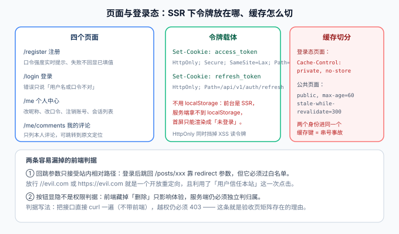

# 页面与登录态

本页是[读者账号与权限](../index.md)的前端侧收口。四个页面本身不难，难的是它们**跑在 SSR 里**：服务端没有 `localStorage`，页面会被缓存，而缓存一旦按错维度分桶，就会出现「A 的页面被 B 看到」这种线上事故。



::: warning 本页只有设计，没有可运行代码
`useAuth.ts`、`AuthCookieFilter.java`、`nuxt.config.ts` 的增量片段都是**要你在自己工程里创建的内容**。前台框架与渲染模式沿用[前台 SSR](../../FrontendSSR/index.md) 与 [Nuxt 专题](../../../../../docs/Frontend/Frame/Nuxt/index.md)。
:::

## 一句话定位

读者账号在前端只有一条主线：**登录态是一个「每用户一份」的数据**。它能不能被服务端渲染、能不能进缓存、能不能被前端 JS 读到，三个问题的答案必须一致——**不一致就是事故**。

## 一、四个页面与各自的一条硬规矩

| 页面 | 做什么 | 那条硬规矩 |
| --- | --- | --- |
| `/register` | 用户名 / 邮箱 / 口令 / 昵称 | 口令强度**实时提示**，但提交失败时**不回显已填口令**（回显等于把它写进 HTML） |
| `/login` | 登录，支持回跳 | 错误文案**只说「用户名或口令不正确」**，与接口页的 `3001` 口径一致 |
| `/me` | 改昵称、改口令、注销、活跃会话列表 | 改口令要**二次输入当前口令**；注销要**输入用户名确认**（不可逆操作不能靠一次点击） |
| `/me/comments` | 我的评论，可跳回原文定位 | 列表**只从 `/api/v1/me/comments` 取数**，不在前端过滤全站评论 |

::: danger `/me/comments` 为什么必须走独立接口
「前端拉全站评论再按 `userId` 过滤」是一种能跑通、能演示、看起来也没问题的写法。它的问题不在性能，而在**它把不属于你的数据发到了你的浏览器里**——打开 DevTools 就能看到所有人的评论（含未通过审核的）。

判据很简单：**任何「只应看到一部分」的列表，过滤必须发生在服务端**。这与[可见性收敛](../../Visibility/index.md)是同一条原则，只是对象从「文章」换成了「评论」。
:::

## 二、令牌载体：httpOnly Cookie，不是 localStorage

| 方案 | XSS 能读到吗 | SSR 能读到吗 | 结论 |
| --- | --- | --- | --- |
| `localStorage` | **能**，脚本一行就取走 | **不能**（服务端没有这个对象） | 否 |
| 普通 Cookie | 能（`document.cookie`） | 能 | 否 |
| **httpOnly Cookie** | 不能 | **能**（请求头里带着） | **采用** |
| 内存变量 | 不能 | 不能 | 否 |

| Cookie | 值 | 属性 | 理由 |
| --- | --- | --- | --- |
| `access_token` | access JWT | `HttpOnly; Secure; SameSite=Lax; Path=/; Max-Age=900` | 全站需要，寿命与令牌一致 |
| `refresh_token` | 不透明随机串 | `HttpOnly; Secure; SameSite=Lax; Path=/api/v1/auth/refresh; Max-Age=2592000` | **只在这一个路径上发送**，其他接口连它长什么样都看不到 |

::: danger `refresh_token` 的 `Path` 必须收窄
`Path=/` 是最省事的写法，也是最容易被利用的写法：此后**站内任何一个接口**（包括将来某个有 XSS 或日志打印请求头的接口）的请求里都会带上这枚 30 天有效的凭据，而它唯一该出现的地方只有刷新接口一个。

收窄 `Path` 之后，「意外泄漏」的暴露面从「全站」缩到「一个路径」。这是几乎零成本的加固，**却最常被漏掉**。
:::

### CSRF：本模块的取舍

`SameSite=Lax` 的作用是：跨站的 `POST` 不带这个 Cookie。因此配合既有契约里的一条既有纪律，风险面已经很小：

| 前提 | 本项目是否满足 |
| --- | --- |
| 所有改变状态的接口都是 `POST` / `PUT` / `DELETE`（不用 `GET` 改状态） | 满足（见[接口契约](../../Contract/index.md)的状态码与幂等约定） |
| 跨站 `POST` 不带登录 Cookie | 满足（`SameSite=Lax`） |
| 顶级导航式的 `GET` 仍会带 Cookie | 是，但 `GET` 不改状态，所以无副作用 |

::: warning 一个必须写下来的已知边界
`SameSite=Lax` 挡的是「跨站发起的写请求」，**挡不住「同站被注入的脚本」**——那属于 XSS，防线在输出编码与 Markdown 消毒（第 101、108 天已做）。

本模块**不引入** CSRF token 双提交机制，理由是：在「全部写操作都是 `POST` 且 `SameSite=Lax`」的前提下，双提交的边际收益低于它带来的复杂度（要改所有表单、要处理 token 生命周期）。

但这条结论**有前提**。如果将来出现：① 需要支持跨站携带凭据的调用（如第三方嵌入）；② 出现用 `GET` 触发副作用的接口；③ 允许 `SameSite=None`——那么**必须回来补 CSRF token**。前提写在这里，就是为了让「哪天可以不做」不是一个需要重新论证的问题。
:::

## 三、SSR 下的登录态：三处必须做对

### 3.1 服务端读 Cookie 并转发

服务端渲染文章详情时要顺便取「我有没有登录、我是谁」，做法是把浏览器请求里的 Cookie 透传给后端：

```ts [server/utils/api.ts 结构示意]
export const apiFetch = <T>(event: H3Event, path: string, init: RequestInit = {}) => {
  return $fetch<T>(`${useRuntimeConfig().apiBase}${path}`, {
    ...init,
    headers: {
      ...init.headers,
      // 关键：把浏览器的 Cookie 原样转给后端，服务端才拿得到登录态
      cookie: getRequestHeader(event, 'cookie') ?? '',
      // 内部调用带上来源标记，后端据此跳过「必须来自浏览器」的校验
      'x-internal-call': 'nuxt-ssr',
    },
  })
}
```

### 3.2 缓存必须按「身份是否需要」切分

这是本节最要紧的一条。

| 页面 | 是否含身份相关内容 | 缓存策略 | 判据 |
| --- | --- | --- | --- |
| 文章详情、列表、搜索、分类标签页 | **不含**（正文与评论列表对所有人一致） | `public, max-age=60, stale-while-revalidate=300` | 与第 108 天口径一致，可继续被 CDN 缓存 |
| `/me`、`/me/comments` | **整页都是** | `private, no-store` | 每次请求回源 |
| 顶栏登录入口、评论输入区（在公共页里） | **是** | **不参与 SSR 输出**，改由客户端渲染 | 见 3.3 |

::: danger 公共页里的身份片段，是本章最容易出的事故
把「张三 / 退出登录」和评论输入框直接放进 SSR 输出，会让一篇文章的 HTML 变成**每用户不同**。接下来只有两条路，两条都难走：

- 把这一页改成 `private, no-store`：**首页与文章页失去 CDN 缓存**，而博客最依赖这两个页面的首屏与 TTFB；
- 加 `Vary: Cookie`：缓存命中率崩塌（几乎每个请求一个变体），而且**只要有一层 CDN 或反代忽略了 `Vary`，就会把 A 的页面发给 B**——泄漏的是登录用户昵称与「我的评论」链接。

本项目的选择是**第三条**：**让身份片段根本不进入 SSR 输出**。正文与评论列表仍是完整 SSR（SEO 判据不变），顶栏与评论框作为 `client-only` 组件在浏览器里挂载后渲染。代价是这两个区域有极短的空白，收益是**公共页的 HTML 真正与用户无关**——它可以从任何一层缓存安全地发给任何人。
:::

### 3.3 与第 108 天的 hydration 三红线一致

`client-only` 的做法天然绕开了 hydration 不匹配（服务端根本没渲染它），但仍要遵守第 108 天定下的三条红线：

| 红线 | 在本章的具体体现 |
| --- | --- |
| 不碰浏览器对象 | 只在 `onMounted` 之后读 `document` / `window` |
| 不用每次都变的值 | 不做 `Date.now()` 之类的 SSR 输出，时间戳一律在客户端生成 |
| key 顺序稳定 | 会话列表按 `issued_at DESC, id DESC` 排序（同分是常态），与[全文搜索](../../Search/index.md)的三级排序同理 |

## 四、回跳参数：开放重定向

「登录后跳回刚才那一页」靠 `?redirect=` 实现，而**任何接受 URL 的参数都是开放重定向的候选**。

| 校验步 | 规则 | 拦住的攻击 |
| --- | --- | --- |
| ① 必须是站内相对路径 | 以**单个** `/` 开头 | `//evil.com`、`https://evil.com` |
| ② 不得含协议分隔 | 不含 `:` | `javascript:`、`data:` |
| ③ 反斜杠一律拒绝 | 不含 `\` | 浏览器把 `/\evil.com` 当 `//evil.com` 处理，这一步专治它 |
| ④ 解析后同源 | `new URL(redirect, location.origin).origin === location.origin` | 兜底 |
| ⑤ 默认值 | 不合法时回落到 `/` | 失败要**安全失败**，不是报错 |

::: tip 为什么「登录后跳回」值得写一整节
因为它的攻击方式是**借用用户对本站的信任**：链接看起来是 `https://your-blog.com/login?redirect=https://evil-clone.com`，用户点进去、登录、然后被送到一个界面一模一样的钓鱼站。**用户全程都在「我们的域名」下操作**，这正是它比普通钓鱼更难识别的原因。
:::

## 五、按钮显隐不是权限

| 层面 | 职责 | 能不能作为判据 |
| --- | --- | --- |
| 前端隐藏「删除」按钮 | 体验：不给用户点了才报错 | **不能** |
| 服务端判 `comment.userId == token.sub` | **权限** | **能** |

```text
Given 读者 B 打开文章页，看不到自己无权删除的按钮
When B 用 curl 直接 DELETE /api/v1/comments/{A 的评论 id}（不带前端）
Then 返回 403 —— 这条就是权限的判据
```

::: danger 为什么必须用 `curl` 而不是「用浏览器点一遍」
浏览器的验证路径会经过前端所有判断，**前端已经拦掉的动作，你根本测不到服务端**。用浏览器点一圈得到的是「体验没问题」，而权限的正确性问题只会在「绕过前端」时才暴露——而真实攻击者从来不走前端。

所以[验收页](../Acceptance/index.md)那张 6 类动作 × 3 种身份的矩阵，**每一格都是用 `curl` 打的**。其中有一格是「读者令牌打管理端接口」，它存在的目的就是提醒：越权不只有「操作别人的数据」一种形态。
:::

## 六、`401` / `403` / `423` 的页面体验

| 状态码 | 页面行为 | 不能做什么 |
| --- | --- | --- |
| `401` | 跳登录页并带 `redirect` 参数（过第四节的白名单） | 不能什么都不做，也不能反复弹窗 |
| `403` | 渲染一个说明页：「你没有权限执行这个操作」+ 返回上一页 | **不能跳登录页**——用户明明已经登录了，跳登录只会让人以为自己的会话丢了 |
| `423` | 渲染冻结提示：账号被冻结 + 联系方式 | 不能暴露冻结原因（原因在服务端日志里） |
| `429` | 提示「尝试过于频繁，请稍后再试」+ 剩余等待时间 | 不能静默失败，否则用户会一直点 |

::: tip 一条前端纪律：状态码要能传到页面
`403` 与 `401` 的区分是**服务端给的**，前端的拦截器最容易犯的错是「所有非 2xx 都当请求失败，统一弹一个 toast」。那样 `403` 与 `429` 会混在一起，用户看到的是「系统错误」。

正确做法：拦截器**保留状态码**，由页面决定怎么渲染。这与[接口契约](../../Contract/index.md)里「错误响应走统一结构」配合起来，页面就能拿到 `code` 去分支。
:::

## 七、验证方式

```shell
cd your-project/frontend

# ① 身份片段不进 SSR 输出：未登录抓到的 HTML 里不应出现身份证片段
curl -s http://127.0.0.1:3000/posts/hello-world | grep -c '我的评论'
# 期望 0

# ② 公共页仍可被缓存（第 108 天口径不变）
curl -sI http://127.0.0.1:3000/posts/hello-world | grep -i cache-control
# 期望 public, max-age=60, stale-while-revalidate=300

# ③ 登录态专属页不可缓存
curl -sI http://127.0.0.1:3000/me | grep -i cache-control
# 期望 private, no-store

# ④ 回跳白名单：开放重定向必须被拦
for r in '//evil.com' 'https://evil.com' '/\evil.com'; do
  curl -sI "http://127.0.0.1:3000/login?redirect=$r" | grep -i '^location:'
done
# 期望：三者都不跳向站外（回落到 /）
```

| 判据 | 期望 |
| --- | --- |
| SSR 输出无身份片段 | 公共页 HTML 里搜不到「我的评论」「退出登录」 |
| 公共页可缓存 | `public, max-age=60, stale-while-revalidate=300` |
| 登录态页不缓存 | `private, no-store` |
| 回跳白名单 | 三种恶意 `redirect` 都不发生站外跳转 |
| 按钮显隐不是权限 | `curl` 直打越权接口仍 `403` |

## 参考资料

- 上一页：[接口设计](../API/index.md) ｜ 下一页：[测试与断言分层](../Tests/index.md)
- 相邻章节：[前台 SSR](../../FrontendSSR/index.md)（`useAsyncData` 与缓存头）｜ [可见性收敛](../../Visibility/index.md) ｜ [评论链路](../../Comments/index.md)
- 技术专题：[Nuxt 全栈开发](../../../../../docs/Frontend/Frame/Nuxt/index.md) ｜ [前端安全](../../../../../docs/Frontend/Others/Security/index.md)（XSS 与开放重定向）｜ [认证与授权 · 会话与 Cookie](../../../../../docs/Backend/Auth/Session/index.md)
- 外部规范：[OWASP Session Management Cheat Sheet](https://cheatsheetseries.owasp.org/cheatsheets/Session_Management_Cheat_Sheet.html) ｜ [OWASP CSRF Prevention Cheat Sheet](https://cheatsheetseries.owasp.org/cheatsheets/Cross-Site_Request_Forgery_Prevention_Cheat_Sheet.html) ｜ [MDN：Set-Cookie 与 SameSite](https://developer.mozilla.org/en-US/docs/Web/HTTP/Headers/Set-Cookie/SameSite)
