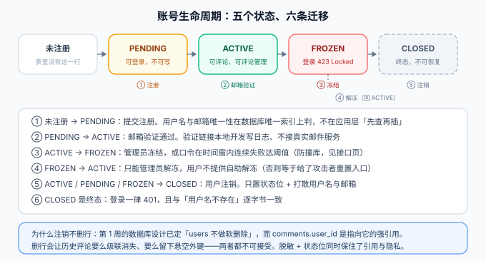

# 需求与验收条件：读者账号

本页是[读者账号与权限](../index.md)的需求侧收口，故事编号接[需求拆分与验收条件](../../Requirements/index.md)（那里到 `US-06`）。

## 一句话定位

读者账号不是「加一个注册页」，而是**给评论链路补上它一直假定存在的那个身份**。本页把这件事拆到能一眼判定做完没有：五个用户故事、一条生命周期、四条非功能要求，以及**第一期明确不做**的清单。



## 为什么这一块是硬依赖，不是「体验优化」

| # | 依赖 | 依据 |
| --- | --- | --- |
| ① | **评论需要稳定身份** | [评论链路](../../Comments/index.md)断言 `T7`「匿名发评论 `401` 先于 `403`」；`comments.user_id` 与 `reply_to_user_id` 是 `NOT NULL` 与强引用——**没有账号，这两列无法产生合法数据** |
| ② | **没有账号就防不住冒名** | 昵称只是个字符串时，任何人都能自称「站长」。`user_id` 是服务端认定的事实，昵称只是它的显示形式 |
| ③ | **可治理需要一个主体** | 封禁、限流、审计的对象只能是「一个账号」，不能是「一个昵称」或「一个 IP」 |

::: tip 一句话理解
第 ①③ 条决定了本模块**必须**在第 3 周落地而不是留到第 4 周：评论已经写完并且测过了，它测试用的那个「登录读者」在此之前只存在于测试脚本的假设里。
:::

## 账号生命周期

| 状态 | 含义 | 能做什么 | 不能做什么 |
| --- | --- | --- | --- |
| `PENDING` | 已注册，邮箱未验证 | 登录、看「我的评论」 | **发评论**、改昵称 |
| `ACTIVE` | 正常 | 全部读者动作 | — |
| `FROZEN` | 被冻结（违规或撞库命中） | 无 | 登录（`423`） |
| `CLOSED` | 用户主动注销 | 无 | 登录（`401`，且与用户名不存在不可区分） |

::: danger 三条最容易写错的生命周期约束
1. **未验证邮箱的账号能登录但不能写**：如果 `PENDING` 连登录都不允许，用户就没法在登录状态下点「重发验证邮件」——这条链会断在一个自相矛盾的设计上。所以约束要加在**写操作**上，而不是登录上。
2. **冻结与注销都不删行**：`users` 在第 1 周已定「不做软删除」（见[数据库设计](../../DatabaseDesign/index.md)），而 `posts.author_id`、`comments.user_id`、`comments.reply_to_user_id` 三处都是强引用。删行会让历史评论要么级联消失、要么悬空——**注销只能是「状态位 + 打散用户名与邮箱」**。
3. **冻结不能自助解冻**：给出自助解冻入口等于把封禁变成一次口令重置，安全措施自己把自己撤销了。
:::

## 用户故事与验收条件

### US-07 注册与邮箱验证

> 作为新访客，我可以注册一个账号，以便用固定身份发表评论。

```text
Given 用户名与邮箱均未被占用
When 提交 POST /api/v1/auth/register（username + email + password + nickname）
Then 返回 202，账号状态为 PENDING，响应不含任何令牌

Given 用户名已被占用
When 用同名再次注册
Then 返回 409（用户名是公开标识，占用与否本来就能从页面看出来，隐藏无意义）

Given 提交的口令不足 10 位、或纯数字、或与用户名相同
When 提交注册
Then 返回 400，错误信息指明字段名与规则，不回显口令

Given 状态为 PENDING 的账号
When 尝试发表评论
Then 返回 403，提示先完成邮箱验证
```

### US-08 登录、登出与会话

> 作为已注册读者，我可以登录并保持登录，也可以在任意设备上登出。

```text
Given 用户名与口令正确且账号为 ACTIVE
When 提交 POST /api/v1/auth/login
Then 返回 200，下发 access_token 与 refresh_token 两个 httpOnly Cookie

Given 用户名不存在，或口令错误
When 提交登录
Then 两种情况返回 401，且响应体与响应头逐字节一致

Given 账号为 FROZEN
When 提交登录
Then 返回 423，不说明冻结原因（原因写服务端日志）

Given 已登录
When 提交 POST /api/v1/auth/logout
Then 当前登录族被撤销；下一个请求即失效，不等 access 自然过期

Given 同一账号在两台设备登录
When 在设备 A 点「退出全部设备」
Then 设备 B 的下一个请求失效，设备 A 也失效（本操作等于重新登录）
```

### US-09 个人资料与改密

> 作为读者，我可以改昵称和口令，并看到我的活跃会话。

```text
Given 已登录
When 提交 PUT /api/v1/me 改昵称
Then 返回 200；该作者历史评论的显示名同步变化（显示名走实时联表，不做快照）

Given 已登录且提供正确的当前口令
When 提交 PUT /api/v1/me/password（新口令过强度校验）
Then 返回 200；**其他登录族全部撤销，当前族保留**

Given 已登录但当前口令错误
When 提交改密
Then 返回 401，且不产生任何副作用（不撤销、不改密）
```

### US-10 我的评论

> 作为读者，我可以在一个地方看到我发过的全部评论，并跳回原文。

```text
Given 已登录
When 请求 GET /api/v1/me/comments?page=1&size=20
Then 返回 200，列表**只含本人**评论，按时间倒序，带文章 slug 与标题

Given 未登录
When 请求 /api/v1/me/comments
Then 返回 401

Given 有一条评论已被本人删除
When 请求我的评论列表
Then 该条不出现在列表里（软删除对本人也不可见）
```

### US-11 数据归属：只能动自己的东西

> 作为读者，我只能修改和删除自己的评论与资料，动别人的必须被拒绝。

```text
Given 已登录读者 A，存在读者 B 的评论
When A 提交 DELETE /api/v1/comments/{B 的评论 id}
Then 返回 403，且该评论未被修改

Given 已登录读者 A，存在 A 自己的评论
When A 提交 DELETE /api/v1/comments/{自己的评论 id}
Then 返回 204，评论软删除，楼中楼按[评论读侧](../../CommentRead/index.md)口径占位保留

Given 未登录
When 提交任意删除或修改请求
Then 返回 401（认证先于授权：未出示身份时不谈「够不够」）

Given 已登录读者 A
When 提交 PUT /api/v1/me 并在请求体里塞入另一个读者的 id
Then 返回 403 —— 改的永远是令牌里的那个主体，请求体里的 id 一律忽略
```

::: danger `US-11` 是这一章真正的技术内容
清单里「我的评论」「我的资料」听起来像功能，**归属判断才是权限**。它也是最容易漏的一类：漏掉之后接口照样返回 `200`，页面照样正常，只有审计日志里能看到「张三删了李四的评论」。

判据必须落在**服务端**：前端把「删除」按钮藏起来只是体验，`curl` 直接打接口才是验收方式——这正是[验收页](../Acceptance/index.md)那张 6×3 矩阵存在的理由。
:::

## 非功能需求（账号维度）

| 维度 | 要求 | 验收方式 |
| --- | --- | --- |
| 口令存储 | 自描述哈希串，参数不低于当前 OWASP 基线；换算法不强制改密 | 断言 `A1`：旧参数记录仍可验证，且登录成功后自动升级重算 |
| 抗暴力 | 登录失败按「账号 + IP」双维度计数，窗口内超限 `429`；注册同 IP 限速 | 断言 `B5`：窗口内第 N 次失败开始 `429`，窗口过后恢复 |
| 隐私 | 登录失败、注销后登录、账号不存在三种情形，**响应不可区分** | 断言 `A5`：响应体逐字节比对 |
| 口令长度 | 上限 256 字节，超限直接 `400`（在哈希计算之前拒绝） | 断言 `A2`：超长口令不产生 CPU 开销 |
| 撤销时效 | 登出、改密、冻结后，**下一个请求**即失效 | 断言 `B2` / `B4`：跨进程时序，必须留冒烟 |
| 审计 | 登录成功/失败、改密、注销、令牌整族撤销写审计日志（含 IP、UA 哈希） | 人工抽查 + 第 4 周接入监控口径 |

::: warning 一条容易被忽略的非功能要求
「口令上限」看着像精度问题，其实是可用性问题：**哈希函数吃的是用户输入，而慢哈希的设计目标就是慢**。不设上限时，一个几 MB 的「口令」就能让一次登录请求占满一个 CPU 核，几十个并发就是一次不需要任何漏洞的拒绝服务。正确的做法是**在进入哈希函数之前**按字节长度拒绝。
:::

## 范围裁剪：本模块第一期明确不做

| 不做 | 理由 | 归宿 |
| --- | --- | --- |
| 第三方登录（OAuth / 微信） | 需要外部应用审核与回跳治理，与「第 3 周把身份链路跑通」无关 | 第 4 周后评估，`docs/Backend/Auth/Oauth2` 已讲清协议 |
| 双因素认证（MFA / TOTP） | 对个人博客的读者来说是净负担，且会牵出恢复码一套独立工程 | 不做 |
| 真实邮件服务 | 本模块的判据是「未验证不可写」，不是「邮件能不能发出去」 | 验证链接本地写日志；上线前接 SMTP 只需替换发送实现 |
| 手机号注册与短信 | 需要资质与成本，且与邮箱验证的能力重复 | 不做 |
| 读者与读者的私信 / 关注 | 评论已满足核心互动（与[需求拆分](../../Requirements/index.md)的口径一致） | 不做 |
| 头像上传 | 依赖对象存储与图片处理，属于独立工程 | 第一期用首字母色块占位 |

## 验证方式

需求侧的验收不是「看着像做了」，而是**故事与断言对得上**：

```shell
cd your-project/service

# 每个 US 至少映射到一条断言，且标识唯一（A1~A10 在 mvn test、B1~B6 在冒烟脚本）
python assertion_audit.py          # 期望 PASS（退出码 0）

# 逐条走查 US-07~US-11 的 Given/When/Then
mvn test                           # A 类断言随单元测试跑
python account_smoke.py --base http://127.0.0.1:18080   # B 类断言 + 越权矩阵外部面
```

| 故事 | 主要断言 |
| --- | --- |
| US-07 | `A2` `A3` `A4` `A6` `B1` |
| US-08 | `A5` `A6` `A7` `A8` `B2` `B3` `B5` |
| US-09 | `A1` `A2` `B4` |
| US-10 | `A9` `B1` `B6` |
| US-11 | `A9` `A10` |

## 参考资料

- 上一页：[读者账号与权限](../index.md) ｜ 下一页：[表设计：扩一列、加一表](../DataModel/index.md)
- 方法论：[完整项目交付 · 需求拆分](../../../../../docs/Others/ProjectDelivery/Requirements/index.md)
- 既有需求页：[需求拆分与验收条件](../../Requirements/index.md)（US-01~US-06）
- 外部规范：[OWASP Authentication Cheat Sheet](https://cheatsheetseries.owasp.org/cheatsheets/Authentication_Cheat_Sheet.html) ｜ [OWASP Password Storage Cheat Sheet](https://cheatsheetseries.owasp.org/cheatsheets/Password_Storage_Cheat_Sheet.html)
