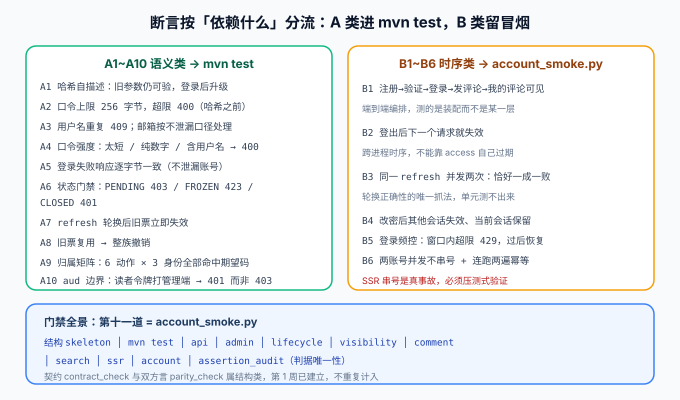

# 测试与断言分层

本页是[读者账号与权限](../index.md)的测试侧收口。分层判据沿用第 103 天定下的那一把尺子：**这条断言依赖什么？** 依赖越少就越靠上（进 `mvn test`），跨进程时序就只能留在冒烟脚本里。



::: warning 本页的验收清单是判据，不是实测输出
账号模块的实现与构建在编写环境里没有落地，所以下表是**设计定稿的断言清单**。请遵循页内顺序：**先跑 `--selftest`，如果它不报红，说明断言本身恒真，后面的全绿没有意义。**
:::

## 一句话定位

这一页的产出不是「有多少条用例」，而是**每条断言的归属是唯一的**：同一件事不会在单元测试和冒烟脚本里各写一遍，也不会两边都没写。

## 一、分层的唯一判据

| 问一句 | 归 A 类（`mvn test`） | 归 B 类（`account_smoke.py`） |
| --- | --- | --- |
| 这条断言依赖什么？ | 只依赖**纯逻辑、单次请求、数据库唯一索引** | 依赖**跨进程时序、并发、多次请求的先后** |
| 能不能重复跑 | 每次都一样 | 依赖真实状态（缓存窗口、连接池、时钟） |
| 失败了能不能定位 | 定位到方法 | 定位到「哪一步之后」 |
| 典型代表 | 哈希解析、状态门禁、归属矩阵、`aud` 判定 | 登出即失效、并发刷新、频控窗口、串号 |

::: tip 一条不能忘的纪律
**上移是搬迁，不是复制**。把某条断言搬进 `mvn test` 之后，冒烟脚本里的那一条必须删掉——否则同一条判据存在两处，改了一处忘了另一处，就会出现「两边都绿、线上仍错」。[判据唯一性](../../Consolidation/index.md)的 `assertion_audit.py` 就是为此而设，本日把 `A*` / `B*` 前缀纳入它的核查范围。
:::

## 二、A 类：语义断言（上移 `mvn test`）

| 标识 | 断言 | 落在哪 |
| --- | --- | --- |
| `A1` | 哈希串自描述：`pbkdf2-sha256$600000$salt$hash` 可解析；**旧参数（120000）记录仍能验证**；验证成功后自动重算为新参数 | `PasswordHasherTest` |
| `A2` | 口令上限 256 字节：`257` 字节返回 `400` 且**不进入哈希计算**；`256` 字节正常受理 | `PasswordHasherTest` |
| `A3` | 用户名重复返回 `409`；**并发两次同名注册只有一次成功**（靠唯一索引而非「先查再插」） | `AccountRegisterTest` |
| `A4` | 口令强度：长度 < 10、纯数字、等于用户名、等于邮箱本地部分，四种都 `400`，错误信息含字段名、不含口令原文 | `AccountRegisterTest` |
| `A5` | 登录失败不可区分：用户名不存在 / 口令错 / 账号已注销，三种响应体**逐字节一致**（忽略 `traceId`） | `AccountLoginTest` |
| `A6` | 状态门禁：`PENDING` 写操作 `403`；`FROZEN` 登录 `423`；`CLOSED` 登录 `401` | `AccountStatusTest` |
| `A7` | `refresh` 轮换：换过之后旧票再请求返回 `401`，且新票可用 | `RefreshTokenTest` |
| `A8` | 复用检测：使用**已撤销**的 refresh → 该 `family_id` 下所有票全部失效（整族撤销） | `RefreshTokenTest` |
| `A9` | 归属矩阵：6 类动作 × 3 种身份，每格命中唯一期望码（见[验收页](../Acceptance/index.md)） | `OwnershipTest`（`@WebMvcTest`） |
| `A10` | `aud` 边界：读者令牌打 `/api/v1/admin/**` → `401`；管理端令牌打 `/api/v1/me` → `401` | `AudienceBoundaryTest` |

::: danger `A5` 是这一组里最容易「写了但没测到」的一条
「响应体逐字节一致」听起来只要断言两个 `401` 就完了，其实不是：

1. 必须先**剥掉会天然不同的字段**（`traceId`、`timestamp`），否则断言永远失败，然后有人把断言改成「只要都是 401 就行」——**这一改就把这条断言废了**；
2. 必须**同时比状态码、响应头和响应体**：有人可能只在 body 里统一，`WWW-Authenticate` 头却泄露了原因；
3. 必须包含「账号已注销」这一来源——它是最容易漏的：注销后如果返回一个独立的错误码，那就等于提供一个「该账号曾存在」的查询接口。

判据写成「剥掉 `traceId` 之后字符串相等」，才算真的测到了。
:::

### A 类原样带进来的三条纪律（第 103 天定下）

| 纪律 | 在账号模块的体现 |
| --- | --- |
| 数据带随机位 | 用户名/邮箱带随机后缀，避免两次运行互相踩；`uk_users_username` 会直接吃掉重跑 |
| 断言相对基线，不写绝对时间 | 「登出后失效」判状态码，不判时间戳；`expires_at` 只判「大于现在」 |
| 断言必须能被证伪 | 每条都要能回答「把实现的哪一行改掉，它就会红」——`A8` 改掉整族撤销即红 |

## 三、B 类：时序断言（留 `account_smoke.py`）

| 标识 | 断言 | 为什么不能上移 |
| --- | --- | --- |
| `B1` | 端到端编排：注册 → 验证 → 登录 → 发评论 → 我的评论可见 → 可跳回原文定位 | 端到端编排，测的是**装配**而不是某一层 |
| `B2` | 撤销时效：登出后**下一个请求**即失效；`logout-all` 后两台设备都失效 | 跨进程时序（撤销状态要在下一次请求生效） |
| `B3` | 并发刷新：同一个 refresh 并发两次 → **恰好一次成功、一次 `401`** | 真实并发只有集成环境能复现；单元测试测的是同一线程的两行代码 |
| `B4` | 改密影响面：当前族保留、其他族失效、旧口令不可再登录 | 跨请求时序，且要检查「当前会话没被误杀」 |
| `B5` | 频控：窗口内第 6 次失败 `429`；**不存在的用户名也会被限速**；窗口过后恢复 | 依赖 Redis 状态与时钟窗口 |
| `B6` | 两账号并发请求互不串号；同一脚本连跑两遍全绿 | SSR 串号是真事故，只能压测式验证 |

::: danger `B3` 与 `B6` 是这一组真正的价值所在
`B3` 抓的是**轮换与并发的交互**：轮换要求「一次一换」，并发却让两个请求同时看到「未撤销」——这只有在真并发下才会暴露。它的正确性依赖两件事同时成立：服务端 `SELECT ... FOR UPDATE` 行锁，以及前端「单飞刷新」。**少了前端的纪律，服务端再对，用户也会随机被踢下线**（因为第二次刷新用的是刚作废的票，可能直接命中复用检测，把整族撤了）。

`B6` 抓的是**跨用户串号**：把 A 的会话数据渲染进 B 的页面。它单请求永远测不出来，只有在两个 Cookie 并发请求下才能复现——而它泄漏的是隐私，不是功能。
:::

## 四、`account_smoke.py` 的结构

```shell
python account_smoke.py --base http://127.0.0.1:18080    # 期望 steps = 22  passed = 22
python account_smoke.py --selftest                       # 期望 selftest: 22/22 通过
```

| 分组 | 覆盖 | 步数 |
| --- | --- | --- |
| `B1` 端到端编排 | 注册 / 验证 / 登录 / 发评论 / 我的评论 / 定位原文 | 6 |
| `B2` 撤销时效 | 登出即失效；`logout-all` 双设备失效 | 2 |
| `B3` 并发刷新 | 并发两次；结果恰好一成一败 | 2 |
| `B4` 改密影响面 | 当前族保留；其他族失效；旧口令不可再登录 | 3 |
| `B5` 频控 | 第 6 次 `429`；不存在用户名也被限速；窗口后恢复 | 3 |
| `B6` 并发与幂等 | 两账号并发不串号；连跑两遍不冲突 | 2 |
| 越权外部面 | 游客 `401` ×2；他人 `403` ×2 | 4 |
| **合计** | | **22** |

::: tip `--selftest` 的变异用例要覆盖「跨账号」这一类
冒烟脚本的自身有效性靠变异测试保证：把每一步的期望值改坏，脚本必须变红。账号模块的变异用例里**必须包含一条「把 A 的令牌换成 B 的令牌」**——如果脚本对这一步不报红，说明它的越权断言是恒真的（因为两个账号的数据根本没被区分开）。

这与第 107 天 `search_smoke.py` 的 `Q9`（停用词回归）是同一类设计：**变异用例要盯着「最容易被忽略、又最致命」的那一格**，而不是最左边那一格。
:::

## 五、门禁全景：第十一道

| # | 门禁 | 类型 | 何时跑 |
| --- | --- | --- | --- |
| 1 | `skeleton_check.py` | 结构（27 checks） | 每次提交 |
| 2 | `mvn test` | 语义（含 `A1~A10`） | PR |
| 3 | `api_smoke.py` | 只读行为（9 cases） | 部署前 |
| 4 | `admin_smoke.py` | 写链路行为（37 steps） | 部署前 |
| 5 | `lifecycle_smoke.py` | 状态迁移（24 steps） | 部署前 |
| 6 | `visibility_smoke.py` | 读侧可见性（22 steps） | 部署前 |
| 7 | `comment_smoke.py` | 评论读写（28 steps） | 部署前 |
| 8 | `search_smoke.py` | 全文搜索（9 steps） | 部署前 |
| 9 | `ssr_smoke.py` | 前台 SSR（10 steps） | 部署前 |
| 10 | **`account_smoke.py`** | **读者账号（22 steps，本日新增）** | 部署前 |
| 11 | `assertion_audit.py` | 判据唯一性 | 每次提交 |

::: warning 这个清单顺手修掉了一处口径漂移
此前项目总览里写的是「十道行为门禁」，并在括号里列了八项——数字与列表对不上，且 `assertion_audit.py` 与结构门禁到底算不算在里面没有说清。

本日把它定格成上表：**十一道，其中 1 与 11 是每次提交就跑的「便宜门禁」，2 是 PR 门禁，3~10 是需要起服务与真库的部署前门禁**。契约 `contract_check.py` 与双方言 `parity_check.py` 属于**结构类**，第 1 周已建立，不重复计入这十一道。

排序原则仍是[测试分层收口](../../TestLayers/index.md)那条：**越靠左越便宜**；以及「同一断言只在一个门禁里存在」。
:::

## 六、判据唯一性

`assertion_audit.py` 给每条判据一个稳定标识，并检查它是否**同时**出现在 JUnit 方法与冒烟脚本里，重复即退出码 `1`。

| 本日新增标识 | 存在处 | 核查点 |
| --- | --- | --- |
| `A1`~`A10` | 仅 `src/test/**` | 不得在 `account_smoke.py` 里再出现 |
| `B1`~`B6` | 仅 `account_smoke.py` | 不得在 JUnit 里再出现 |

```shell
python assertion_audit.py            # 期望 PASS（退出码 0）
# 自证有效：把 A5 同时写进两层，脚本必须报红并退出 1
```

## 七、验证方式

```shell
cd your-project/service

# ① 先证断言能被证伪（不报红 = 断言恒真，后面全绿无意义）
python account_smoke.py --selftest        # 期望 selftest: 22/22 通过

# ② A 类：秒级、不起服务、不连库
mvn test                                  # 期望 BUILD SUCCESS，A1~A10 全绿

# ③ B 类：要起服务
export SERVER_PORT=18080 && cd blog-application && mvn spring-boot:run
cd .. && python account_smoke.py --base http://127.0.0.1:18080
# 期望 steps = 22  passed = 22

# ④ 判据唯一性
python assertion_audit.py                 # 期望 PASS

# ⑤ 幂等：同一条命令连跑两遍都要全绿（B6）
python account_smoke.py --base http://127.0.0.1:18080 && \
python account_smoke.py --base http://127.0.0.1:18080
```

| 判据 | 期望 |
| --- | --- |
| `--selftest` | 22/22，且把任一步期望值改坏必须变红 |
| `mvn test` | `A1~A10` 全绿，耗时仍是秒级 |
| 冒烟主流程 | `steps = 22  passed = 22` |
| 连跑两遍 | 第二遍仍全绿（数据带随机位，不互相踩） |
| 判据唯一性 | `assertion_audit.py` PASS |

## 参考资料

- 上一页：[页面与登录态](../Pages/index.md) ｜ 下一页：[验收与第 3 周收尾](../Acceptance/index.md)
- 相邻章节：[测试分层收口](../../TestLayers/index.md)（分层的判据来源）｜ [判据收口与分类标签联调](../../Consolidation/index.md)（判据唯一性）｜ [评论链路](../../Comments/index.md)（`comment_smoke` 的断言清单先行）
- 技术专题：[CI/CD · 测试](../../../../../docs/Tools/CICD/Testing/index.md) ｜ [前端测试](../../../../../docs/Frontend/Testing/index.md)
