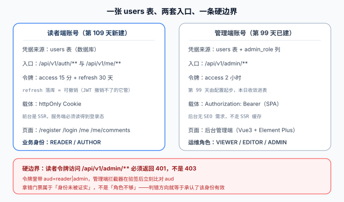

# 读者账号与权限

本页是「全栈博客平台」第 109 天的构建步骤（周期 4 第 3 周 · 联调测试收尾）。

第 99 天做了**管理端认证与角色**：令牌怎么签、口令怎么存、`401` 与 `403` 谁先谁后。但那条链路只服务后台——**读者是谁，一直没有落点**。而[评论链路](../Comments/index.md)的断言 `T7` 早就写着「匿名发评论 `401` 先于 `403`」，[数据库设计](../DatabaseDesign/index.md)的 `comments` 表也早就有了 `user_id` 与 `reply_to_user_id` 两列。也就是说：**结构上早就假定读者有账号，只是没人把它建出来**。

本日把这块补上：一个从注册到注销的读者账号体系，加上「只能动自己的东西」这条最容易被漏掉的权限。



::: warning 本页只有设计，没有可运行代码
本仓是**文档库**，`project/` 下不存放源码、脚本与 SQL。下面出现的 `AccountService.java`、`account_smoke.py`、`V2__reader_account.sql` 等，都是**要你在自己工程里创建的文件**；代码块给的是关键实现与结构。验收清单是**判据**，不是实测输出。
:::

## 一句话定位

读者账号模块要解决的不是「怎么加一张用户表」，而是三个**不报错就会出事**的问题：**登录态在 SSR 下放在哪**、**刷新令牌被偷了怎么发现**、以及**「我的评论」到底是权限还是过滤**。三处写错都能跑通、都能看，只是安静地越权。

## 模块边界：一张表、两套身份、一条硬边界

| 维度 | 读者端（本日新建） | 管理端（第 99 天） |
| --- | --- | --- |
| 凭据来源 | `users` 表（数据库） | `users` 表 + `admin_role` 列 |
| 业务身份 | `role` ∈ `READER` / `AUTHOR` | `admin_role` ∈ `VIEWER` / `EDITOR` / `ADMIN`（可为 NULL） |
| 令牌载体 | httpOnly Cookie（前台是 SSR） | `Authorization: Bearer`（后台是 SPA） |
| access 寿命 | 15 分钟 | 2 小时 |
| 令牌可撤销 | 有 refresh，落库可撤销 | 无 refresh，靠短寿命 + 重新登录 |
| 入口前缀 | `/api/v1/auth/**`、`/api/v1/me/**` | `/api/v1/admin/**` |
| 页面 | `/register` `/login` `/me` `/me/comments` | 后台管理端 |

::: danger 这条边界写错，等于给读者开后台
**读者令牌打到 `/api/v1/admin/**` 必须返回 `401`，不是 `403`。**

两类令牌用的是同一套签发格式（第 99 天的 HS256 自签），所以「能验签通过」不代表「有权访问这个入口」。做法是在 payload 里加 `aud`（`reader` / `admin`），管理端拦截器**验签通过后立刻比对 `aud`**，不匹配就按「身份未被证实」处理。

为什么是 `401` 而不是 `403`：`403` 的语义是「你的身份我认，但权限不够」——对一个不该出现在这个入口的身份承认它有效，正是第 99 天那条「认证必须排在授权前面」的同一条原则。
:::

## 为什么这一块值得单独成章，而不是「顺手加个注册」

| 已有资产 | 它假定读者有账号吗 | 本日补的是什么 |
| --- | --- | --- |
| [评论链路](../Comments/index.md) | **是**。`T7` 断言匿名发评论 `401`；`reply_to_user_id` 要指向一个稳定用户 | 让这个假定成立：读者身份从哪来 |
| [数据库设计](../DatabaseDesign/index.md) | **是**。`users` 表与 `comments.user_id` 第 1 周就画进 ER 图 | 把「画了但没用上」的列真正用起来 |
| [管理端认证与角色](../AuthRoles/index.md) | **否**。它是配置驱动的后台账号 | 两套身份的分工与「读者不得进后台」的 `aud` 判据 |
| [测试分层收口](../TestLayers/index.md) | — | 新增断言按同一把尺子分流：语义进 `mvn test`、时序留冒烟 |
| [可见性收敛](../Visibility/index.md) | — | 把「不存在性不泄漏」从**文章**推广到**账号**（登录失败响应逐字节一致） |

::: tip 一句话理解
文章侧第 102 天已经在做「不让读者用 `404` 与 `403` 的差别去枚举路径」；账号侧要做的是同一件事的镜像——**不让攻击者用响应差别去枚举账号是否存在**。
:::

## 当日做了什么

六件事，每件一页：

1. [需求与验收条件](./Requirements/index.md)：账号的生命周期与五条用户故事，含「未验证不可写」与「注销不删行」两条硬约束。
2. [表设计：扩一列、加一表](./DataModel/index.md)：`users` 的增量列、新建 `user_tokens`、以及**三处悬空口径的收敛**（哈希注释、两套角色枚举、管理端账号来源）。
3. [接口设计：注册、登录与令牌轮换](./API/index.md)：十一个路径、一张错误码表、以及「注册接口该不该告诉你邮箱已被占用」这个真实的取舍。
4. [页面与登录态](./Pages/index.md)：四个页面、Cookie 载体、**SSR 缓存按身份切分**，以及两个前端判据（回跳白名单、按钮显隐不是权限）。
5. [测试与断言分层](./Tests/index.md)：`A1~A10` 进 `mvn test`、`B1~B6` 留 `account_smoke.py`，门禁扩到第十一道。
6. [验收与第 3 周收尾](./Acceptance/index.md)：六类动作 × 三种身份的越权矩阵、跨链路一条龙回归，以及**补跑第 1 周遗留的 Docker 验证 DDL**。

## 如何验证

先在你自己的工程里按上述六页落地文件，再按顺序执行。判据分两层：**先证断言能被证伪，再看主流程**。

```shell
cd your-project/service

# ① 断言有效性：把任一断言的期望值改坏必须变红
python account_smoke.py --selftest            # 期望 selftest: 22/22 通过

# ② 语义类断言（A1~A10）随单元测试跑，秒级、不起服务、不连库
mvn test                                      # 期望 BUILD SUCCESS，A1~A10 全绿

# ③ 起服务（prod profile + MySQL，本模块要真表）
export SERVER_PORT=18080 && cd blog-application && mvn spring-boot:run

# ④ 主流程（另开终端）
cd .. && python account_smoke.py --base http://127.0.0.1:18080
# 期望 steps = 22  passed = 22（B1~B6 + 越权矩阵的外部可观测面）
python assertion_audit.py                     # 期望 PASS：A*/B* 标识在两层中各只出现一次
```

```shell
# ⑤ 增量 DDL 可执行（结掉第 1 周的欠账）
docker run --rm -i mysql:8.4 mysql -uroot -proot -e "
  CREATE DATABASE IF NOT EXISTS blog DEFAULT CHARSET utf8mb4;
  USE blog; SOURCE /dev/stdin;" < db/mysql/V2__reader_account.sql
# 期望：无报错退出；SHOW COLUMNS FROM users 看到 admin_role / status / email 三列
```

## 问题与决策

| 问题 | 决策 | 理由 |
| --- | --- | --- |
| 读者账号与管理端账号存不存一张表 | **一张表，两个角色列** | 都是「一个人」，字段高度重合；拆两张表会让「同一个人既是作者又是编辑」变成两行，账号治理立刻分叉 |
| 令牌放 Cookie 还是 localStorage | **httpOnly Cookie** | 前台是 SSR，服务端必须读得到登录态；localStorage 在服务端不存在，首屏只能渲染成未登录 |
| 无状态令牌怎么撤销 | **access 不落库 + refresh 落库** | 15 分钟的 access 用验签兜住成本；30 天的 refresh 必须能反悔（登出 / 改密 / 冻结 / 泄漏检测） |
| refresh 被偷怎么发现 | **轮换 + 复用检测，整族撤销** | 服务端分不清用旧票的是攻击者还是本人，只能让双方都重新登录（RFC 9700 的做法） |
| 登录失败要不要区分「用户不存在」与「口令错」 | **不区分，响应逐字节一致** | 区分等于赠送一个账号枚举接口，与本项目第 102 天的存在性判据同源 |
| 「我的评论」是权限还是过滤 | **过滤** | 它不是「能不能看」，而是「看哪些」；越权判据要落在**对单条评论的写操作**上，而不是列表接口 |
| 注销是删行还是置状态位 | **置状态位 + 打散用户名与邮箱** | `users` 第 1 周已定「不删行」，而四处强引用（`posts.author_id`、`comments.user_id` 等）不允许悬空 |
| 邮箱验证在本地怎么验 | **验证链接写日志，不接真实邮件服务** | 本模块的判据是「未验证不可写」，不是「邮件能不能发出去」；把不可控的外部依赖挡在验收口径之外 |

## 下一步

1. **第 110 天（核心业务流收口）**：把「发文 → 发布 → 被搜到 → 被评论 → 作者收到通知」串成一条端到端链路，读者账号是这条链路的身份主语。
2. **第 3 周剩余**：十一道门禁全绿记录实测、跨链路一条龙回归报告（见[验收页](./Acceptance/index.md)三件事）。
3. **第 4 周铺垫**：会话表与账号审计日志进入监控口径（登录失败率、令牌撤销量），部署时用环境变量注入引导管理员凭据。

## 参考资料

- 项目总览：[全栈博客平台](../index.md) ｜ [进展记录](../Progress/index.md)
- 相邻章节：[管理端认证与角色](../AuthRoles/index.md) ｜ [评论链路](../Comments/index.md) ｜ [数据库设计](../DatabaseDesign/index.md) ｜ [测试分层收口](../TestLayers/index.md)
- 技术专题：[认证与授权](../../../../docs/Backend/Auth/index.md)（会话 / JWT / 权限模型 / 服务端落地）｜ [Spring Security 6](../../../../docs/Backend/Java/Frame/SpringSecurity/index.md)
- 外部规范：[RFC 9700 OAuth 2.0 Security Best Current Practice](https://www.rfc-editor.org/rfc/rfc9700)（刷新令牌轮换与撤销）｜ [OWASP Password Storage Cheat Sheet](https://cheatsheetseries.owasp.org/cheatsheets/Password_Storage_Cheat_Sheet.html) ｜ [OWASP Session Management Cheat Sheet](https://cheatsheetseries.owasp.org/cheatsheets/Session_Management_Cheat_Sheet.html)
