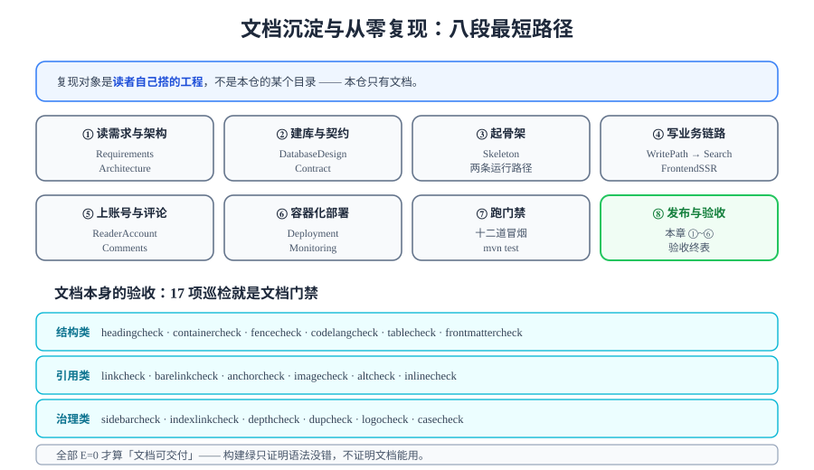

# 文档沉淀与从零复现

> 本项目的交付物不是代码，而是**一套能让别人重建它的文档**。「从零复现」就是这套文档的最终验收——如果照着文档建不出来，那么前面 27 章的判据再漂亮，也没有交付出去。



## 一句话定位

本页回答两个问题：

1. **按什么顺序读、按什么顺序做**，才能最快地把系统重建起来（八段最短路径）；
2. **文档本身怎么验收**——`pnpm docs:build` 只证明语法没错，不证明文档能用；真正的文档门禁是 17 项巡检脚本。

::: warning 复现的对象是「你自己搭的工程」
`project/` 是**纯文档目录**，本仓不存放任何源码、脚本、SQL 或构建文件。所以「从零复现」的含义是：**读者按文档在自己的目录里把系统重建出来**，而不是把本仓的某个目录复制出去。

这决定了一条复现纪律：**复现过程中不得回头参考本仓已有的任何目录组织**——一旦参照了，验证的就不再是「文档是否自洽」，而是「照抄是否准确」。`H5` 的证据价值正是在这里。
:::

## 一、八段最短路径

按**依赖顺序**排列。每一步都给出「入口章节」与「做完的标志」——没有做完标志就往下走，是最常见的返工来源。

| # | 阶段 | 入口章节 | 做完的标志（可验证） |
| --- | --- | --- | --- |
| ① | 需求与架构 | [需求拆分](../../Requirements/index.md)、[架构设计与技术选型](../../Architecture/index.md) | 能说清三条主链路的读者/作者动作，以及前台为什么用 SSR |
| ② | 建库与契约 | [数据库设计](../../DatabaseDesign/index.md)、[接口契约](../../Contract/index.md) | 8 张表 DDL 可执行；OpenAPI 文档能打开且路径齐全 |
| ③ | 起骨架 | [工程骨架与验收门禁](../../Skeleton/index.md) | `mvn spring-boot:run` 起来、`skeleton_check.py` 27/0 |
| ④ | 写业务链路 | [文章写入链路](../../WritePath/index.md) → [Markdown 渲染](../../Rendering/index.md) → [可见性收敛](../../Visibility/index.md) → [全文搜索](../../Search/index.md) → [前台 SSR](../../FrontendSSR/index.md) | 能发文章、能在前台看到、能搜到；`admin_smoke` / `visibility_smoke` / `search_smoke` / `ssr_smoke` 全绿 |
| ⑤ | 上账号与评论 | [读者账号与权限](../../ReaderAccount/index.md)、[评论写入](../../Comments/index.md)、[评论读侧](../../CommentRead/index.md) | 能注册登录、能评论、能看楼层；`account_smoke` / `comment_smoke` 全绿 |
| ⑥ | 容器化与观测 | [一键部署](../../Deployment/index.md)、[监控接入](../../Monitoring/index.md) | `docker compose ps` 全绿；`/actuator/prometheus` 可拉取 |
| ⑦ | 跑门禁 | [测试分层收口](../../TestLayers/index.md) | `mvn test` + 十二道冒烟全绿；`assertion_audit.py` PASS |
| ⑧ | 发布与验收 | 本章 ①~④ | `GL1~GL6` 通过；[终表](../GoLiveCheck/index.md) 的 C/D 组无 ❌ |

::: tip 前三段可以并行，第四段之后必须串行
① ②（设计与契约）可以同时进行——契约是从设计推导出来的。

但从 ③ 开始必须严格串行，原因是**每一段都以「上一段的产物存在」为前提**：没有骨架就无法写业务链路，没有两条主链路就无法验证评论（评论的写入前置是「文章必须 PUBLISHED」），没有可运行系统就无法容器化。

强行并行到 ④ 之后，你会同时面对多个互相干扰的失败。
:::

## 二、依赖关系：为什么是这个顺序

有一类问题是「顺序不对就必然失败」的，值得单独列出：

| 顺序陷阱 | 错误顺序的后果 | 正确顺序 |
| --- | --- | --- |
| 先评论后文章 | 评论写入的前置条件是「文章必须是 PUBLISHED」（[`Comments`](../../Comments/index.md) 的写入三约束），没有文章就没法测评论 | 文章链路 → 评论链路 |
| 先搜索后渲染 | `search_text` 是**渲染后纯文本**，在写入时与渲染同事务生成；渲染没写好，索引里存的就是错的 | 渲染 → 搜索 |
| 先 SSR 后账号 | 前台 SSR 在登录态下要处理「SSR 缓存切分（身份片段不得进入 SSR 输出）」；账号没做好，这个接缝无法验证 | 账号 → SSR（或至少同步验证接缝） |
| 先压测后功能 | 功能不对的系统压出来的瓶颈是假的，优化方向会被带偏（[`S2`](../EnvFulfill/index.md) 的执行纪律第 2 条） | 门禁全绿 → 压测 |
| 先迁移后… 反了 | 见[发布方案](../ReleasePlan/index.md)：**迁移必须在应用之前** | 迁移 → 应用 |

## 三、文档本身的验收：17 项巡检就是文档门禁

`pnpm docs:build` 会告诉你「语法有没有错」，但**不会**告诉你：

- 链接指向的页面是不是真的存在（本仓 `config.mts` 里写着 `ignoreDeadLinks: true`，构建**不检查**死链）；
- 图片引用路径在少写一级 `../` 时是不是还能解析；
- 表格有没有缺分隔行、代码块有没有标语言、行内标记有没有配对；
- 页面是不是一个只有标题的空壳；
- 目录页有没有漏挂子页面。

这些全部要靠巡检脚本。本项目把 17 项巡检当作**文档门禁**——它们就是「文档可交付」这个结论的证据来源（`H4`）。

::: warning 但这 17 项都是**文本级**判据，它们覆盖不了「渲染结果」
第 120 天收尾时真实发生过一次：**17 项静态巡检全绿，`pnpm docs:build` 却直接报错**。原因是本轮新写的一条记录里出现了一个畸形反引号构造——CommonMark 的配对规则是「开游程长度 N 必须由等长的闭游程 N 收尾」，畸形写法让两组双反引号先自成一个**只含空白**的代码片段，落单的单反引号转而与后面某个单反引号配对，把一大段正文吞进代码片段；连锁后果是后面本该被行内代码包住的 `<...>` 裸奔成了 HTML 开标签，构建在「元素缺闭合标签」处失败。

**为什么 17 项一项都没拦到**：缺陷不在「反引号写没写对」，而在「**markdown 渲染出来的 HTML 是否仍然良构**」——这是**渲染管线**层面的性质，不是文本行级的性质。因此这套门禁在文本层之上还补了一道**渲染级判据**：把 VitePress 自己渲染出的 HTML 交给 Vue 自己的模板解析器解析，判据来源与构建**完全同源**（这也正是「判据唯一性」的要求——不另写第二套 markdown 实现）。
:::

| 类别 | 脚本 | 检查什么 |
| --- | --- | --- |
| **结构** | `headingcheck` | 单 H1、无跳级 |
| | `containercheck` | `:::` 容器正确配对与用法 |
| | `fencecheck` | 围栏闭合、无裸代码块 |
| | `codelangcheck` | 代码块必须标语言、标注必须是渲染器认识的语言 |
| | `tablecheck` | 表头与分隔行齐全、单元格数量一致 |
| | `frontmattercheck` | frontmatter 只在需要的位置出现 |
| **引用** | `linkcheck` | 链接目标存在（`../` / `./` 形态） |
| | `barelinkcheck` | 裸相对路径链接（无 `./` 前缀）的深度错误 |
| | `anchorcheck` | 锚点目标真实存在 |
| | `imagecheck` | 图片路径可解析、无孤儿图片 |
| | `altcheck` | 图片有有意义的替代文本 |
| | `inlinecheck` | 行内标记成对性、SVG 记号泄漏 |
| **治理** | `sidebarcheck` | 侧边栏配置链接存在、无孤儿页面 |
| | `indexlinkcheck` | 目录页列出了它的子页面 |
| | `depthcheck` | 无空壳页、无「未完成」篇幅 |
| | `dupcheck` | 无整页或近似重复 |
| | `logocheck` | 主题首页有官方 Logo |
| | `casecheck` | 链接大小写与磁盘一致 |

```shell
# 文档门禁：全部退出码为 0 才算「文档可交付」
cd /Users/<you>/Projects/docs-website
for s in altcheck anchorcheck casecheck codelangcheck containercheck depthcheck dupcheck \
         fencecheck frontmattercheck headingcheck imagecheck indexlinkcheck inlinecheck \
         linkcheck logocheck sidebarcheck tablecheck; do
  out=$(python3 ~/.workbuddy/skills/docs-website-doc-ops/scripts/$s.py 2>&1)
  rc=$?
  [ $rc -eq 0 ] || echo "FAIL($rc) $s"
done
# 期望：无输出
# 再跑一次构建，作为语法层兜底
pnpm docs:build
```

::: danger 三个「构建绿但文档不可用」的真实案例
这三类问题都**不会有任何构建报错**，全部由巡检脚本抓出：

1. **相对链接少写一级 `../`**：本仓在历史上反复出现（第 112 天 121 处、第 113 天 6 处、第 114 天 11 处、第 115 天 8 处图片）；根因是 `ignoreDeadLinks: true`——**构建绿从来不代表链接可点**。
2. **代码块语言的静默回退**：写了一个渲染器不认识的语言名（如 `promql`、`drl`），构建成功但该代码块**失去全部高亮**，页面上只是「看起来没有颜色」。
3. **SVG 里的 Markdown 记号**：写进 `<text>` 的 `**加粗**` 与 `[文字](链接)` 会被**照字面画出来**——SVG 不认识 Markdown，而且它既不是链接也不是图片，所以链接类巡检完全看不见（第 120 天新增 `inlinecheck` 补上这一角）。
:::

## 四、复现验收：`H5` 怎么做才算数

`H5` 要求「从零复现成功」，但「成功」需要一个可证伪的定义：

```shell
# 在一个全新的空目录里执行；过程中只读文档，不看本仓目录结构
mkdir -p /tmp/reproduce && cd /tmp/reproduce

# 1) 按第 ①②③ 段建立工程并跑起来
#    期望：mvn spring-boot:run 后 /actuator/health/readiness = UP
curl -s http://127.0.0.1:8080/actuator/health/readiness

# 2) 按第 ⑥ 段容器化
docker compose up -d && docker compose ps
#    期望：五服务全 Up

# 3) 按第 ⑦ 段跑门禁
python skeleton_check.py                       # 期望 checks = 27  failed = 0
python api_smoke.py --base http://127.0.0.1:18080   # 期望 cases = 9  passed = 9

# 4) 用 k6 smoke 档收尾（形态验证最便宜的一次）
k6 run --vus 1 --duration 30s -e BASE=http://127.0.0.1 post-detail.js
#    期望：checks 100%、dropped_iterations = 0
```

::: tip 为什么复现必须用 k6 smoke 档收尾，而不是「看到页面就行」
「页面能打开」只证明了前台到后端的一条链路；k6 的 smoke 档同时覆盖了：服务启动、反向代理规则（nginx 的路径前缀与转发）、数据库连接（真实查询）、以及两条主要读链路。

它与[压测验收](../../LoadTesting/Acceptance/index.md)的衔接点在这里完全一致：**重建成功 ≠ 形态正确**。用 30 秒换一次形态验证，是本项目里性价比最高的一条判据。
:::

### 复现记录表

| 项 | 期望 | 实测 | 状态 |
| --- | --- | --- | --- |
| 三段（①②③）可独立完成，无缺页 | 无「待补」章节 | ___ | ⏳ |
| 文档中的命令可直接复制执行 | 无占位符残留 | ___ | ⏳ |
| `docker compose ps` 五服务 | 全 `Up` | ___ | ⏳ |
| 十二道冒烟 | 全绿 | ___ | ⏳ |
| k6 smoke 档 | checks 100% | ___ | ⏳ |
| 十七项文档巡检 | 全部退出码 0 | ___ | ⏳ |

## 五、文档沉淀的形态：为什么本项目只放文档

| 方案 | 优点 | 为什么本项目不选 |
| --- | --- | --- |
| 文档 + 完整可运行源码 | 读者可直接 `git clone` 跑起来 | ① 源码会随依赖升级而失效（第 63 天的 Go 版本、第 103 天的 JDK 版本）；② 仓库体积与维护成本失控；③ **「能跑」会掩盖「文档是否自洽」**——读者会直接跑代码，不再检验文档 |
| **文档 + 可复制片段 + 判据**（本项目） | 判据与命令面向**读者的工程**，不随本仓依赖失效；复现过程本身成为文档质量的检验 | 读者需要自己动手（这是代价，但也是目的） |
| 文档 + 脚手架 CLI | 兼顾两者 | 留作演进方向：本项目第 5 章已沉淀骨架结构，**未来可以做成脚手架**（见[模板 CLI](../../../../Base/BackendTemplate/TemplateCli/index.md) 的先例） |

::: warning 这个取舍有一个直接后果
因为不放源码，**每一条命令都必须能被读者在自己搭的工程里执行**——所以本项目所有命令都写成 `--base http://127.0.0.1:18080` 这类形式（端口与路径显式给出），而不是依赖仓库内的隐藏配置。

同理，`mvn test` 之前必须 `mvn install` 一次（本地仓库缺来源元数据时 `-o` 离线模式会失败）——这类「读者会踩的坑」都写在总览页的命令块里，而不是留给读者自己发现。
:::

## 六、易错点

::: danger 复现与文档验收的五个高频坑
1. **把 `pnpm docs:build` 通过当成文档没问题**。它只检查语法；死链、空壳页、错位的目录页它一概不管（见第三节三个案例）。
2. **复现时参考了本仓目录结构**。这样得到的成功无法证明文档自洽，`H5` 的证据价值归零。
3. **跳段复现**。④ 之后每一段都以上一段的产物为前提；跳过 ⑤ 直接做 ⑥，你会得到一堆无法归因的失败。
4. **命令里的占位符没替换就执行**。文档里的 `<registry>`、`$MYSQL_ROOT_PASSWORD` 这类占位符需要读者替换成自己的值——执行失败时先确认是不是占位符没换，而不是怀疑文档写错。
5. **用 dev server 验证需要构建产物的能力**。PWA 的 Service Worker 在 `pnpm dev` 下不注册；这类「必须 build 后才成立」的能力，验证前先 `pnpm build`。
:::

## 七、验证方式

```shell
# 十七项文档门禁（本仓执行）
for s in altcheck anchorcheck casecheck codelangcheck containercheck depthcheck dupcheck \
         fencecheck frontmattercheck headingcheck imagecheck indexlinkcheck inlinecheck \
         linkcheck logocheck sidebarcheck tablecheck; do
  python3 ~/.workbuddy/skills/docs-website-doc-ops/scripts/$s.py > /dev/null 2>&1 || echo "FAIL $s"
done                                        # 期望：无输出
# 构建（语法层兜底）
pnpm docs:build                             # 期望：build complete，无语言回退警告
grep -c "is not loaded, falling back" /tmp/build.log   # 期望：0
# 复现（在读者自己的新目录执行）
k6 run --vus 1 --duration 30s -e BASE=http://127.0.0.1 post-detail.js   # 期望 checks 100%
```

## 当日做了什么 / 如何验证 / 下一步

- **做了什么**：给出八段复现最短路径（每段附入口章节与「做完的标志」）、五条「顺序不对就必然失败」的依赖陷阱、以及「文档本身的验收」这一节——把 17 项巡检明确定位为文档门禁并列成三类清单；写清 `H5` 的可证伪定义（含 k6 smoke 收尾的理由与复现记录表）；说明「只沉淀文档、不放源码」这个取舍的后果（命令必须可被读者执行、坑要写进命令块）。
- **如何验证**：第七节命令逐条可执行——十七项巡检与 `pnpm docs:build` 本日实测 ✅（E 级全零，构建无语言回退警告）；复现阶段（`H5` / 九项 9）依赖 Docker 环境记 `⏳ 阻塞`，解除条件见[结项与交接](../Handover/index.md)的遗留登记表。
- **下一步**：进入[常见问题与最佳实践](.././FAQ/index.md)——收束上线日与结项日的全部高频问题。

## 深入阅读

- 八段路径的入口：[需求拆分](../../Requirements/index.md)｜[工程骨架](../../Skeleton/index.md)｜[一键部署](../../Deployment/index.md)｜[测试分层收口](../../TestLayers/index.md)
- 文档工程方法论：[文档体系建设](../../../../../docs/Tools/DocsInfra/index.md)｜[SSG 选型](../../../../../docs/Tools/DocsInfra/Ssg/index.md)｜[文档自动化](../../../../../docs/Tools/DocsInfra/Automation/index.md)
- 项目总览与运行命令：[项目总览](../index.md)｜[进度记录](../../Progress/index.md)
- 交付方法论：[交付测试](../../../../../docs/Others/ProjectDelivery/Testing/index.md)｜[交付验收](../../../../../docs/Others/ProjectDelivery/Delivery/index.md)
- VitePress 官方文档（`ignoreDeadLinks` 的语义与影响）：[vitepress.dev/reference/site-config](https://vitepress.dev/reference/site-config)
