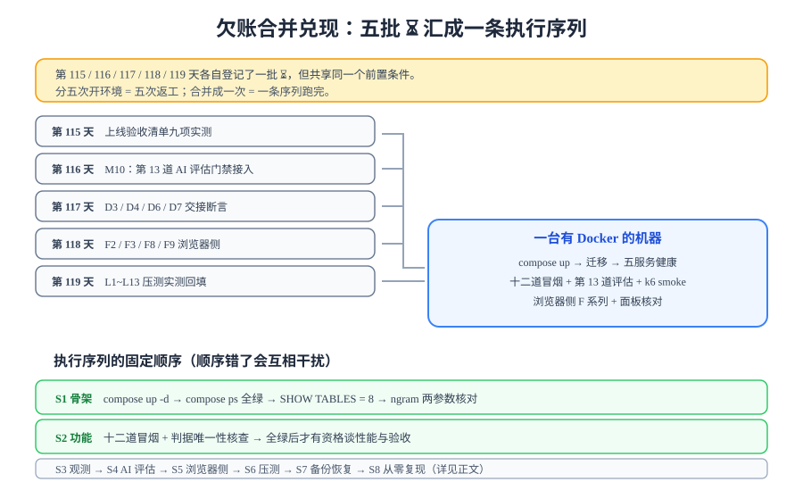

# 欠账合并兑现：一次开环境跑完

> 五个工作日分别登记了五批 `⏳`。它们的**原因完全相同**（本机没有 Docker、没有可运行的工程），所以正确的做法不是跑五次，而是**把前置条件满足一次，然后按固定序列跑完**。



## 一句话定位

本页是本章唯一真正「动手」的一页：它把第 115 / 116 / 117 / 118 / 119 天挂起的全部实测项，合并成 `S1~S8` 一条执行序列，每段给出**目的、命令、期望输出、覆盖了哪些欠账**。

::: warning 本页不新增任何判据
`S1~S8` **不是断言**，而是执行序号——它们的唯一作用是回答「先跑什么、后跑什么」。每段里出现的每一个断言都属于某个已有编号（九项 / `L` / `F` / `D` / `M` / `R` / `GL` / `Rb` / `CF`），本页只做**排序与串联**，不改写、不重定义。
:::

## 一、为什么要合并：分五次做的真实成本

| 分五次开环境 | 合并成一次 |
| --- | --- |
| 五次「按文档搭好工程」——每次都要重新拉镜像、跑迁移、灌数据 | 搭一次，后续全部复用 |
| 五份实测记录，环境各不相同（数据量、容器限额、时间点都可能不一致） | 一份记录，共享同一个环境基线 |
| 五次「搭到一半发现前置没满足」的中断风险 | 前置在 `S1` 一次性确认 |
| 各批欠账之间**无法互相校验**（例如压测结论无法与监控面板对照） | 序号相邻的段落天然可以互相印证 |

::: tip 合并的边界在哪
合并只对「共享同一个前置条件」的欠账成立。本页的五批欠账共享的是「**一台有 Docker 的机器 + 按文档搭好的工程**」——这是同一个前置。

反例：如果某一批欠账需要的是「真实域名 + 有效证书」（例如 HTTPS 与 HSTS 相关验证），那它就不该被并进来，因为它的前置条件不同、解除条件也不同。**判断标准是前置条件是否相同，不是「都是待办」。**
:::

## 二、欠账总清单：五批，逐条归属

| 来源 | 欠账 | 涉及编号 | 判据出处 | 由哪一段兑现 |
| --- | --- | --- | --- | --- |
| 第 115 天 | 上线验收清单九项实测回填 | 九项 1~9 | [第 4 周收口](../../Week4Close/index.md) | `S1` / `S2` / `S3` / `S6` / `S7` / `S8` |
| 第 116 天 | 第 13 道 AI 评估门禁接入 `gates.json` | `M10` | [AI 预审与文章摘要](../../AiModeration/index.md) | `S4` |
| 第 117 天 | 交接断言 `D3` / `D4` / `D6` / `D7` | `D` 系列 | [交付文档包](../../Delivery/index.md) | `S1`（D3/D4）/ `S3`（D6/D7） |
| 第 118 天 | 浏览器侧 `F2` / `F3` / `F8` / `F9` | `F` 系列 | [前台 PWA 与离线可读](../../PwaOffline/index.md) | `S5` |
| 第 119 天 | 压测 `L1~L13` 实测回填 | `L` 系列 | [压测验收](../../LoadTesting/Acceptance/index.md) | `S6` |
| 本日新增 | 发布与回滚演练 | `GL1~GL6` / `Rb4~Rb7` | [发布方案](../ReleasePlan/index.md)/[回滚预案](../Rollback/index.md) | `S5` |

## 三、`S1~S8`：执行序列

### `S1` 骨架与迁移

**目的**：证明这个形态真的能起来，且数据库长成设计文档说的样子。

```shell
cd your-project
docker compose up -d
docker compose ps
# 期望：五个服务全 Up；mysql / redis / blog-server 带 (healthy)
# 覆盖：九项第 1 条、D3、GL2 的前置

docker compose exec -T mysql mysql -uroot -p"$MYSQL_ROOT_PASSWORD" \
  -e "SHOW TABLES;" blog
# 期望：8 张表（posts / comments / users / user_tokens / categories / tags / post_tags / flyway_schema_history）

docker compose exec -T mysql mysql -uroot -p"$MYSQL_ROOT_PASSWORD" -e "
  SHOW VARIABLES LIKE 'ngram_token_size';
  SHOW VARIABLES LIKE 'innodb_ft_enable_stopword';"
# 期望：ngram_token_size = 2；innodb_ft_enable_stopword = OFF
# 覆盖：九项第 2 条、D4
```

::: danger `S1` 的两条红线
1. **`ngram_token_size` 是只读变量**，改它必须重启容器（它是启动时读取的）。第 107 天把这两条配置写成了「必须挂进容器」的红线，就是因为**改配置不改镜像**是这个项目最容易反复犯的错。
2. **表数必须是 8**。如果 `SHOW TABLES` 只有 7 张，说明 V2 增量迁移（`user_tokens`）没跑——而 `account_smoke` 与 `Visibility` 系列都会因此失败，你会以为是代码问题。
:::

### `S2` 功能门禁：十二道冒烟 + 判据唯一性

**目的**：在谈性能与验收之前，先把「功能对不对」钉死。**顺序不能和后面几段换**——一个功能都不对的系统，压测出来的数字没有意义。

```shell
cd your-project/service
python skeleton_check.py                            # 期望 checks = 27  failed = 0
python api_smoke.py       --base http://127.0.0.1:18080   # 期望 cases = 9   passed = 9
python admin_smoke.py     --base http://127.0.0.1:18080   # 期望 steps = 37  passed = 37
python lifecycle_smoke.py --base http://127.0.0.1:18080   # 期望 steps = 24  passed = 24
python visibility_smoke.py --base http://127.0.0.1:18080  # 期望 steps = 22  passed = 22
python comment_smoke.py   --base http://127.0.0.1:18080   # 期望 steps = 28  passed = 28
python search_smoke.py    --base http://127.0.0.1:18080   # 期望 steps = 9   passed = 9
python account_smoke.py   --base http://127.0.0.1:18080   # 期望 steps = 22  passed = 22
python coreflow_smoke.py  --base http://127.0.0.1:18080   # 期望 steps = 14  passed = 14
python ssr_smoke.py --base http://127.0.0.1:3000 --api http://127.0.0.1:18080
                                                          # 期望 steps = 10  passed = 10
python assertion_audit.py                           # 期望 PASS（每条判据只有一个归属）
# 覆盖：九项第 3 条、GL2
```

::: danger 冒烟脚本会写数据，只能对本地环境跑
`admin_smoke` / `comment_smoke` / `account_smoke` / `coreflow_smoke` 都会真实写库。这是**故意的设计**——只读断言无法覆盖写链路的状态迁移与唯一索引冲突。

代价是：它们不能对生产环境执行，且**重复执行必须幂等**。所以每道脚本内部都用固定标识（固定 slug、固定用户名）而不是时间戳随机值，跑第二次会走「已存在则复用」的分支。如果你发现同一道脚本跑第二次失败，那不是环境问题，是脚本的幂等性被改坏了。
:::

### `S3` 观测：指标可拉、告警触达、traceId 三段闭环

**目的**：证明「系统出问题时你能看见」。

```shell
# 指标可拉取
curl -s http://127.0.0.1:8080/actuator/prometheus | grep -c 'http_server_requests_seconds'
# 期望：> 0（九项第 4 条）

# traceId 三段闭环：取任一请求的 ID，在三段日志里都能 grep 到
TRACE=$(curl -s -D- -o /dev/null http://127.0.0.1/api/v1/posts?page=1 | grep -i 'x-trace-id' | tr -d '\r' | awk '{print $2}')
docker compose logs nginx       | grep -c "$TRACE"   # 期望 ≥ 1
docker compose logs blog-server | grep -c "$TRACE"   # 期望 ≥ 1
docker compose logs blog-web    | grep -c "$TRACE"   # 期望 ≥ 1
# 覆盖：九项第 6 条、D6、D7

# 告警触达（一次性人工验证）
# 将阈值临时调到必然触发（例如错误率阈值改为 0.0001），制造一次失败请求，
# 确认值班渠道在 __ 秒内收到通知，然后改回原阈值并再次确认不再误报。
# 期望：收到 1 次通知；改回后不再收到 → 九项第 5 条
```

::: danger 告警验证必须「制造真触发」，不能只看配置
「告警规则配好了」与「告警真的会响」是两件事。中间断掉的环节至少有四个：Prometheus 采集不到（`S3` 第一段已排）、规则表达式写错（永远不满足）、Alertmanager 路由错（发了但发到没人看的渠道）、通知模板渲染失败（发了但内容是空的）。

**唯一可靠的验证方式是让它响一次。** 阈值临时调低是标准手法——比在测试环境伪造指标更接近真实链路。
:::

### `S4` 第 13 道：AI 评估门禁

**目的**：把第 116 天定义好的判据真正接进 `gates.json`。

```shell
cd your-project/service
python eval_runner.py --suite eval_l2.jsonl --base-url http://127.0.0.1:8099/v1
# 期望：RESULT: PASS  30/30  exit=0（对象为本地桩时）
python eval_runner.py --suite empty.jsonl
# 期望：RESULT: FAIL (activity check: empty suite)  exit=1（空集不许静默通过）
# 覆盖：M10
```

::: warning 锚点：`eval_l2.jsonl` 的基线是有对象的
第 116 天的 30/30 是**对本地桩**跑出来的。换成真实模型端点后，这个数字**不能直接沿用**——必须重跑并取得新基线，否则门禁会把「模型的正常波动」当成「防护失效」而误报，然后被整体跳过。

这一条在[评估集建设](../../../../../docs/AI/PromptSecurity/EvalSet/index.md)里写过：**基线是「与某个具体被测对象绑定」的**，换对象即换基线。
:::

### `S5` 浏览器侧与回滚演练

**目的**：验证两件只能在真实浏览器 / 真实容器上做的事——离线能力、以及回滚能力。

```shell
# F 系列（DevTools → Application；操作步骤见 PwaOffline 页的断言表）
# F2 期望：断网后文章详情仍可读
# F3 期望：离线评论进入 IndexedDB 队列，恢复网络后自动补发
# F8 期望：Service Worker 有更新时出现「有新版本」提示
# F9 期望：安装引导在支持的平台出现、已安装后不再出现
# 覆盖：F2 / F3 / F8 / F9

# 回滚演练（Rb4~Rb7；完整步骤见 Rollback 页）
time docker compose up -d --no-deps blog-server    # 期望 ≤ 5 分钟
curl -s http://127.0.0.1:8080/actuator/health/readiness    # 期望 {"status":"UP"}
python api_smoke.py --base http://127.0.0.1:18080  # 期望 cases = 9  passed = 9
```

::: danger 验证 PWA 不能用 dev server
`pnpm dev` 默认**不注册 Service Worker**——开发期的热更新与 SW 的缓存策略直接冲突。必须 `pnpm build && pnpm preview` 后再验证。

另外：DevTools 的 **Disable cache 不绕过 Service Worker**。要验证 SW 行为，走 Application → Service Workers → Offline；而要做压测，则必须反过来勾上 **Bypass for network**（见 `S6`）。这两个开关方向相反，混淆的后果是得出完全错误的结论。
:::

### `S6` 压测：smoke 档先行，再跑基线 / 目标档

**目的**：回填 `L1~L13` 的实测列。

```shell
cd your-project/perf
k6 run --vus 1 --duration 30s -e BASE=http://127.0.0.1 post-detail.js
# 期望：checks 100%、dropped_iterations = 0、退出码 0（L1~L2 的形态验证）

k6 run -e BASE=http://127.0.0.1 --summary-export results/baseline.json post-detail.js
k6 run -e BASE=http://127.0.0.1 --summary-export results/target.json   post-detail.js
# 期望：thresholds 全过（L6~L9）；结果留在 results/ 供环比
k6 version > results/tool-version.txt      # 工具版本必须留痕（k6 为 AGPL-3.0）
# 覆盖：L1~L13；数据量门槛见 L3
```

::: danger 压测前置三件事，缺一件数字就不可比
1. **联调复核 `I1~I8` 全通过**——两端本身对不上时，压出来的是「一个错误系统的性能」；
2. **排除旁路变量**：DevTools 勾 **Application → Service Workers → Bypass for network** 与 **Network → Disable cache**，否则请求根本回源不到服务端；
3. **数据量达标**：`posts ≥ 10000`、`comments ≥ 5000`、`users ≥ 200`。空库跑出来的 P95 好得没有意义。
:::

### `S7` 备份与恢复

**目的**：证明「数据丢了能救回来」。

```shell
# 备份在跑：观察 backups/ 出现当日 dump，体积非零
ls -lh backups/ | tail -3            # 期望：当日文件存在且非空（九项第 7 条）

# 临时容器恢复演练（四步流程见 BackupDrill 页）
# 期望：R1~R6 逐条满足（九项第 8 条）
```

### `S8` 从零复现

**目的**：在一个全新的目录里，**只看文档**把系统重建起来。这是全项目最综合的一条验收，也是 `H5` 的实测来源。

```shell
mkdir -p /tmp/reproduce && cd /tmp/reproduce
# 严格按 [项目总览](../index.md) 的章节顺序执行，不参考任何外部材料
# 期望：最终 docker compose ps 全绿；再跑一次 k6 smoke 档通过（checks 100%）
# 覆盖：九项第 9 条、H5
```

::: tip 为什么复现要用 k6 的 smoke 档收尾
「重建成功」只证明容器起来了，证明不了形态正确。k6 的 smoke 档（1 VU × 30s）是**最便宜的一次形态验证**：它同时覆盖了服务启动、反向代理规则、数据库连接与两条主要读链路。

这一条与[压测验收](../../LoadTesting/Acceptance/index.md)的衔接点完全一致——那里也写着「重建成功 ≠ 形态正确」。
:::

## 四、执行纪律

::: danger 跑这条序列的四条纪律
1. **一次开环境，不中途停**。序列的价值就在于共享同一个环境基线；中断后恢复，前面的实测记录就与后面的不同源了。
2. **不跳步**。`S2` 全绿之前不要跑 `S6`。功能不对的系统压出来的数字会误导优化方向——你会去优化一个本来就不该存在的瓶颈。
3. **失败即停，先修再往下**。`S1` 的表数不对就停在那里——继续跑 `S2` 只会得到一堆由同一个根因引起的失败，淹没真正的问题。
4. **实测列只填真跑出来的输出**。跑不了的（例如某个需要真实域名才能验证的项）就写「未跑 + 原因 + 解除条件」，**不许把期望值抄进实测列**。
:::

## 五、执行记录表模板

```markdown
<!-- 写在你自己工程的 ops/fulfillment/2026-10-07.md -->
# 欠账兑现记录 — 2026-10-07
- 环境：__ 核 / __ GB；Docker __；compose 五服务；blog-server 限额 1g
- 数据量：posts=____ comments=____ users=____
- S1 骨架与迁移     ：九项 1/2 ✅/❌　D3 ✅/❌　D4 ✅/❌
- S2 功能门禁       ：十二道冒烟 ____/12 全绿　assertion_audit ✅/❌
- S3 观测           ：九项 4/5/6 ✅/❌　D6 ✅/❌　D7 ✅/❌
- S4 AI 评估门禁    ：M10 ✅/❌（基线对象：____）
- S5 浏览器与回滚   ：F2/F3/F8/F9 ✅/❌　Rb4~Rb7 ✅/❌（回滚耗时 ____ 分 ____ 秒）
- S6 压测           ：L1~L13 ✅/❌　（P95 实测 ____ms / 基线 ____ms）
- S7 备份与恢复     ：九项 7/8 ✅/❌　R1~R6 ✅/❌
- S8 从零复现       ：九项 9 ✅/❌　H5 ✅/❌
- 无法执行的项与原因：____
```

## 六、易错点

::: danger 兑现日的五个高频坑
1. **表数只数了「看起来对」**。`SHOW TABLES` 必须逐张核对到 8——少一张 `user_tokens` 时，`account_smoke` 会以「表不存在」失败，很容易被误判成代码问题。
2. **跳过 `S2` 直接跑 `S6`**。功能不对的系统压出来的瓶颈是假的，优化方向会被完全带偏。
3. **告警只验证了配置、没验证触达**（见 `S3` 的红线）。四个环节任何一处断开，告警都不会响。
4. **PWA 用 dev server 验证**。`pnpm dev` 不注册 SW，结果必然是「离线测试全失败」，然后你会去改本来就正确的 SW 代码。
5. **复现时参考了本仓的目录结构**。复现的意义是验证**文档是否自洽**；一旦回头去看已有的目录组织，就变成了「照抄」而不是「按文档重建」，`H5` 的证据价值归零。
:::

## 七、验证方式

本页自身的验证方式是**逐段可执行 + 覆盖可核对**：

```shell
# 覆盖完整性：五批欠账是否都在序列里有归属
grep -nE "^\| (S[1-8]|第 1(15|16|17|18|19) 天)" index.md   # 期望：六行，无遗漏
# 序列可执行性：每段命令是否为可直接复制的代码块
grep -c '^```shell' index.md                                # 期望 ≥ 8（每段至少一条）
# 本页是否擅自新增判据（应无新前缀）
grep -oE "\b(GL|Rb|H|L|F|D|M|R)[0-9]" index.md | sort -u | wc -l
```

## 当日做了什么 / 如何验证 / 下一步

- **做了什么**：把第 115/116/117/118/119 天的五批 `⏳` 合并成 `S1~S8` 一条执行序列，逐段给出命令与期望输出，并建立「欠账 → 编号 → 出处 → 兑现段」的完整映射表；写清合并的边界（按前置条件是否相同，而非「都是待办」）与四条执行纪律；给出兑现记录表模板。
- **如何验证**：本页为文档产出——验证方式是核对映射表无遗漏、每段命令可复制、无新增判据（第七节三条命令）。**本机无 Docker 环境**，故本页面向读者的实测列全部为 `⏳ 阻塞`，解除条件 = 一台有 Docker 的机器并按其上命令执行；执行完成后回填[上线验收终版](../GoLiveCheck/index.md)的终表。
- **下一步**：进入[上线验收终版](../GoLiveCheck/index.md)，看这五批欠账最终合并成的四组终表长什么样。

## 深入阅读

- 欠账的原始出处：[第 4 周收口](../../Week4Close/index.md)｜[AI 预审与文章摘要](../../AiModeration/index.md)｜[交付文档包](../../Delivery/index.md)｜[前台 PWA 与离线可读](../../PwaOffline/index.md)｜[压测验收](../../LoadTesting/Acceptance/index.md)
- 环境形态：[一键部署](../../Deployment/index.md)｜[监控接入](../../Monitoring/index.md)｜[备份恢复演练](../../BackupDrill/index.md)
- 完整章节沿用：[实现阶段索引](../../Skeleton/index.md)｜[测试分层收口](../../TestLayers/index.md)
- k6 结果输出与阈值：[grafana.com/docs/k6/latest/results-output](https://grafana.com/docs/k6/latest/results-output/)
- Docker Compose 健康检查与依赖：[docs.docker.com/compose](https://docs.docker.com/compose/)
