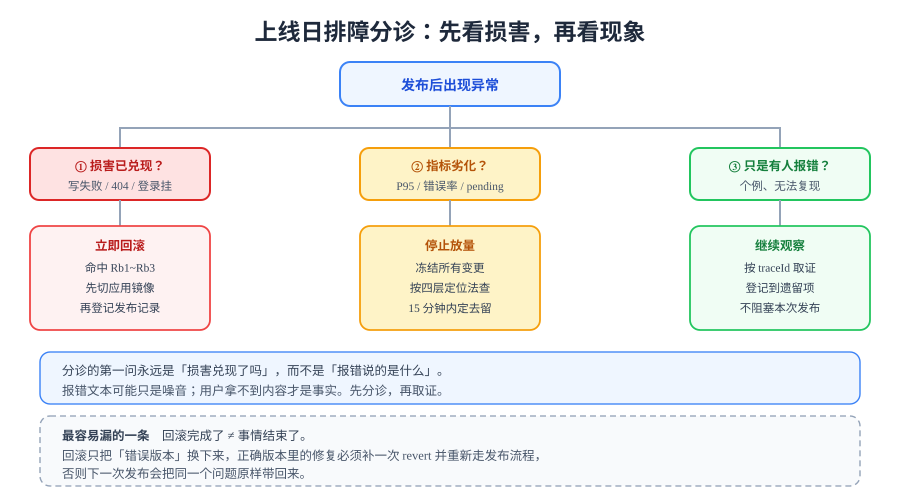

# 常见问题与最佳实践

> 本章的收束页：把上线日与结项日真正会碰到的问题集中在这里。分诊的第一原则与全项目一致——**先看损害有没有兑现，再看报错说的是什么**。



## 一句话定位

上线日与结项日的问题有两个特点：**时间压力大**（有停机窗口）和**信息噪音多**（所有人的判断都带情绪）。本页提供三样东西来对抗它们：一棵分诊树、一份高频问答、一张发布前自查清单。

## 一、分诊树：第一问永远是「损害兑现了吗」

| 现象 | 先问什么 | 判定 | 下一步 |
| --- | --- | --- | --- |
| 日志里出现大量错误 | 用户受影响了吗 | 写失败 / 404 / 登录挂 → **损害已兑现** | 查 `Rb1~Rb3`，命中即[回滚](../Rollback/index.md) |
| 指标上去了，但页面能用 | 是哪个指标 | P95 / pending 上升但无 5xx → **功能可用** | 降级到 `L2 停止放量`，按[四层定位法](../../LoadTesting/Bottleneck/index.md)排查 |
| 有人报错，但复现不了 | 有多少人、多久了 | 个例、无规律 → **疑似环境问题** | 要 traceId 取证，登记到遗留项，**不阻塞本次发布** |
| 告警没响但确实挂了 | 是没触发还是没送达 | 规则没触发 / 路由送错 / 模板渲染失败 | 见下方 Q2 |
| 回滚执行了但没恢复 | 配置回滚是否真生效 | 大概率是 `restart` 没重载 `environment` | 用 `up -d` 重建，见 [`Rb5`](../Rollback/index.md) |
| 回滚后好了，但下次发布又挂 | 代码有没有 revert | 仓库与线上版本不一致 | 补 `git revert`，见 [`Rb8`](../Rollback/index.md) |

::: danger 分诊的常见反模式
**拿着报错文本直接开始查**。报错文本可能是噪音（上游超时的下游报错、重试过程中的中间态失败），而用户拿不到内容才是事实。

判断顺序固定：**损害 → 范围 → 取证 → 处置**。顺序颠倒的最典型后果是「查了 20 分钟发现是日志噪音，而真实问题在另一边」。这与[压测瓶颈定位](../../LoadTesting/Bottleneck/index.md)的「先看哪一层先动」是同一个原则。
:::

## 二、高频问答

**Q1：发布成功了，但用户说「页面是旧的」，怎么回事？**
优先怀疑缓存，顺序从外到内查：① 浏览器强缓存（S 静态资源的 `max-age` 是否配得过长，且文件名有没有带 hash）；② CDN / 反向代理缓存（nginx 的 `proxy_cache`）；③ **Service Worker**（第 26 章引入，命中 SW 缓存时请求根本不回源）；④ 服务端缓存（Redis 的 TTL 兜底有没有生效）。诊断手法：DevTools → Network 勾上 **Disable cache**（它绕过 HTTP 缓存但**不绕过 SW**），若仍拿到旧内容，就是 SW 或服务端缓存。详见[前台 PWA 与离线可读](../../PwaOffline/index.md)。

**Q2：告警规则配好了，但真出故障时没收到通知，怎么排查？**
链路有四段，逐段确认：① Prometheus 是否采集到该指标（`/targets` 看 UP，`/graph` 手动查一次表达式）；② 规则表达式是否**真的会被满足**（把阈值临时调到必然触发，看 `ALERTS` 里有没有 `firing`）；③ Alertmanager 路由是否正确（`/api/v2/alerts` 看有没有收到，`/#/status` 看路由树）；④ 通知模板渲染是否成功（Alertmanager 日志里有渲染错误）。**只看配置文件永远查不出问题——必须让它响一次。**

**Q3：验收清单里有一半是 `⏳`，这次结项能算通过吗？**
取决于 `⏳` 的写法。写了「原因 + 归属人 + 解除条件 + 解除后如何验证」的 `⏳`，是**合格的结项状态**；只写「待补」的 `⏳`，等于零。判据见[结项与交接](../Handover/index.md)的 `H8`。**结项不要求零遗留，要求零无主遗留。**

**Q4：为什么不把压测结论写进上线验收清单？**
因为两者的**稳定性不同**。上线清单的判据必须「与机器无关、在任何环境都成立」；压测结论依赖机器、数据量、工具版本，换台机器数字就变。混在一起会让清单失去「到处都成立」这个性质。正确分工：清单答「能不能上线」，[压测验收](../../LoadTesting/Acceptance/index.md)答「这套形态能扛多少」。

**Q5：回滚是不是意味着发布失败？**
不是。回滚是**止损机制**，它的存在正是为了让发布敢做。真正的问题不是「回滚了」，而是「为什么没有在发布前发现」——所以要回溯的是发布前置检查（`GL1~GL4`）漏了哪一项，而不是讨论该不该回滚。

**Q6：能不能不带回滚包就发布？**
不能。`GL3` 要求**发布前真拉一次镜像**验证回滚包可用。翻车场景不是「没有 tag」，而是「tag 在但拉不下来」或「上一个版本从来没以可发布形态构建过」。回滚能力必须在上线**前**被证明，不是在上线后被期待。

**Q7：迁移能不能和应用一起发（同时）？**
不能。**迁移必须在应用之前**，见[发布方案](../ReleasePlan/index.md)。理由是时间窗：迁移「只加不减」时，旧代码忽略新列照样工作，所以先迁移是安全的；反之新代码访问不存在的列会全量 500。这一条同时决定了**回滚时先回应用、不动数据**。

**Q8：什么时候可以用 `docker compose restart`？**
只在「重启进程本身」是目的时用（例如内存泄漏后临时释放）。**配置回滚不能用它**——`restart` 不会重新读取 `docker-compose.yml` 里的 `environment`，必须 `up -d` 重建容器。这是本章「配置回滚看起来做了、实际没生效」这类问题的根因。

**Q9：终表里有 40 多条，必须全部跑完才能上线吗？**
取决于你处在哪个发布。终表是**全量视图**（A 系统可用 / B 可观测 / C 抗压与可恢复 / D 可交接与可复现），日常发布通常只需要 A 组 + 与本次改动相关的条目；**C 组（容量）在形态或数据量变化时才需要重跑**，D 组在交付节点才需要完整走一遍。终表的价值是让你能**按需选择**，而不是每次都全跑——这与[测试分层收口](../../TestLayers/index.md)「断言按依赖分流」是同一个思路。

**Q10：结项之后代码还会继续改，怎么保证这一章不失效？**
区分两类内容：**判据**（`GL` / `Rb` / `H`）会继续有效，因为它们约束的是「动作」而不是「某次动作的结果」；**实测记录**（终表里的实测列、发布记录）只在当次有效，会随环境失效——所以它们写在**记录文件**里，不写进文档正文。这条分工与[联调与压测](../../LoadTesting/index.md)「压测结论不写进 README」的取舍一致。

**Q11：从零复现时，我在第 ④ 段就卡住了，文档有问题吗？**
先分清三种情况：① **依赖顺序问题**——你可能跳过了第 ③ 段（骨架），导致 ④ 段没有可挂载的工程；② **占位符没替换**——文档里的 `<registry>`、`$MYSQL_ROOT_PASSWORD` 需要换成你自己的值；③ **文档确实缺内容**——这才是真问题，应当作为文档缺陷登记。区分方法是：把卡住的命令**原样**贴到问题记录里，并附上你的环境——如果同一条命令在别人的环境里也是同样失败，那是文档问题。

**Q12：为什么不安排复盘？前面踩过的坑怎么传承？**
坑的传承靠**判据**而不是靠心得。本项目每次踩坑都做了同一件事：把它固化成**巡检脚本的一条判据**（第 120 天新增 `inlinecheck` 就是例证——第 109 天靠人眼发现的 SVG 记号泄漏，本日变成了可复跑的检查）。判据是**可执行的传承**：它不会遗忘、不会因人而异、每次 CI 都跑一遍。心得做不到这三件事。

## 三、发布前自查清单

上线日执行前逐条确认（**全部为「是」才允许开始**）：

| # | 检查项 | 是 / 否 |
| --- | --- | --- |
| 1 | 提交已冻结，且与镜像 tag 指向同一 SHA（`GL1`） | ☐ |
| 2 | 十二道冒烟在预发布环境全绿（`GL2`） | ☐ |
| 3 | **回滚包已真拉取成功**（`GL3`） | ☐ |
| 4 | 发布前备份已完成且非空（`GL4`） | ☐ |
| 5 | 本次迁移**只加不减**；若有删改，已改为下个发布 | ☐ |
| 6 | 迁移脚本幂等（`IF NOT EXISTS` / 带 `WHERE` 的回填） | ☐ |
| 7 | 观察窗口的四项指标**基线值已知** | ☐ |
| 8 | `Rb1~Rb3` 已确认，且所有人都知道「命中即回滚、不需审批」 | ☐ |
| 9 | 发布窗口内规划为「只执行预演过的步骤」，无顺手改动 | ☐ |
| 10 | 有人**连续在场**看完 15 分钟观察窗口 | ☐ |

::: danger 第 10 条最容易被当成形式
「有人在场看完 15 分钟」听起来像流程要求，实质是**判据有效性的前提**：`GL6` 的四项指标需要有人对照基线做判断，`L1/L2/L3` 的处置决定也需要有人做。发布完就离开，等于放弃了整条处置链——此时出了问题的默认状态是「没人知道」，而不是「自动回滚」。

这与[监控接入](../../Monitoring/index.md)「谁来看」一节是同一件事：**告警的判据里包含「有人响应」这个前提。**
:::

## 四、最佳实践

::: tip 上线与结项的十二条纪律
1. **判据在动作之前定好**。`Rb1~Rb3` 与三级处置必须在发布前确定，不在故障现场讨论标准。
2. **回滚能力先证明再依赖**。`GL3` 用一条 `docker pull` 换掉一整类风险。
3. **迁移只加不减，删除留到下个发布**。这是唯一能让新旧版本同时可用的策略。
4. **一次开环境跑完所有共享前置的欠账**。分五次开环境 = 五次返工（[`S1~S8`](../EnvFulfill/index.md)）。
5. **失败即停，不跳步**。跳步会把一个根因放大成一片失败。
6. **实测列只填真跑出来的输出**。跑不了就写「未完成 + 原因 + 解除条件」。
7. **终表只归类不重写**。判据正文只有一处，摘要冲突时以出处为准。
8. **验收与交接分成两张表**。判据对象分别是系统与人，稳定性不同。
9. **交接要被验证**。对方操作、原作者只看不说，并记录卡点。
10. **遗留必须登记归属人与解除条件**。没有归属的遗留等于静默销账。
11. **文档门禁用 17 项巡检，不用 `pnpm docs:build`**。构建绿只证明语法没错。
12. **踩过的坑固化成判据**，而不是写成心得——判据可执行、不遗忘、不因人而异。
:::

## 五、术语表

| 术语 | 含义 |
| --- | --- |
| **发布窗口** | 允许执行发布的时段，按「出问题代价最小」而非「尽早」选择 |
| **冻结提交** | 发布所用的唯一代码版本；发布期间不接受合并 |
| **回滚包** | 上一个可发布版本的镜像；必须在发布前验证可拉取（`GL3`） |
| **不可回滚点** | 迁移越过之后，切回旧版本会导致旧版本无法正常服务的状态（如删列、改类型） |
| **前滚** | 无法回滚时，用更快的修复顶上去的处置方式 |
| **观察窗口** | 发布后连续 15 分钟的指标观察期，是 `GL6` 的执行载体 |
| **止血** | 让用户重新可用的动作（回滚）；与「定位根因」是两件事 |
| **三级处置** | `L1` 继续观察 / `L2` 停止放量 / `L3` 立即回滚 |
| **终表** | 把五个编号族按验收对象合并成的四组验收表（只归类不重写） |
| **结果三态** | ✅ 通过 / ❌ 不通过 / ⏳ 阻塞（阻塞必须写明原因与解除条件） |
| **文档门禁** | 17 项巡检脚本；「文档可交付」的证据来源（`H4`） |
| **知识转移** | 交接中要求「被验证」的三个动作：走 SOP、独立发布、处置演练 |
| **遗留项** | 未完成且已写明归属人与解除条件的待办；结项要求零**无主**遗留 |

## 六、验证方式

```shell
# 分诊与处置：回滚判据是否可查
grep -nE "Rb[1-8]" ../Rollback/index.md                # 期望：八条全部命中
# 自查清单可执行性：十条是否都有对应判据或页内说明
grep -c "^| [0-9]\+ |" index.md                         # 期望 ≥ 10
# 术语表完整性：终表与三态的关键术语是否都有条目
grep -c "^| \*\*" index.md                              # 期望 ≥ 13
# 本章文档门禁（本仓执行，全部脚本退出码应为 0）
python3 ~/.workbuddy/skills/docs-website-doc-ops/scripts/inlinecheck.py
python3 ~/.workbuddy/skills/docs-website-doc-ops/scripts/linkcheck.py
```

## 当日做了什么 / 如何验证 / 下一步

- **做了什么**：给出六行分诊表（第一问固定为「损害兑现了吗」）与常见反模式；整理 12 个高频问答（缓存旧内容、告警没送达、`⏳` 能否结项、压测为何不进清单、回滚是不是失败、备份包、迁移顺序、`restart` 陷阱、终表按需执行、结项后失效边界、复现卡住如何归因、为什么不做复盘）；给出发布前十条自查清单；总结十二条纪律与 13 条术语表。
- **如何验证**：第六节四条命令校验判据可查性、清单条目数、术语表完整性与文档门禁；文档层判据本日 ✅。运行时类问题（Q2 告警送达、Q3 终表回填、Q9 分档执行）依赖 Docker 环境，解除条件与其余欠账合并见[欠账合并兑现](../EnvFulfill/index.md)。
- **下一步**：**本项目到此结束**。周期 4（全栈博客平台）累计 28 章 + 本章 8 页，全部交付物见[结项与交接](../Handover/index.md)的资产索引。下一个月起进入周期 5（实时监控大盘），从需求与架构重新开始。

## 深入阅读

- [发布方案](../ReleasePlan/index.md)｜[回滚预案](../Rollback/index.md)｜[欠账合并兑现](../EnvFulfill/index.md)｜[上线验收终版](../GoLiveCheck/index.md)｜[结项与交接](../Handover/index.md)｜[文档沉淀与从零复现](../DocsRepro/index.md)
- [联调与压测](../../LoadTesting/index.md)（四层定位法与结果三态）｜[前台 PWA 与离线可读](../../PwaOffline/index.md)（缓存层级）｜[监控接入](../../Monitoring/index.md)（告警判据与「谁来看」）
- [监控告警专题](../../../../../docs/Ops/Monitoring/index.md)｜[告警设计](../../../../../docs/Ops/Monitoring/Alerting/index.md)（告警链路四段排查）
- [CI/CD 部署与回滚](../../../../../docs/Tools/CICD/DeployRollback/index.md)｜[交付方法论](../../../../../docs/Others/ProjectDelivery/index.md)
- Docker Compose 官方文档（`restart` 与 `up -d` 的差异）：[docs.docker.com/compose](https://docs.docker.com/compose/)
