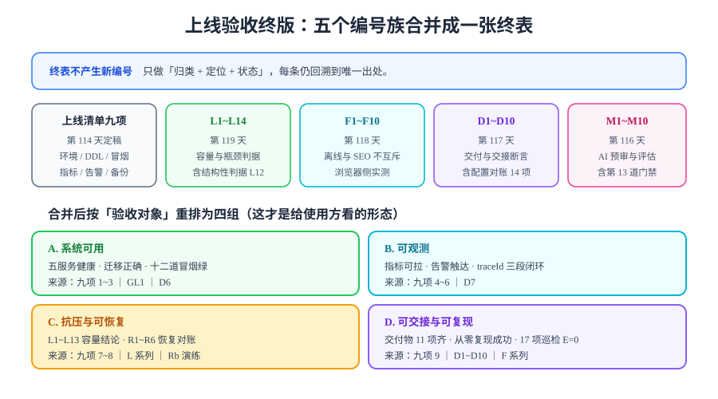

# 上线验收终版

> 全项目的最后一张验收表。它把分散在五个编号族里的判据合并成**四组**——不是为了重写判据，而是为了让「能不能上线」这个问题有一个**单一入口**。



## 一句话定位

第 27 章结束时，验收判据分散在五个地方，各有各的编号：上线清单九项（第 114 天）、`L1~L14`（第 119 天）、`F1~F10`（第 118 天）、`D1~D10`（第 117 天）、`M1~M10`（第 116 天）。它们**互不重复**，但也没有任何一页回答「全部加起来，总共要看多少条、按什么顺序看」。

本页做三件事：

1. **合并**：把五个编号族按「验收对象」重排成四组（可用 / 可观测 / 抗压可恢复 / 可交接可复现）；
2. **定位**：每条判据仍标注唯一出处——**本页不产生任何新编号**；
3. **登记**：结果三态，每条要么有实测值，要么有原因与解除条件。

::: danger 本页最重要的规矩：只归类，不重写
如果本页把某条判据「顺手改写一遍以便排版」，那么同一条判据就有了两份措辞。两份措辞一旦分叉（哪怕只差一个阈值），就再也没人知道哪份是对的——这正是[判据收口](../../Consolidation/index.md)要解决的问题。

所以本页的规则是：**判据的正文只有一处（在它的出处页面），本页只写「编号 + 一句话摘要 + 出处」**。摘要与原文冲突时，以出处页面为准。
:::

## 一、A 组：系统可用

**这一组回答的问题**：这个系统装好了吗、库对不对、功能通不通。

| 编号 | 断言（摘要） | 出处 | 执行方式 | 期望 | 实测 | 状态 |
| --- | --- | --- | --- | --- | --- | --- |
| 九项 1 | 五服务全 Up / healthy | [第 4 周收口](../../Week4Close/index.md) | `docker compose ps` | 全 `Up`，`mysql`/`redis`/`blog-server` 带 `(healthy)` | ___ | ⏳ |
| 九项 2 | DDL 实测：8 表 + 两条 ngram 参数 | 同上 | `SHOW TABLES`；`SHOW VARIABLES` | 表数 = 8；`ngram_token_size=2`、`innodb_ft_enable_stopword=OFF` | ___ | ⏳ |
| 九项 3 | 三条冒烟门禁通过 | 同上 | `search_smoke` 9/9、`skeleton_check` 27/0、`coreflow_smoke` 14/14 | 零失败 | ___ | ⏳ |
| `GL1` | 冻结提交与镜像 tag 一致 | [发布方案](../ReleasePlan/index.md) | `git rev-parse HEAD` 与镜像 tag 比对 | 同一 SHA | ___ | ⏳ |
| `GL2` | 预发布环境十二道冒烟全绿 | 同上 | 十二个 `*_smoke.py` | 全绿 | ___ | ⏳ |
| `GL3` | 回滚包已就位且可拉取 | 同上 | `docker pull <previous-tag>` | 拉取成功 | ___ | ⏳ |
| `GL4` | 发布前备份已完成 | 同上 | 见 `S7` | 当日 dump 存在且非空 | ___ | ⏳ |
| `GL5` | 迁移早于应用替换 | 同上 | 比日志时间戳 | 迁移时刻早于应用启动 | ___ | ⏳ |
| `D3` | 一键部署六步可复现 | [交付文档包](../../Delivery/index.md) | 逐步执行部署六步 | 六步全部成功 | ___ | ⏳ |
| `D4` | 健康检查三个端点全通 | 同上 | `curl` 三个 actuator 端点 | 三个均 `UP` | ___ | ⏳ |

## 二、B 组：可观测

**这一组回答的问题**：出问题时你能不能看见、看见了能不能找到人。

| 编号 | 断言（摘要） | 出处 | 执行方式 | 期望 | 实测 | 状态 |
| --- | --- | --- | --- | --- | --- | --- |
| 九项 4 | 指标可拉取 | [监控接入](../../Monitoring/index.md) | `curl -s /actuator/prometheus` | 含 `http_server_requests` | ___ | ⏳ |
| 九项 5 | 告警链路实测触达一次 | 同上 | 临时调低阈值 → 制造失败请求 | 值班渠道收到 1 次通知 | ___ | ⏳ |
| 九项 6 | traceId 三段日志闭环 | 同上 | 取 `X-Trace-Id` 后 grep 三段日志 | nginx / server / web 各 ≥ 1 次命中 | ___ | ⏳ |
| `D6` | 指标口径与文档一致 | [交付文档包](../../Delivery/index.md) | 对照六项指标名与标签 | 与文档逐项一致 | ___ | ⏳ |
| `D7` | 告警阈值由基线推导 | 同上 | 对照阈值表 | 每条阈值可回溯到某个基线值 | ___ | ⏳ |

::: tip 为什么把 `D6` / `D7` 放在这一组而不是「交接组」
它们**表面上是文档一致性检查，实质上是可观测性检查**：`D6` 校验的是「文档上写的指标名，是不是真的能在 `/actuator/prometheus` 里查到」，`D7` 校验的是「告警阈值背后有没有一个真实的基线」。

判据分组按**它验证的对象**，不是按「它由哪一天产出」。这也是本页重排的意义——第 117 天把 `D6`/`D7` 放在交接清单里，是为了它们能被交出去；本页把它们放进 B 组，是为了它们能被**执行**。
:::

## 三、C 组：抗压与可恢复

**这一组回答的问题**：能扛多少、坏了能不能退、数据丢了能不能救。

| 编号 | 断言（摘要） | 出处 | 执行方式 | 期望 | 实测 | 状态 |
| --- | --- | --- | --- | --- | --- | --- |
| `L1` | 五服务全绿且带健康检查 | [压测验收](../../LoadTesting/Acceptance/index.md) | `docker compose ps` | 全 `Up` | ___ | ⏳ |
| `L2` | 联调复核 `I1~I8` 全通过 | 同上 | 见联调复核页 | 全通过 | ___ | ⏳ |
| `L3` | 数据量达标 | 同上 | 三张表 `COUNT(*)` | posts ≥ 10000、comments ≥ 5000、users ≥ 200 | ___ | ⏳ |
| `L4` | 旁路变量已排除 | 同上 | DevTools 两项勾选 + 脚本固定 `no-cache` | 已确认 | ___ | ⏳ |
| `L5` | 基线档已跑并留档 | 同上 | `results/baseline.json` | 文件存在且含 P95 值 | ___ | ⏳ |
| `L6` | 目标档 P95 达标 | 同上 | `summary-export` 的 `p(95)` | ≤ 基线 × 2 | ___ | ⏳ |
| `L7` | 目标档 P99 达标 | 同上 | `p(99)` | ≤ 基线 × 4 | ___ | ⏳ |
| `L8` | 目标档错误率达标 | 同上 | `http_req_failed` | < 1% | ___ | ⏳ |
| `L9` | 压测机未成为瓶颈 | 同上 | `dropped_iterations` | = 0 | ___ | ⏳ |
| `L10` | 缓存命中率达标 | 同上 | 面板④ | ≥ 90% | ___ | ⏳ |
| `L11` | 连接池稳态无等待 | 同上 | `hikaricp_connections_pending` | 稳态 = 0 | ___ | ⏳ |
| `L12` | 根因有结构性判据 | 同上 | `EXPLAIN` | `type` 非 `ALL`、无 `Using filesort` | ___ | ⏳ |
| `L13` | 优化后功能未回归 | 同上 | `mvn test` + 十二道冒烟 | 零失败 | ___ | ⏳ |
| `L14` | 报告四要素齐全 | 同上 | 文档自查 | 四个小节无「待补」 | ✅ | ✅ 本日 |
| 九项 7 | 备份任务在跑 | [备份恢复演练](../../BackupDrill/index.md) | `ls -lh backups/` | 有当日 dump | ___ | ⏳ |
| 九项 8 | 恢复演练通过 | 同上 | 临时容器恢复四步 | `R1~R6` 全部满足 | ___ | ⏳ |
| `Rb4` | 应用回滚 ≤ 5 分钟 | [回滚预案](../Rollback/index.md) | 切旧 tag + 健康检查 | ≤ 5 分钟 | ___ | ⏳ |
| `Rb5` | 配置回滚显式重建生效 | 同上 | `up -d`（非 `restart`） | 运行时配置已还原 | ___ | ⏳ |
| `Rb6` | 数据回滚只走 `R1~R6` | 同上 | 见备份恢复演练 | 判据全部满足 | ___ | ⏳ |
| `Rb7` | 回滚后跑十二道冒烟 | 同上 | 十二个 `*_smoke.py` | 全绿 | ___ | ⏳ |

## 四、D 组：可交接与可复现

**这一组回答的问题**：换个人能不能接住、照文档能不能重建、AI 能力有没有护栏。

| 编号 | 断言（摘要） | 出处 | 执行方式 | 期望 | 实测 | 状态 |
| --- | --- | --- | --- | --- | --- | --- |
| 九项 9 | 从零复现成功 | [第 4 周收口](../../Week4Close/index.md) | 新目录按总览重建 | 重建成功 + k6 smoke 通过 | ___ | ⏳ |
| `D1` | 交付物 11 项均可定位 | [交付文档包](../../Delivery/index.md) | 逐项点开 | 11 项全部可达 | ___ | ⏳ |
| `D2` | 配置对账 diff 为空 | 同上 | `.env.example` 与配置表 diff | 无差异 | ___ | ⏳ |
| `D5` | Runbook 四条 SOP 可执行 | 同上 | 逐条走查五段式 | 四条均有症状/确认/处置/回滚/判据 | ___ | ⏳ |
| `D8` ~ `D10` | 交接清单其余项 | 同上 | 见交付文档包 | 逐项满足 | ___ | ⏳ |
| `F1` | Manifest 的 Content-Type 正确 | [前台 PWA 与离线可读](../../PwaOffline/index.md) | `curl -sI /manifest.webmanifest` | `application/manifest+json` | ___ | ⏳ |
| `F2` / `F3` | 离线可读 + 离线评论队列补发 | 同上 | DevTools → Application | 断网可读、恢复后补发成功 | ___ | ⏳ |
| `F4` ~ `F7` | 缓存策略与更新提示 | 同上 | 见 `F1~F10` 断言表 | 逐条满足 | ___ | ⏳ |
| `F8` / `F9` | 更新提示与安装引导 | 同上 | 同上 | 更新时提示、已安装不重复引导 | ___ | ⏳ |
| `F10` | 正文出现在源码里（SEO 未退化） | 同上 | `curl -s /posts/hello \| grep -c '<title>'` | `1` | ___ | ⏳ |
| `M1` ~ `M9` | AI 预审模块契约与断言 | [AI 预审与文章摘要](../../AiModeration/index.md) | 见断言清单 | 逐条满足 | ___ | ⏳ |
| `M10` | 第 13 道评估门禁接入且可证伪 | 同上 | `eval_runner.py` 两个入口 | 正常集 PASS/exit 0；空集 FAIL/exit 1 | ___ | ⏳ |
| `H1` ~ `H8` | 结项交接八项 | [结项与交接](../Handover/index.md) | 见 `H` 判据表 | 逐条满足 | ___ | ⏳ |

## 五、结果三态与登记纪律

终表的每一行只允许三种状态，与[压测验收](../../LoadTesting/Acceptance/index.md)完全一致（**同一套三态定义，不重新定义**）：

| 状态 | 判定依据 | 记录要求 |
| --- | --- | --- |
| **✅ 通过** | 有实测输出片段 | 填实测列，附命令或截图位置 |
| **❌ 不通过** | 有明确的实测失败值 | 写明失败项、实测值、失败方向 |
| **⏳ 阻塞** | 前置条件不满足，无法执行 | **必须写明原因与解除条件**，不得填期望值 |

::: danger 这条纪律在本项目已经被写了五次
`回归报告`（第 110 天）→ `第 4 周收口`（第 115 天）→ `交付文档包`（第 117 天）→ `压测验收`（第 119 天）→ 本页。

五次都写同一个理由：**「期望 240ms」和「实测 240ms」看起来一样，含义完全相反**。前者是设计目标，后者是证据。混在一起，报告就失去了被反驳的能力——而一份不能被反驳的验收报告，等于没有报告。

本页作为全项目的最后一张表，是这条纪律的**最终落点**：如果这里也允许把期望值填进实测列，那前面四次坚持就都白写了。
:::

## 六、本日登记

| 组 | 覆盖条目 | 状态 | 原因 / 解除条件 |
| --- | --- | --- | --- |
| A 系统可用 | 九项 1~3、`GL1~GL5`、`D3`、`D4` | ⏳ 阻塞 | 需 Docker 环境 + 按文档搭好的工程；解除条件见[欠账合并兑现](../EnvFulfill/index.md) `S1`/`S2` |
| B 可观测 | 九项 4~6、`D6`、`D7` | ⏳ 阻塞 | 依赖 A 组；解除条件同上（`S3`） |
| C 抗压与可恢复 | `L1~L13`、九项 7~8、`Rb4~Rb7` | ⏳ 阻塞 | 依赖 A 组；解除条件同上（`S5`~`S7`） |
| C 抗压与可恢复（文档项） | `L14`（报告四要素） | ✅ 本日 | 报告模板与四要素检查表已在[压测验收](../../LoadTesting/Acceptance/index.md)定稿 |
| D 可交接与可复现 | 九项 9、`D1~D10`、`F1~F10`、`M1~M10`、`H1~H8` | ⏳ 阻塞 | 依赖 A 组；`H` 组另需知识转移对象，见[结项与交接](../Handover/index.md) |

**合并终表的文档层判据本日 ✅**：四组分类互斥且完备（每条判据只出现在一组）、每条均可回溯到唯一出处、三态定义与已有页面一致。

## 七、与第 115 天清单的关系：是升级，不是替代

| 维度 | 第 115 天「上线验收清单九项」 | 本页「上线验收终版」 |
| --- | --- | --- |
| 覆盖范围 | 九项（环境、DDL、冒烟、指标、告警、traceId、备份、恢复、复现） | 九项 **∪** `L` **∪** `F` **∪** `D` **∪** `M` **∪** `Rb` **∪** `GL` |
| 分组方式 | 按**产出日**顺序（1~9） | 按**验收对象**分四组 |
| 回答的问题 | 能不能上线 | 能不能上线 **+** 能扛多少 **+** 能不能退 **+** 能不能交出去 |
| 是否新增判据 | — | **否**（九项在本页是 A~D 组的子集，不重复计数） |

::: warning 九项清单依然有效，不要作废它
本页**不是**九项清单的替代品：九项清单是「**与机器无关、在任何环境都成立**」的那一份（这正是第 119 天拒绝把压测结论塞进九项清单的原因）；终表则包含了依赖环境与数据量的容量的判据。

两者的关系：**九项清单是终表 A/B 组的主体，终表 C/D 组是九项清单不覆盖的部分。** 引用时优先引九项清单（更稳定），需要完整视图时引本页。
:::

## 八、易错点

::: danger 使用这张终表的四个坑
1. **把终表当新判据的来源**。终表里每一条的**权威定义都在它的出处页面**。改阈值要改出处页，本页只跟着改摘要——反过来做会让两份措辞分叉。
2. **只看状态列不看原因列**。`⏳` 不是「还没做」，是「**写明了解除条件的待办**」。一个没有原因与解除条件的 `⏳`，与一篇没写完的文档等价。
3. **把 `L14` 的 ✅ 当成压测通过了**。`L14` 校验的是**报告模板是否齐全**（文档产出），与容量结论无关。压测是否通过看 `L6~L13`。
4. **在终表里补齐「总量」数字**。「一共 40 条」这类数字一旦写进正文就会随判据增删而失效；本页刻意不给总数，只给分组与出处。
:::

## 九、验证方式

```shell
# 分组完备性：五个编号族是否都被覆盖
grep -cE "^\| (九项|`L[0-9]|`F[0-9]|`D[0-9]|`M[0-9]|`Rb[0-9]|`GL[0-9]|`H[0-9])" index.md
# 出处可达性：本页所有链接是否有效（由 linkcheck 兜底）
python3 ~/.workbuddy/skills/docs-website-doc-ops/scripts/linkcheck.py
# 三态一致性：状态列只允许三种取值
grep -oE "✅ 通过|❌ 不通过|⏳ 阻塞" index.md | sort -u
```

## 当日做了什么 / 如何验证 / 下一步

- **做了什么**：把五个编号族（九项 / `L` / `F` / `D` / `M`，另并入 `GL` / `Rb` / `H`）按验收对象重排成 A~D 四组，形成全项目唯一的验收入口；逐条标注唯一出处，保证「判据正文只有一处」；沿用三态登记纪律并把本日实测状态逐组登记；写清它与第 115 天九项清单是升级关系而非替代关系。
- **如何验证**：第九节三条命令校验分组完备性、链接可达性与状态枚举；文档层判据本日 ✅（四组互斥完备、每条可回溯、三态一致）。运行时条目全部 `⏳ 阻塞`，解除条件与其余欠账合并见[欠账合并兑现](../EnvFulfill/index.md)。
- **下一步**：进入[结项与交接](../Handover/index.md)——验收回答「能不能上」，交接回答「换个人接不接得住」。

## 深入阅读

- 判据原始出处：[第 4 周收口](../../Week4Close/index.md)｜[压测验收](../../LoadTesting/Acceptance/index.md)｜[前台 PWA 与离线可读](../../PwaOffline/index.md)｜[交付文档包](../../Delivery/index.md)｜[AI 预审与文章摘要](../../AiModeration/index.md)
- 执行序列：[欠账合并兑现](../EnvFulfill/index.md)（`S1~S8`）
- 判据唯一性原则：[判据收口与分类标签联调](../../Consolidation/index.md)
- 测试分层（哪些断言属于门禁、哪些属于验收）：[测试分层收口](../../TestLayers/index.md)
- 交付方法论：[交付验收](../../../../../docs/Others/ProjectDelivery/Delivery/index.md)
