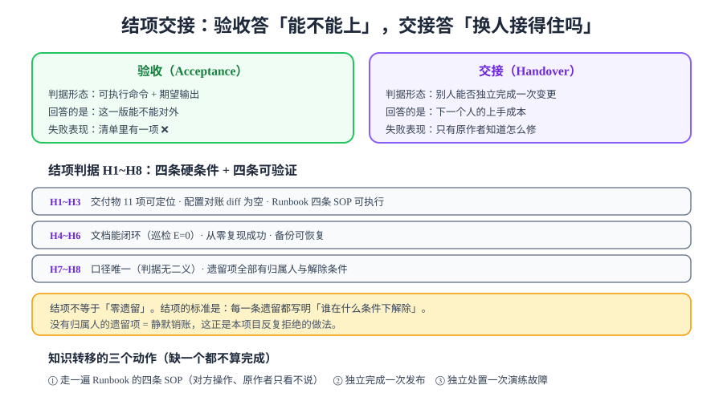

# 结项与交接

> [上线验收终版](../GoLiveCheck/index.md)回答「**能不能对外**」，本页回答「**换个人接不接得住**」。两者判据不重叠：验收的对象是系统，交接的对象是人。



## 一句话定位

本章（也是本项目）到本页为止不再产出新功能。本页要交付的是一份可以被第三方复核的**结项记录**，由四部分组成：

1. **验收报告**：终表的四组结论汇总成一份可归档的文件；
2. **签收**：交付物 11 项逐项确认收到；
3. **知识转移**：`H6`~`H8` 要求的三个动作，每个都要被**验证**而不是宣称；
4. **结项判据 `H1~H8`**：把「可以交给下一个人了」变成可检查的清单。

::: info 本页与「复盘」的区别，必须说清
全库口径一致：**不安排复盘类内容**。本页不是复盘，两者的差别在产出形态上：

| | 复盘（本项目不做） | 结项（本页） |
| --- | --- | --- |
| 产出 | 经验、心得、改进建议 | 待办清单，每条带归属人与解除条件 |
| 对象 | 过去（发生了什么） | 未来（谁在什么条件下做什么） |
| 「做得好」的部分 | 需要总结 | **不写**——它不是待办 |
| 未完成的部分 | 归因 | 登记为带解除条件的阻塞项 |
:::

## 一、验收与交接：为什么必须是两张表

| 维度 | 验收（Acceptance） | 交接（Handover） |
| --- | --- | --- |
| 判据对象 | **系统** | **人** |
| 判据形态 | 可执行命令 + 期望输出 | 「对方能否独立完成一次变更」 |
| 回答的问题 | 这一版能不能对外 | 下一个人的上手成本是多少 |
| 失败表现 | 清单里有一项 ❌ | 只有原作者知道怎么修 |
| 可自动化的部分 | 几乎全部 | 几乎没有（靠观察与实操） |
| 出处 | [上线验收终版](../GoLiveCheck/index.md) | 本页 |

::: tip 为什么「交接」不能塞进验收清单
因为**判据的稳定性不同**。验收判据与机器无关、可重复执行、结果可复现；交接判据依赖具体的人，同一个人不同时间做结论都可能不同。

把两者混在一张表里，会让「验收通过」这个结论变得不可复核——你不知道它是指「系统正常」还是「有人学会了」。第 114 天合并九项清单时把范围限定为「与机器无关的判据」，正是同一个理由。
:::

## 二、`H1~H8`：结项八项

| 编号 | 类型 | 断言 | 验证方式 | 期望 |
| --- | --- | --- | --- | --- |
| **H1** | 交付 | 交付物 11 项全部可定位 | 逐项点开[交付物清单](../../Delivery/index.md) | 11 项全部可达，无「待补」 |
| **H2** | 交付 | 配置对账 diff 为空 | `.env.example` 与配置表逐键比对 | 无差异（含 `TZ`、`AI_TIMEOUT_MS` 两个隐蔽项） |
| **H3** | 交付 | Runbook 四条 SOP 可执行 | 按五段式逐条走查 | 症状 / 5 分钟确认 / 处置 / 回滚 / 判据俱全 |
| **H4** | 文档 | 文档质量巡检全绿 | 17 项巡检脚本 | 全部 `E = 0` |
| **H5** | 可复现 | 从零复现成功 | 新目录按总览重建 | 重建成功 + k6 smoke 通过 |
| **H6** | 转移 | 对方独立走通一条 SOP | 对方操作、原作者只看不说 | 四条 SOP 任一条无需提示完成 |
| **H7** | 转移 | 对方独立完成一次发布 | 按[发布方案](../ReleasePlan/index.md)执行 | `GL1~GL6` 全部由对方判定 |
| **H8** | 治理 | 遗留项全部有归属人与解除条件 | 通读遗留登记表 | 每条都有「谁 / 什么条件 / 怎么验证」 |

### 关于 `H6~H8`：交接必须被「验证」，不能只被「完成」

::: danger 「我讲过了」不等于「交接完成」
交接最常见的失败形态不是「没讲」，而是**讲的人以为讲清了**。判断标准必须外化：

- ❌ **不合格的验证**：「我把 Runbook 给他讲了一遍，他没问问题」——没问问题可能是因为听懂了，也可能是因为不知道该问什么；
- ✅ **合格的验证**：「**他操作，我只看不说**。他在第 2 步卡了 40 秒找到了日志位置，其余全部独立完成」。

三个动作对应三种能力，缺一个都不算完成：

| 动作 | 验证的能力 | 为什么单独列一项 |
| --- | --- | --- |
| 走一遍 Runbook 四条 SOP（`H6`） | **故障处置**能力 | 最需要临场判断、也最依赖口头传承的部分 |
| 独立完成一次发布（`H7`） | **日常变更**能力 | 验证「顺序知识」是否被传递（迁移为什么必须在应用之前） |
| 独立处置一次演练故障（`H8` 的前置） | **决策**能力 | 验证「命中 `Rb1~Rb3` 直接回滚、不等审批」这条反直觉的规则是否真的被接受 |
:::

## 三、结项判据：不是「零遗留」

::: warning 结项的标准是「每条遗留都有归属」，不是「没有遗留」
这是本页最容易被误解的一条。如果结项要求零遗留，那么实际结果一定是：**遗留被悄无声息地藏起来**——要么不记录，要么把 `⏳` 改写成 `✅` 并附一个说法。

本项目的做法相反：遗留**必须**登记，但登记时要完整回答三个问题：

1. **是什么**：具体哪一条判据、期望是什么；
2. **为什么没完成**：阻塞的真实原因（不是「时间不够」，而是「本机没有 Docker 环境」这类可解除的条件）；
3. **谁在什么条件下解除**：归属人 + 触发条件 + 解除后如何验证。

一条这样的记录，价值等于一条已完成的判据；一条「待补充」，价值为零。
:::

### 遗留登记表

| # | 遗留项 | 涉及编号 | 原因 | 归属人 | 解除条件 | 解除后如何验证 |
| --- | --- | --- | --- | --- | --- | --- |
| 1 | 五批实测欠账合并兑现 | 九项 / `L` / `F` / `D` / `M` | 本机无 Docker、无运行工程 | 部署负责人 | 一台有 Docker 的机器且按文档搭好工程 | 按 `S1~S8` 执行后回填[终表](../GoLiveCheck/index.md) |
| 2 | 回滚演练 | `Rb4~Rb7` | 依赖 1 | 部署负责人 | 同 1 | 按[回滚预案](../Rollback/index.md)四步记录耗时表 |
| 3 | 知识转移三动作 | `H6~H8` | 依赖 1（没有可运行环境无法实操） | 交接双方 | 同 1 | 对方独立操作一遍，附耗时与卡点记录 |
| 4 | 从零复现 | `H5` / 九项 9 | 依赖 1 | 交付负责人 | 同 1 | 新目录重建 + k6 smoke 通过 |

::: tip 为什么四条遗留都指向同一个解除条件
留意这张表：**四条遗留的解除条件全部是「一台有 Docker 的机器」**。这不是巧合——它说明整章的阻塞**不是四个问题，而是一个前置条件没被满足**。

把这个看清了，处置方式就明确了：不要分四次处理，按[欠账合并兑现](../EnvFulfill/index.md)一次跑完。**遗留登记表的价值恰恰在于它能暴露出「多个遗留其实是同一个根因」**——如果只写「待补充」，这层信息就永远看不见。
:::

## 四、验收报告模板

```markdown
<!-- 归档为 your-project/ops/ACCEPTANCE-2026-10-07.md -->
# 上线验收报告 — 博客平台 v<版本> — 2026-10-07

## 一、范围
本次验收覆盖四组：A 系统可用 / B 可观测 / C 抗压与可恢复 / D 可交接与可复现。
判据出处：[上线验收终版]（四组共 __ 条；本报告不新增判据）。

## 二、环境
- 机器：__ 核 / __ GB；Docker __；compose 五服务；blog-server 限额 1g
- 数据量：posts=____ comments=____ users=____
- 版本：<commit-sha>　镜像 tag：<repo>:<tag>

## 三、结论
| 组 | 通过 | 不通过 | 阻塞 |
| --- | --- | --- | --- |
| A 系统可用 | __ | __ | __ |
| B 可观测 | __ | __ | __ |
| C 抗压与可恢复 | __ | __ | __ |
| D 可交接与可复现 | __ | __ | __ |

## 四、不通过项
（逐条：编号 / 期望 / 实测 / 失败方向 / 处置决定）

## 五、阻塞项
（逐条：编号 / 原因 / 归属人 / 解除条件 / 解除后如何验证）

## 六、签收
- 交付方：____　接收方：____　日期：____
- 交付物：11 项逐项确认（清单见 Delivery 页）
- 知识转移：H6 ✅/❌　H7 ✅/❌　H8 ✅/❌
```

::: danger 报告的第五节不能写「无」
「阻塞项：无」只允许在**真的没有任何阻塞时**出现。在还没有跑过环境的情况下写「无」，等价于把未验证的内容默认为通过——这是本章反复拒绝的做法。

正确写法是：列出每一条阻塞项，即使它看起来「早晚会做」。**写下来的阻塞项是待办，写在心里的阻塞项是欠账。**
:::

## 五、周期 4 资产索引

结项记录应当让接手的人**不需要读 28 章正文就知道东西在哪**。下表就是这份索引。

### 项目交付物（`project/Complete/BlogPlatform/`，28 章）

| 阶段 | 章节 |
| --- | --- |
| 第 1 周：需求与设计 | [需求拆分](../../Requirements/index.md)｜[架构与技术选型](../../Architecture/index.md)｜[数据库设计](../../DatabaseDesign/index.md)｜[接口契约](../../Contract/index.md) |
| 第 2 周：核心编码 | [工程骨架](../../Skeleton/index.md)｜[文章写入链路](../../WritePath/index.md)｜[管理端认证与角色](../../AuthRoles/index.md)｜[文章下线动作](../../Lifecycle/index.md)｜[Markdown 渲染](../../Rendering/index.md)｜[可见性收敛](../../Visibility/index.md)｜[测试分层收口](../../TestLayers/index.md)｜[判据收口与联调](../../Consolidation/index.md) |
| 第 3 周：联调与测试 | [评论写入](../../Comments/index.md)｜[评论读侧](../../CommentRead/index.md)｜[全文搜索](../../Search/index.md)｜[前台 SSR](../../FrontendSSR/index.md)｜[读者账号与权限](../../ReaderAccount/index.md)｜[核心业务流收口](../../CoreFlow/index.md)｜[第 3 周收口](../../Week3Close/index.md) |
| 第 4 周：部署与验收 | [一键部署](../../Deployment/index.md)｜[监控接入](../../Monitoring/index.md)｜[备份恢复演练](../../BackupDrill/index.md)｜[第 4 周收口](../../Week4Close/index.md)｜[AI 预审与摘要](../../AiModeration/index.md)｜[交付文档包](../../Delivery/index.md)｜[前台 PWA 与离线可读](../../PwaOffline/index.md)｜[联调与压测](../../LoadTesting/index.md)｜**本章** |
| 流水记录 | [进度跟踪](../../Progress/index.md)（按天）｜[项目总览](../index.md)（按章节 + 复现命令） |

### 复用的基座与模板（周期 1~3 资产）

| 资产 | 在本项目中的角色 |
| --- | --- |
| [后端通用模板](../../../../Base/BackendTemplate/index.md) | 后端基座：认证、统一响应、异常、TraceId、数据访问、门禁全套（本项目只写业务层） |
| [Vue3 模板](../../../../Base/Vue3Template/index.md) | 后台管理端的工程约定来源（目录结构、权限、组件库集成） |
| [Nuxt 通用模板](../../../../Base/NuxtTemplate/index.md) | 前台 SSR 的可选起点（本项目前台按第 16 章自行搭建） |
| [全栈项目实战](../../../FullStackProject/index.md) | 流程模板：四周里程碑、联调、验收的走法 |

### 对应的方法论专题（`docs/`）

| 领域 | 专题 |
| --- | --- |
| 交付与验收 | [完整项目交付](../../../../../docs/Others/ProjectDelivery/index.md)｜[交付验收](../../../../../docs/Others/ProjectDelivery/Delivery/index.md)｜[交付测试](../../../../../docs/Others/ProjectDelivery/Testing/index.md) |
| 发布与回滚 | [CI/CD 部署与回滚](../../../../../docs/Tools/CICD/DeployRollback/index.md)｜[流水线设计](../../../../../docs/Tools/CICD/PipelineDesign/index.md) |
| 可观测 | [监控告警](../../../../../docs/Ops/Monitoring/index.md)｜[告警设计](../../../../../docs/Ops/Monitoring/Alerting/index.md)｜[日志监控](../../../../../docs/Ops/Monitoring/LogMonitoring/index.md) |
| 容灾 | [备份与容灾](../../../../../docs/Ops/BackupDR/index.md)｜[容灾分级与切换](../../../../../docs/Ops/BackupDR/DisasterRecovery/index.md) |
| 数据 | [数据同步与 CDC](../../../../../docs/DB/CDC/index.md)（搜索索引升级路径）｜[Elasticsearch](../../../../../docs/DB/NoRelational/Elasticsearch/index.md) |
| 性能 | [高性能 Java](../../../../../docs/Backend/HighPerformanceJava/index.md)｜[测试工具](../../../../../docs/Tools/TestingTools/index.md) |
| AI 能力护栏 | [提示词安全与评估](../../../../../docs/AI/PromptSecurity/index.md) |
| 离线能力 | [PWA 与离线应用](../../../../../docs/Frontend/PWA/index.md) |
| 文档工程 | [文档体系建设](../../../../../docs/Tools/DocsInfra/index.md)｜[文档自动化](../../../../../docs/Tools/DocsInfra/Automation/index.md) |

## 六、易错点

::: danger 结项日的五个高频坑
1. **把遗留项写成「待补充」**。没有归属人与解除条件的待办等于零；四个要素（是什么 / 为什么 / 谁 / 什么条件解除）缺一不可。
2. **交接靠「我讲过了」**。验证方式必须是**对方独立操作、原作者只看不说**，并记录卡点（`H6~H8`）。
3. **验收报告写「阻塞项：无」**。在没跑过环境的情况下写「无」，等于把未验证默认为通过。
4. **把交接判据混进验收清单**。两者的稳定性不同；混在一起会让「验收通过」这个结论不可复核。
5. **结项后删掉留痕**。发布记录、兑现记录、验收报告属于**交付物**（`H1` 的 11 项之一），不是临时文件——没有它们，下一个接手的人只能从零重建这套认知。
:::

## 七、验证方式

```shell
# H1：交付物 11 项可定位（逐项打开交付文档包页面中的链接）
grep -c "index.md" ../../Delivery/index.md
# H2：配置对账（对方工程里执行；键名以交付文档包的配置表为准）
diff <(grep -oE '^[A-Z_]+' .env.example | sort -u) <(grep -oE '`[A-Z_]+`' 配置表.md | tr -d '`' | sort -u)
# H4：文档质量巡检（本仓执行）
for s in altcheck anchorcheck casecheck codelangcheck containercheck depthcheck dupcheck \
         fencecheck frontmattercheck headingcheck imagecheck indexlinkcheck inlinecheck \
         linkcheck logocheck sidebarcheck tablecheck; do
  python3 ~/.workbuddy/skills/docs-website-doc-ops/scripts/$s.py > /dev/null 2>&1 || echo "非零退出：$s"
done
# 期望：无输出（全部退出码 0）
# H5：从零复现 + smoke 档
k6 run --vus 1 --duration 30s -e BASE=http://127.0.0.1 post-detail.js   # 期望 checks 100%
```

## 当日做了什么 / 如何验证 / 下一步

- **做了什么**：定稿 `H1~H8`（四项交付与文档、三项知识转移、一项治理）；写清验收与交接为什么必须是两张表；给出验收报告模板与签收流程；建立遗留登记表并把全章四条遗留的**共同根因**（同一个前置条件）暴露出来；整理出周期 4 的资产索引（28 章 + 4 个基座模板 + 9 类方法论专题）。
- **如何验证**：第七节命令逐条可执行——`H1`/`H2`/`H4` 为文档层（本日可跑，其中 `H4` 的 17 项巡检本日实测全绿），`H5`~`H8` 依赖 Docker 环境记 `⏳ 阻塞`，解除条件见第三节遗留登记表。
- **下一步**：进入[文档沉淀与从零复现](../DocsRepro/index.md)——把「照文档能不能重建」这条判据的操作路径写清楚。

## 深入阅读

- [上线验收终版](../GoLiveCheck/index.md)｜[交付文档包与运维手册](../../Delivery/index.md)｜[备份恢复演练](../../BackupDrill/index.md)
- [发布方案](../ReleasePlan/index.md)｜[回滚预案](../Rollback/index.md)｜[欠账合并兑现](../EnvFulfill/index.md)
- [完整项目交付](../../../../../docs/Others/ProjectDelivery/index.md)｜[交付验收](../../../../../docs/Others/ProjectDelivery/Delivery/index.md)
- [文档体系建设](../../../../../docs/Tools/DocsInfra/index.md)（交付物中的文档质量如何被保证）
- [交接之后会发生什么：绞杀者模式与防腐层](../../../../../docs/Backend/Microservices/Overview/index.md)
