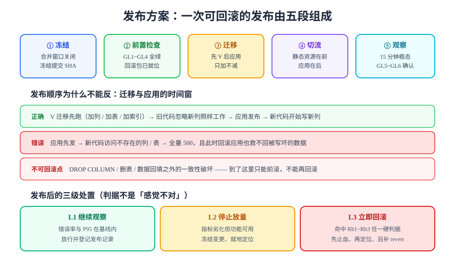

# 发布方案：一次可回滚的发布

> [一键部署](../../Deployment/index.md)定义了这个系统**长什么样**；本页定义它**怎么被换上去**。前者是静态的（定义一次就固定），后者是动态的（每次上线都要走一遍），而且必须满足一个硬条件：**任何一步都可以退回来**。



## 一句话定位

发布方案要回答四个问题，缺任何一个都会在上线日变成现场讨论：

1. **什么时候发**（发布窗口）——不是「什么时候写完」，而是「什么时候出问题代价最小」；
2. **发之前确认什么**（前置检查 `GL1~GL4`）——尤其是**回滚包是否已就位**；
3. **按什么顺序发**（迁移优先）——顺序错的代价是「回滚也救不回来」；
4. **发完怎么判断去留**（观察窗口 + 三级处置 `GL5~GL6`）——判据必须在发布**之前**定好。

## 一、`GL1~GL6`：把「发布做完了」变成可证伪的定义

| 编号 | 类型 | 断言 | 命令 / 动作 | 期望 |
| --- | --- | --- | --- | --- |
| **GL1** | 前置 | 冻结提交与镜像 tag 一致 | `git rev-parse HEAD` 与镜像 tag 比对 | 两者指向同一个 SHA |
| **GL2** | 前置 | 十二道冒烟在预发布环境全绿 | 十二个 `*_smoke.py` | 全绿，零失败 |
| **GL3** | 前置 | **回滚包已就位且可拉取** | `docker pull <repo>:<上一个 tag>` | 拉取成功、`docker image inspect` 有该 tag |
| **GL4** | 前置 | 备份已完成且可校验 | 见[备份恢复演练](../../BackupDrill/index.md) | 当日 dump 存在、体积非零 |
| **GL5** | 时序 | 迁移在应用之前执行完毕 | `flyway migrate` 的完成时刻 **早于**应用容器替换 | 日志时间戳早于应用启动 |
| **GL6** | 后置 | 观察窗口内四项指标在基线内 | `docker compose ps` + 四项指标 | 错误率、P95、缓存命中率、连接池 pending 达标 |

::: danger `GL3` 是最容易被跳过、也最贵的一条
「回滚包已就位」听起来像废话——镜像本来就在仓库里。但实际翻车场景非常一致：**上一个 tag 因为镜像仓库的保留策略被清理了**，或者**这个 commit 从来没有以可发布形态构建过**（只在 CI 里跑过测试，没打过 tag）。

判断方法不是「我记得有」，而是一条命令：

```shell
# 发布前必须真拉一次，而不是假设仓库里有
docker pull <registry>/blog-server:<previous-tag>
docker image inspect <registry>/blog-server:<previous-tag> --format '{{.Id}}'
```

两条都成功，`GL3` 才算通过。**回滚能力必须在上线前被证明，而不是在上线后被期待。**
:::

## 二、发布窗口：什么时候发

发布窗口的选择是一条**风险最小化**而非「尽快上线」的决策：

| 因素 | 建议 | 理由 |
| --- | --- | --- |
| **时段** | 流量低谷（本项目按读者分布取 22:00–24:00 或清晨） | 同样的故障，深夜影响面小一个数量级 |
| **周内** | 避开周五与节假日前 | 出问题需要有足够的人在岗，且要留出「观察一天」的余量 |
| **时长预算** | 预留 **2 小时**：发布 20 分钟 + 观察 15 分钟 + 回滚窗口 30 分钟 + 缓冲 | 发布本身很快，卡住的时间都在「确认」上 |
| **不做什么** | 不在窗口内做「顺手的小改动」 | 发布窗口内只允许执行**已经预演过**的步骤；任何临时变更都会让回滚失去确定性 |

::: warning 停机窗口 vs 无损发布
本项目是单机五服务、单一应用实例的形态，**没有两套完整环境**，因此发布是**短暂的停机窗口内的原地替换**，不是蓝绿也不是金丝雀。

这个取舍写在这里是为了避免误读：看到 `GL1~GL6` 全是「顺序」与「确认」，不要以为本项目已经具备无损发布能力。**具备无损发布能力的前提是「两套环境 + 流量切换层」，本项目第 20 章的服务拓扑里没有这一层。**
:::

## 三、发布顺序：为什么迁移必须在前

这是整页最重要的一条，也是唯一一条**顺序错了就不可逆**的规则。

| 阶段 | 动作 | 旧代码是否还能工作 | 新代码是否已经工作 |
| --- | --- | --- | --- |
| ① 迁移 | 加列 / 加表 / 加索引（**只加不减**） | ✅ 忽略新列照常工作 | — |
| ② 应用 | 替换应用容器为新版本 | — | ✅ 新列已存在 |
| ③ 校验 | 跑冒烟与四项指标 | — | ✅ |

反过来做会立刻出事：

| 错误顺序 | 后果 | 能否回滚 |
| --- | --- | --- |
| 应用先发 → 再迁移 | 新代码访问不存在的列，全量 500 | 能，但期间写入失败的数据已经丢了 |
| 先删列 → 再替换应用 | 旧应用读不到该列 | **不能**，数据已删 |

三条硬规则：

1. **只加不减**：一次发布里只做「加列 / 加表 / 加索引 / 加新接口」，删除动作**必须留到下一个发布**，而且要在确认「没有任何代码再读它」之后。这与 `deleted_at` 软删的取舍同源——见[文章写入链路](../../WritePath/index.md)与[数据库设计](../../DatabaseDesign/index.md)。
2. **迁移必须幂等**：Flyway 的 `V*__*.sql` 只执行一次，但人工补跑、容器重建都会重放。迁移脚本里所有建表建列都要写 `IF NOT EXISTS`，数据回填要用 `WHERE` 限定未处理行。
3. **迁移与应用之间不留「空窗」讨论**：两步之间不插入任何其他变更（配置改动、索引重建、缓存清理）。**空窗期越长，出问题时就越难判断是谁的锅。**

```shell
# 发布动作序列（在 your-project/ 下执行；每步都有判据，不要连写）
docker compose stop blog-web                 # ① 前台先停：读者侧降级为维护页，写链路不可用
docker compose exec -T mysql \
  mysql -uroot -p"$MYSQL_ROOT_PASSWORD" blog < migrations/V3__xxx.sql
                                             # ② 迁移：先库后应用；执行完核对字段已存在
docker compose up -d --no-deps blog-server   # ③ 后端换新版本
docker compose exec blog-server \
  curl -s http://127.0.0.1:8080/actuator/health/readiness   # 期望 {"status":"UP"}
docker compose up -d --no-deps blog-web      # ④ 前台最后起：前面的都健康了才对外
docker compose ps                            # 期望：五个服务全 Up，mysql/redis/blog-server (healthy)
```

::: danger 前台为什么最后起
前台是**唯一直接面对读者的入口**。如果前台先起而后端没起，读者看到的是 502 而不是维护页——两者对用户的影响完全不同（前者像故障，后者像维护）。

顺序原则：**越靠近用户的越后起，越底层的越先起。** 停止时则相反，先停最靠近用户的。
:::

## 四、观察窗口：15 分钟看什么

`GL6` 的观察窗口固定 **15 分钟**，看四项（口径全部来自[监控接入](../../Monitoring/index.md)，本页不重新定义）：

| # | 指标 | 在哪看 | 达标判据 | 不达标意味着 |
| --- | --- | --- | --- | --- |
| 1 | 5xx 错误率 | Prometheus / Grafana | < 1% | 新版本有确定性缺陷 → 考虑 `L3` |
| 2 | P95 延迟 | 同上 | ≤ 基线 × 2 | 可能是缓存未预热，先等 5 分钟再判 |
| 3 | 缓存命中率 | 同上 | 稳态 ≥ 90% | 缓存键或失效逻辑被改坏 |
| 4 | 连接池 pending | 同上 | 稳态 = 0 | 有慢查询或连接泄漏 |

::: tip 为什么是 15 分钟
观察窗口太短会漏掉「缓存冷启动 + 空闲连接回收」这类要几分钟才暴露的问题；太长则影响回滚决策的时效——回滚窗口本身也是有限的（见下一页的 `Rb` 判据）。15 分钟是「足以观察一个完整缓存预热周期」与「来得及回滚」的交点。

关键在于：**这 15 分钟必须是连续、有人在看的 15 分钟**，不是「发完了，我先去干别的」。
:::

## 五、三级处置：判据必须在发布前定好

发布后出现异常时的处置，**不允许在上线日现场讨论标准**——那时候每个人的风险偏好都会被情绪放大。

| 级别 | 触发条件 | 动作 | 谁决定 |
| --- | --- | --- | --- |
| **L1 继续观察** | 四项指标全部在基线内；个别用户报告但无法复现 | 完成观察窗口、登记发布记录、记录零星反馈 | 发布执行人 |
| **L2 停止放量** | 指标劣化但功能可用（例如 P95 超标但错误率正常） | **冻结所有变更**，就地按[四层定位法](../../LoadTesting/Bottleneck/index.md)排查；15 分钟内给出去留结论 | 发布执行人 |
| **L3 立即回滚** | 命中 `Rb1~Rb3` 任一硬判据 | 不再讨论根因，直接执行[回滚预案](../Rollback/index.md)；止血后再定位 | **不需要审批** |

::: danger `L3` 不需要审批，这一条必须写死
故障现场最常见的错误是「要不要回滚」变成一场讨论：有人担心回滚本身有风险，有人觉得再等一会儿可能自己好了。**讨论的每一分钟，用户都在承受损害。**

所以把决策前移：`Rb1~Rb3` 在发布前就定成**硬判据**，命中即回滚——把「要不要回滚」这个需要判断力的问题，转化成「有没有命中」这个只需查表的问题。代价是可能在少数情况下回滚了一个其实能自愈的版本；这个代价远小于「因为讨论而多挂了半小时」。
:::

## 六、发布记录模板

每次发布留下一条记录，格式固定——**它是本章实测列纪律在发布动作上的落地**：

```markdown
<!-- 写在你自己工程的 ops/releases/2026-10-07.md -->
# 发布记录 — 2026-10-07
- 版本：<commit-sha 前 7 位>　镜像 tag：<repo>:<tag>
- 上一个版本：<previous-sha 前 7 位>　回滚包：<previous-tag>（GL3 已实测可拉取 ✅/❌）
- 迁移：V3__xxx.sql（只加列）　执行时刻：22:14:03（早于应用启动 22:16:40 ✅）
- 前置：GL1 ✅ GL2 ✅ GL3 ✅ GL4 ✅
- 观察窗口：22:18–22:33
  - 错误率：实测 ___%　　基线 ___%（上限 1%）
  - P95：实测 ___ms　　基线 ___ms（上限 ×2）
  - 缓存命中率：实测 ___%　　基线 ___%（下限 90%）
  - 连接池 pending：实测 ___　　期望 0
- 处置级别：L1 / L2 / L3
- 遗留：<无 或 逐条写明归属人与解除条件>
```

**空白处不是留给复制的，是留给真跑出来的数字的。** 跑不了就写「未跑 + 原因」。

## 七、易错点

::: danger 发布日的五个高频坑
1. **回滚包没验证过**。`GL3` 要在发布**前**真拉一次镜像。翻车场景不是「没有 tag」，而是「tag 在但拉不下来」或「拉下来的其实是构建缓存里的一个旧层」。
2. **迁移与应用之间插入额外动作**。顺手清一次缓存、顺手重启一下 Redis——看起来无害，但一旦出问题，你不知道是发布还是那次顺手。
3. **先起前台后起后端**。读者看到 502 而不是维护页，影响面被无谓放大。顺序永远是：底层先、用户最近的后。
4. **观察窗口里只看了日志没看指标**。「日志里没报错」不等于「指标正常」——错误率上升可能发生在日志采样之外，延迟劣化则根本不会写日志。
5. **回滚完成后忘了补 revert**。回滚只是把错误版本换下来；**正确版本里的修复必须补一次 revert 并重新走完整发布流程**，否则下一次发布会把同一个问题原样带回来。
:::

## 八、验证方式

本页的判据全部可执行，逐条验证方式如下：

```shell
# GL1：冻结提交与镜像 tag 一致
git rev-parse HEAD                                    # 期望：与镜像 tag 指向同一 SHA
# GL3：回滚包已就位（发布前必做）
docker pull <registry>/blog-server:<previous-tag>     # 期望：拉取成功
# GL5：迁移早于应用启动（比时间戳）
docker compose logs mysql  | grep -i "V3__"           # 迁移完成时刻
docker compose logs blog-server | head -5             # 应用启动时刻
                                                      # 期望：前者早于后者
# GL6：五项健康与四项指标
docker compose ps                                     # 期望：全 Up，关键服务 (healthy)
curl -s http://127.0.0.1:8080/actuator/prometheus | grep -c http_server_requests_seconds
                                                      # 期望：> 0（指标可拉取）
```

## 当日做了什么 / 如何验证 / 下一步

- **做了什么**：定稿 `GL1~GL6`（四前置 + 一时序 + 一后置）、发布窗口的三条选择标准、迁移优先的发布顺序与四条可复制命令、15 分钟观察窗口的四项指标与判据、`L1/L2/L3` 三级处置及「`L3` 不需审批」的理由、发布记录模板。
- **如何验证**：本页为文档产出——`GL1~GL6` 全部给出了命令与期望输出，可逐条执行；本机无 Docker 环境，因此 `GL2~GL6` 的实测状态记 `⏳ 阻塞`，解除条件与其余欠账合并见[欠账合并兑现](../EnvFulfill/index.md)的 `S1` / `S5` 段。文档层判据（`GL1` 的比对方法、模板四要素是否齐全）本日 ✅。
- **下一步**：按[回滚预案](../Rollback/index.md)定义「什么情况必须退」——发布与回滚是一对，**只有发布方案而没有回滚判据的发布计划是不完整的**。

## 深入阅读

- [一键部署](../../Deployment/index.md)｜[监控接入](../../Monitoring/index.md)｜[备份恢复演练](../../BackupDrill/index.md)
- [回滚预案](../Rollback/index.md)｜[欠账合并兑现](../EnvFulfill/index.md)｜[上线验收终版](../GoLiveCheck/index.md)
- [CI/CD 部署与回滚](../../../../../docs/Tools/CICD/DeployRollback/index.md)｜[流水线设计](../../../../../docs/Tools/CICD/PipelineDesign/index.md)
- Docker Compose 官方文档（`up --no-deps`、`depends_on` 与健康检查）：[docs.docker.com/compose](https://docs.docker.com/compose/)
- Flyway 迁移与幂等：[documentation.red-gate.com/flyway](https://documentation.red-gate.com/flyway)
