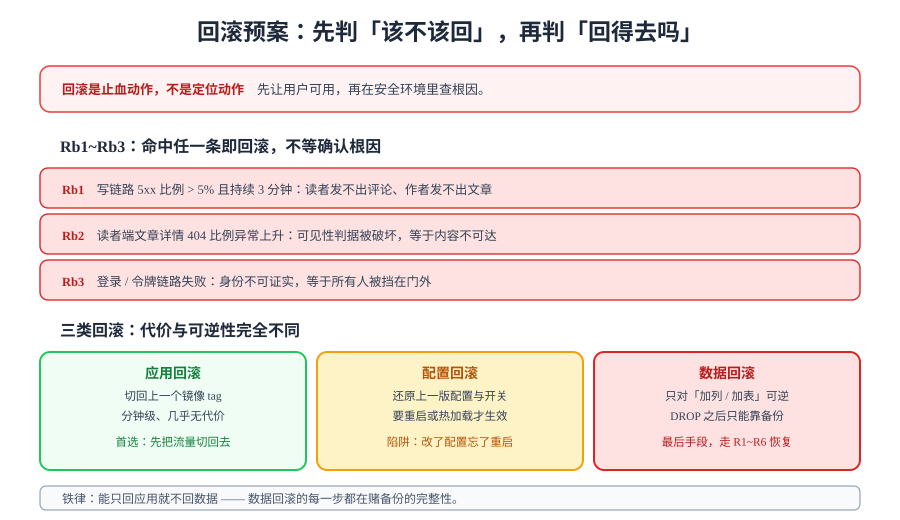

# 回滚预案：先判该不该回，再判回得去吗

> 发布方案回答「怎么上去」，本页回答「怎么下来」。这一页的存在本身就是一条纪律：**任何一次发布，在它开始之前就必须知道怎么退回去。**



## 一句话定位

回滚预案由两半组成，顺序不能颠倒：

- **前半是判据**（`Rb1~Rb3`）：什么情况**必须**回滚。这半必须在发布**之前**定好，理由见[发布方案](../ReleasePlan/index.md)的「`L3` 不需要审批」；
- **后半是能力**（`Rb4~Rb8`）：回滚**能不能真的做到**，以及做完之后还欠什么。

::: danger 回滚是止血动作，不是定位动作
本页的所有内容都建立在一个前提上：**回滚的目标是让用户重新可用，不是把问题搞清楚。**

这条区分在实践中经常被违反——故障现场最自然的冲动是「先看看日志，说不定是配置问题」。这个冲动的代价是：定位可能花 5 分钟也可能花 50 分钟，而用户在这段时间里拿不到任何东西。

正确顺序永远是：**先止血（回滚）→ 再在安全环境里定位 → 最后把修复重新发上去。** 回滚不是失败，回滚是止损。
:::

## 一、`Rb1~Rb3`：三条硬判据

命中任意一条，**不再讨论根因，直接回滚**。判据全部围绕「用户还能不能用」而不是「指标好不好看」：

| 编号 | 判据 | 观测方式 | 为什么这一条不可协商 |
| --- | --- | --- | --- |
| **Rb1** | 写链路 5xx 比例 **> 5% 且持续 3 分钟** | `http_server_requests` 按 `uri` 聚合 | 写失败意味着读者发不出评论、作者发不出文章——**业务直接停摆**，不是「体验下降」 |
| **Rb2** | 读者端文章详情 **404 比例异常上升** | 同上，`GET /api/v1/posts/{slug}` | [可见性收敛](../../Visibility/index.md)的核心判据被破坏，等于**内容不可达**；且 404 是「静默失败」——页面不报错，读者只是「看不到」 |
| **Rb3** | 登录 / 令牌链路失败 | `POST /api/v1/auth/*`、刷新令牌接口 | 身份不可证实 = 所有人被挡在门外；恢复代价远大于回滚代价 |

关于「持续 3 分钟」这个阈值的由来：

| 口径 | 后果 | 结论 |
| --- | --- | --- |
| 不设时间窗，瞬时超标就回滚 | 一次网络抖动、一次 GC 停顿就触发回滚 | 阈值太敏感，会把系统变成「永远在回滚」 |
| 时间窗太长（如 15 分钟） | 用户被影响 15 分钟后才止血 | 违背本页第一原则 |
| **3 分钟** | 足以过滤抖动与单次停顿，又短于用户的耐心阈值 | 采用 |

::: warning 为什么 `Rb2` 要有单独一条
只看 5xx 的错误率，会漏掉**最阴的一类故障**：读者端文章详情返回 404。它既不是 5xx（不计入错误率），也不是显式异常（日志里可能一条报错都没有），但它意味着**内容对读者消失了**——对一个博客来说，这与宕机等价。

这与[压测验收](../../LoadTesting/Acceptance/index.md)的 `L12` 是同一种设计思路：**把「原因本身」也写成断言的观测对象**，而不是只盯着一个笼统的指标。
:::

## 二、三类回滚：代价与可逆性完全不同

| 类型 | 动作 | 耗时 | 代价 | 什么时候用 |
| --- | --- | --- | --- | --- |
| **应用回滚** | 把应用容器切回上一个镜像 tag | 分钟级 | 几乎为零（旧镜像还在） | **首选**：任何由代码变更引起的问题 |
| **配置回滚** | 还原上一版配置 / 开关 | 分钟级 + 重启 | 低，但有「忘了重启」的陷阱 | 由配置变更引起的问题 |
| **数据回滚** | 走备份恢复（`R1~R6`） | 十几分钟起 | 高：会丢掉恢复点之后的写入 | **最后手段**：只在数据被破坏时使用 |

::: danger 铁律：能只回应用，就绝不回数据
原因不是「数据回滚慢」，而是**数据回滚的每一步都在赌备份的完整性**：

1. 备份是不是**恢复点之前**的？——如果备份任务恰好在上线后跑过，那份备份里已经含有坏数据；
2. 备份是不是**可用**的？——第 114 天的 `R1~R6` 对账就是为回答这个问题而设，但它的完成度取决于有没有演练过；
3. 恢复点之后**所有人的写入**都会丢——包括那些与本次故障完全无关的正常评论。

所以正确的顺序是：**应用 → 配置 → 数据**。前两者失败或不适用时，才动数据。
:::

### 配置回滚的陷阱

配置回滚看起来最简单，但它有一个高频翻车点：**配置改了没生效**。

| 配置类型 | 生效方式 | 陷阱 |
| --- | --- | --- |
| 环境变量（`docker-compose.yml`） | 需**重建容器**才生效 | `docker compose restart` **不会**重新读取 `environment`，必须 `up -d` 重建 |
| 挂载的配置文件（如 `my.cnf`） | 需**重启进程** | 改了文件但没重启，日志里一切正常，行为还是旧的 |
| 应用内动态配置 | 看实现：可能热加载、可能有缓存 | 「我改了」与「它生效了」之间没有任何自动保证 |

::: tip 判断配置是否真的生效
不要看配置文件，要看**运行中的进程实际读到了什么**。例如 Spring Boot 的 `/actuator/env` 或启动日志里的配置快照；MySQL 的 `SHOW VARIABLES`。这一条与[交付文档包](../../Delivery/index.md)里配置对账的思路一致：**对账的对象是运行时状态，不是仓库里的文件。**
:::

## 三、不可回滚点：到了这里只能前滚

这是本页最需要提前知道的一条：**迁移一旦越过某个点，回滚就不再是一个选项**。

| 迁移动作 | 可回滚性 | 说明 |
| --- | --- | --- |
| 加列 / 加表 / 加索引 | ✅ 可回滚 | 旧代码忽略新列照常工作；新列的数据即使留着也不影响旧版本 |
| 加非空约束（带默认值） | ⚠️ 谨慎 | 旧版本照常工作，但新版本写入的行可能不满足新代码的假设 |
| **改列类型 / 重命名列** | ❌ 视为不可回滚 | 新代码写入的数据旧代码读不懂，回滚后会产生「读不出来的行」 |
| **删列 / 删表 / 清数据** | ❌ **不可回滚** | 数据已经没了；只能靠备份，且会丢恢复点后的写入 |

::: danger 「不可回滚点」的判定方法
发布前用一条问题自查：**这次迁移做完之后，把应用切回上一个版本，数据库还能不能正常服务上一个版本？**

- 能 → 可回滚，按正常流程走；
- 不能 → **已经越过不可回滚点**。此时应当：
  1. 把「删列 / 改类型」拆到**下一个发布**，本次只做「加」；
  2. 如果必须本次做，那就把「回滚」从预案里划掉，改为**前滚预案**：一旦出错，只能用更快的修复顶上去，没有退路。

这与[数据库设计](../../DatabaseDesign/index.md)里「先加列并给存量语义的默认值、再回填、最后才改默认值」的三段式是同一个原则在不同尺度上的应用：**每一步都让新旧两个版本同时可用。**
:::

## 四、`Rb4~Rb8`：回滚能力本身要被验证

前三条是「什么时候回」，这五条是「回得去吗、回完还欠什么」：

| 编号 | 断言 | 命令 / 动作 | 期望 |
| --- | --- | --- | --- |
| **Rb4** | 应用回滚 5 分钟内完成 | `docker compose up -d --no-deps blog-server`（指定旧 tag）→ health 检查 | 从决定回滚到 `readiness=UP` ≤ 5 分钟 |
| **Rb5** | 配置回滚必须显式重建 / 重启 | 改回 `docker-compose.yml` 后 `up -d`（不是 `restart`） | 运行时配置确认已还原（看 `/actuator/env` 或启动日志） |
| **Rb6** | 数据回滚只走 `R1~R6` 路径 | 见[备份恢复演练](../../BackupDrill/index.md) | `R1~R6` 全部满足后再对外 |
| **Rb7** | 回滚后跑十二道冒烟 | 十二个 `*_smoke.py` | 全绿——证明**回滚动作本身**没弄坏东西 |
| **Rb8** | 补 revert 并重新走发布流程 | `git revert` + 新的镜像 tag | 仓库里的代码与线上运行的版本一致 |

::: danger `Rb7` 与 `Rb8` 是最常被省掉的两条
**`Rb7` 为什么必要**：回滚换的是镜像，但缓存、连接池、会话、Flyway 的 `schema_history` 都没变。回滚后的系统是一个**新老混合的中间状态**，它必须被重新验证一次。「回滚完就好了」是错觉。

**`Rb8` 为什么必要**：回滚把**线上**退回了旧版本，但**仓库里的代码还是新版本**。如果不补 revert，下一次发布会把同一个问题原样带回来——而且因为「上次回滚过」，它看起来像是偶发。

这两条合起来回答一个问题：**回滚之后，什么时候算真的结束了？** 答案是：代码、镜像、线上三者重新一致，且冒烟全绿。
:::

## 五、回滚演练

`Rb1~Rb8` 里，`Rb4~Rb7` 是**可以在没有故障的时候演练**的。演练是本项目一贯的做法（与[备份恢复演练](../../BackupDrill/index.md)、[第 3 周收口](../../Week3Close/index.md)的回归报告同一形态）：

```shell
# 回滚演练（在预发布环境执行；记录每一步的实际耗时）
# 步骤 1：确认当前版本与回滚目标
docker compose ps --format '{{.Service}}\t{{.Image}}\t{{.Status}}'
docker image ls | grep blog-server               # 期望：看到 current 与 previous 两个 tag

# 步骤 2：执行应用回滚，掐表
time docker compose up -d --no-deps blog-server  # 期望：≤ 5 分钟（Rb4）
curl -s http://127.0.0.1:8080/actuator/health/readiness   # 期望：{"status":"UP"}

# 步骤 3：回滚后重新验证（Rb7）——十二道冒烟
python skeleton_check.py                          # 期望 checks = 27  failed = 0
python api_smoke.py --base http://127.0.0.1:18080 # 期望 cases = 9   passed = 9
# ... 其余十道冒烟脚本，同 [项目总览](../index.md)「在你自己的工程里跑起来」一节

# 步骤 4：切回发布版本，确认正向流程也没坏
docker compose up -d --no-deps blog-server        # 期望：再次 readiness=UP
```

演练的产出一份**记录表**（实测列纪律照旧：只填真跑出来的数字）：

| 步骤 | 期望 | 实测 | 状态 |
| --- | --- | --- | --- |
| 回滚包可拉取 | 成功 | ___ | ⏳ |
| 应用回滚耗时 | ≤ 5 分钟 | ___ | ⏳ |
| 回滚后 `readiness` | `UP` | ___ | ⏳ |
| 回滚后十二道冒烟 | 全绿 | ___ | ⏳ |
| 切回发布版本 | `UP` | ___ | ⏳ |

::: tip 演练要练「切回去」，不只是「切回来」
只练回滚，你会得到一个「能退不能进」的方案。演练的最后一步必须是**切回发布版本并确认正常**——否则真到故障时，你根本不知道回滚之后能不能再往前走，而「只能退不能进」意味着故障持续时间被无限拉长。
:::

## 六、易错点

::: danger 回滚的五个高频坑
1. **用 `restart` 代替 `up -d` 做配置回滚**。`docker compose restart` 不重新读取 `environment`，配置回滚看起来执行了、实际没生效——最难查的一类问题（运行时行为与配置文件不一致）。
2. **回滚后不跑冒烟**。回滚后的系统是新老混合状态，缓存与连接池都没变；「回滚完就好了」是错觉，`Rb7` 必须执行。
3. **回滚了但没补 revert**。仓库与线上不一致，下一次发布会把同一个问题带回来（`Rb8`）。
4. **在不可回滚点上准备了回滚预案**。已经删了列还写「出问题就回滚」，这份预案在关键时刻是无效的——演练时才发现就太晚了。
5. **回滚决策依赖审批链**。`Rb1~Rb3` 命中即回滚，**不设审批**。任何形式的「先请示一下」都会把止血时间拉长到不可接受。
:::

## 七、验证方式

```shell
# Rb3/Rb4：回滚包存在且可执行
docker image inspect <registry>/blog-server:<previous-tag> --format '{{.Id}}'
# Rb5：配置回滚是否真的生效（对运行时状态，不对文件）
docker compose exec blog-server curl -s localhost:8080/actuator/env | grep -o '<键名>'
# Rb6：数据回滚判据
grep -c "R[1-6]" ../../BackupDrill/index.md           # 确认恢复判据已定义
# Rb7：回滚后冒烟（示例两条，其余十道同理）
python api_smoke.py --base http://127.0.0.1:18080     # 期望 cases = 9  passed = 9
python coreflow_smoke.py --base http://127.0.0.1:18080 # 期望 steps = 14 passed = 14
```

## 当日做了什么 / 如何验证 / 下一步

- **做了什么**：定稿 `Rb1~Rb8`（三条触发判据 + 五条执行与收尾断言）；写清三类回滚的代价排序与「能只回应用就绝不回数据」的理由；给出「不可回滚点」的判定方法（一条自查问题）与越界后的处置（拆到下次发布，或改为前滚预案）；配置回滚的三种生效方式与高频陷阱；回滚演练四步与五格记录表。
- **如何验证**：本页为文档产出——`Rb1~Rb3` 的观测方式、`Rb4~Rb7` 的演练命令均给出期望输出，可逐条执行；无 Docker 环境处记 `⏳ 阻塞`，与其余欠账合并见[欠账合并兑现](../EnvFulfill/index.md)的 `S1` / `S5` 段。文档层判据（判据可证伪、演练表可填、不可回滚点有判定方法）本日 ✅。
- **下一步**：进入[欠账合并兑现](../EnvFulfill/index.md)——把五个工作日积累的 `⏳` 排成一条一次跑完的序列；回滚相关项作为其中的 `S1` / `S5` 两段执行。

## 深入阅读

- [发布方案](../ReleasePlan/index.md)（本页的对称篇）｜[一键部署](../../Deployment/index.md)｜[备份恢复演练](../../BackupDrill/index.md)
- [测试分层收口](../../TestLayers/index.md)（冒烟脚本的分层依据）｜[联调与压测](../../LoadTesting/index.md)（四层定位法）
- [CI/CD 部署与回滚](../../../../../docs/Tools/CICD/DeployRollback/index.md)｜[镜像推送与发布策略](../../../../Base/BackendTemplate/Release/index.md)
- Docker Compose 官方文档（`up --no-deps` 与 `restart` 的差异）：[docs.docker.com/compose](https://docs.docker.com/compose/)
- Flyway 迁移与 `schema_history`：[documentation.red-gate.com/flyway](https://documentation.red-gate.com/flyway)
