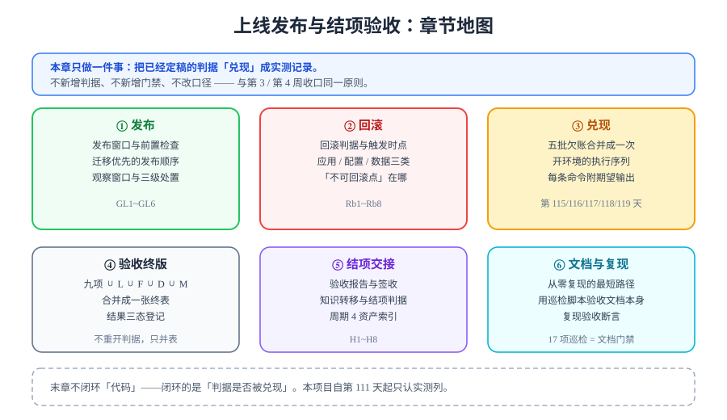

# 上线发布与结项验收

> 周期 4 的最后一天（第 120 天），也是全项目的收口章。前 27 章回答的是「怎么做出来」：需求、契约、骨架、写链路、评论、搜索、SSR、账号、部署形态、监控、备份、AI 预审、离线、压测。本章只回答一个问题：**这些已经定稿的判据，兑现了多少？**

## 一句话定位

本章不写新功能、不新增判据、不新增门禁——它做的是**把散落在 6 个章节里的欠账合并成一次兑现**，并按「发布 → 回滚 → 兑现 → 验收 → 交接 → 沉淀」六步，产出一份可以被第三方复核的**结项记录**。

这条原则与[第 3 周收口](../Week3Close/index.md)、[第 4 周收口](../Week4Close/index.md)完全一致：**收口的含义就是不再开新口子**。区别在于，前两次收口是周内收敛，这一次是**整个周期的终结**——本项目到本章为止不再有下一个工作日，所有仍然悬空的东西必须写明归属人与解除条件。

::: info 本章的四条不动原则
1. **不新增判据**：本章出现的每一条判据都能回溯到一个已有编号（九项 / `L` / `F` / `D` / `M` / `R` / `CF`）；
2. **不改口径**：压测归属第 119 天、上线清单第 114 天定稿——三处口径从第 111 天锁定至今，本章不重排；
3. **不抄期望值**：实测列只填真跑出来的输出，跑不了就标 `⏳ 阻塞 + 原因 + 解除条件`；
4. **不做复盘**：本章是**验收与交接**，不是「经验总结」——未完成项按待办登记，不按心得书写。
:::

## 与相邻章节的分工

本章的新增内容只有三样：**发布与回滚**（第 20 章讲形态，本章讲动作）、**欠账合并兑现**（把五批 `⏳` 排成一条序列）、**结项与交接**（第 17 章讲交付物清单，本章讲签收与知识转移）。其余全部是引用。

| 相邻章节 | 它讲什么 | 本章讲什么 | 为什么不互相替代 |
| --- | --- | --- | --- |
| [一键部署](../Deployment/index.md)（第 112 天） | Compose 五服务的**形态**：依赖注入矩阵、`my.cnf` 红线、从零复现六步 | 用这个形态做一次**真实发布**：什么顺序、观察多久、什么条件下停 | 形态是静态的（定义一次就固定），发布是动态的（每次上线都要走一遍，且必须可回滚） |
| [监控接入](../Monitoring/index.md)（第 113 天） | 六项指标口径、告警阈值、traceId 串链**判据** | 发布后用这些指标**判断去留** | 监控回答「看得见吗」，本章回答「看见了之后怎么办」——同一份指标，两种用途 |
| [备份恢复演练](../BackupDrill/index.md)（第 114 天） | 备份策略、恢复四步、`R1~R6` 对账，**上线验收清单九项** | 九项终版合并、回滚预案、结项判据 | 它给的是「数据丢了能救回来」，本章给的是「先尽量别丢」——回滚是回滚预案的第一选择，走备份是最后手段 |
| [交付文档包与运维手册](../Delivery/index.md)（第 117 天） | 交付物 11 项、配置对账判据、Runbook 四条 SOP、`D1~D10` | 就这份交付物做**签收与知识转移** | 它回答「交付包里有什么」，本章回答「对方真的接住了吗」——包含知识转移，是两份不同的判据 |
| [联调与压测](../LoadTesting/index.md)（第 119 天） | 联调复核 `I1~I8`、压测前置 `Pr1~Pr8`、验收 `L1~L14` | 把 `L1~L13` 的实测回填并入终版验收表 | 它给的是**判据与脚本**，本章给的是**执行与记录**；判据 ≠ 证据 |
| [第 4 周收口](../Week4Close/index.md)（第 115 天） | 九项验收清单**逐条回填**（实测 `⏳`） | 把这一次回填真正跑完，并合并全部剩余欠账 | 第 115 天记的是「判据定稿、实测未跑」；本章要么跑出数字，要么写明解除条件——**不允许第三次延后** |
| [进度跟踪](../Progress/index.md) | 每天做了什么、如何验证 | 全周期的**结项索引**与资产地图 | 进度页是流水账（按天），本章是索引（按交付物）——找「东西在哪」看本章 |

## 页面导航

| # | 页面 | 讲什么 | 编号 |
| --- | --- | --- | --- |
| 1 | [发布方案：一次可回滚的发布](./ReleasePlan/index.md) | 发布窗口、前置检查、迁移优先的发布顺序、观察窗口、三级处置 | `GL1~GL6` |
| 2 | [回滚预案：先判该不该回](./Rollback/index.md) | 回滚硬判据、应用/配置/数据三类回滚、不可回滚点、回滚演练 | `Rb1~Rb8` |
| 3 | [欠账合并兑现：一次开环境跑完](./EnvFulfill/index.md) | 五批 `⏳` 合并成一条八段执行序列，每段附命令与期望输出 | `S1~S8` |
| 4 | [上线验收终版](./GoLiveCheck/index.md) | 五个编号族合并成一张终表、按验收对象分四组、结果三态 | — |
| 5 | [结项与交接](./Handover/index.md) | 验收报告、签收、知识转移三动作、结项判据 | `H1~H8` |
| 6 | [文档沉淀与从零复现](./DocsRepro/index.md) | 八段复现最短路径、用 17 项巡检验收文档本身 | — |
| 7 | [常见问题与最佳实践](./FAQ/index.md) | 上线日分诊树、高频问题、上线日纪律清单 | — |

## 判据编号约定

前几章已经用掉了 `I` / `Pr` / `L` / `CF` / `M` / `F` / `R` / `D` / `A` / `B` / `C` / `S` / `Q` / `T` / `V` 等前缀。本章新增三段，与既有编号**互补不重叠**：

| 前缀 | 含义 | 数量 | 出现在 | 为什么需要新前缀 |
| --- | --- | --- | --- | --- |
| `GL` | 上线发布执行项（Go-Live） | `GL1~GL6` | [发布方案](./ReleasePlan/index.md) | 已有编号全部是**状态断言**（结论「对不对」）；发布需要的是**时序断言**（顺序「对不对」）——两者不能共用一套编号 |
| `Rb` | 回滚预案项（Rollback） | `Rb1~Rb8` | [回滚预案](./Rollback/index.md) | 回滚的判据方向与其他全部相反：别的编号回答「做成什么算对」，`Rb` 回答「出现什么就必须退」 |
| `H` | 结项交接项（Handover） | `H1~H8` | [结项与交接](./Handover/index.md) | 结项的判据对象是**人**（下一个人能否独立操作），前 27 章全部以**系统**为对象 |
| `S` | 兑现序列步骤（Sequence） | `S1~S8` | [欠账合并兑现](./EnvFulfill/index.md) | 不是断言而是**执行序号**，只用来指路；沿用本章内局部编号，不参与判据唯一性统计 |

`GL` / `Rb` / `H` 三段的完整清单见各自页面。判据唯一性原则（同一条判据只允许一个归属）见[判据收口](../Consolidation/index.md)——本章合并终表时**只归类不重写**，正是这条原则的延伸。

## 为什么最后一天值得单独存在

三个理由：

1. **「判据定稿」与「判据兑现」是两种不同的产出，且前者不能替代后者**。本项目从第 111 天起反复写死这条纪律：[回归报告](../CoreFlow/Regression/index.md)、[第 4 周收口](../Week4Close/index.md)、[交付文档包](../Delivery/index.md)、[压测验收](../LoadTesting/Acceptance/index.md)四处都写过「期望 240ms 和实测 240ms 含义完全相反」。全周期累计挂起的 `⏳` 已经跨了五个工作日，如果不在结项日收敛，它们就变成了永久欠账。
2. **发布本身是有判据的，而且和「部署成功」不是一回事**。「`docker compose ps` 全绿」只证明容器起来了，证明不了「这次上线是可回滚的、观察窗口是够的、迁移是可逆的」。把发布拆成 `GL1~GL6` 是为了让「发布做完了」也有可证伪的定义。
3. **结项需要一个显式的终点**。没有结项判据的项目，末态是「文档写完了」——而文档写完既不是交付完成，也不是可交接。`H1~H8` 的意义是把「可以交给下一个人了」变成可检查的动作。

## 本章面对的处境，必须一开始就说清

本项目的文档全部在本机完成，**本机没有 Docker、也没有可运行的工程仓库**（`project/` 按规则只沉淀文档）。因此本章的绝大多数实测项在**写作当天**只能登记为 `⏳`。

这不是本章的缺陷，而是本章的**核心内容**：

| 如果不做本章 | 如果按本章做 |
| --- | --- |
| 五批 `⏳` 散落在五个页面，各带各的原因 | 一张[兑现清单](./EnvFulfill/index.md)把它们排成一条序列，**一次开环境全部跑完** |
| 「发布成功了」只有口头结论 | `GL1~GL6` 给发布一个可证伪的定义 |
| 出问题靠现场发挥 | `Rb1~Rb3` 先定「什么情况必须退」，避免在故障中讨论该不该回滚 |
| 「交付完成了」等于文档写完 | `H1~H8` 要求知识转移被**验证**（对方独立操作一遍） |
| 遗留项停在「待补」 | 每条遗留写明归属人与解除条件，否则不算结项 |

::: tip 本章最重要的一个判断
**能一次开环境跑完的事，不要分五次做。** 第 115 天的九项、第 116 天的第 13 道门禁、第 117 天的 `D3/D4/D6/D7`、第 118 天的 `F2/F3/F8/F9`、第 119 天的 `L1~L13` —— 五批欠账共享**同一个前置条件**（一台有 Docker 的机器 + 按文档搭好的工程）。分五次开环境意味着五次重复的搭建、五份互相不一致的实测记录，以及五次都可能半途而废。合并成 `S1~S8` 之后，前置条件只满足一次。
:::

## 建议阅读顺序

1. **只想知道结论** → 直接看[上线验收终版](./GoLiveCheck/index.md)的四组终表与结果三态；
2. **准备真的上线一次** → 按 1 → 2 → 4 顺序读（发布方案 → 回滚预案 → 验收终版），第 3 和第 6 页按需查；
3. **接手这个项目** → 按 5 → 6 → 3 顺序读（结项交接 → 文档复现 → 兑现清单），先看清有什么，再想怎么跑起来。

## 本章不做什么

| 不做的事 | 理由 |
| --- | --- |
| 不做复盘 / 总结类内容 | 与全库口径一致：轮换表与章节中均不出现复盘内容；未完成项按待办登记，不按心得书写 |
| 不新增门禁 | 门禁集合在第 110 天扩到十二道、第 116 天定义第十三道后即冻结；结项日再加门禁，等于在终点线上改规则 |
| 不做蓝绿 / 金丝雀发布 | 单机五服务的形态给不出两套完整环境；本章的发布是**停机窗口内的原地替换 + 回滚预案**，不是渐进式发布（判断依据写在[发布方案](./ReleasePlan/index.md)） |
| 不做容量规划 | 第 119 天的结论只覆盖「这套形态的边界」，扩容决策等形态变化后再做 |
| 不承诺「零遗留」 | 结项判据是「每条遗留有归属人与解除条件」，不是「没有遗留」——两者的区别见[结项与交接](./Handover/index.md) |

## 参考资料

- 交付方法论：[完整项目交付](../../../../docs/Others/ProjectDelivery/index.md)｜[交付验收](../../../../docs/Others/ProjectDelivery/Delivery/index.md)｜[交付测试](../../../../docs/Others/ProjectDelivery/Testing/index.md)
- 发布与回滚：[CI/CD 部署与回滚](../../../../docs/Tools/CICD/DeployRollback/index.md)｜[流水线设计](../../../../docs/Tools/CICD/PipelineDesign/index.md)
- 可观测与告警：[监控告警专题](../../../../docs/Ops/Monitoring/index.md)｜[告警设计](../../../../docs/Ops/Monitoring/Alerting/index.md)
- 备份与容灾：[备份与容灾专题](../../../../docs/Ops/BackupDR/index.md)｜[恢复与 PITR](../../../../docs/Ops/BackupDR/Recovery/index.md)
- 文档自身质量：[文档体系建设](../../../../docs/Tools/DocsInfra/index.md)｜[文档自动化](../../../../docs/Tools/DocsInfra/Automation/index.md)
- 同周期项目：[Vue3 模板](../../../Base/Vue3Template/index.md)｜[后端通用模板](../../../Base/BackendTemplate/index.md)（周期 3 资产，本项目的基座）
