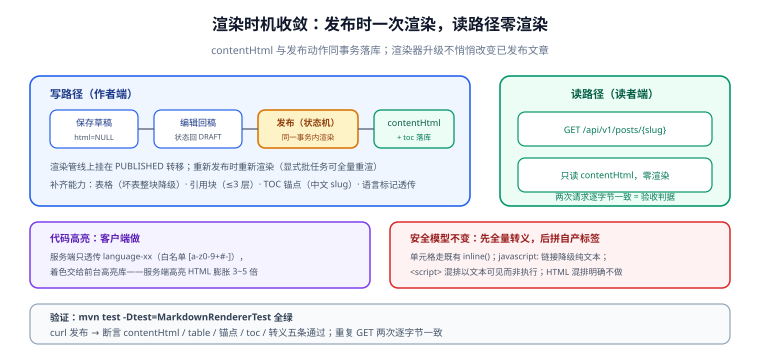

# Markdown 渲染能力补齐

第 98 天的 [文章写入链路](../WritePath/index.md) 落了一个「安全优先」的最小渲染器（先转义再拼标签），能撑起草稿链路，但离「读者端可用」还差三件事：**表格与引用块渲染不出来、长文没有目录、代码块没有高亮**。本页是第 2 周「Markdown 渲染能力补齐」待办的落地记录。



## 当日做了什么

### 1. 渲染时机收敛：发布时渲染，读路径零渲染

第 98 天的实现在「每次读都渲染」的形态上，本轮把它收敛成**写时渲染**：

```text
保存草稿：contentMd 原文入库，contentHtml 保持 NULL
发布动作：渲染管线执行一次 → contentHtml 落库（与状态机 PUBLISHED 转移同一事务）
读取路径：读者端只读 contentHtml，不存在「读时渲染」这一步
重新编辑：状态回 DRAFT，contentHtml 置 NULL，再次发布时重新渲染
```

收益与代价写清楚：**读路径成本恒定**（一次 SELECT），且「渲染结果」与「发布时刻的渲染器版本」绑定——渲染器升级不会悄悄改变已发布文章的 HTML（要做全量重渲染时是显式的一次批处理任务）。代价是正文占用双倍存储，这在 [数据库设计](../DatabaseDesign/index.md) 的「正文双列」决策里已经预留。

### 2. 块级解析补齐：表格与引用块

在既有「先转义、后拼标签」顺序不变的前提下，块级解析器补两类：

| 语法 | 解析规则 | 安全边界 |
| --- | --- | --- |
| 表格（`\|` 分隔 + `---` 分隔行） | 分隔行合法性校验：列数不齐按段落纯文本输出 | 单元格内容走既有 `inline()`，先转义后拼 `<td>` |
| 引用块（`>` 前缀） | 连续 `>` 行合并为一个 `<blockquote>`，内部递归走块级解析 | 嵌套上限 3 层，超出按普通段落 |

```java [MarkdownRenderer.java（块级补齐，节选）]
/** 表格：cells 已逐格 escape；列数不齐返回 null（调用方按段落降级）。 */
private static String table(List<String> lines) {
    if (lines.size() < 2 || !isSeparator(lines.get(1))) return null;
    List<String> header = splitRow(lines.get(0));
    StringBuilder html = new StringBuilder("<table><thead><tr>");
    for (String cell : header) html.append("<th>").append(inline(cell)).append("</th>");
    html.append("</tr></thead><tbody>");
    for (int i = 2; i < lines.size(); i++) {
        List<String> row = splitRow(lines.get(i));
        if (row.size() != header.size()) return null;   // 列数不齐 → 整表降级为段落
        html.append("<tr>");
        for (String cell : row) html.append("<td>").append(inline(cell)).append("</td>");
        html.append("</tr>");
    }
    return html.append("</tbody></table>").toString();
}
```

:::danger 降级必须「整块降级」，不要「尽力修复」
列数不齐的表格渲染成残缺 `<table>` 比渲染成纯文本更糟——浏览器会自动补 `<td>`，版式悄悄坏掉且没人发现。规则：**解析失败就整块退回纯文本段落**，让作者在预览里立刻看到「表格没渲染出来」，而不是带着坏版式发布。
:::

### 3. 目录（TOC）与锚点

长文没有目录没法用。实现为**渲染的副产品**：块级解析遇到 H2/H3 时生成锚点 id 并登记：

```java
// 标题 → 锚点 id：小写、空白转短横线、去非 [a-z0-9-] 字符；重复时追加 -2、-3
String anchor = slugify(headingText, usedAnchors);
out.append("<h2 id=\"").append(anchor).append("\">").append(inline(headingText)).append("</h2>");
toc.add(new TocItem(2, headingText, anchor));
```

- TOC 结构随 `contentHtml` 一起落库（单独一列 `toc`，JSON），读者端直接用，不做「读时再解析 HTML 提取标题」。
- **中文标题的 slug 保留中文字符**（URL 编码后可用且可读），只去除标点与空白——纯 `a-z0-9` 的 slugify 会把全中文标题变成空 id。
- `slugify` 是纯函数，进单测：`「A B」「A  B」「A-B」` 三个标题必须得到三个不同锚点。

### 4. 代码高亮：服务端不干这件事

| 方案 | 取舍 | 结论 |
| --- | --- | --- |
| 服务端高亮（渲染时产出着色 span） | HTML 体积膨胀 3~5 倍，渲染器引入语言词表依赖 | ❌ 不做 |
| **客户端按需高亮** | 服务端只输出 `<pre><code class="language-xx">`，前台引轻量高亮库 | ✅ 采纳 |

服务端唯一的职责是**把代码块的语言标记透传**（第 98 天已支持 ```lang 围栏），并做白名单校验：语言标记只允许 `[a-z0-9+#-]`，非法标记丢弃 class（防把任意字符串塞进属性）。

### 5. 明确不做（归档理由）

| 不做 | 理由 |
| --- | --- |
| 图片上传与外链图 | 需求页已列为非目标；渲染器对 `` 按链接规则处理（仅 http/https 与站内路径） |
| HTML 混排 | 攻击面与「先转义」模型冲突；作者要 HTML 时用代码块展示 |
| 数学公式 / Mermaid | 个人博客受众不需要；引入即违背「最小攻击面」原则 |

## 如何验证

```shell
# ① 单元级：渲染器用例表（在你的工程里，JUnit）
#    输入含：合法表格 / 列数不齐表格 / 嵌套引用 / 重复标题 / javascript: 链接 / <script> 混排
#    断言：合法表格产出 <table>；坏表格整体为段落文本；
#          两个相同标题得到 id="a" 与 id="a-2"；
#          javascript: 链接降级为纯文本；<script> 以文本形式可见而非执行
mvn test -Dtest=MarkdownRendererTest

# ② 链路级：发布一篇文章，读路径断言（curl）
B=http://127.0.0.1:18080
# 登录拿 token、建文、发布（沿用 WritePath 页的冒烟步骤，此处略）
curl -s $B/api/v1/posts/my-post | python3 -c "
import json,sys; d=json.load(sys.stdin)['data']
assert d['contentHtml'] is not None, '发布后 contentHtml 必须已生成'
assert '<table>' in d['contentHtml'], '表格应被渲染'
assert 'id=' in d['contentHtml'], '标题应带锚点 id'
assert d['toc'] and d['toc'][0]['anchor'], 'TOC 应已登记'
assert '<script>' not in d['contentHtml'].replace('&lt;script&gt;',''), '脚本必须被转义'
print('渲染管线断言全部通过')"
```

**预期收尾**：`mvn test` 全绿；curl 断言五条全部通过；再次 `GET /api/v1/posts/my-post` 两次响应内容逐字节一致（读路径零渲染的证据）。

## 问题与决策

| 问题 | 决策 |
| --- | --- |
| 渲染在读时还是写时？ | **写时**。读路径成本恒定、渲染结果与发布时刻绑定；代价是双倍存储与重渲染批任务，均可接受 |
| 代码高亮在服务端还是客户端？ | **客户端**。服务端高亮让 HTML 膨胀且引入词表依赖，收益只是省一次前端加载 |
| 中文标题的锚点 slug 怎么生成？ | 保留中文、去标点空白、冲突追加序号；纯 a-z0-9 会把中文标题变成空 id |
| 表格解析失败怎么办？ | **整块降级为段落**。尽力修复会产生悄悄坏掉的版式 |

## 下一步（第 102 天）

1. **可见性收敛**：匿名读者列表/详情对 DRAFT / OFFLINE / DELETED 一律 404（第 100 天状态机的读侧收口），补第四道门禁 `visibility_smoke`。
2. 渲染器用例表与 `visibility_smoke` 一起评估上移 `mvn test`（第 101-104 天周收口目标）。
3. 之后进入第 3 周：评论链路（两级楼层 + 软删除）。

## 相关文档

- [文章写入链路](../WritePath/index.md)：最小渲染器与「先转义后拼标签」顺序的原始论证
- [文章下线动作](../Lifecycle/index.md)：发布 / 下线状态机——渲染时机挂在状态转移上
- [数据库设计](../DatabaseDesign/index.md)：contentMd / contentHtml 双列与 toc 列的落位
