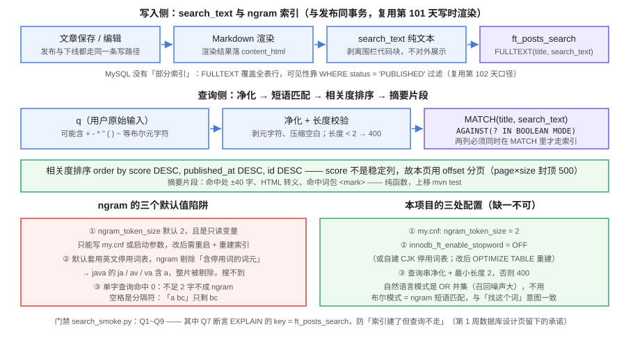

# 全文搜索：MySQL ngram 先行

本页是「全栈博客平台」第 107 天的构建步骤（周期 4 第 3 周 · 第 3/4 步）。

::: warning 本页命令里的路径指「你自己的工程」
本仓是**文档库**，不存放代码。`service/`、`python xxx.py`、`my.cnf` 等路径指的是**你按对应章节搭起来的工程目录与配置**。本页的验收清单是**判据**，不是实测输出。
:::

## 一、当日做了什么

第 1 周的[数据库设计](../DatabaseDesign/index.md)已经预留了搜索位：`search_text` 冗余列 + `FULLTEXT KEY ft_posts_search (title, search_text) WITH PARSER ngram`，并把「两列必须同时在 `MATCH` 里才走索引」写成了一条设计约定。本日把这条约定**兑现成可运行的链路**：写入侧怎么产出 `search_text`、服务端要不要改配置、查询串怎么净化、相关度怎么排、分页怎么做，以及**为什么不用自然语言模式**。



### 1.1 写入侧：`search_text` 与渲染同事务

`search_text` 是「给检索用、不给展示用」的纯文本副本（展示走 `content_html`）。它的产生方式直接复用[第 101 天的写时渲染](../Rendering/index.md)：

| 决策点 | 结论 | 理由 |
| --- | --- | --- |
| 何时生成 | **与 Markdown 渲染同一事务**（发布 / 编辑 / 重新渲染时一起写） | 搜索不到「还没渲染的内容」；两列要么一起新、要么一起旧，不留半边可见的窗口 |
| 内容来源 | 渲染后的纯文本（标题 + 正文） | 与展示口径同源——用户搜的是他看到的字，不是 Markdown 标记 |
| 围栏代码块 | **剥离**（行内代码保留） | 大段代码会把相关度拉高、把「这段代码出现在哪篇文章」变成搜索结果；行内代码（`ngram_token_size` 这类术语）是正文的一部分，要留 |
| 草稿 | 照样写 `search_text` | 索引是**表级**的，不做「只索引已发布」（MySQL 无部分索引）；可见性在查询期用 `WHERE status='PUBLISHED'` 过滤 |
| 下线 / 删除 | 不物理删除 `search_text` | 复用第 100 天的四态状态机语义，搜索是可逆动作，删了就没法「恢复后立刻能搜到」 |

::: tip 与第 102 天可见性口径的关系
`search_text` 只解决「能不能搜到这个词」，**不解决「该不该看到这篇」**。后者完全由第 102 天的可见性判据兜底：搜索查询的 `WHERE` 里必须带 `status='PUBLISHED'`，且排序前就过滤——不能「先搜出来再在内存里筛」，否则命中数、分页、`hasMore` 全部失真。
:::

### 1.2 三处服务端配置：缺一不可

这是本日最容易被跳过、又最容易「搜不到东西却查不出原因」的一段。三条都不是代码问题，是**配置问题**：

| # | 配置 | 为什么必须改 |
| --- | --- | --- |
| ① | `[mysqld] ngram_token_size = 2` | 默认值就是 2（二元分词），通常**不用改**——但必须知道它是**只读变量**：只能写在配置文件或启动参数里，改完要**重启 MySQL 并重建 FULLTEXT 索引**才生效。部署到新环境时，如果容器镜像里的 MySQL 没带这行，行为会与你本地不同 |
| ② | `innodb_ft_enable_stopword = OFF`（或自建 CJK 停用词表） | **ngram 解析器的停用词规则与默认解析器不同：它剔除的是「包含停用词的词元」，而不是「等于停用词的词元」**。默认用的是英文停用词表（`a` / `i` / `in` / `is` …），于是 `java` 被切成 `ja` / `av` / `va`——三个词元都含字母 `a`，**整片被剔除，搜 `java` 命中 0**。中文正文不受影响（词元是汉字），但标题里带英文的文章、以及 `search_text` 里的英文术语会静默消失 |
| ③ | 查询串净化 + 最小长度 2 | 布尔模式下的 `+` `-` `*` `"` `(` `)` `~` `@` 是运算符，用户输入带这些字符会被当表达式解析（`-词` 变成「排除」）；且 ngram 下不足 2 个字的查询不成词、必然命中 0。二者都要在**服务端入口**处理，不能靠前端拦 |

```ini
# my.cnf —— 写进你自己的工程（compose 里的 mysql 服务挂在 /etc/mysql/conf.d/ 下）
[mysqld]
ngram_token_size = 2
innodb_ft_enable_stopword = OFF
```

```sql
-- 改完配置、重启 mysqld 之后，让存量数据重建一次全文索引
ALTER TABLE posts DROP INDEX ft_posts_search;
ALTER TABLE posts ADD FULLTEXT KEY ft_posts_search (title, search_text) WITH PARSER ngram;
```

::: danger `innodb_ft_enable_stopword` 是动态变量，但**光改它不够**
它是运行时可改的 `SET GLOBAL`，可是**已建的全文索引不会自动重算**——必须让索引重建（`ALTER TABLE ... DROP INDEX` + `ADD INDEX`，或 `OPTIMIZE TABLE posts`）才对新旧数据一致生效。判据见 1.5 的 Q9（搜 `java` 必须命中）。这条陷阱的隐蔽性在于：改完变量后 `SHOW VARIABLES` 显示已是 `OFF`，你会以为生效了。
:::

### 1.3 索引「建了不用」：`MATCH` 必须写全两列

第 1 周已有明文约定，本日把它变成断言。FULLTEXT 索引建在 `(title, search_text)` 上，**`MATCH()` 里的列集合必须与索引定义完全一致**才能吃掉索引——即使你只想搜正文，也要写 `MATCH(title, search_text)`，给 `title` 传空串：

```sql
-- 反例：MATCH 只有 search_text → 索引用不上 → 全表扫 + 逐行分词
-- SELECT id, title FROM posts
--  WHERE MATCH(search_text) AGAINST(? IN BOOLEAN MODE) AND status = 'PUBLISHED';

-- 正例：MATCH 两列齐全（与索引定义逐字一致）
SELECT id, title, search_text,
       MATCH(title, search_text) AGAINST(? IN BOOLEAN MODE) AS score
  FROM posts
 WHERE MATCH(title, search_text) AGAINST(? IN BOOLEAN MODE)
   AND status = 'PUBLISHED'
 ORDER BY score DESC, published_at DESC, id DESC
 LIMIT ? OFFSET ?;
```

::: tip 为什么「建了不用」不会自己暴露
普通索引写错最多慢一点，全文索引写错是**两条路都通**：`MATCH(search_text)` 语法合法、结果也「看起来对」（就是慢），没有报错、没有空结果。唯一能发现它的是 `EXPLAIN` 的 `key` 列——所以本日把它写成门禁（Q7），而不是靠代码评审盯。
:::

### 1.4 查询模式：为什么不用自然语言模式

MySQL 全文检索两种模式在 ngram 下的语义差异很大（这是本日最有价值的一条认知）：

| 模式 | ngram 下的语义 | 对「博客搜索」是否合适 |
| --- | --- | --- |
| `IN NATURAL LANGUAGE MODE` | 查询串转成 ngram 词的**并集**（OR）。`abc` → `ab bc`，**含 `ab` 或 `abc` 的文档都命中** | ❌ 召回噪声太大。搜「数据库设计」会命中只含「数据」的文章，且排在前面 |
| `IN BOOLEAN MODE` | 查询串转成 ngram **短语**搜索。`abc` → `"ab bc"`，**只命中含完整 `abc` 的文档** | ✅ 与用户「我要找这个词」的意图一致 |

结论：**默认走布尔模式**，代价是要净化输入（见 1.2 ③）。净化规则只有一条：「只保留字词与空白」，即剥掉 `+ - * " ( ) ~ @ > <`，再压缩空白并 `trim`：

```java
// 净化是纯函数，单独一个类、单独一组单元测试（T11）
public final class SearchQuery {
    private static final Pattern META = Pattern.compile("[+\\-*\"()~@><]+");

    /** @return 净化后的查询串；长度 < 2 时返回 null，由上层转 400 */
    public static String normalize(String raw) {
        if (raw == null) return null;
        String q = META.matcher(raw).replaceAll(" ").replaceAll("\\s+", " ").trim();
        return q.codePointCount(0, q.length()) >= 2 ? q : null;
    }
}
```

::: danger 明确不做（v1 的边界）
- **不做 `*` 前缀通配**：ngram 索引里没有「词的开头」信息，通配语义会诡异漂移——前缀短于 `ngram_token_size` 时退化成前缀匹配，长于时被当短语且**忽略 `*`**。行为不稳的东西不进 v1。
- **不做 `-` 排除词 / `~` 降权**：需要让用户理解布尔 DSL，等于把检索语法暴露成产品功能。
- **不做短语精确匹配开关**：布尔模式默认已经是短语语义，再叠一层没有增量。
:::

### 1.5 相关度排序、分页与摘要

| 决策点 | 结论 | 理由 |
| --- | --- | --- |
| 排序 | `score DESC, published_at DESC, id DESC` | 三级键**必须定全**：`score` 大量并列（ngram 短语命中常常同分），只写 `score` 会让分页在页边界重复/漏读 |
| 分页 | **offset 分页**（`page` / `size`），`size` 封顶 50，`page × size` 封顶 500 | 这里**不能**像评论那样用 keyset：游标分页要求排序键是「稳定、单调、可比较的列」，而 `score` 是**随查询串变化的计算值**，换一页就得重算——keyset 无从下手。搜索的产品语义是「找到就走」，深翻页无意义，用封顶代替 |
| 总数 | 只返回 `hasMore`，**不返回精确 `total`** | 精算总数要给全文索引再跑一次 `COUNT(*)`，代价与主查询同量级；`hasMore` 只需多取一条探边（与评论分页同一手法） |
| 摘要 | 服务端生成：命中处前后各 40 字、HTML 转义、命中词包 `<mark>` | 纯函数、可单测（T12）。不做「直接截正文前 80 字」——那样用户看不出为什么命中 |
| 无命中摘要 | 取 `search_text` 前 80 字 | 兜底也要给上下文，不能返回空片段 |

### 1.6 断言清单：T11~T14 与 Q1~Q9

| 标识 | 层 | 断言 |
| --- | --- | --- |
| T11 | `mvn test` | 查询净化是纯函数：剥掉布尔元字符并压缩空白；长度 < 2 返回 `null`；`null` / 空串 / 纯空白返回 `null` |
| T12 | `mvn test` | 摘要片段是纯函数：命中处 ±40 字、HTML 转义（`<script>` 不得原样出现）、命中词包 `<mark>`；无命中时取前 80 字 |
| T13 | `mvn test` | 排序是纯函数：给定带 `score` 的候选集，按 `score DESC → published_at DESC → id DESC` 排序，且**同分候选的相对顺序确定**（不是随机） |
| T14 | `mvn test` | 分页边界：`page < 1` 归 1；`size > 50` 钳制为 50；`page × size > 500` 返回空列表且 `hasMore = false` |
| Q1 | smoke | 标题命中：搜索标题里的词 → 结果含该文章 |
| Q2 | smoke | 正文命中：搜索只在正文出现的词 → 结果含该文章 |
| Q3 | smoke | **短语语义**：搜「全文搜索」不返回只含「数据」的文章（证明走的是布尔模式的短语，而不是自然语言模式的 OR 并集） |
| Q4 | smoke | 空 / 纯空白 / 单字（长度 1）→ 400；超长（> 100 字）→ 400 |
| Q5 | smoke | 只返回 `PUBLISHED`：`DRAFT` / `OFFLINE` / `DELETED` 的文章一律不出现（第 102 天可见性口径的读侧回归） |
| Q6 | smoke | 分页：`page=1&size=2` 时按 `hasMore` 取下一页，两页并集无重复；`page × size > 500` 返回空 |
| Q7 | smoke | **`EXPLAIN` 的 `key` = `ft_posts_search`**（防「索引建了但查询不走」，第 1 周设计页留下的承诺） |
| Q8 | smoke | 布尔元字符不炸：`q=+a -b*` 返回 200，且结果与净化后的 `a b` 一致（不得出现 SQL 语法错 1064） |
| Q9 | smoke | **停用词回归**：搜 `java` 必须命中（证明 `innodb_ft_enable_stopword = OFF` 且索引已重建）。这条正是 1.2 ② 的守门断言 |

T11~T14 上移 `mvn test`（`SearchQueryTest` / `SearchServiceTest`）；Q1~Q9 留在 `search_smoke.py`（要真库 + 真索引，跑在服务起来之后）。门禁全集从八道扩到**九道**。
`assertion_audit.py` 的前缀唯一性核查随之扩展到 `T11~T14` 与 `Q1~Q9`。

## 二、如何验证

```shell
# 前提：MySQL 已按 1.2 配置 ngram_token_size=2 与 innodb_ft_enable_stopword=OFF 并重启，
#       且已重建 ft_posts_search 索引

cd your-project/service

mvn test                            # 期望 BUILD SUCCESS；T1~T14 全绿（新增 SearchQueryTest / SearchServiceTest）

export SERVER_PORT=18080 && cd blog-application && mvn spring-boot:run   # 另开终端跑服务

cd your-project/service
python search_smoke.py --base http://127.0.0.1:18080
# 期望 steps = 9  passed = 9（Q1~Q9，含 Q7 执行计划断言与 Q9 停用词回归）
python search_smoke.py --selftest                  # 期望 selftest: 9/9（断言可证伪）
python assertion_audit.py                          # 期望 PASS：T1~T14 / S1~S6 / Q1~Q9 各只出现一次
```

```shell
# 手工抽查
curl -s 'http://127.0.0.1:18080/api/v1/search?q=全文搜索' | head -c 300
# 期望：命中标题含「全文搜索」的文章，且首条 score 最高
curl -s -o /dev/null -w '%{http_code}\n' 'http://127.0.0.1:18080/api/v1/search?q='
# 期望 400（Q4：空查询）
curl -s -o /dev/null -w '%{http_code}\n' 'http://127.0.0.1:18080/api/v1/search?q=%E6%90%9C'
# 期望 400（Q4：单字「搜」，ngram 不足 2 字必然命中 0，直接拒）
curl -s 'http://127.0.0.1:18080/api/v1/search?q=java'
# 期望非空（Q9：停用词表已关闭，否则 java 会被整片剔除）
```

```sql
-- Q7 的执行计划（在你的工程连上库直接跑）
EXPLAIN SELECT id FROM posts
 WHERE MATCH(title, search_text) AGAINST('全文搜索' IN BOOLEAN MODE) AND status='PUBLISHED';
-- 期望 key 列 = ft_posts_search；若为 NULL，说明 MATCH 的列集合与索引定义不一致
```

## 三、问题与决策

| 问题 | 决策 |
| --- | --- |
| `search_text` 什么时候生成？ | 与 Markdown 渲染**同一事务**（第 101 天机制），不留「渲染了但搜不到 / 搜到了但页面没内容」的半边窗口 |
| 围栏代码块进不进索引？ | 不进。大段代码会把相关度拉高；行内代码保留（正文术语要能搜） |
| `ngram_token_size` 要不要调？ | 保持默认 2。它是**只读变量**，改它要重启 + 重建索引，代价与收益不成比例；真正要改的是停用词表 |
| 为什么必须关停用词表？ | ngram 剔除的是「**包含**停用词的词元」，默认英文停用词表会让 `java` 这类英文词被整片剔除（`ja`/`av`/`va` 都含 `a`）——这是「搜不到却查不出原因」的典型 |
| 自然语言模式还是布尔模式？ | **布尔模式**。ngram 下 NL 是 OR 并集（噪声大），布尔是短语匹配（与意图一致）；代价是必须净化布尔元字符 |
| 搜索分页为什么能退回 offset？ | 游标分页要求排序键是稳定列，而 `score` 随查询串变化、是计算值——**这里用不了 keyset，用「上限封顶」代替**，与评论区的 keyset 是两种不同的正确解 |
| 排序键要不要写全三级？ | 要（`score, published_at, id`）。同分是常态，少一级就会在页边界重复/漏读 |
| 返回精确总数吗？ | 不返回。精算 `total` 要给全文索引再跑一次 `COUNT(*)`；`hasMore` 只需多取一条探边 |
| 单字查询为什么直接 400 而不是返回空？ | 返回空是「静默无结果」，用户会以为站内没有相关内容；400 让产品能在前端提示「至少输入 2 个字」 |

## 四、下一步（第 108 天）

第 3 周进入最后一步：**前台 SSR**——把读者端从「接口能通」推进到「Nuxt 前台能渲染」。要做的是：Nuxt 服务端取数与 hydration（`useAsyncData` 与首屏 HTML 一致）、文章详情与列表的 SSR 缓存头、搜索页在服务端渲染时的空查询处理（复用本日 Q4 的 400 判据，前台要把它转成友好提示）、以及 SEO 元信息（`title` / `description` / `og:`）由服务端渲染进 HTML。判据：「查看源代码能看到正文与 TDK；禁用 JavaScript 后页面仍可读」。

里程碑对照：第 3 周（105-111 天）进行中 **3/4**（评论写入 → 评论读侧 → 全文搜索 → 前台 SSR）。

:::tip 后续衔接（第 110 天补记）
搜索在核心业务流里的位置与「发布后立即可搜」的链路级断言，见[核心业务流收口](../CoreFlow/index.md)：状态机副作用矩阵解释了为什么 `publish` **没有**「写索引」副作用（FULLTEXT 建在 `posts` 表上），一条龙回归 CF4/CF12 把「可搜 / 下线不可搜 / 重新发布恢复可搜」固化成接缝断言。
:::
